硬件：GD32F103C8T6（类似STM32F103C8T6）

软件：keil mdk

参考文献：

1. [嵌入式OTA升级实现原理_哔哩哔哩_bilibili](https://www.bilibili.com/video/BV1em411C7xy/?spm_id_from=333.1387.favlist.content.click&vd_source=3b2bba9cd9eee7c88a08ea7d3ea6261a)

---


1、OTA升级是什么：OTA升级，说简单点，就是对我们单片机Flash里面的程序进行更新，就和我们用烧录工具去更新程序一样，只是烧录方式，变成了我们先把程序(Bin文件)先上传到服务器，然后由服务器给每个设备下发程序更新指令和数据。

2、OTA固件升级的两种方式：

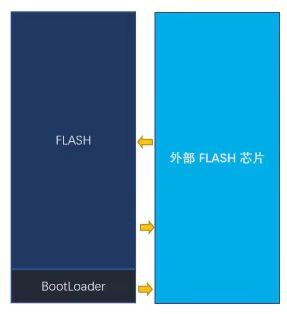

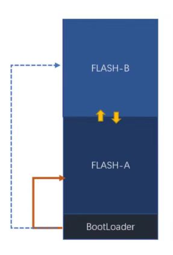

3、相关工作：

```
1、服务器与开发板的通信流程、通信协议
2、开发板上BootLoader设计
3、固件应用设计
```

4、目标

**需求1：**

有线OTA：开发板通过以太网网线连接路由器，服务器通过通过网线连接路由器（wifi？），服务器发送bin固件包，开发板替换内部bin固件包

环境：spaceOS

流程：单片机通过外设接口（如 UART 、 IIC 、 SPI 、 CAN 、 USB 等接口），连接具备联网能力的模块、器件、设备（以下统称上位机）。上位机从服务器上拉取固件包，再将固件包以约定的通讯协议，经由通讯接口发送至 **MCU** ，由 **MCU** 负责固件的解析、解密、存储、更新等操作，以完成设备固件更新的功能.


**需求2：**

服务器通过网线（HTTP协议）传递文件到开发板指定目录下


目前先熟悉OTA的整体流程 

[【手把手教程 4G通信物联网 OTA远程升级 BootLoader程序设计】GD32F103C8T6单片机【上篇章】_哔哩哔哩_bilibili](https://www.bilibili.com/video/BV1SatHeBEVG/?spm_id_from=333.1387.favlist.content.click&vd_source=3b2bba9cd9eee7c88a08ea7d3ea6261a)

需求：

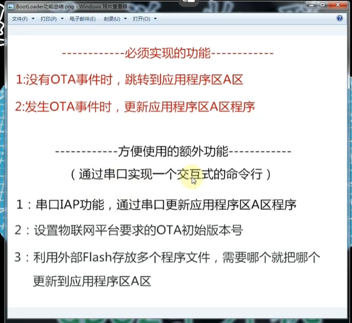


需要bootloader去跳转程序区A或者更新程序区A(OTA升级方式第一种)

​	单片机执行程序，从起始位置（低地址）开始运行，一般起始位置放的是bootloader程序段

**必须实现的功能：**

- 开发板某一个掉电不易失寄存器存放ota_flag标志，1表示需要bootloader去擦除程序区从外部flash读取进行更新，0表示跳转到程序区
- 开发板需要一个外部的flash存放从服务器下载下来的固件文件

**方便使用的额外功能**

- 通过串口IAP实现更新程序区固件
- OTA版本号上报
- 外部flash存放多个程序文件，通过命令下发更新指定固件文件


# 基础

**参考文献**

- [GD32F103学习笔记（1）——搭建环境、编译烧写 - 简书 (jianshu.com)](https://www.jianshu.com/p/4beaefda1e21)

## 仿真器

见仿真器使用手册，接pA13和PA14口

## 工程流程

使用keil需要安装指定板子的芯片包和官方库文件（Fireware文件夹下）（指定硬件下的标准库文件）

**流程：**

- 安装指定板子的芯片包（addon标识）

  - 可以在官网根据addon标识下载，也可在keil中下载
  - 

- 移动官方库文件的CMSIS
  - src：system_gd32f10x.c（初始化系统启动代码），startup_gd32f10x_md.s（定义系统启动流程和中断向量表）
    - **中密度产品（GD32F10X_MD）** 是指 FLASH 存储器容量在 `16 KB 至 128 KB` 的 GD32F101xx 和 GD32F103xx 微控制器。
       **高密度产品（GD32F10X_HD）** 是指 FLASH 存储器容量在 `256KB 至 512KB` 的 GD32F101xx 和 GD32F103xx 微控制器。
       **超高密度产品（GD32F10X_XD）** 是指FLASH存储器容量在 `512KB 以上` 的GD32F101xx 和 GD32F103xx 微控制器。
       **互联型产品（GD32F10X_CL）** 是指产品是指 GD32F105xx 和 GD32F107xx 微控制器。
    - 这里gd32f103c8t6flash为64属于md的产品启动流程选择md
      - 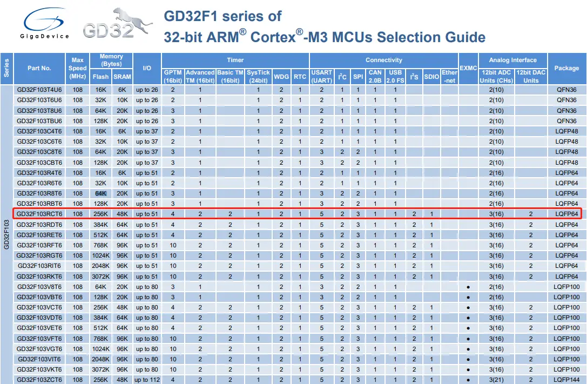
  - include：arm的标准头文件和厂商自定义的头文件
- 移动官方标准库文件(GD32F10x_standard_peripheral)
  - 将该文件下的include和src移动到LIB中作为库文件

- 移动官方库文件下的Template/it中断相关的文件
  - gd32f10x_it.c和gd32f10x_it.h

- 创建新工程
  - 选择芯片gd32f1038
  - 管理-->分组(CMSIS、USER、HW、LIB)
  - 设置output，存放在OBJ下，设置createHEX file，在Target中勾选Use MicroLIB(使用printf)
  - 在工程设置的c/c++中设置头文件路径(USER、CMSIS/Include、HW/Include、LIB/Include)

    - 在c/c++中添加GD32F10x_MD宏定义
    - 在 C/C++选项卡中添加处理宏及编译器编译的时候查找的头文件路径。如果头文件路径添加有误，则编译的时候会报错找不到头文件。

      在这个选项中添加宏，就相当于我们在文件中使用“#define”语句定义宏一样。在编
      译器中添加宏的好处就是，只要用了这个模版，就不用源文件中修改代码。

      GD32F10X_HD 宏：为了告诉 GD32 标准库，我们使用的芯片类型是 GD32
      型号是大容量的，使 GD32 标准库根据我们选定的芯片型号来配置。
      USE_STDPERIPH_DRIVER 宏：为了让 gd32f10x.h 包含 gd32f10x_libopt.h 这个头文件。
  - 向工厂中添加文件(*.c)
    - LIB: misc.c、rcu.c、gpio.c、usart.c
    - HW:  it
    - CMSIS: .c和.md.s
    - USER：main.c（gd32f10x.h）
    - 删除it中的sysTick_handle的内容（目前没有相关的库）
    - 开始编译
      - 自定义创建RTE_components.h（USER下），添加RCU、GPIO、MISC的定义
      - it.c中注释main.h和systick.h
  
- 自己写的代码添加

  - 在HW下
  - 在lib下添加硬件库和头文件
  - 根据硬件库和头文件编辑HW下自己的文件


## 文件说明

gd32f10x.h：开发的基本头文件，包含对某一芯片的寄存器、外设定义以及一些常用的头文件如stdin.h等

gd32f10x_libopt.h：官方库的功能开关

- RTE_Components.h：与gd32f10x_libopt.h配合开关官方库的功能，且需要添加对应的头文件
- 一般出现某个函数未定义或者c99非法，考虑是没有启用该功能

startup_gd32f10x_md.s：

- 定义系统启动流程和中断向量表，定义外设与接口的对应关系，类似设备树
- misc.c
  - nvic
  - sysTick
- 官方手册使用

**user_manual在GPIO引脚复用上使用**

**datasheet在pin definitions上使用**


## 宏定义

uint8_t：stdint.h


## 原理图

- 看GPIO引脚
  - #表示低电平有效

# RCU

在嵌入式系统里，RCU（Reset and Clock Unit，复位和时钟单元）是一种关键的外设模块，下面为你详细介绍它的相关内容。

**功能概述**

- **复位管理**：为系统和各个外设提供复位信号，确保系统在启动、异常情况（如硬件故障、软件错误）时能够恢复到初始状态，保证系统的稳定性和可靠性。
- **时钟控制**：负责生成和管理系统以及各个外设所需的时钟信号。不同的外设可能需要不同频率和相位的时钟，RCU 能够灵活配置和分配这些时钟资源，以满足系统的性能和功耗需求。

**具体功能及作用**

**复位功能**

- **系统复位**：当发生严重错误或需要重新启动系统时，RCU 会触发系统复位，将整个系统的状态重置为初始状态，包括 CPU、内存、外设等，类似于计算机的重启操作。
- **外设复位**：可以对特定的外设进行单独复位，而不影响其他外设和系统的正常运行。这在调试或修复外设故障时非常有用，例如当某个外设出现异常时，可以通过 RCU 对其进行复位，使其恢复正常工作。

**时钟功能**

- **时钟生成**：RCU 通常会包含多个时钟源，如内部 RC 振荡器、外部晶体振荡器等。它可以根据系统的需求选择合适的时钟源，并通过 PLL（锁相环）等电路对时钟信号进行倍频或分频处理，以生成不同频率的时钟信号。
- **时钟分配**：将生成的时钟信号分配给系统的各个部分，包括 CPU、总线、外设等。不同的外设可能需要不同频率的时钟，RCU 可以通过时钟分频器等电路为每个外设提供合适的时钟频率，以满足其工作要求。
- **时钟控制**：可以动态地开启或关闭某些外设的时钟，以降低系统的功耗。例如，当某个外设暂时不需要工作时，可以通过 RCU 关闭其时钟，减少不必要的功耗消耗。

**应用场景**

- **低功耗嵌入式系统**：在一些对功耗要求较高的嵌入式系统中，如智能手表、无线传感器节点等，RCU 的时钟控制功能可以根据系统的工作状态动态调整时钟频率和开关外设时钟，从而显著降低系统的功耗，延长电池续航时间。
- **高性能嵌入式系统**：在需要处理大量数据和执行复杂任务的高性能嵌入式系统中，如工业控制计算机、汽车电子控制单元等，RCU 能够提供稳定、高速的时钟信号，确保 CPU 和外设能够高效地工作，提高系统的整体性能。
- **嵌入式开发调试**：在嵌入式系统的开发和调试过程中，RCU 的复位功能可以方便地对系统和外设进行复位操作，帮助开发人员快速定位和解决问题。同时，通过调整时钟频率，开发人员可以测试系统在不同时钟条件下的性能和稳定性。


# bootloader

**参考文献：**[【手把手教程 4G通信物联网 OTA远程升级 BootLoader程序设计】GD32F103C8T6单片机【上篇章】_哔哩哔哩_bilibili](https://www.bilibili.com/video/BV1SatHeBEVG/?spm_id_from=333.1387.favlist.content.click&vd_source=3b2bba9cd9eee7c88a08ea7d3ea6261a)

---

```
1：谁将OTA_flag变成对勾？
A区
2：什么时候将OTA_flag变成对勾？
A区下载完毕之后
3：OTA时，最新版本的程序文件下载到哪？
分片下载，[256],W25Q64中
4：OTA时，最新版本的程序文件如何下载？下载多少？
服务器下发告诉我们上传的新版本程序的大小，字节数
4+：下载多少这个变量用不用保存？
用，保存到24C02
5：发生OTA事件时，B区如何更新A区？
根据保存在24C02中的下载量，拿数据(每次1024个字节)，写到A区
```


---

**OTA的bootloader需要用到哪些功能：**

- **串口：通过串口IAP将bootloader下载到b分区**
  - 接受数据方案：轮询、中断、**DMA**
  - 如何判断数据接受完毕：总线空闲中断
  - 如何对数据处理：加入缓冲区（固件内存大小分配），用于解决处理数据和接受数据速度不匹配问题
    - 定义缓存数据回收策略：定义串口最大传输数据字节，每次接受之前判断空闲缓存与最大比较
    - 加入位置数组：记录每一次传输数据在缓存中的位置信息，在缓存加入s和e标记每一次传输数据在缓存中的位置
    - 用in记录位置数据的最后一位的下一位，用out记录位置数组首位，In==out表示缓冲区没有数据
- **IIC 24C02：存放OTA_flage、掉电不丢失**
  - 256B，一页16B
  - 读取任意位置，任意字节数量

- **SPI W25Q64：外部flash、掉电不丢失，存放多个固件版本号**
  - 8MB
  - 128块，每块64KB
    - 按块擦除

  - 32768页，每页256B
    - 按页写入

  - 读取任意位置，任意字节数量

- **FLASH 擦除写入：内部flash的擦除和写入**
  - 一页1KB
  - 写入任意内存位置，任意字节数量


## **串口**

**参考文献：**

- [GD32F103学习笔记（7）——USART串口使用 - 简书 (jianshu.com)](https://www.jianshu.com/p/a37d5ef3c471)
- [GD32F103学习笔记（7）——USART串口使用_gd32 uart作为调试口,还可以串口接收吗-CSDN博客](https://blog.csdn.net/qq_36347513/article/details/124248826)

---

### *一般串口中断流程*

- 在HW中添加usart.c和usart.h，将usart.c加入工程的HW中
  - 确定串口程序需要哪些变量，在usart.c和usart.h中编写 
  - **建立串口USART0_Init(uint32_t 波特率)函数：**
    - 结合rcu.h和rcu.c执行enable函数，使能 RX 和 TX 引脚 GPIO 时钟和 USART 时钟
    - 结合gpio.h和gpio.c执行init函数，初始化 GPIO，并将 GPIO 复用到 USART 上
    - 结合usart.h和usart.c函数，配置 USART 参数
      - **需要知道USART0对应的GPIO引脚（一般从官方文档的用户手册的GPIO映射中可找到）**
      - **比如USART0默认对应PA9和PA10，所以PA9初始化TX，PA10初始化为RX，串口线接PA9和PA10**
    - 根据misc.c和misc.h，配置中断控制器并使能 USART 接收中断
    - 使能串口
    - 在 USART 接收中断服务函数实现接收和发送

```
#include <stdio.h>
#include "gd32f10x.h"
#include "board_usart.h"

void USART0_Init(void){
	// 使能 RX 和 TX 引脚 GPIO 时钟和 USART 时钟
	rcu_periph_clock_enable(RCU_GPIOA);
	rcu_periph_clock_enable(RCU_USART0);
	// 初始化 GPIO，并将 GPIO 复用到 USART 上
	// 设置GPIO PA9为TX(PP)  PA10为RX(FLOATING)
	gpio_init(GPIOA, GPIO_MODE_AF_PP, GPIO_OSPEED_50MHZ, GPIO_PIN_9);
	gpio_init(GPIOA, GPIO_MODE_IN_FLOATING, GPIO_OSPEED_50MHZ, GPIO_PIN_10);
	// 配置 USART 参数
	usart_deinit(USART0);                                       // 重置串口
	usart_baudrate_set(USART0, speed);                          // 波特率
	usart_word_length_set(USART0, USART_WL_8BIT);               // 帧数据字长
	usart_stop_bit_set(USART0, USART_STB_1BIT);                 // 停止位
	usart_parity_config(USART0, USART_PM_NONE);                 // 奇偶校验位
	usart_hardware_flow_rts_config(USART0, USART_RTS_DISABLE);  // 硬件流控制RTS
	usart_hardware_flow_cts_config(USART0, USART_CTS_DISABLE);  // 硬件流控制CTS
	usart_receive_config(USART0, USART_RECEIVE_ENABLE);         // 使能接收
	usart_transmit_config(USART0, USART_TRANSMIT_ENABLE);       // 使能发送
	// 使能USART的总中断并使能 USART0 接收中断
	nvic_irq_enable(USART0_IRQn, 0, 0);
	usart_interrupt_enable(USART0, USART_INT_RBNE);
	// 使能串口
	usart_enable(USART0);                                       
	// 在 USART 接收中断服务函数实现接收和发送
	// 在HW的it.c文件下，根据startup_gd32f10x_md.s的映射关系找到USART0对应的中断服务函数USART0_IRQHandler
	// 在it.c下新建USART0_IRQHandler中断服务函数
}


/*
	串口接受数据，处理后通过串口发送
*/
void USART0_IRQHandler(void)
{
	uint8_t data;
	// 如果接受缓冲区非空，则接受数据
	if(RESET != usart_interrupt_flag_get(USART0, USART_INT_FLAG_RBNE)){
		data = usart_data_receive(USART0);
		usart_data_transmit(USART0, (uint8_t)data);
		// 如果发送缓冲区满，则循环等待，否则后来的数据会覆盖之前要发送的数据
		while(RESET == usart_flag_get(USART0, USART_FLAG_TBE));//发送完成判断
		usart_data_transmit(USART0, (uint8_t)'*');
		while(RESET == usart_flag_get(USART0, USART_FLAG_TBE));//发送完成判断
		
	}
}
```


****


### DMA+串口空闲中断

**参考文献：**

- [GD32F103串口DMA收发空闲中断与DMA的使用方法详解-物联沃-IOTWORD物联网](https://www.iotword.com/14516.html)

 **基础知识：**

- **串口（0/1/2/3/4）与DMA（0/1）以及DMA的通道（0/1/2/3/4/5/6）有映射关系：在用户手册的DMA章节中DMA请求映射**

  - 比如USART0映射到DMA0，其中TX映射到DMA0的通道3，RX映射到DMA0的通道4

- **DMA 的工作机制**

  - DMA（Direct Memory Access）是一种硬件模块，用于在外设和内存之间传输数据，而无需 CPU 的干预。
  - 在配置 DMA 时，需要指定传输的数据量（`transfer_number`），即 DMA 每次传输的字节数。
  - 每次 DMA 开始传输时，计数器会从配置的 `transfer_number` 开始递减，直到传输完成（计数器变为 0）。
  - 基于以上，每次DMA传输数据后都需要重新设置number的值

- **0xff默认为未使用的数据**

- **清除空闲中断标志位**

  - **步骤 1：读取 USART 的状态寄存器（`USART_STAT`）**

    - 当空闲中断触发时，`USART_STAT` 寄存器中的 `IDLE` 标志会被置位。
    - 读取 `USART_STAT` 是清除 `IDLE` 标志的第一步。

    **步骤 2：读取 USART 的接收数据寄存器（`USART_RDATA`）**

    - 在读取 `USART_STAT` 之后，还需要读取 `USART_RDATA` 寄存器。
    - 这是清除 `IDLE` 标志的第二步，也是完全清除标志的必要操作。

    ```
    if (RESET != usart_interrupt_flag_get(USART0, USART_INT_FLAG_IDLE)) {
        // 清除空闲中断标志位
        usart_interrupt_flag_clear(USART0, USART_INT_FLAG_IDLE);
        // 也可读取空闲标志寄存器来清除空闲中断标志位
        usart_flag_get(USART0, USART_INT_FLAG_IDLE)
    
        // 读取接收数据寄存器，完成标志清除
        uint8_t data = usart_data_receive(USART0);
    }
    
    if (USART_STAT(USART0) & USART_STAT_IDLE) {
        // 读取状态寄存器（USART_STAT）
        volatile uint32_t stat = USART_STAT(USART0);
        // 读取接收数据寄存器（USART_RDATA），完成标志清除
        volatile uint8_t data = USART_RDATA(USART0);
    }
    ```
    
    

**流程**

- usart0_init

  ```c
  void Usart0_Init(uint32_t bandrate){
  	rcu_periph_clock_enable(RCU_USART0);
  	rcu_periph_clock_enable(RCU_GPIOA);
  	
  	gpio_init(GPIOA,GPIO_MODE_AF_PP,GPIO_OSPEED_50MHZ,GPIO_PIN_9);
  	gpio_init(GPIOA,GPIO_MODE_IN_FLOATING,GPIO_OSPEED_50MHZ,GPIO_PIN_10);
  	
  	usart_deinit(USART0);
  	usart_baudrate_set(USART0,bandrate);
  	usart_parity_config(USART0,USART_PM_NONE);
  	usart_word_length_set(USART0,USART_WL_8BIT);
  	usart_stop_bit_set(USART0,USART_STB_1BIT);
  	usart_transmit_config(USART0,USART_TRANSMIT_ENABLE);
  	usart_receive_config(USART0,USART_RECEIVE_ENABLE);
  	usart_dma_receive_config(USART0,USART_RECEIVE_DMA_ENABLE);
  	
  	nvic_priority_group_set(NVIC_PRIGROUP_PRE2_SUB2);
  	nvic_irq_enable(USART0_IRQn,0,0);
  	usart_interrupt_enable(USART0,USART_INT_IDLE);
  	
  	U0Rx_PtrInit();
  	DMA_Init();
  	usart_enable(USART0);
  }
  ```

  

- dma0_init

  ```c
  void DMA_Init(void){
  	dma_parameter_struct dma_init_struct;
  	
  	rcu_periph_clock_enable(RCU_DMA0);
  	
  	dma_deinit(DMA0,DMA_CH4);
  	
  	dma_init_struct.periph_addr = USART0+4;
  	dma_init_struct.periph_width = DMA_PERIPHERAL_WIDTH_8BIT;
  	dma_init_struct.memory_addr = (uint32_t)U0_RxBuff;
  	dma_init_struct.memory_width = DMA_MEMORY_WIDTH_8BIT;
  	dma_init_struct.number = U0_RX_MAX+1;
  	dma_init_struct.priority = DMA_PRIORITY_HIGH;
  	dma_init_struct.periph_inc = DMA_PERIPH_INCREASE_DISABLE;
  	dma_init_struct.memory_inc = DMA_MEMORY_INCREASE_ENABLE;
  	dma_init_struct.direction = DMA_PERIPHERAL_TO_MEMORY;
  	dma_init(DMA0,DMA_CH4,&dma_init_struct);
  	dma_circulation_disable(DMA0,DMA_CH4);	
  	dma_channel_enable(DMA0,DMA_CH4);
  }
  ```

  

- 自定义实现输出函数
  - **usart0_dma_send**
  
    - 通过dma发送数据
    - ```c
      /**
       * * @brief USART0中断服务函数
       * * * @param None
       * * @retval None
       * *  通过串口0发送数据
       */
      void usart0_dma_send(uint8_t *buffer,uint16_t len){
          // 需要自定义发送数据，所以要重新配置DMA的通道3TX的参数
      	dma_channel_disable(DMA0, DMA_CH3);
      	dma_memory_address_config(DMA0, DMA_CH3,(uint32_t)buffer);//设置要发送数据的内存地址
      	dma_transfer_number_config(DMA0, DMA_CH3, len);//一共发送多少个数据
      	dma_channel_enable(DMA0, DMA_CH3); 
      }
      ```
  
      
  
  - **usart0_fputc**
  
    - 中断的形式发送一字节
  
    - ```c
      int fputc_usart0(uint8_t ch){
          // 通过USART0发送一字节数据
          usart_data_transmit(USART0, ch);
          while(RESET == usart_flag_get(USART0, USART_FLAG_TBE));
          return ch;
      }
      ```
  
      
  
  - **u0_printf**
  
    - 中断的形式发送多个字节
  
    - ```c
      void u0_printf(char *format,...){
      	uint16_t i;
      	va_list listdata;
      	va_start(listdata,format);
      	vsprintf((char *)U0_TxBuff,format,listdata);
      	va_end(listdata);
      
      	for(i=0;i<strlen((const char*)U0_TxBuff);i++){
      		while(usart_flag_get(USART0,USART_FLAG_TBE) == RESET);
      		usart_data_transmit(USART0,U0_TxBuff[i]);
      	}
      	while(usart_flag_get(USART0,USART_FLAG_TBE)!=1);
      }
      ```
  
  - 对缓冲区初始化
  
    - ```c
      void U0Rx_PtrInit(void){
      	U0CB.URxDataIN = &U0CB.URxDataPtr[0];
      	U0CB.URxDataOUT = &U0CB.URxDataPtr[0];	
      	U0CB.URxDataEND = &U0CB.URxDataPtr[NUM-1];
      	U0CB.URxDataIN->start = U0_RxBuff;
      	U0CB.URxCounter = 0;
      }
      ```
  
  - 在空闲中断处对缓冲区进行处理
  
    - ```c
      if(usart_interrupt_flag_get(USART0,USART_INT_FLAG_IDLE) == SET){
      		usart_flag_get(USART0,USART_FLAG_IDLEF);
      		usart_data_receive(USART0);
      		U0CB.URxCounter += (U0_RX_MAX+1) - dma_transfer_number_get(DMA0,DMA_CH4);
      		U0CB.URxDataIN->end = &U0_RxBuff[U0CB.URxCounter-1];
      		U0CB.URxDataIN++;
      		if(U0CB.URxDataIN == U0CB.URxDataEND){
      			U0CB.URxDataIN = &U0CB.URxDataPtr[0];
      		}
      		if(U0_RX_SIZE - U0CB.URxCounter >= U0_RX_MAX){
      			U0CB.URxDataIN->start = &U0_RxBuff[U0CB.URxCounter];
      		}else{
      			U0CB.URxDataIN->start = U0_RxBuff;
      			U0CB.URxCounter = 0;
      		}
      		dma_channel_disable(DMA0,DMA_CH4);
      		dma_transfer_number_config(DMA0,DMA_CH4,U0_RX_MAX+1);
      		dma_memory_address_config(DMA0,DMA_CH4,(uint32_t)U0CB.URxDataIN->start);
      		dma_channel_enable(DMA0,DMA_CH4);
      	}
      ```
  
  - 主程序代码
  
    - ```c
      #include "gd32f10x.h"
      #include "usart.h"
      uint16_t i;
      int main(void){
      	Usart0_Init(921600);
      	u0_printf("%d %c %x",0x30,0x30,0x30);
      	
      	while(1){
      		if(U0CB.URxDataOUT != U0CB.URxDataIN){
      			u0_printf("本次接收了%d字节数据\r\n",U0CB.URxDataOUT->end - U0CB.URxDataOUT->start + 1);
      			for(i=0;i<U0CB.URxDataOUT->end - U0CB.URxDataOUT->start + 1;i++) u0_printf("%c",U0CB.URxDataOUT->start[i]);
      			u0_printf("\r\n\r\n");
      			
      			U0CB.URxDataOUT++;
      		    if(U0CB.URxDataOUT == U0CB.URxDataEND){
      			    U0CB.URxDataOUT = &U0CB.URxDataPtr[0];
      			}
      		}
      	}
      }
      ```
  
      


**自己完成的程序**

```c
#include <stdio.h>
#include <string.h>
#include "gd32f10x.h"
#include "board_usart_dma.h"

uint8_t rxbuffer[84];
uint8_t txbuffer[84] = {0x01,0x02,0x03,0x04,0x05,0x06,0x07,0x08,0x09,0x0a};
uint32_t flag = 0;
uint16_t len = 0;

/*
通过dma实现串口通信
*/

/**
 * * @brief USART0初始化函数
 * * @param None
 * * @retval None
 *  串口初始化
 * *  1. 使能 GPIOA 时钟和 USART0 时钟
 * *  2. 设置 GPIOA 的 PA9 为复用推挽输出模式，PA10 为浮空输入模式
 *          USART0 的 TX 引脚为 PA9，RX 引脚为 PA10（查询用户手册GPIO映射）
 * *  3. 配置 USART0 的波特率、数据位、停止位、奇偶校验位等参数
 * *  4. 使能 USART0 的接收和发送功能
 * *  5. 使能 USART0 中断
 * *  6. 在 USART 接收中断服务函数实现接收和发送
 */
void usart0_init(){
	// 使能 RX 和 TX 引脚 GPIO 时钟和 USART 时钟
	rcu_periph_clock_enable(RCU_GPIOA);  // pa9和pa10
	// 使能gpio的使能复用功能模块时钟（RCU_AF)
	rcu_periph_clock_enable(RCU_AF);  
	// 使能串口0的时钟
	rcu_periph_clock_enable(RCU_USART0);
	// 初始化 GPIO，并将 GPIO 复用到 USART 上
	// 设置GPIO PA9为TX(PP)  PA10为RX(FLOATING)
	gpio_init(GPIOA, GPIO_MODE_AF_PP, GPIO_OSPEED_50MHZ, GPIO_PIN_9);
	gpio_init(GPIOA, GPIO_MODE_IN_FLOATING, GPIO_OSPEED_50MHZ, GPIO_PIN_10);
	// 配置 USART 参数
	usart_deinit(USART0);                                       // 重置串口
	usart_baudrate_set(USART0, speed);                          // 波特率
	usart_word_length_set(USART0, USART_WL_8BIT);               // 帧数据字长
	usart_stop_bit_set(USART0, USART_STB_1BIT);                 // 停止位
	usart_parity_config(USART0, USART_PM_NONE);                 // 奇偶校验位
	
	usart_hardware_flow_rts_config(USART0, USART_RTS_DISABLE);  // 硬件流控制RTS
	usart_hardware_flow_cts_config(USART0, USART_CTS_DISABLE);  // 硬件流控制CTS
	
	usart_receive_config(USART0, USART_RECEIVE_ENABLE);         // 使能接收
	usart_transmit_config(USART0, USART_TRANSMIT_ENABLE);       // 使能发送
	
	
	// 使能串口
	usart_enable(USART0);  
}

/**
 * * @brief DMA初始化函数
 * * @param None
 * * @retval None
 * *  DMA初始化
 * *  1. 使能 DMA0 时钟
 * *  2. 配置 DMA0 通道1（USART2 TX）和通道2（USART2 RX）的参数
 *          查询用户手册 DMA 控制器的通道映射（USART2对应DMA0的通道1和2）
 *          这里使用的是串口0
 * *  3. 配置 DMA0 的传输方向、内存地址、外设地址、数据宽度、传输数量等参数
 * *  4. 配置 DMA0 的循环模式和内存到内存模式
 * * *  5. 配置 USART2 的 DMA 接收和发送功能
 * * *  6. 使能 DMA0 通道1 和通道2 的传输完成中断
 * * *  7. 使能 DMA0 通道2（USART2 RX）
 * * * *  8. 使能 DMA0 通道1（USART2 TX）
 * * *  9. 在 USART 接收中断服务函数实现接收和发送
 */
void dma_initconfig(){
    dma_parameter_struct dma_init_struct;
    /* 1. 使能 DMA0 时钟 */
    rcu_periph_clock_enable(RCU_DMA0);
    
    /* 2. 配置 DMA0 通道3（USART0 TX）和通道4（USART0 RX）的参数 */
    dma_deinit(DMA0, DMA_CH3);
    dma_struct_para_init(&dma_init_struct);

    
    dma_init_struct.direction = DMA_MEMORY_TO_PERIPHERAL;  // 设置DMA传输方向为内存到外设
    dma_init_struct.memory_addr = NULL;
    dma_init_struct.memory_inc = DMA_MEMORY_INCREASE_ENABLE;  // 设置内存地址递增模式
    dma_init_struct.memory_width = DMA_MEMORY_WIDTH_8BIT;  // 设置内存数据宽度为8位
    dma_init_struct.number = ARRAYNUM(txbuffer);  // 设置传输数据数量为txbuffer的大小
    dma_init_struct.periph_addr = USART0_DATA_ADDRESS;  // 设置外设地址为USART0的数据寄存器地址
    dma_init_struct.periph_inc = DMA_PERIPH_INCREASE_DISABLE;  // 设置外设地址不递增模式
    dma_init_struct.periph_width = DMA_PERIPHERAL_WIDTH_8BIT;  // 设置外设数据宽度为8位
    dma_init_struct.priority = DMA_PRIORITY_ULTRA_HIGH;  // 设置DMA优先级为超高
    dma_init(DMA0, DMA_CH3, &dma_init_struct);  // 初始化DMA0通道3（USART0 TX）
    
    /* deinitialize DMA channel4 (USART0 rx) */
    dma_deinit(DMA0, DMA_CH4);
    dma_struct_para_init(&dma_init_struct);

    dma_init_struct.direction = DMA_PERIPHERAL_TO_MEMORY;  // 设置DMA传输方向为外设到内存
    dma_init_struct.memory_addr = (uint32_t)rxbuffer;
    dma_init_struct.memory_inc = DMA_MEMORY_INCREASE_ENABLE;  
    dma_init_struct.memory_width = DMA_MEMORY_WIDTH_8BIT;
    dma_init_struct.number = ARRAYNUM(rxbuffer); 
    dma_init_struct.periph_addr = USART0_DATA_ADDRESS;
    dma_init_struct.periph_inc = DMA_PERIPH_INCREASE_DISABLE;
    dma_init_struct.memory_width = DMA_PERIPHERAL_WIDTH_8BIT;
    dma_init_struct.priority = DMA_PRIORITY_ULTRA_HIGH;
    dma_init(DMA0, DMA_CH4, &dma_init_struct);
  
    /* 4. 配置 DMA0 的循环模式和内存到内存模式 */
    dma_circulation_disable(DMA0, DMA_CH3);  // 不需要循环的DMA传输
    dma_memory_to_memory_disable(DMA0, DMA_CH3);  // 不需要内存到内存的DMA传输
//    dma_circulation_enable(DMA0, DMA_CH2);      // 使用接收空闲中断，是否循环没有关系
    dma_circulation_disable(DMA0, DMA_CH4);
    dma_memory_to_memory_disable(DMA0, DMA_CH4);
    
    /* 5. 配置 USART0 的 DMA 接收和发送功能 */
    /* 6. 使能 DMA0 通道1 和通道2 的传输完成中断 */
    usart_dma_receive_config(USART0, USART_RECEIVE_DMA_ENABLE);
    //dma_interrupt_enable(DMA0, DMA_CH4, DMA_INT_FTF);  // DMA接受完成后触发中断
    dma_channel_enable(DMA0, DMA_CH4);  // 使能DMA0通道4（USART0 RX）
		
    usart_dma_transmit_config(USART0, USART_TRANSMIT_DMA_ENABLE);  // 使能USART0的DMA发送功能
    //dma_interrupt_enable(DMA0, DMA_CH3, DMA_INT_FTF);  // DMA发送完成后触发中断(DMA_INT_FTF)
    //dma_channel_enable(DMA0, DMA_CH3);  // 使能DMA0通道3（USART0 TX）

//    /* disable DMA0 channel1 */
    dma_channel_disable(DMA0, DMA_CH3);
}

/**
 * 需要在中断服务函数中实现空闲中断逻辑
 */
void nvic_init(){
    // 设置中断优先级分组为 3 位抢占优先级和 1 位响应优先级
    // 3 位抢占优先级和 1 位响应优先级的组合方式为 0x00000003
	nvic_priority_group_set(NVIC_PRIGROUP_PRE3_SUB1);
    // 开启 USART0 中断
    // USART0 中断优先级为 0，子优先级为 0
	nvic_irq_enable(USART0_IRQn,0,0);
    // 启动USART0的空闲中断(USART_INT_FLAG_IDLE)
	usart_interrupt_enable(USART0, USART_INT_FLAG_IDLE);
}

/**
 * * @brief USART0中断服务函数
 * * * @param None
 * * @retval None
 * *  通过串口0发送数据
 */
void usart0_dma_send(uint8_t *buffer,uint16_t len){
    // 需要自定义发送数据，所以要重新配置DMA的通道3TX的参数
	dma_channel_disable(DMA0, DMA_CH3);
	dma_memory_address_config(DMA0, DMA_CH3,(uint32_t)buffer);//设置要发送数据的内存地址
	dma_transfer_number_config(DMA0, DMA_CH3, len);//一共发送多少个数据
	dma_channel_enable(DMA0, DMA_CH3); 
}

int fputc_usart0(uint8_t ch){
    // 通过USART0发送一字节数据
    usart_data_transmit(USART0, ch);
    while(RESET == usart_flag_get(USART0, USART_FLAG_TBE));
    return ch;
}

void dma_usart0_init(){ 
    // 嵌入式中，0xff默认为未使用的数据
	memset(rxbuffer,0xff,sizeof(rxbuffer));
	usart0_init();
  nvic_init();
  dma_initconfig();
	flag = 0;
}
```


### 相关函数接口

```c
usart_interrupt_flag_get(USART2, USART_INT_FLAG_IDLE)
usart_interrupt_flag_get(USART0, USART_INT_RBNE); 
	USART_INT_FLAG_IDLE
    	如果线路正忙（接受数据），会返回RESET，如果串口空闲，那么返回SET
    	空闲中断（IDLE 中断）仅与接收器相关，与发送器无关。因此，发送数据不会触发此中断。
	USART_INT_RBNE
        接收缓冲区非空（Receive Buffer Not Empty），意思是当接收缓冲区有数据时就会触发中断
    RESET:0/SET:1
 

// 串口的接受发送
usart_data_transmit(USART0,U0_TxBuff[i]);  // 轮询的方式，与usart_interrupt_flag_get配合使用
usart_data_receive(USART0);

// 自定义串口输出会用到
va_start(listdata,format);
vsprintf((char *)U0_TxBuff,format,listdata);
va_end(listdata);

// DMA接受数据，每次中断需要调整内存的地址位置
dma_channel_disable(DMA0,DMA_CH4);
dma_transfer_number_config(DMA0,DMA_CH4,U0_RX_MAX+1);
dma_memory_address_config(DMA0,DMA_CH4,(uint32_t)U0CB.URxDataIN->start);
dma_channel_enable(DMA0,DMA_CH4);

// 获取DMA通道剩余可传输的数量
dma_transfer_number_get(DMA0,DMA_CH4)
```


## IIC 24C02

**通过I2c总线向24c02数据**

**IIC是一种总线标准，半双工通信**


### **sysTick定时器功能实现**

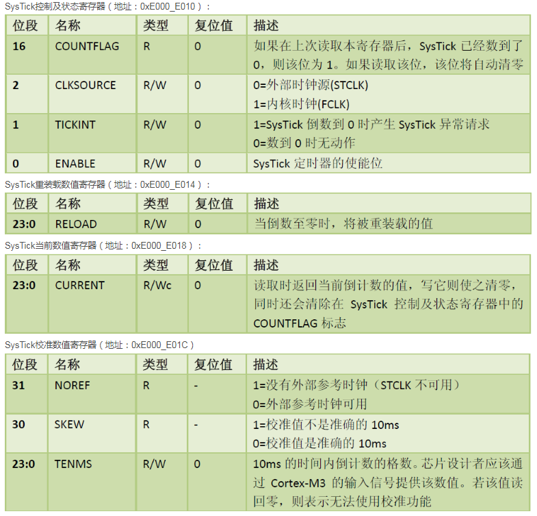

- delay.c代码

  - ```c
    #include "gd32f10x.h"
    #include "delay.h"
    
    void Delay_Init(void){
    	systick_clksource_set(SYSTICK_CLKSOURCE_HCLK);
    }
    
    void Delay_Us(uint16_t us){
    	SysTick->LOAD = us*108;
    	SysTick->VAL = 0x00;
    	SysTick->CTRL |= SysTick_CTRL_ENABLE_Msk;
    	while(!(SysTick->CTRL&SysTick_CTRL_COUNTFLAG_Msk));
    	SysTick->CTRL &= ~SysTick_CTRL_ENABLE_Msk;
    }
    
    void Delay_Ms(uint16_t ms){
    	while(ms--){
    		Delay_Us(1000);
    	}
    }
    
    delay.h
    #ifndef DELAY_H
    #define DELAY_H
    
    #include "stdint.h"
    
    void Delay_Init(void);
    void Delay_Us(uint16_t us);
    void Delay_Ms(uint16_t ms);
    
    #endif
    
    ```


### **通过IIC发送一字节数据**

- IIC时序图

  - 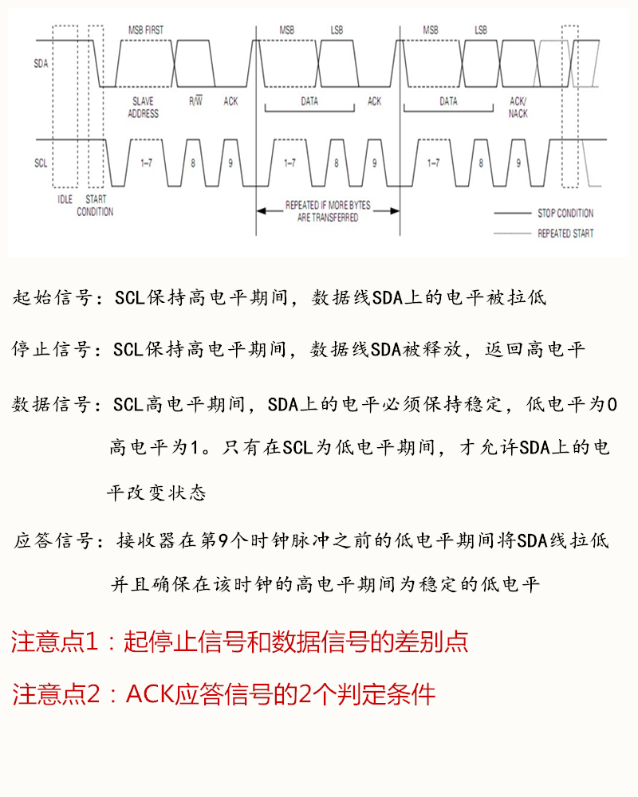

  - **需要知道以下：**

    - SCL：时钟线，SDA：数据线
      - SCL为高电平，SDA为高电平表示IIC总线空闲
      - SCL为低电平，SDA为高电平也表示IIC总线空闲
    - SCL设置高电平时
      - SDA设置高电平，再设置低电平表示起始信号
      - SDA设置低电平，再设置高电平表示停止信号
    - SCL设置低电平时
      - SDA设置低电平表示数据0，高电平表示数据1
    - **ACK/NACK：**
      - 前提：发送方在发送一字节数据后，修改SDA为高电平
      - 接收方在收到一字节数据后，拉高SCL电平，并修改SDA为低电平表示发送ACK应答信号，发送方可以继续发送字节数据
      - 若接收方收到一字节数据后，SCL为高电平，SDA保持低电平一段时间表示不需要接受数据了

  - **代码：**

    - ```c
      #include "gd32f10x.h"
      #include "iic.h"
      #include "delay.h"
      
      
      // 为什么IIC是GPIO6和7
      // 手册GPIO映射
      void IIC_Init(void){
      	rcu_periph_clock_enable(RCU_GPIOB);	
      	gpio_init(GPIOB,GPIO_MODE_OUT_OD,GPIO_OSPEED_50MHZ,GPIO_PIN_6);
      	gpio_init(GPIOB,GPIO_MODE_OUT_OD,GPIO_OSPEED_50MHZ,GPIO_PIN_7);
          
          //  SCL 和 SDA 都拉高是为了确保 I²C 总线处于空闲状态
      	IIC_SCL_H;
      	IIC_SDA_H;
      }
      
      void IIC_Start(void){
      	IIC_SCL_H;
      	IIC_SDA_H;
      	Delay_Us(2);
      	IIC_SDA_L;
      	Delay_Us(2);
      	IIC_SCL_L;
      }
      
      void IIC_Stop(void){
      	IIC_SCL_H;
      	IIC_SDA_L;
      	Delay_Us(2);
      	IIC_SDA_H;
      }
      
      // IIC发送一字节数据
      void IIC_Send_Byte(uint8_t txd){
      	int8_t i;
      	
      	for(i=7;i>=0;i--){
      		IIC_SCL_L;
      		if(txd&BIT(i))
      			IIC_SDA_H;
      		else
      			IIC_SDA_L;
      		Delay_Us(2);
      		IIC_SCL_H;
      		Delay_Us(2);
      	}
      
      	// 为接受从机的ack信号做准备
      	// 从机会在SCL高电平时拉低SDA线
      	IIC_SCL_L;
      	IIC_SDA_H;
      }
      
      uint8_t IIC_Wait_Ack(int16_t timeout){
      	do{
      		timeout--;
      		Delay_Us(2);
      	}while((READ_SDA)&&(timeout>=0));
      	if(timeout<0) return 1;
      	// 在ack信号到来之前，SCL线必须拉高
          // 进行READ_SDA操作必须确保SCL为高电平
      	IIC_SCL_H;
      	Delay_Us(2);
      	// ack信号到来后，SCL线拉低
      	if(READ_SDA!=0) return 2;
      	IIC_SCL_L;
      	Delay_Us(2);
      	return 0;
      }
      
      0：表示收到ack应答信号
      
      ```

      ```c
      #ifndef IIC_H
      #define IIC_H
      
      #define IIC_SCL_H   gpio_bit_set(GPIOB,GPIO_PIN_6)
      #define IIC_SCL_L   gpio_bit_reset(GPIOB,GPIO_PIN_6)
      
      #define IIC_SDA_H   gpio_bit_set(GPIOB,GPIO_PIN_7)
      #define IIC_SDA_L   gpio_bit_reset(GPIOB,GPIO_PIN_7)
      
      #define READ_SDA    gpio_input_bit_get(GPIOB,GPIO_PIN_7)
      
      void IIC_Init(void);
      void IIC_Start(void);
      void IIC_Stop(void);
      void IIC_Send_Byte(uint8_t txd);
      uint8_t IIC_Wait_Ack(int16_t timeout);
      uint8_t IIC_Read_Byte(uint8_t ack);
      
      
      #endif
      
      ```
      
      


### **通过IIC接受一字节数据**

- 代码：

  - ```c
    uint8_t IIC_Read_Byte(uint8_t ack){
    	int8_t i;
    	uint8_t rxd;
    	
    	rxd = 0;
    	for(i=7;i>=0;i--){
    		// 一开始设置低电平，等待发送设备更改数据线
    		IIC_SCL_L;
    		Delay_Us(2);
            // 等待2us后，更改SCL为高电平，读取数据线
    		IIC_SCL_H;
    		if(READ_SDA)
    			rxd |= BIT(i);
    		Delay_Us(2);
    	}
    	IIC_SCL_L;
    	Delay_Us(2);
    	if(ack){
    		// 将SDA拉低，发送ACK
    		IIC_SDA_L;
    		IIC_SCL_H;
    		Delay_Us(2);
    		// 将SDA拉高，准备接收下一个字节
    		IIC_SCL_L;
    		IIC_SDA_H;
    		Delay_Us(2);
    	}else{
    		// 将SDA拉高，发送NACK
    		IIC_SDA_H;
    		IIC_SCL_H;
    		Delay_Us(2);
    		// 将SDA拉低，准备接收下一个字节
    		IIC_SCL_L;
    		Delay_Us(2);
    	}
    	return rxd;
    }
    ```

    

### **24c02通过IIC写入数据**

**参考文献：**

- **PDF：M24c02指导手册中的写和读操作**

**流程：**

- 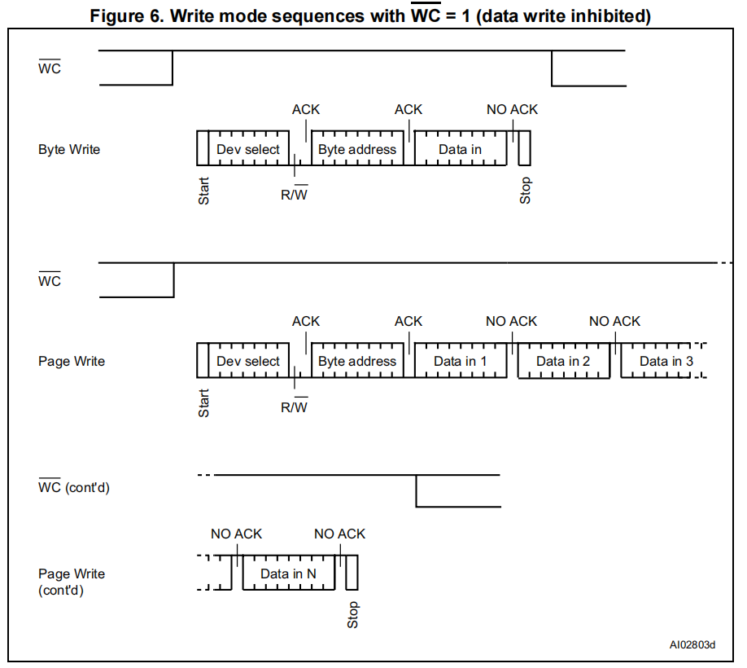

- **见上图写入一字节流程**

  - 发送start信号
  - 发送一字节数据：前7位表示设备描述符后1位表示写标识
  - 收到24c02发送的ack消息表示设备正确
  - 发送一字节地址数据，表示24c02内部地址偏移量
  - 收到24c02发送的ack消息
  - 开始数据发送，每一字节数据写入24c02发送一位ack信号
  - 发送端发送stop信号结束通信

- **见上图写入一页（16字节）流程**

  - 发送start信号
  - 发送一字节数据：前7位表示设备描述符后1位表示写标识
  - 收到24c02发送的ack消息表示设备正确
  - 发送一字节地址数据，表示24c02内部地址偏移量
  - 收到24c02发送的ack消息
  - 开始连续16字节发送，每一字节数据写入24c02发送一位ack信号
  - 发送端发送stop信号结束通信

- **代码：**

  - ```c
    #include "gd32f10x.h"
    #include "iic.h"
    #include "m24c02.h"
    
    uint8_t M24C02_WriteByte(uint8_t addr, uint8_t wdata){
    	IIC_Start();
    	IIC_Send_Byte(M24C02_WADDR);
    	if(IIC_Wait_Ack(100)!=0) return 1;
    	IIC_Send_Byte(addr);
    	if(IIC_Wait_Ack(100)!=0) return 2;
    	IIC_Send_Byte(wdata);
    	if(IIC_Wait_Ack(100)!=0) return 3;
    	IIC_Stop();
    	return 0;
    	
    }
    
    uint8_t M24C02_WritePage(uint8_t addr, uint8_t *wdata){
    	
    	uint8_t i;
    	IIC_Start();
    	IIC_Send_Byte(M24C02_WADDR);
    	if(IIC_Wait_Ack(100)!=0) return 1;
    	IIC_Send_Byte(addr);
    	if(IIC_Wait_Ack(100)!=0) return 2;
    	for(i=0;i<16;i++){
    		IIC_Send_Byte(wdata[i]);
    		if(IIC_Wait_Ack(100)!=0) return 3+i;
    	}
    	IIC_Stop();
    	return 0;
    }
    
    
    m24c02.h
    #ifndef M24C02_H
    #define M24C02_H
    
    #include "stdint.h"
    
    #define M24C02_WADDR  0xA0
    #define M24C02_RADDR  0xA1
    
    
    #endif
        
    // 0xA0通过手册知道24c02的设备标识为0xAX
    ```


### **24c02通过IIC读取数据**

**参考文献：**

- **PDF：w24c02**

**流程：**

- 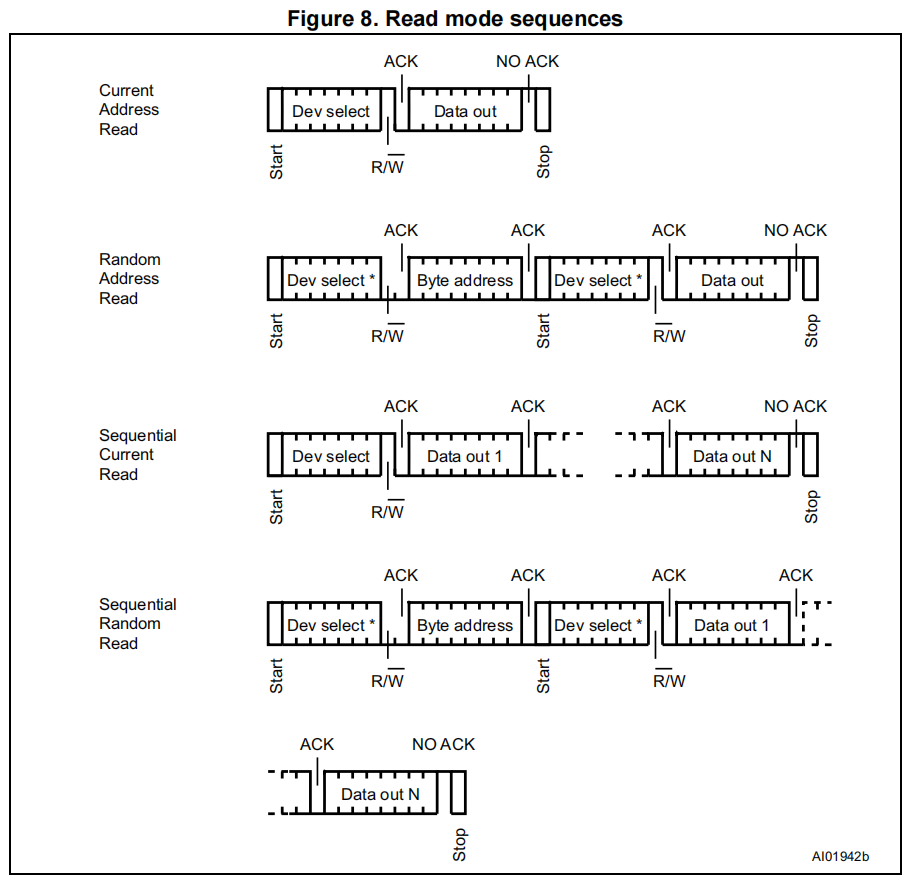

- **如上图使用第四种方法进行读取数据**

  - 发送start信号
  - 发送一字节的设备描述符和读信号
  - 收到ack信号
  - 发送一字节的要读的内部字节地址
  - 收到ack信号
  - 发送start信号和一字节的设备描述符和读信号
  - 收到ack信号后开始读一字节的数据并发送ack信号表示继续读，发送NACK表示终止
  - 发送stop信号停止通信

- **代码：**

  - ```c
    uint8_t M24C02_ReadData(uint8_t addr, uint8_t *rdata, uint8_t datalen){
    	
    	uint8_t i;
    	IIC_Start();
    	IIC_Send_Byte(M24C02_WADDR);
    	if(IIC_Wait_Ack(100)!=0) return 1;
    	IIC_Send_Byte(addr);
    	if(IIC_Wait_Ack(100)!=0) return 2;
    	IIC_Start();
    	IIC_Send_Byte(M24C02_RADDR);
    	if(IIC_Wait_Ack(100)!=0) return 3;
    	for(i=0;i<datalen-1;i++){
    		rdata[i] = IIC_Read_Byte(1);
    	}
    	rdata[datalen-1] = IIC_Read_Byte(0);
    	IIC_Stop();
    	return 0;	
    }
    ```

  

### 主程序

```c
#include "gd32f10x.h"
#include "usart.h"
#include "delay.h"
#include "iic.h"
#include "m24c02.h"

uint8_t rbuff[256];

//uint8_t wbuff[16]={0,1,2,3,4,5,6,7,8,9,10,11,12,13,14,15};
uint8_t wbuff[16]={15,14,13,12,11,10,9,8,7,6,5,4,3,2,1,0};

int main(void){
	
	uint16_t i;
	
	Delay_Init();
	Usart0_Init(921600);
	IIC_Init();
	
//	for(i=0;i<256;i++){
//		M24C02_WriteByte(i,255-i);
//		Delay_Ms(5);
//	}
	
	for(i=0;i<16;i++){
		M24C02_WritePage(i*16,wbuff);
		Delay_Ms(5);
	}
	
	M24C02_ReadData(0,rbuff,256);
	
	for(i=0;i<256;i++){
		u0_printf("地址%d=%x\r\n",i,rbuff[i]);
	}
	
	
	while(1){

	}
}

```


## SPI W25Q64

**SPI（Serial Peripheral Interface）即串行外设接口，是一种高速、全双工、同步的通信总线**

**必须先擦除后写入**

### IIC与SPI区别

**相同点**

- **通信类型**：都是串行通信方式，数据按位依次传输，适合近距离设备间的通信，常用于连接微控制器与各种外围设备。
- **同步通信**：都属于同步通信，需要时钟信号来同步数据的传输和接收，确保数据的准确性和稳定性。

**不同点**

- 总线结构
  - **I²C**：**使用两条线，即串行数据线（SDA）和串行时钟线（SCL），所有设备都连接在这两条总线上，通过设备地址来区分不同的设备，是一种多主多从的总线结构，总线上可以有多个主机和多个从机。**
  - **SPI**：**通常使用四条线，包括时钟线（SCK）、主输出从输入线（MOSI）、主输入从输出线（MISO）和片选线（SS）。SPI 是主从结构，一个主机可以连接多个从机，通过片选信号来选择与哪个从机进行通信。**
- 通信速度
  - **I²C**：通信速度相对较慢，标准模式下速度为 100kbps，快速模式为 400kbps，高速模式可达 3.4Mbps。
    - i2c读写都是按位读写
  - **SPI**：通信速度通常比 I²C 快，能达到几十 Mbps 甚至更高，具体速度取决于**设备和时钟频率。**
    - SPI读写是按自己读写
- 数据传输方向
  - **I²C**：是半双工通信，同一时刻数据只能在一个方向上传输，要么主机向从机发送数据，要么从机向主机发送数据。
  - **SPI**：是全双工通信，允许主机和从机在同一时刻进行双向的数据传输，提高了数据传输效率。
- 设备地址
  - **I²C**：每个设备都有唯一的 7 位或 10 位地址，主机通过发送设备地址来选择要通信的从机，地址在通信过程中是固定的。
  - **SPI**：从机没有固定的地址，主机通过片选信号（SS）来选择从机，不同的从机有不同的片选引脚，主机通过控制片选引脚的电平来选中特定的从机进行通信。
- 应用场景
  - **I²C**：适用于对通信速度要求不高、总线上设备数量较多且需要共享总线资源的场景，如连接多个传感器、EEPROM、LCD 控制器等。
  - **SPI**：常用于对通信速度要求较高、需要全双工通信以及从机数量相对较少的场景，如连接闪存芯片、高速传感器、音频编解码器等。

### SPI基础

在嵌入式系统中使用 SPI（Serial Peripheral Interface）进行数据的读取和写入是很常见的操作。下面分别从硬件连接、STM32 和 Linux 平台上的使用示例来详细介绍。

**硬件连接**

SPI 通常有 4 个主要的信号引脚：

- **SCLK（Serial Clock）**：时钟信号，由主设备产生，用于同步数据传输。
- **MOSI（Master Output Slave Input）**：主设备输出，从设备输入的数据线。
- **MISO（Master Input Slave Output）**：主设备输入，从设备输出的数据线。
- **SS（Slave Select）**：从设备选择信号，低电平有效，主设备通过该信号选择要通信的从设备，也用来表示通信的开始和结束。
  - 当w25q64不忙时，将ss置为低电平，w25q64看到ss被置为低电平，其他主设备访问时发送忙信号
  - 每次要读写w25q64时需要看忙不忙，然后置ss低电平

**SPI 全双工工作原理**

1. **时钟同步**

- SPI 是同步串行通信，需要时钟信号（SCK）来同步数据传输
- 主机负责产生时钟信号

2. **数据传输机制**

- MOSI（主机输出）和 MISO（主机输入）同时工作
- 每个时钟周期：
  - 主机通过 MOSI 发送一位数据
  - 从机通过 MISO 发送一位数据

3. **为什么需要发送才能接收**

```
主机 ----MOSI----> 从机
     <---MISO----
     ----SCK---->
```

- 要接收数据，必须产生时钟信号
- 产生时钟的同时，必须在 MOSI 线上发送数据
- 即使只想接收数据，也必须发送"虚拟数据"（通常是 0xFF）

**代码示例**

如果只想接收数据，通常这样写：

````c
uint8_t SPI_ReceiveByte(void) {
    // 发送 0xFF 作为虚拟数据，同时接收真实数据
    return SPI0_ReadWriteByte(0xFF);
}
````

**实际应用举例**

在读取 W25Q64 Flash 时：

````c
void W25Q64_Read(uint8_t *rbuff, uint32_t len) {
    for(uint32_t i = 0; i < len; i++) {
        // 发送 0xFF 作为虚拟数据，读取实际数据
        rbuff[i] = SPI0_ReadWriteByte(0xFF);
    }
}
````

因此，发送数据是为了产生时钟信号，使从设备能够正确发送数据到主机。这是 SPI 协议的基本工作方式。

**流程：**

- 查看用户手册GPIO映射关于SPI部分，SPI0对应pa4/5/6/7
  - pa5对应SCK，不需要使用
- 添加spi.c的lib库文件，打开spi的宏开关
- spi初始化注意点
  - 设置spi的分频值
    - 确定RCU_SPI0对应的ABP2
    - 在手册的rcu时钟树找到ABP2的频率
    - 在w25q64手册中支持的最大频率
- spi收发
  - 收发注意点
    - spi的收发是一体的
    - 为什么接受数据必须要先发送数据
      - 发送数据用于产生时钟信号

### **SPI收发代码**

```c
头文件：
#ifndef SPI_H
#define SPI_H

#include "stdint.h"

void SPI0_Init(void);
uint8_t SPI0_ReadWriteByte(uint8_t txd);
void SPI0_Write(uint8_t *wdata, uint16_t datalen);
void SPI0_Read(uint8_t *rdata, uint16_t datalen);

#endif
```

```c
代码：
#include "gd32f10x.h"
#include "usart.h"
#include "delay.h"
#include "spi.h"
#include "w25q64.h"

uint8_t wdata[256];
uint8_t rdata[256];

int main(void){

	uint16_t i,j;
	
	Delay_Init();
	Usart0_Init(921600);
	W25Q64_Init();
	
	
	W25Q64_Erase64K(0);
	
	for(i=0;i<256;i++){
		for(j=0;j<256;j++) 
			wdata[j] = i;
		W25Q64_PageWrite(wdata,i);
	}
		
	Delay_Ms(50);

    for(i=0;i<256;i++){
		W25Q64_Read(rdata,i*256,256);
		for(j=0;j<256;j++) 
			u0_printf("地址%d=%x\r\n",i*256+j,rdata[j]);
	}
	
	
	while(1){

	}
}

```

### **w25q64收发代码**

**可以理解spi收发代码是底层驱动**

#### **手册使用：**

查看w25q54寄存器（忙状态）、标准SPI指令

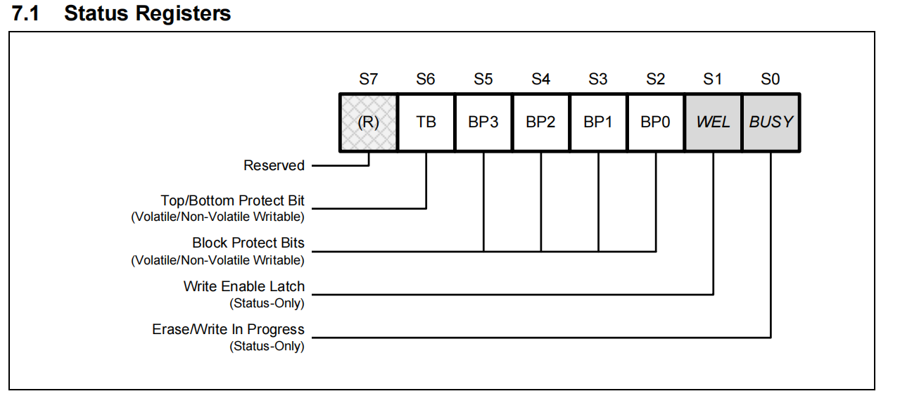

A-地址

D-数据

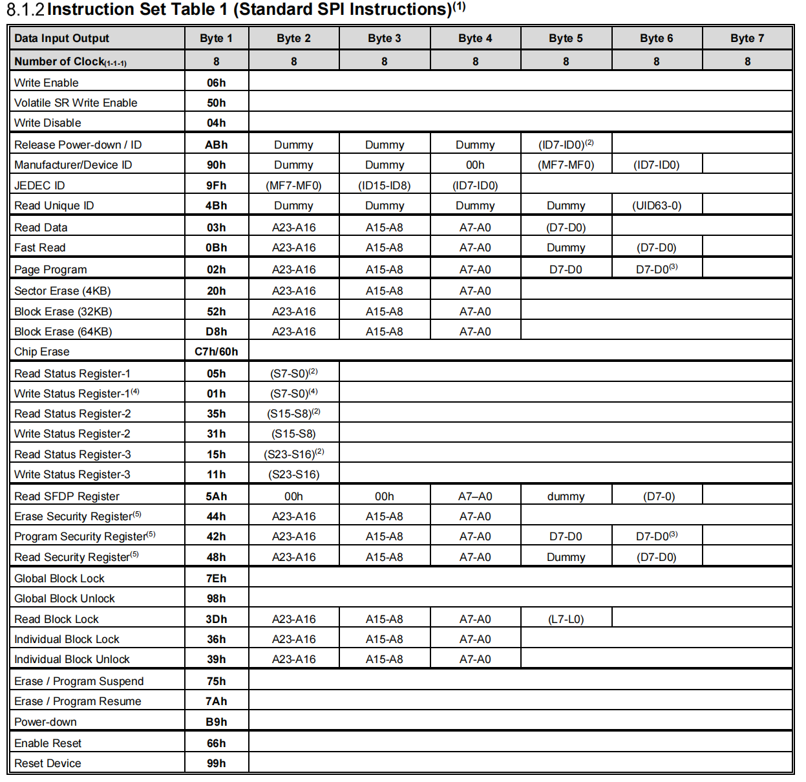

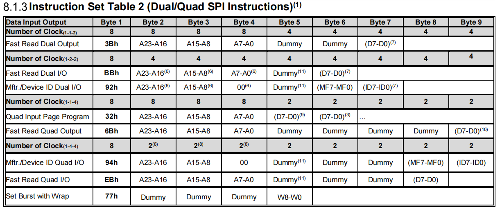

**查看spi指令表，发送0x05可读状态寄存器1，通过读状态寄存器1的0位值判断w25q54是否忙**

W25Q64_WaitBusy


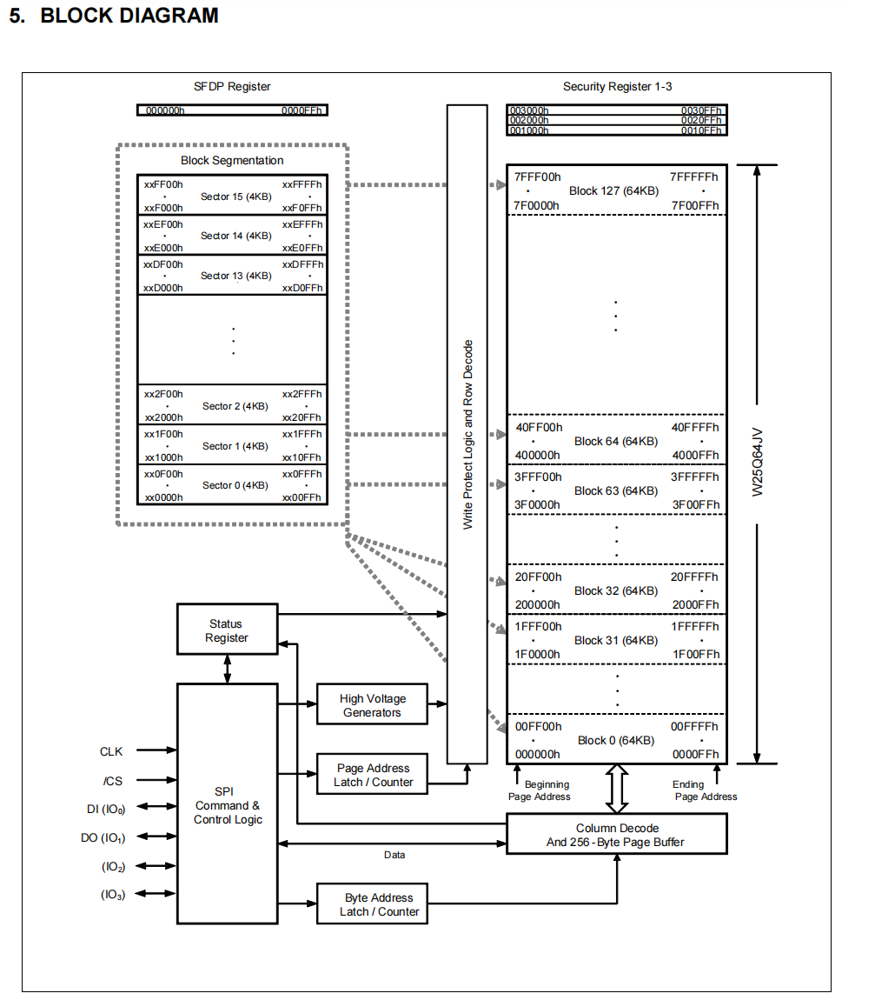

图中w25q64有128块，每块有64KB数据，

   最大地址 = 128 * 64 * 1024

​     = 128 * 65536

​     = 8,323,072 (0x7F0000)，只需要24位表示


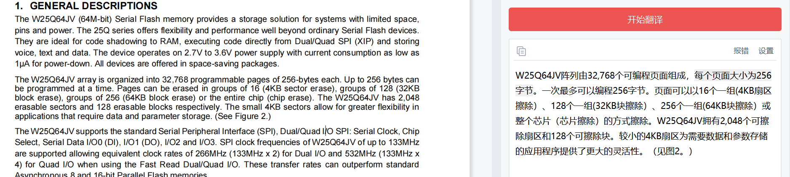

最大逻辑地址：

32768*64=2097152（0x200000），只需要24位表示

#### 代码

```c
头文件
#ifndef W25Q64_H
#define W25Q64_H

#include "stdint.h"

#define  CS_ENABLE     gpio_bit_reset(GPIOA,GPIO_PIN_4)
#define  CS_DISENABLE  gpio_bit_set(GPIOA,GPIO_PIN_4)

void W25Q64_Init(void);
void W25Q64_WaitBusy(void);
void W25Q64_Enable(void);
void W25Q64_Erase64K(uint8_t blockNB);
void W25Q64_PageWrite(uint8_t *wbuff, uint16_t pageNB);
void W25Q64_Read(uint8_t *rbuff, uint32_t addr, uint32_t datalen);

#endif
```

```c
代码
#include "gd32f10x.h"
#include "spi.h"
#include "w25q64.h"

void W25Q64_Init(void){
	// 开启GPIO_4引脚
	// GPIO_4引脚作为W25Q64的片选引脚
	// 片选引脚高电平时，W25Q64处于空闲状态，低电平时，W25Q64处于工作状态
	rcu_periph_clock_enable(RCU_GPIOA);
	gpio_init(GPIOA,GPIO_MODE_OUT_PP,GPIO_OSPEED_50MHZ,GPIO_PIN_4);
	CS_DISENABLE;
	SPI0_Init();	
}

void W25Q64_WaitBusy(void){
	uint8_t res;
	do{
		CS_ENABLE;
		// 发送读取状态寄存器的命令
		SPI0_ReadWriteByte(0x05);
		// 读取状态寄存器的值
		// 读取状态寄存器的值时，发送0xff作为占位符
		res = SPI0_ReadWriteByte(0xff);
		CS_DISENABLE;
		// 读取状态寄存器的值时，返回值的最低位表示W25Q64是否处于忙碌状态
		// 如果最低位为1，表示W25Q64处于忙碌状态，继续等待
	}while((res&0x01)==0x01);
}

void W25Q64_Enable(void){
	W25Q64_WaitBusy();
	CS_ENABLE;
	SPI0_ReadWriteByte(0x06);
	CS_DISENABLE;
}

// 每次擦除64k，传入参数为块号
// 有128个块，每个块64K,需要7位地址
void W25Q64_Erase64K(uint8_t blockNB){
	uint8_t wdata[4];
	
	// 发送擦除64K的命令
	wdata[0] = 0xD8;
	// 计算擦除块的地址
	// 擦除块的地址 = 擦除块号 * 64K
	// 擦除块号是从0开始的，所以需要乘以64K
	/**
	 * 最大地址 = 127 * 64 * 1024
         = 127 * 65536
         = 8,323,072 (0x7F0000)
	 */
	wdata[1] = (blockNB*64*1024)>>16;
	wdata[2] = (blockNB*64*1024)>>8;
	wdata[3] = (blockNB*64*1024)>>0;
	
	W25Q64_WaitBusy();
	W25Q64_Enable();
	CS_ENABLE;
	SPI0_Write(wdata,4);
	CS_DISENABLE;
	W25Q64_WaitBusy();
}

//一页256字节
// 有32768页，需要16位地址
void W25Q64_PageWrite(uint8_t *wbuff, uint16_t pageNB){
	uint8_t wdata[4];
	
	wdata[0] = 0x02;
	wdata[1] = (pageNB*256)>>16;
	wdata[2] = (pageNB*256)>>8;
	wdata[3] = (pageNB*256)>>0;
	
	W25Q64_WaitBusy();
	W25Q64_Enable();
	CS_ENABLE;
	SPI0_Write(wdata,4);
	// 每次写入256字节的数据（正好一页）
	SPI0_Write(wbuff,256);
	CS_DISENABLE;
}

// 从第几个字节开始读取datalen的数据
void W25Q64_Read(uint8_t *rbuff, uint32_t addr, uint32_t datalen){
	uint8_t wdata[4];
	
	wdata[0] = 0x03;
	wdata[1] = (addr)>>16;
	wdata[2] = (addr)>>8;
	wdata[3] = (addr)>>0;
	
	W25Q64_WaitBusy();
	CS_ENABLE;
	SPI0_Write(wdata,4);
	SPI0_Read(rbuff,datalen);
	CS_DISENABLE;
}
```

**主代码**

```c
#include "gd32f10x.h"
#include "usart.h"
#include "delay.h"
#include "spi.h"
#include "w25q64.h"

uint8_t wdata[256];
uint8_t rdata[256];

int main(void){

	uint16_t i,j;
	
	Delay_Init();
	Usart0_Init(921600);
	W25Q64_Init();
	
	
    // 必须先擦除后写入，擦除前64KB
	W25Q64_Erase64K(0);
	
    // 写入256页，每页256字节，一共64KB
	for(i=0;i<256;i++){
		for(j=0;j<256;j++) 
			wdata[j] = i;
		W25Q64_PageWrite(wdata,i);
	}
		
	Delay_Ms(50);

    for(i=0;i<256;i++){
		W25Q64_Read(rdata,i*256,256);
		for(j=0;j<256;j++) 
			u0_printf("地址%d=%x\r\n",i*256+j,rdata[j]);
	}
	
	
	while(1){

	}
}

```


## FLASH 擦除写入

擦除A分区，写入A分区

gd32中flash别名fmc


- fmc.c宏启用
- 引入fmc的lib库
- 查看用户手册fmc部分
  - 内存页大小1KB（以页大小擦除写入）
  - 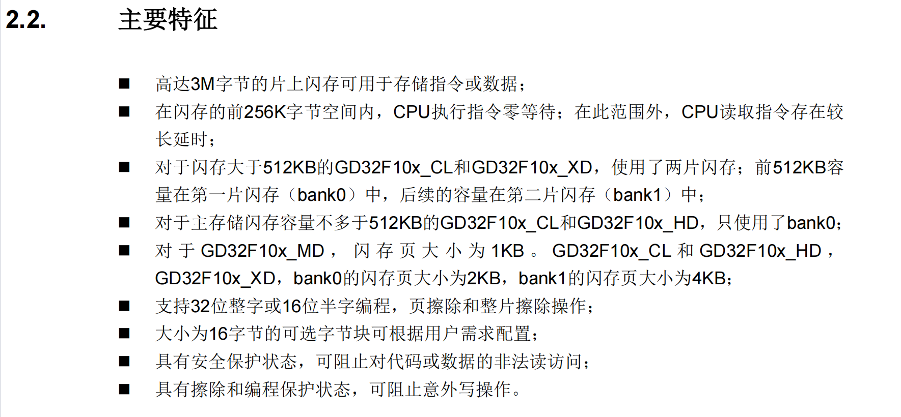
- 编写擦除和写入flash函数


### **擦除写入代码**

```c
#include "gd32f10x.h"
#include "fmc.h"

void GD32_EraseFlash(uint16_t start, uint16_t num){
	uint16_t i;
	fmc_unlock();
	for(i=0;i<num;i++){
		fmc_page_erase((0x08000000 + start * 1024) + (1024 * i));
	}
	fmc_lock();
}

void GD32_WriteFlash(uint32_t saddr, uint32_t *wdata, uint32_t wnum){
	fmc_unlock();
	while(wnum){
		// 写入一个字，32位机器一个字等于4字节
		fmc_word_program(saddr,*wdata);
		wnum-=4;
		saddr+=4;
		wdata++;
	}
	fmc_lock();
}

#ifndef FMC_H
#define FMC_H

#include "stdint.h"

void GD32_EraseFlash(uint16_t start, uint16_t num);
void GD32_WriteFlash(uint32_t saddr, uint32_t *wdata, uint32_t wnum);

#endif


```


### **主程序**

```c
#include "gd32f10x.h"
#include "usart.h"
#include "delay.h"
#include "fmc.h"

uint32_t wbuff[1024];
uint32_t i;

int main(void){
	
	Delay_Init();
	Usart0_Init(921600);

	for(i=0;i<1024;i++)
		wbuff[i] = 0x87654322;
	
	// 必须先擦除，第60页开始的4页
	GD32_EraseFlash(60,4);
	
	GD32_WriteFlash(60*1024+0x08000000,wbuff,1024*4);
	
	for(i=0;i<1024;i++)
		u0_printf("%x\r\n",*(uint32_t *)((60*1024+0x08000000)+(i*4)));
	
	while(1){

	}
}

```


## 构建bootloader程序

- 分区
  - C8T6：64KB，一页1KB，页号0~63
  - b区：bootloader程序20K，0~19
  - a区：程序区，20~63

- ota事件触发、非ota事件触发


### **flash分区**

- main.h中宏定义

  - 一些关于A，B区的宏定义

  - 关于OTA_flag的声明

    - A区下载完后置位OTA_flag:set(1)，然后重启运行bootloader程序
    - B区负责重置OTA_flag:reset(0)
      - 在m24c02中添加读取OTA_flag标签函数
      - bootloader读取OTA_flag，若为1（表示外部flash的A区可更新）则更新A区，跳转再重置OTA_flag
      - 需要注意大小端模式

  - 代码

    - ```C
      #ifndef MAIN_H
      #define MAIN_H
      
      #include "stdint.h"
      
      #define  GD32_FLASH_SADDR   0x08000000                                             //FLASH起始地址
      #define  GD32_PAGE_SIZE     1024                                                   //FLASH扇区大小
      #define  GD32_PAGE_NUM      64                                                     //FLASH总扇区个数
      #define  GD32_B_PAGE_NUM    20                                                     //B区扇区个数
      #define  GD32_A_PAGE_NUM    GD32_PAGE_NUM - GD32_B_PAGE_NUM                        //A区扇区个数
      #define  GD32_A_START_PAGE  GD32_B_PAGE_NUM                                        //A区起始扇区编号
      #define  GD32_A_SADDR       GD32_FLASH_SADDR + GD32_A_START_PAGE * GD32_PAGE_SIZE  //FA区起始地址
      
      
      #define OTA_SET_FLAG        0x0c0d0e0f
      typedef struct{
      	uint32_t OTA_flag;
      }OTA_InfoCB;
      #define OTA_INFOCB_SIZE sizeof(OTA_InfoCB)
      
      extern OTA_InfoCB OTA_Info;
      
      #endif
      ```

    - main代码

      - ```c
        #include "gd32f10x.h"
        #include "main.h"
        #include "usart.h"
        #include "delay.h"
        #include "fmc.h"
        #include "iic.h"
        #include "m24c02.h"
        #include "boot.h"
        
        OTA_InfoCB OTA_Info;
        uint8_t buff[256];
        uint8_t txbuff[16] = {15,14,13,12,11,10,9,8,7,6,5,4,3,2,1,0};;
        int main(void){
        	
        	Delay_Init();
        	Usart0_Init(921600);
          	IIC_Init();
        	M24C02_WritePage(0, txbuff);
        	Delay_Ms(5);
        	M24C02_ReadData(0, buff, sizeof(buff));
        	for (int i = 0; i < 256; ++i)
        		u0_printf("%d:%x\r\n", i, buff[i]);
        	M24C02_ReadOTAInfo();
        	BootLoader_Brance();
        	
        	while(1){
        
        	}
        }
        ```

        

- HW下boot.c/boot.h

  - bootloader读取OTA_flag，若为1（表示外部flash的A区可更新）则更新A区，跳转再重置OTA_flag

  - 若为0则跳转

  - 代码

    - ```c
      #include "gd32f10x.h"
      #include "boot.h"
      #include "main.h"
      #include "usart.h"
      #include "delay.h"
      #include "fmc.h"
      #include "iic.h"
      #include "m24c02.h"
      
      void BootLoader_Brance(void){
      	if(OTA_Info.OTA_flag == OTA_SET_FLAG){
      		u0_printf("OTA更新\r\n");
      	}else{
      		u0_printf("跳转A分区\r\n");
      	}
      }
      ```

      


**bootloader跳转的SP指针和PC指针设置**

可以理解将A区的中断向量表值覆盖到B区上，形成跳转

- 看Cortax-M3芯片寄存器
  - 设置SP(堆栈)指针（R13寄存器）
    - 找到A区的起始地址（0x08005000），中断向量表放在起始位置，向量表第一个成员存放__initial_sp初始值
      - 即把0x08005000存的值给到sp指针
  - 设置PC（程序计数器）指针(R15寄存器)
    - 复位向量，中断向量表的第二个成员
    - 将向量表的第二个成员给到PC，0x08005000 + 4存的值
  - B区用到的外设，寄存器reset

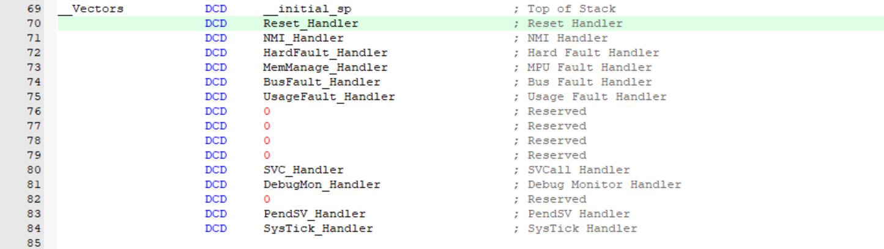


**流程**

- 在boot编写设置sp、PC函数
  - 使用汇编设置sp
  - 使用函数指针指向PC第二个成员
  - 外设和寄存器的reset
    - 使用deinit表示复位
- c语言调用汇编指令设置sp：MSR
  - 第一个参数r0，第二个r1
- 设置PC
  - 需要知道RAM的大小，起始地址大小
    - 一般RAM起始值（逻辑值）：0x20000000~0x20004FFF(20KB)
- 创建A区工程（之前的串口工程）
  - 修改target为0x08005000
  - 修改向量表vect_tab_offset 0x5000
  - 烧录A分区
- 烧录B分区，其target设置为0x08000000

**boot代码**

```c
#include "gd32f10x.h"
#include "boot.h"
#include "main.h"
#include "usart.h"
#include "delay.h"
#include "fmc.h"
#include "iic.h"
#include "m24c02.h"

load_a load_A;

void BootLoader_Brance(void){
	if(OTA_Info.OTA_flag == OTA_SET_FLAG){
		u0_printf("OTA更新\r\n");
	}else{
		u0_printf("跳转A分区\r\n");
		LOAD_A(GD32_A_SADDR);
	}
}

// c语言使用汇编设置sp堆栈寄存器
__asm void MSR_SP(uint32_t addr){
	MSR MSP, r0
	BX r14
}

// load_A表示函数指针，指向A区的地址，调用会修改PC值指向A区
void LOAD_A(uint32_t addr){
	if((*(uint32_t *)addr>=0x20000000)&&(*(uint32_t *)addr<=0x20004FFF)){
		MSR_SP(*(uint32_t *)addr);
		load_A = (load_a)*(uint32_t *)(addr+4);
		BootLoader_Clear();
		load_A();
	}
}

void BootLoader_Clear(void){
	usart_deinit(USART0);
	gpio_deinit(GPIOA);
	gpio_deinit(GPIOB);
}


// boot.h
#ifndef BOOT_H
#define BOOT_H

#include "stdint.h"

typedef void (*load_a)(void);

void BootLoader_Brance(void);
__asm void MSR_SP(uint32_t addr);
void LOAD_A(uint32_t addr);
void BootLoader_Clear(void);


#endif
```


### 读写24c02结构体信息

```
1：谁将OTA_flag变成对勾？
A区
2：什么时候将OTA_flag变成对勾？
A区下载完毕之后
3：OTA时，最新版本的程序文件下载到哪？
分片下载，[256],W25Q64中
4：OTA时，最新版本的程序文件如何下载？下载多少？
服务器下发告诉我们上传的新版本程序的大小，字节数
4+：下载多少这个变量用不用保存？
用，保存到24C02
5：发生OTA事件时，B区如何更新A区？
根据保存在24C02中的下载量，拿数据(每次1024个字节)，写到A区
```


**24c02保存的信息**

- 在main.h结构体添加成员变量

  - 该结构体保存到24c02中，确保是一页（16B）的整数倍
  - Firelen[11]
    - 0：OTA程序在w25q64中的大小
    - 1-10：其他程序，比如uarst程序等在w25q64中的大小

- 新加结构体

  - 存放w25q64读取的数据buff，根据结构体中的数据写入到内部flash中

  - UpDataA_B

    - buff[1024]:内部flash中，一页1024字节
    - blockNB：保存w25q64程序存放的块地址，0号块存放OTA程序

  - ```
    #ifndef MAIN_H
    #define MAIN_H
    
    #include "stdint.h"
    
    #define  GD32_FLASH_SADDR   0x08000000                                             //FLASH起始地址
    #define  GD32_PAGE_SIZE     1024                                                   //FLASH扇区大小
    #define  GD32_PAGE_NUM      64                                                     //FLASH总扇区个数
    #define  GD32_B_PAGE_NUM    20                                                     //B区扇区个数
    #define  GD32_A_PAGE_NUM    GD32_PAGE_NUM - GD32_B_PAGE_NUM                        //A区扇区个数
    #define  GD32_A_START_PAGE  GD32_B_PAGE_NUM                                        //A区起始扇区编号
    #define  GD32_A_SADDR       GD32_FLASH_SADDR + GD32_A_START_PAGE * GD32_PAGE_SIZE  //FA区起始地址
    
    
    #define OTA_SET_FLAG        0xAABB1122
    
    // 存放在24c02中，尽量保证一页的整数倍（16B）
    typedef struct{
    	uint32_t OTA_flag;
    	uint32_t Firelen[11];   //0号成员固定对应OTA的大小，1-10标识其他程序的大小
    }OTA_InfoCB;
    #define OTA_INFOCB_SIZE sizeof(OTA_InfoCB)
    	
    typedef struct{
    	uint8_t  Updatabuff[GD32_PAGE_SIZE];   // 每次向内部flash中写入一页
    	uint32_t W25Q64_BlockNB;  // 不同块设备表示不同版本程序块，0表示OTA块，与Firelen一起用
    }UpDataA_CB;
    
    
    extern OTA_InfoCB OTA_Info;
    extern UpDataA_CB UpDataA;
    
    #endif
    ```

    

- 24c02写和读

  - ```c
    void M24C02_ReadOTAInfo(void){
    	memset(&OTA_Info, 0, OTA_INFOCB_SIZE);
    	M24C02_ReadData(0, (uint8_t *)&OTA_Info, OTA_INFOCB_SIZE);
    }
    
    void M24C02_WriteOTAInfo(void){
    	uint32_t cnt = OTA_INFOCB_SIZE / 16;
    	for (int i = 0; i < cnt; ++i){
    		M24C02_WritePage(i * 16, (uint8_t *)&OTA_Info + i * 16);
    		Delay_Ms(5);
    	}
    }
    
    ```

    

### w25q64

将w25q64新版本程序更新到内部flash中

流程

- 有OTA事件时，改变标志位
  - update_A
- 在main.c的循环中if功能进行OTA
  - 判断长度是不是4B的整数倍（字的整数倍）
  - 擦除flash
  - 读取1024字节写入flash中
  - 置位flag
  - 调用nvic_systemReset函数

```c
#ifndef MAIN_H
#define MAIN_H

#include "stdint.h"

#define  GD32_FLASH_SADDR   0x08000000                                             //FLASH起始地址
#define  GD32_PAGE_SIZE     1024                                                   //FLASH扇区大小
#define  GD32_PAGE_NUM      64                                                     //FLASH总扇区个数
#define  GD32_B_PAGE_NUM    20                                                     //B区扇区个数
#define  GD32_A_PAGE_NUM    GD32_PAGE_NUM - GD32_B_PAGE_NUM                        //A区扇区个数
#define  GD32_A_START_PAGE  GD32_B_PAGE_NUM                                        //A区起始扇区编号
#define  GD32_A_SADDR       GD32_FLASH_SADDR + GD32_A_START_PAGE * GD32_PAGE_SIZE  //FA区起始地址

#define  UPDATA_A_FLAG      0x00000001  // 表示OTA事件


#define OTA_SET_FLAG        0xAABB1122

// 存放在24c02中，尽量保证一页的整数倍（16B）
typedef struct{
	uint32_t OTA_flag;
	uint32_t Firelen[11];   //0号成员固定对应OTA的大小，1-10标识其他程序的大小
}OTA_InfoCB;
#define OTA_INFOCB_SIZE sizeof(OTA_InfoCB)
	
typedef struct{
	uint8_t  Updatabuff[GD32_PAGE_SIZE];   // 每次向内部flash中写入一页
	uint32_t W25Q64_BlockNB;  // 不同块设备表示不同版本程序块，0表示OTA块，与Firelen一起用
}UpDataA_CB;


extern OTA_InfoCB OTA_Info;
extern UpDataA_CB UpDataA;

#endif
```

```c
#include "gd32f10x.h"
#include "main.h"
#include "usart.h"
#include "delay.h"
#include "fmc.h"
#include "iic.h"
#include "m24c02.h"
#include "boot.h"
#include "w25q64.h"

OTA_InfoCB OTA_Info;
UpDataA_CB UpDataA;
uint32_t BootStaFlag;


int main(void){
	uint8_t i;
	
	Delay_Init();
	Usart0_Init(921600);
    IIC_Init();
	M24C02_ReadOTAInfo();
	BootLoader_Brance();
	
	while(1){
		if(BootStaFlag&UPDATA_A_FLAG){
			//更新A区
			u0_printf("长度%d字节\r\n",OTA_Info.Firelen[UpDataA.W25Q64_BlockNB]);
			if(OTA_Info.Firelen[UpDataA.W25Q64_BlockNB] % 4 == 0){
				GD32_EraseFlash(GD32_A_START_PAGE,GD32_A_PAGE_NUM);
				for(i=0;i<OTA_Info.Firelen[UpDataA.W25Q64_BlockNB]/GD32_PAGE_SIZE;i++){
					W25Q64_Read(UpDataA.Updatabuff,i*1024 + UpDataA.W25Q64_BlockNB*64*1024 ,GD32_PAGE_SIZE);
					GD32_WriteFlash(GD32_FLASH_SADDR + i*GD32_PAGE_SIZE,(uint32_t *)UpDataA.Updatabuff,GD32_PAGE_SIZE);
				}
				if(OTA_Info.Firelen[UpDataA.W25Q64_BlockNB] % 1024 != 0){
					W25Q64_Read(UpDataA.Updatabuff,i*1024 + UpDataA.W25Q64_BlockNB*64*1024 ,OTA_Info.Firelen[UpDataA.W25Q64_BlockNB] % 1024);
					GD32_WriteFlash(GD32_FLASH_SADDR + i*GD32_PAGE_SIZE,(uint32_t *)UpDataA.Updatabuff,OTA_Info.Firelen[UpDataA.W25Q64_BlockNB] % 1024);
				}
				if(UpDataA.W25Q64_BlockNB == 0){
					OTA_Info.OTA_flag = 0;
					M24C02_WriteOTAInfo();
				}
				NVIC_SystemReset();
			}else{
				u0_printf("长度错误\r\n");
				BootStaFlag &=~ UPDATA_A_FLAG;
			}
		}
	}
}

```


### **bootloader收尾**


**进入串口命令行**（38）

- 串口的输入输出
  - boot.c和boot.h的补充

**擦除A 分区和重启实现**（39）

**通过xmodem实现A区更新**

- **xmoderm协议基础**（40）

  - 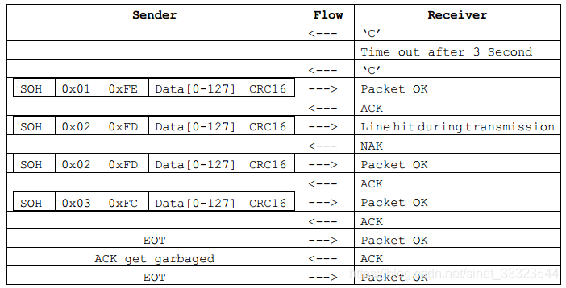

  - ```c
    
    1：先发C，500ms/1s
    
    2：SOH = 0x01
    
       ACK = 0x06
    
       NCK = 0x15
    
       EOT = 0x04
    
    3：有效数据 128 把它写入A区
       
       整包数据 128 + 5 = 133
    
    4：C8T6硬件CRC32位的，自己做一个CRC16校验
    ```

- **实现CRC16校验**（41）

  - CRC32的代码

    - ```c
      // CRC32 查找表
      static const uint32_t crc32_table[256] = {
          0x00000000, 0x77073096, 0xEE0E612C, 0x990951BA, 0x076DC419, 0x706AF48F, 0xE963A535, 0x9E6495A3,
          0x0EDB8832, 0x79DCB8A4, 0xE0D5E91E, 0x97D2D988, 0x09B64C2B, 0x7EB17CBD, 0xE7B82D07, 0x90BF1D91,
          // ...这里省略了部分表项，完整表可以通过生成函数得到
      };
      
      // 生成 CRC32 查找表
      void Generate_CRC32_Table(void) {
          uint32_t polynomial = 0xEDB88320;
          for (uint32_t i = 0; i < 256; i++) {
              uint32_t c = i;
              for (uint32_t j = 0; j < 8; j++) {
                  if (c & 1) {
                      c = polynomial ^ (c >> 1);
                  } else {
                      c = c >> 1;
                  }
              }
              crc32_table[i] = c;
          }
      }
      
      // CRC32 计算函数
      uint32_t Calculate_CRC32(uint8_t *data, uint32_t length) {
          uint32_t crc = 0xFFFFFFFF;
          
          while (length--) {
              crc = (crc >> 8) ^ crc32_table[(crc & 0xFF) ^ *data++];
          }
          
          return crc ^ 0xFFFFFFFF;
      }
      ```

  - CRC16代码

    - ```c
      uint16_t Xmodem_CRC16(uint8_t *data, uint16_t datalen){
      	
      	uint8_t i;
      	uint16_t Crcinit = 0x0000;
      	uint16_t Crcipoly = 0x1021;
      	
      	while(datalen--){
      		Crcinit = (*data << 8) ^ Crcinit;
      		for(i=0;i<8;i++){
      			if(Crcinit&0x8000) 
      				Crcinit = (Crcinit << 1) ^ Crcipoly;
      			else 
      				Crcinit = (Crcinit << 1);
      		}
      		data++;
      	}
      	return Crcinit;
      }
      ```

- **实现发送C**（42）

  - 定义标志位当要通过xmodem发送bin程序，则置位
  - 根据标志位在主循环中定时发送C

- **通过xmodem协议，将外部bin文件通过串口下载到内部flash中**

  - boot.c文件，主要修改main.c/h和boot.c/h文件

    - ```c
      #include "gd32f10x.h"
      #include "boot.h"
      #include "main.h"
      #include "usart.h"
      #include "delay.h"
      #include "fmc.h"
      #include "iic.h"
      #include "m24c02.h"
      
      load_a load_A;        //函数指针load_A
      
      /*-------------------------------------------------*/
      /*函数名：BootLoader分支判断                       */
      /*参  数：无                                       */
      /*返回值：无                                       */
      /*-------------------------------------------------*/
      void BootLoader_Brance(void)
      {
      	if(BootLoader_Enter(20)==0){	
      		if(OTA_Info.OTA_flag == OTA_SET_FLAG){       //判断OTA_flag是不是OTA_SET_FLAG定义的值，是的话进入if
      			u0_printf("OTA更新\r\n");                //串口0输出信息
      			BootStaFlag |= UPDATA_A_FLAG;            //置位标志位，表明需要更新A区
      			UpDataA.W25Q64_BlockNB = 0;              //W25Q64_BlockNB等于0，表明是OTA要更新A区		
      		}else{                                       //判断OTA_flag是不是OTA_SET_FLAG定义的值，不是的话进入else
      			u0_printf("跳转A分区\r\n");              //串口0输出信息
      			LOAD_A(GD32_A_SADDR);                    //跳转到A区
      		}
      	}
      	u0_printf("进入BootLoader命令行\r\n");
      	BootLoader_Info();
      }
      uint8_t BootLoader_Enter(uint8_t timeout){
      	u0_printf("%dms内，输入小写字母 w ,进入BootLoader命令行\r\n",timeout*100);
      	while(timeout--){
      		Delay_Ms(100);
      		if(U0_RxBuff[0] == 'w'){
      			return 1;                            //进入命令行
      		}
      	}
      	return 0;                                    //不进入命令行
      }
      void BootLoader_Info(void){
      	u0_printf("\r\n");
      	u0_printf("[1]擦除A区\r\n");
      	u0_printf("[2]串口IAP下载A区程序\r\n");
      	u0_printf("[3]设置OTA版本号\r\n");
      	u0_printf("[4]查询OTA版本号\r\n");
      	u0_printf("[5]向外部Flash下载程序\r\n");
      	u0_printf("[6]使用外部Flash内程序\r\n");
      	u0_printf("[7]重启\r\n");
      }
      void BootLoader_Event(uint8_t *data, uint16_t datalen){
      	if(BootStaFlag == 0){
      		if((datalen==1)&&(data[0]=='1')){
      			u0_printf("擦除A区\r\n");
      			GD32_EraseFlash(GD32_A_START_PAGE,GD32_A_PAGE_NUM);
      		}
      		else if((datalen==1)&&(data[0]=='2')){
      			u0_printf("通过Xmodem协议，串口IAP下载A区程序，请使用bin格式文件\r\n");
      			GD32_EraseFlash(GD32_A_START_PAGE,GD32_A_PAGE_NUM);	
      			BootStaFlag |= (IAP_XMODEMC_FLAG|IAP_XMODEMD_FLAG);
      			UpDataA.XmodemTimer = 0;
      			UpDataA.XmodemNB= 0;
      		}
      		else if((datalen==1)&&(data[0]=='7')){
      			u0_printf("重启\r\n");
      			Delay_Ms(100);
      			NVIC_SystemReset(); 			
      		}
      	}
      	if(BootStaFlag&IAP_XMODEMD_FLAG){
      		if((datalen==133)&&(data[0]==0x01)){
      			BootStaFlag &=~ IAP_XMODEMC_FLAG;
      			UpDataA.XmodemCRC = Xmodem_CRC16(&data[3],128);
      			if(UpDataA.XmodemCRC == data[131]*256 + data[132]){
      				UpDataA.XmodemNB++;
      				memcpy(&UpDataA.Updatabuff[((UpDataA.XmodemNB-1)%(GD32_PAGE_SIZE/128))*128],&data[3],128);
      				if((UpDataA.XmodemNB%(GD32_PAGE_SIZE/128))==0){
      					GD32_WriteFlash(GD32_A_SADDR + ((UpDataA.XmodemNB/(GD32_PAGE_SIZE/128))-1)*GD32_PAGE_SIZE,(uint32_t *)UpDataA.Updatabuff,GD32_PAGE_SIZE);    //写入到单片机A区相应的扇区
      				}
      				u0_printf("\x06");
      			}else{
      				u0_printf("\x15");
      			}
      		}
      		if((datalen==1)&&(data[0]==0x04)){
      			u0_printf("\x06");
      			if((UpDataA.XmodemNB%(GD32_PAGE_SIZE/128))!=0){
      				GD32_WriteFlash(GD32_A_SADDR + ((UpDataA.XmodemNB/(GD32_PAGE_SIZE/128)))*GD32_PAGE_SIZE,(uint32_t *)UpDataA.Updatabuff,(UpDataA.XmodemNB%(GD32_PAGE_SIZE/128))*128);    //写入到单片机A区相应的扇区
      			}
      			BootStaFlag &=~ IAP_XMODEMD_FLAG;
      			Delay_Ms(100);
      			NVIC_SystemReset(); 
      		}
      	}
      }
      /*-------------------------------------------------*/
      /*函数名：设置SP                                   */
      /*参  数：addr：栈顶指针初始值                     */
      /*返回值：无                                       */
      /*-------------------------------------------------*/
      __asm void MSR_SP(uint32_t addr)
      {
      	MSR MSP, r0        //addr的值加载到了r0通用寄存器，然后通过MSR指令，将通用寄存器r0的值写入到MSP主堆栈指针
      	BX r14             //返回调用MSR_SP函数的主函数
      }
      /*-------------------------------------------------*/
      /*函数名：跳转到A区                                */
      /*参  数：addr：A区的起始地址                      */
      /*返回值：无                                       */
      /*-------------------------------------------------*/
      void LOAD_A(uint32_t addr)
      {
      	if((*(uint32_t *)addr>=0x20000000)&&(*(uint32_t *)addr<=0x20004FFF)){     //判断sp栈顶指针的范围是否合法，在对应型号的RAM控件范围内
      		MSR_SP(*(uint32_t *)addr);                                            //设置SP
      		load_A = (load_a)*(uint32_t *)(addr+4);                               //将函数指针load_A指向A区的复位向量
      		BootLoader_Clear();                                                   //清除B区使用的外设
      		load_A();                                                             //调用函数指针load_A，改变PC指针，从而转向A区的复位向量位置，完成跳转
      	}else u0_printf("跳转A分区失败\r\n"); 
      }
      /*-------------------------------------------------*/
      /*函数名：清除B区使用的外设                        */
      /*参  数：无                                       */
      /*返回值：无                                       */
      /*-------------------------------------------------*/
      void BootLoader_Clear(void)
      {
      	usart_deinit(USART0);   //复位串口0
      	gpio_deinit(GPIOA);     //复位GPIOA
      	gpio_deinit(GPIOB);     //复位GPIOB
      }
      
      uint16_t Xmodem_CRC16(uint8_t *data, uint16_t datalen){
      	
      	uint8_t i;
      	uint16_t Crcinit = 0x0000;
      	uint16_t Crcipoly = 0x1021;
      	
      	while(datalen--){
      		Crcinit = (*data << 8) ^ Crcinit;
      		for(i=0;i<8;i++){
      			if(Crcinit&0x8000) 
      				Crcinit = (Crcinit << 1) ^ Crcipoly;
      			else 
      				Crcinit = (Crcinit << 1);
      		}
      		data++;
      	}
      	return Crcinit;
      }
      ```

- **更新外部flash文件到外部flash**

- **更新外部flash到A区**


## 总结

已完成一下功能：

- 没有OTA事件时，正常跳转到A区
- 有OTA事件时，更新w25q64中的程序到A区中
- 通过串口传输文件


接受缓冲区：有rxbuff，有指针start、end，针对start和end数组有in和out

外部flash：

- 存ota_flag、sft_len[]、ota_ver

- 存放外部flash到内部flash结构体/或者外部网络传输的bin文件：

  - buff，定义内部flash一页

  - 外部flash开始地址，记录sft_len下的索引
  - 记录收到的数据包数量
  - CRC值


接受数据、存放到外部flash中，从外部flash加载到内部flash中


**网线传输数据：**


根据xmodem协议传输数据


```c

1：先发C，500ms/1s

2：SOH = 0x01

   ACK = 0x06

   NCK = 0x15

   EOT = 0x04

3：有效数据 128 把它写入A区
   
   整包数据 128 + 5 = 133

4：C8T6硬件CRC32位的，自己做一个CRC16校验


将文件分成多个数据包
接收端每收到一个数据包就把序号存到文件中，发送指定数据包序号+1即可断点续传
接收端收到后从指定分片，指定字节处开始下载
SOH(开始位)0x01(数据包序号)0xfe(序号位反码)数据位CRC32(CRC冗余检错)
SOH(开始位)0x02(数据包序号)0xfd(序号位反码)数据位补0CRC32(CRC冗余检错)

发送的数据位可以包含：
	 bin文件总大小，文件名、文件位置、检验位
	下位机的内部flash开始地址、数据位
    
服务器发送OTA更新消息
spaceOS收到后发送
```


TODO：

- OTA升级网络协议（看github）
- spaceOS系统流程 （讨论）
- flash操作流程（手册）


# spaceOS

```
RAM：256KB

SDK\system_platform\FSBL\A7_NOR_XIP.icf
    nor flash：
    1. 基地址: 0xE2000000
       - SMC控制器映射的NOR Flash起始地址
    2. FSBL区域
       - 起始地址: 0xE2002800
       - 布局:
```
         向量表:   0xE2002800 - 0xE2002900 (256字节)
         代码区域: 0xE2002900 - 0xE2FFFFFF
         ```
    
    3. 存储空间大小
       - ROM区域: 0xE2002800 - 0xE2FFFFFF
       - 实际大小: 约14MB

   


    1. QSPI Flash
       - 容量：16MB
       - 地址范围：0xE8000000 - 0xE8FFFFFF
       - 特点：串行接口，支持XIP
    
    2. NOR Flash (通过SMC)
       - 容量：16MB
       - 地址范围：0xE2000000 - 0xE2FFFFFF
       - 特点：并行接口，支持XIP

```


## 文件介绍

主要关注SDK文件夹下内容

让我详细解释这个系统平台目录结构：

**1. `FM_QL_bsp/` - 板级支持包目录**

```markdown
- bootloader/      # 启动引导程序
- include/         # 通用头文件目录
- libsrc/          # 驱动库源代码
  - qspips_v1_0/   # QSPI Flash控制器驱动
  - smcps_v1_0/    # 静态存储控制器驱动
  - nfcps_v1_0/    # NAND Flash控制器驱动
  - i2cps_v1_0/    # I2C控制器驱动
  - fatfs_v1_0/    # 文件系统驱动
- pl/              # 可编程逻辑相关代码
- plsrc/           # 可编程逻辑源代码
```

**2. `FM_QL_doc/` - 文档目录**

```markdown
包含各种外设接口的说明文档：
- QSPI控制器接口说明文档.pdf
- SDMMC接口说明文档.pdf
- SMC接口说明文档.pdf 
- 其他外设接口文档...
```

**3. `fs/` - 文件系统目录**

```markdown
- h/               # 文件系统头文件
包含文件系统相关实现代码
```

**4. `FSBL/` - 第一阶段启动加载程序**

```markdown
- A7_NOR_XIP.icf   # NOR Flash XIP模式配置
- A7_QSPI_XIP.icf  # QSPI Flash XIP模式配置
- a7_sram.icf      # SRAM配置
```

**5. `PTP/` - 精确时间协议**

```markdown
实现IEEE 1588精确时间协议相关功能
```

**6. `SpaceOS/` - 操作系统核心**

```markdown
操作系统的核心实现代码
```

**7. `tsn/` - 时间敏感网络**

```markdown
实现TSN(Time Sensitive Networking)相关功能
```

**8. `settings/` - 配置文件目录**

```markdown
包含各种系统配置文件
```


## libsrc介绍

让我详细解释 SDK/system_platform/FM_QL_bsp/libsrc/ 目录下每个文件夹的功能：

### 通信相关驱动
```markdown
1. canps_v1_0/      # CAN总线控制器驱动
2. i2cps_v1_0/      # I2C控制器驱动
3. uartps_v1_0/     # 串口控制器驱动
4. gmacps_v1_0/     # 以太网MAC控制器驱动
```

### 存储相关驱动
```markdown
1. nfcps_v1_0/      # NAND Flash控制器驱动
2. qspips_v1_0/     # QSPI Flash控制器驱动(v1.0)
3. qspips_v1_1/     # QSPI Flash控制器驱动(v1.1)
4. smcps_v1_0/      # 静态存储控制器驱动(NOR Flash)
5. sdmmcps_v1_0/    # SD/MMC卡控制器驱动
6. fatfs_v1_0/      # FAT文件系统驱动
```

### 系统控制相关
```markdown
1. gicps_v1_0/      # 全局中断控制器
2. dmaps_v1_0/      # DMA控制器驱动
3. devcps_v1_0/     # 设备控制驱动
4. ddr3ps_v1_0/     # DDR3内存控制器驱动
```

### 定时器/看门狗
```markdown
1. ttcps_v1_0/      # 三重定时器计数器驱动
2. wdtps_v1_0/      # 看门狗定时器驱动
3. gtcps_v1_0/      # 全局定时器计数器驱动
```

### IO控制相关
```markdown
1. gpiops_v1_0/     # GPIO控制器驱动
2. slcrps_v1_0/     # 系统级控制寄存器驱动
```

### 通用功能支持
```markdown
1. common_v1_0/     # 通用函数和定义
   - 包含基础数据结构
   - 通用宏定义
   - 基础功能函数
```

### 特殊功能接口
```markdown
1. spips_v1_0/      # SPI控制器驱动(v1.0)
2. spips_v1_1/      # SPI控制器驱动(v1.1)
3. usbps_v1_0/      # USB控制器驱动
```

这些驱动文件共同构成了一个完整的BSP(板级支持包)，为上层应用提供硬件抽象层接口。每个驱动都遵循相似的结构：
1. 控制器寄存器定义
2. 数据结构定义
3. 驱动初始化函数
4. 操作接口函数
5. 中断处理函数

## 关于flash部分内容

```
1、SDK\system_platform\FM_QL_bsp\include\fmsh_ps_parameters.h
	存放flash外设对应内存的基地址（虚拟地址）
	以qspi举例说明：（nor同理，nand没有数据映射）
	1. 当CPU访问0xE8000000这个地址时：
       - 不是访问实际的内存
       - 而是通过QSPI控制器读取Flash内容
       - 控制器将Flash数据返回给CPU
    2. 这种映射机制的优点：
       - 可以像访问内存一样读取Flash
       - 支持代码直接从Flash执行(XIP)
       - 无需专门的读取命令
2、NOR Flash
	QSPI (Quad SPI)总线的形式（用于串行nor flash）：
		bootloader加载到这
        SDK\system_platform\FM_QL_bsp\libsrc\qspips_v1_0
        	SDK\system_platform\FM_QL_bsp\libsrc\qspips_v1_0\fmsh_qspips.h
        		FQspiPs_T：存放操作nor flash的信息
        有API可以运行相关的API接口确定qspi的Flash的大小、页/块大小、读写API接口
        手册qspi对应的是1.0版本
    smc (Static Memory Controller)的形式（用于并行nor flash）：
    	SDK/system_platform/FM_QL_bsp/libsrc/smcps_v1_0/
    		SDK\system_platform\FM_QL_bsp\libsrc\smcps_v1_0\fmsh_smc.h
    			FSmcPs_T：存放操作nor flash的信息
   
2、NAND Flash
	NFCPS(NAND Flash Controller Peripheral Space)
		存放OTA下载区
        SDK/system_platform/FM_QL_bsp/libsrc/nfcps_v1_0/
            SDK\system_platform\FM_QL_bsp\libsrc\qspips_v1_0\fmsh_qspips.h
                FQspiPs_T：存放操作nand flash的信息
3、SD/MMC/eMMC
	驱动代码层
		SDK\system_platform\FM_QL_bsp\libsrc\sdmmcps_v1_0
	在SD卡上套fatFs文件系统
		SDK\system_platform\FM_QL_bsp\libsrc\fatfs_v1_0
	
4、QSPI和smc的区别
	SMC：
        1. 并行数据总线(8/16位)
        2. 地址线和数据线分开
        3. 典型厂商：AMD/Spansion、Intel等
        4. 支持的命令集：
           - AMD命令集
           - Intel命令集
           - CFI(Common Flash Interface)标准
    QSPI：
    	1. 串行接口，使用更少的引脚
        2. 支持多种传输模式:
           - 标准SPI (1线传输)
           - 双线传输 (DUAL SPI)
           - 四线传输 (QUAD SPI)
        3. 典型厂商：
           - Winbond
           - Micron
           - ISSI
           - Macronix
           - 复旦微
        4. 支持XIP(Execute In Place)
```


TODO：

​	了解spaceOS启动流程

​	怎么烧录的spaceOS

​	一些硬件：

​		QSPI还是smc

​		nand还是sd/emmc/mmc


**准备一些问题**

**做一个PPT、word文档方案**

**需求**


**固件、软件（SD）**


网络协议、能不能不重启


## 网络OTA

- 服务器socket收发文件


http_ota

**rt_ota:**

参考**UM1004-RT-Thread-OTA 用户手册.pdf**

- fal软件包用来对flash进行操作

  - FAL 软件包下载：

    - git clone https://github.com/RT-Thread-packages/fal.git
    - FAL 软件包移植参考 FAL README

  - Quicklz 或者 Fastlz（可选）

    - 压缩固件

    - ```
      Quicklz 和 Fastlz 是 rt_ota 支持的解压缩软件包，用户可以选择使用其中的一个。
      Quicklz 软件包下载：
      git clone https://github.com/RT-Thread-packages/quicklz.git
      在 OTA 中启用压缩并且使用 Quicklz 需要在 rtconfig.h 文件中定义以下宏定义：
      #define RT_OTA_USING_CMPRS // 启用解压缩功能
      #define RT_OTA_CMPRS_ALGO_USING_QUICKLZ // 使用 Quicklz
      #define QLZ_COMPRESSION_LEVEL 3 // 定义使用 Quicklz 3级压缩
      
      Fastlz 软件包下载：
      git clone https://github.com/RT-Thread-packages/fastlz.git
      在 OTA 中启用压缩并且使用 Quicklz 需要在 rtconfig.h 文件中定义以下宏定义：
      #define RT_OTA_USING_CMPRS // 启用解压缩功能
      #define RT_OTA_CMPRS_ALGO_USING_FASTLZ // 使用 Fastlz
      ```

  - TinyCrypt（可选）

    - 固件加密解密

    - ```
      inyCrypt 是 rt_ota 中使用的用于固件加密的软件包，支持 AES256 加解密。
      TinyCrypt 软件包下载：
      git clone https://github.com/RT-Thread-packages/tinycrypt.git
      在 OTA 中启用压缩并且使用 TinyCrypt 需要在 rtconfig.h 文件中定义以下宏定义：
      #define RT_OTA_USING_CRYPT // 启用 Tinycrypt 组件包
      #define TINY_CRYPT_AES // 启用 AES 功能
      #define RT_OTA_CRYPT_ALGO_USING_AES256 // 启用 AES256 加密功能
      ```

      

- webclient用来下载文件（需要知道流程）

  - TCP连接，端口号80

  - ```
    1.客户端连接到服务器
    WebClient 用户手册
    通常是通过 TCP 三次握手建立 TCP 连接，默认 HTTP 端口号为 80。
    2. 客户端发送 HTTP 请求（GET/POST）
    通过 TCP 套接字，客户端向 Web 服务器发送一个文本的请求报文，一个请求报文由
    请求行、请求头部、空行和请求数据四部分组成
    3. 服务器接受请求并返回 HTTP 响应
    服务器解析请求，定位请求资源。服务器将需要发送的资源写到 TCP 套接字，由客户
    端读取。一个响应由状态行、响应头部、空行和响应数据四部分组成。
    4. 客户端和服务器断开连接
    若客户端和服务器之间连接模式为普通模式，则服务器主动关闭 TCP 连接，客户端被
    动关闭连接，释放 TCP 连接。若连接模式为 keepalive 模式，则该连接保持一段时间，
    在该时间内可以继续接收数据。
    5. 客户端解析响应的数据内容
    客户端获取数据后应该先解析响应状态码，判断请求是否成功，然后逐行解析响应报
    头，获取响应数据信息，最后读取响应数据，完成整个 HTTP 数据收发流程。
    ```

    


**我需要补充的：**

- 断点续传（从服务器分片下载数据）
  - 视频
    - [【手把手教程 4G通信物联网 OTA远程升级 BootLoader程序设计】GD32F103C8T6单片机【上篇章】_哔哩哔哩_bilibili](https://www.bilibili.com/video/BV1SatHeBEVG/?spm_id_from=333.1387.favlist.content.click&vd_source=3b2bba9cd9eee7c88a08ea7d3ea6261a)
  - webclient分片下载样例
    - [webclient/docs/samples.md at master · RT-Thread-packages/webclient (github.com)](https://github.com/RT-Thread-packages/webclient/blob/master/docs/samples.md)
- 版本回滚（服务器端存放多个版本）


**TODO：**

- webclient
  - [RT-Thread-packages/webclient: http client library by RT-Thread (github.com)](https://github.com/RT-Thread-packages/webclient)
  - 完整的API
    - [webclient/docs/api.md at master · RT-Thread-packages/webclient (github.com)](https://github.com/RT-Thread-packages/webclient/blob/master/docs/api.md)
- fal


**先通过分片实现断点续传功能**

- 看rtthread怎么实现
- 视频怎么实现的
- 博客


- spaceOS通过命令下载指定固件
- 服务器向spaceOS下发固件


**新在哪里**

- 操作系统：
  - spaceOS实时操作系统
- 有线网络
  - TSN实时确定性网络
  - 有线网络下OTA，迪杰斯特拉找没有ota的开发板
  - 快速OTA，用空间换时间（记录网络拓扑）
  - 专门使用一个CPU核心用于ota，确保第一时间下载更新程序
- 不同网络域
  - CAN-TSN转换


SDK\system_platform\FM_QL_bsp\pl\libsrc\qspips_v3_6\src\xqspips.h

SDK\system_platform\FM_QL_bsp\libsrc\qspips_v1_0\fmsh_qspips_flash.c


好像有QSPI Flash外部flash，内部flash操作接口没有看到

有内部flash：**NOR Flash**

**spaceOS部分**

- 需要知道板子内部flash大小
  - 找到空闲flash
  - 划分空间
  - 如何读写flash操作，看lib库
- 守护进程的实现（书籍）

如果你需要操作 Flash，应该查看以下几个目录的驱动文件：

不知道bootloader烧录到哪

1. **QSPI Flash 驱动（有手册）**:

   **外部flash**
```
SDK/system_platform/FM_QL_bsp/libsrc/qspips_v1_0/
```

2. **NOR Flash 驱动(有手册)**:

​	**内部flash**

```
SDK/system_platform/FM_QL_bsp/libsrc/smcps_v1_0/
```

3. **NAND Flash 驱动（有手册）**:

​	**磁盘**

```
SDK/system_platform/FM_QL_bsp/libsrc/nfcps_v1_0/
```

建议根据你的硬件平台使用的 Flash 类型选择对应的驱动模块。比如对于 QSPI Flash，你可以查看：
- `fmsh_qspips.h`
- `fmsh_qspips.c` 

**对以上三种flash的理解：**

这些文件中包含了具体的 Flash 读写操作接口。

- **QSPI Flash**：通常是外部 Flash。它通过 SPI 接口与主控芯片连接，具有高速数据传输、节省引脚资源等特点，常被用于外部扩展存储，可存储代码、数据等，一些对启动速度要求高的系统会用它来存储 Bootloader 和部分关键代码，也可用于存储一些需要快速读取的配置信息或小型数据库等。
- **NOR Flash**：既可以是内部 Flash，也可以是外部 Flash。在很多嵌入式系统中，由于其随机访问速度快、支持 XIP 等特性，常被用于存储 Bootloader、操作系统内核以及关键的应用程序代码等。但说它只能存这些是不准确的，它也可以存储一些重要的配置数据、参数等，只是从成本和存储特性角度考虑，一般不会用它来存大量的非关键数据。
- **NAND Flash**：常被用于实现类似文件系统的功能来存放大容量的数据，如在嵌入式设备中用于存储用户的文件、日志、多媒体数据等。不过，它也可以用于存储系统的一些数据，比如在一些手机中，除了用户数据外，系统的部分配置信息、缓存数据等也可能存储在 NAND Flash 中。而且，在一些特定的嵌入式系统中，经过特殊的设计和管理，NAND Flash 也可以用来存储部分代码，但一般需要配合复杂的管理机制来保证代码执行的可靠性和效率。


