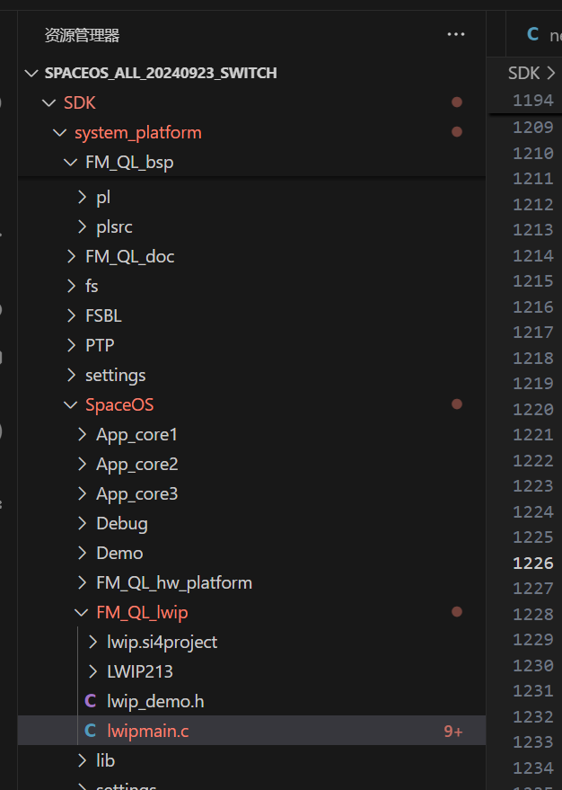

硬件：GD32F103C8T6（类似STM32F103C8T6）

软件：keil mdk

参考文献：

1. [嵌入式OTA升级实现原理_哔哩哔哩_bilibili](https://www.bilibili.com/video/BV1em411C7xy/?spm_id_from=333.1387.favlist.content.click&vd_source=3b2bba9cd9eee7c88a08ea7d3ea6261a)

---


1、OTA升级是什么：OTA升级，说简单点，就是对我们单片机Flash里面的程序进行更新，就和我们用烧录工具去更新程序一样，只是烧录方式，变成了我们先把程序(Bin文件)先上传到服务器，然后由服务器给每个设备下发程序更新指令和数据。

2、OTA固件升级的两种方式：


3、相关工作：

```
1、服务器与开发板的通信流程、通信协议
2、开发板上BootLoader设计
3、固件应用设计
```

4、目标

**需求1：**

有线OTA：开发板通过以太网网线连接路由器，服务器通过通过网线连接路由器（wifi？），服务器发送bin固件包，开发板替换内部bin固件包

环境：spaceOS

流程：单片机通过外设接口（如 UART 、 IIC 、 SPI 、 CAN 、 USB 等接口），连接具备联网能力的模块、器件、设备（以下统称上位机）。上位机从服务器上拉取固件包，再将固件包以约定的通讯协议，经由通讯接口发送至 **MCU** ，由 **MCU** 负责固件的解析、解密、存储、更新等操作，以完成设备固件更新的功能.


**需求2：**

服务器通过网线（HTTP协议）传递文件到开发板指定目录下


目前先熟悉OTA的整体流程 

[【手把手教程 4G通信物联网 OTA远程升级 BootLoader程序设计】GD32F103C8T6单片机【上篇章】_哔哩哔哩_bilibili](https://www.bilibili.com/video/BV1SatHeBEVG/?spm_id_from=333.1387.favlist.content.click&vd_source=3b2bba9cd9eee7c88a08ea7d3ea6261a)

需求：


需要bootloader去跳转程序区A或者更新程序区A(OTA升级方式第一种)

​	单片机执行程序，从起始位置（低地址）开始运行，一般起始位置放的是bootloader程序段

**必须实现的功能：**

- 开发板某一个掉电不易失寄存器存放ota_flag标志，1表示需要bootloader去擦除程序区从外部flash读取进行更新，0表示跳转到程序区
- 开发板需要一个外部的flash存放从服务器下载下来的固件文件

**方便使用的额外功能**

- 通过串口IAP实现更新程序区固件
- OTA版本号上报
- 外部flash存放多个程序文件，通过命令下发更新指定固件文件


# 基础

**参考文献**

- [GD32F103学习笔记（1）——搭建环境、编译烧写 - 简书 (jianshu.com)](https://www.jianshu.com/p/4beaefda1e21)

## 仿真器

见仿真器使用手册，接pA13和PA14口

## 工程流程

使用keil需要安装指定板子的芯片包和官方库文件（Fireware文件夹下）（指定硬件下的标准库文件）

**流程：**

- 安装指定板子的芯片包（addon标识）

  - 可以在官网根据addon标识下载，也可在keil中下载
  - 

- 移动官方库文件的CMSIS
  - src：system_gd32f10x.c（初始化系统启动代码），startup_gd32f10x_md.s（定义系统启动流程和中断向量表）
    - **中密度产品（GD32F10X_MD）** 是指 FLASH 存储器容量在 `16 KB 至 128 KB` 的 GD32F101xx 和 GD32F103xx 微控制器。
       **高密度产品（GD32F10X_HD）** 是指 FLASH 存储器容量在 `256KB 至 512KB` 的 GD32F101xx 和 GD32F103xx 微控制器。
       **超高密度产品（GD32F10X_XD）** 是指FLASH存储器容量在 `512KB 以上` 的GD32F101xx 和 GD32F103xx 微控制器。
       **互联型产品（GD32F10X_CL）** 是指产品是指 GD32F105xx 和 GD32F107xx 微控制器。
    - 这里gd32f103c8t6flash为64属于md的产品启动流程选择md
      - 
  - include：arm的标准头文件和厂商自定义的头文件
- 移动官方标准库文件(GD32F10x_standard_peripheral)
  - 将该文件下的include和src移动到LIB中作为库文件

- 移动官方库文件下的Template/it中断相关的文件
  - gd32f10x_it.c和gd32f10x_it.h

- 创建新工程
  - 选择芯片gd32f1038
  - 管理-->分组(CMSIS、USER、HW、LIB)
  - 设置output，存放在OBJ下，设置createHEX file，在Target中勾选Use MicroLIB(使用printf)
  - 在工程设置的c/c++中设置头文件路径(USER、CMSIS/Include、HW/Include、LIB/Include)

    - 在c/c++中添加GD32F10x_MD宏定义
    - 在 C/C++选项卡中添加处理宏及编译器编译的时候查找的头文件路径。如果头文件路径添加有误，则编译的时候会报错找不到头文件。

      在这个选项中添加宏，就相当于我们在文件中使用“#define”语句定义宏一样。在编
      译器中添加宏的好处就是，只要用了这个模版，就不用源文件中修改代码。

      GD32F10X_HD 宏：为了告诉 GD32 标准库，我们使用的芯片类型是 GD32
      型号是大容量的，使 GD32 标准库根据我们选定的芯片型号来配置。
      USE_STDPERIPH_DRIVER 宏：为了让 gd32f10x.h 包含 gd32f10x_libopt.h 这个头文件。
  - 向工厂中添加文件(*.c)
    - LIB: misc.c、rcu.c、gpio.c、usart.c
    - HW:  it
    - CMSIS: .c和.md.s
    - USER：main.c（gd32f10x.h）
    - 删除it中的sysTick_handle的内容（目前没有相关的库）
    - 开始编译
      - 自定义创建RTE_components.h（USER下），添加RCU、GPIO、MISC的定义
      - it.c中注释main.h和systick.h
  
- 自己写的代码添加

  - 在HW下
  - 在lib下添加硬件库和头文件
  - 根据硬件库和头文件编辑HW下自己的文件


## 文件说明

gd32f10x.h：开发的基本头文件，包含对某一芯片的寄存器、外设定义以及一些常用的头文件如stdin.h等

gd32f10x_libopt.h：官方库的功能开关

- RTE_Components.h：与gd32f10x_libopt.h配合开关官方库的功能，且需要添加对应的头文件
- 一般出现某个函数未定义或者c99非法，考虑是没有启用该功能

startup_gd32f10x_md.s：

- 定义系统启动流程和中断向量表，定义外设与接口的对应关系，类似设备树
- misc.c
  - nvic
  - sysTick
- 官方手册使用

**user_manual在GPIO引脚复用上使用**

**datasheet在pin definitions上使用**


## 宏定义

uint8_t：stdint.h


## 原理图

- 看GPIO引脚
  - #表示低电平有效

# RCU

在嵌入式系统里，RCU（Reset and Clock Unit，复位和时钟单元）是一种关键的外设模块，下面为你详细介绍它的相关内容。

**功能概述**

- **复位管理**：为系统和各个外设提供复位信号，确保系统在启动、异常情况（如硬件故障、软件错误）时能够恢复到初始状态，保证系统的稳定性和可靠性。
- **时钟控制**：负责生成和管理系统以及各个外设所需的时钟信号。不同的外设可能需要不同频率和相位的时钟，RCU 能够灵活配置和分配这些时钟资源，以满足系统的性能和功耗需求。

**具体功能及作用**

**复位功能**

- **系统复位**：当发生严重错误或需要重新启动系统时，RCU 会触发系统复位，将整个系统的状态重置为初始状态，包括 CPU、内存、外设等，类似于计算机的重启操作。
- **外设复位**：可以对特定的外设进行单独复位，而不影响其他外设和系统的正常运行。这在调试或修复外设故障时非常有用，例如当某个外设出现异常时，可以通过 RCU 对其进行复位，使其恢复正常工作。

**时钟功能**

- **时钟生成**：RCU 通常会包含多个时钟源，如内部 RC 振荡器、外部晶体振荡器等。它可以根据系统的需求选择合适的时钟源，并通过 PLL（锁相环）等电路对时钟信号进行倍频或分频处理，以生成不同频率的时钟信号。
- **时钟分配**：将生成的时钟信号分配给系统的各个部分，包括 CPU、总线、外设等。不同的外设可能需要不同频率的时钟，RCU 可以通过时钟分频器等电路为每个外设提供合适的时钟频率，以满足其工作要求。
- **时钟控制**：可以动态地开启或关闭某些外设的时钟，以降低系统的功耗。例如，当某个外设暂时不需要工作时，可以通过 RCU 关闭其时钟，减少不必要的功耗消耗。

**应用场景**

- **低功耗嵌入式系统**：在一些对功耗要求较高的嵌入式系统中，如智能手表、无线传感器节点等，RCU 的时钟控制功能可以根据系统的工作状态动态调整时钟频率和开关外设时钟，从而显著降低系统的功耗，延长电池续航时间。
- **高性能嵌入式系统**：在需要处理大量数据和执行复杂任务的高性能嵌入式系统中，如工业控制计算机、汽车电子控制单元等，RCU 能够提供稳定、高速的时钟信号，确保 CPU 和外设能够高效地工作，提高系统的整体性能。
- **嵌入式开发调试**：在嵌入式系统的开发和调试过程中，RCU 的复位功能可以方便地对系统和外设进行复位操作，帮助开发人员快速定位和解决问题。同时，通过调整时钟频率，开发人员可以测试系统在不同时钟条件下的性能和稳定性。


# bootloader

**参考文献：**[【手把手教程 4G通信物联网 OTA远程升级 BootLoader程序设计】GD32F103C8T6单片机【上篇章】_哔哩哔哩_bilibili](https://www.bilibili.com/video/BV1SatHeBEVG/?spm_id_from=333.1387.favlist.content.click&vd_source=3b2bba9cd9eee7c88a08ea7d3ea6261a)

---

**OTA的bootloader需要用到哪些功能：**

- **串口：通过串口IAP将bootloader下载到b分区**
  - 接受数据方案：轮询、中断、**DMA**
  - 如何判断数据接受完毕：总线空闲中断
  - 如何对数据处理：加入缓冲区（固件内存大小分配），用于解决处理数据和接受数据速度不匹配问题
    - 定义缓存数据回收策略：定义串口最大传输数据字节，每次接受之前判断空闲缓存与最大比较
    - 加入位置数组：记录每一次传输数据在缓存中的位置信息，在缓存加入s和e标记每一次传输数据在缓存中的位置
    - 用in记录位置数据的最后一位的下一位，用out记录位置数组首位，In==out表示缓冲区没有数据
- **IIC 24C02：存放OTA_flage、掉电不丢失**
- **SPI W25Q64：外部flash、掉电不丢失，存放多个固件版本号**
- **FLASH 擦除写入：内部flash的擦除和写入**

## **串口**

**参考文献：**

- [GD32F103学习笔记（7）——USART串口使用 - 简书 (jianshu.com)](https://www.jianshu.com/p/a37d5ef3c471)
- [GD32F103学习笔记（7）——USART串口使用_gd32 uart作为调试口,还可以串口接收吗-CSDN博客](https://blog.csdn.net/qq_36347513/article/details/124248826)

---

### *一般串口中断流程*

- 在HW中添加usart.c和usart.h，将usart.c加入工程的HW中
  - 确定串口程序需要哪些变量，在usart.c和usart.h中编写 
  - **建立串口USART0_Init(uint32_t 波特率)函数：**
    - 结合rcu.h和rcu.c执行enable函数，使能 RX 和 TX 引脚 GPIO 时钟和 USART 时钟
    - 结合gpio.h和gpio.c执行init函数，初始化 GPIO，并将 GPIO 复用到 USART 上
    - 结合usart.h和usart.c函数，配置 USART 参数
      - **需要知道USART0对应的GPIO引脚（一般从官方文档的用户手册的GPIO映射中可找到）**
      - **比如USART0默认对应PA9和PA10，所以PA9初始化TX，PA10初始化为RX，串口线接PA9和PA10**
    - 根据misc.c和misc.h，配置中断控制器并使能 USART 接收中断
    - 使能串口
    - 在 USART 接收中断服务函数实现接收和发送

```
#include <stdio.h>
#include "gd32f10x.h"
#include "board_usart.h"

void USART0_Init(void){
	// 使能 RX 和 TX 引脚 GPIO 时钟和 USART 时钟
	rcu_periph_clock_enable(RCU_GPIOA);
	rcu_periph_clock_enable(RCU_USART0);
	// 初始化 GPIO，并将 GPIO 复用到 USART 上
	// 设置GPIO PA9为TX(PP)  PA10为RX(FLOATING)
	gpio_init(GPIOA, GPIO_MODE_AF_PP, GPIO_OSPEED_50MHZ, GPIO_PIN_9);
	gpio_init(GPIOA, GPIO_MODE_IN_FLOATING, GPIO_OSPEED_50MHZ, GPIO_PIN_10);
	// 配置 USART 参数
	usart_deinit(USART0);                                       // 重置串口
	usart_baudrate_set(USART0, speed);                          // 波特率
	usart_word_length_set(USART0, USART_WL_8BIT);               // 帧数据字长
	usart_stop_bit_set(USART0, USART_STB_1BIT);                 // 停止位
	usart_parity_config(USART0, USART_PM_NONE);                 // 奇偶校验位
	usart_hardware_flow_rts_config(USART0, USART_RTS_DISABLE);  // 硬件流控制RTS
	usart_hardware_flow_cts_config(USART0, USART_CTS_DISABLE);  // 硬件流控制CTS
	usart_receive_config(USART0, USART_RECEIVE_ENABLE);         // 使能接收
	usart_transmit_config(USART0, USART_TRANSMIT_ENABLE);       // 使能发送
	// 使能USART的总中断并使能 USART0 接收中断
	nvic_irq_enable(USART0_IRQn, 0, 0);
	usart_interrupt_enable(USART0, USART_INT_RBNE);
	// 使能串口
	usart_enable(USART0);                                       
	// 在 USART 接收中断服务函数实现接收和发送
	// 在HW的it.c文件下，根据startup_gd32f10x_md.s的映射关系找到USART0对应的中断服务函数USART0_IRQHandler
	// 在it.c下新建USART0_IRQHandler中断服务函数
}


/*
	串口接受数据，处理后通过串口发送
*/
void USART0_IRQHandler(void)
{
	uint8_t data;
	// 如果接受缓冲区非空，则接受数据
	if(RESET != usart_interrupt_flag_get(USART0, USART_INT_FLAG_RBNE)){
		data = usart_data_receive(USART0);
		usart_data_transmit(USART0, (uint8_t)data);
		// 如果发送缓冲区满，则循环等待，否则后来的数据会覆盖之前要发送的数据
		while(RESET == usart_flag_get(USART0, USART_FLAG_TBE));//发送完成判断
		usart_data_transmit(USART0, (uint8_t)'*');
		while(RESET == usart_flag_get(USART0, USART_FLAG_TBE));//发送完成判断
		
	}
}
```


****


### DMA+串口空闲中断

**参考文献：**

- [GD32F103串口DMA收发空闲中断与DMA的使用方法详解-物联沃-IOTWORD物联网](https://www.iotword.com/14516.html)

 **基础知识：**

- **串口（0/1/2/3/4）与DMA（0/1）以及DMA的通道（0/1/2/3/4/5/6）有映射关系：在用户手册的DMA章节中DMA请求映射**

  - 比如USART0映射到DMA0，其中TX映射到DMA0的通道3，RX映射到DMA0的通道4

- **DMA 的工作机制**

  - DMA（Direct Memory Access）是一种硬件模块，用于在外设和内存之间传输数据，而无需 CPU 的干预。
  - 在配置 DMA 时，需要指定传输的数据量（`transfer_number`），即 DMA 每次传输的字节数。
  - 每次 DMA 开始传输时，计数器会从配置的 `transfer_number` 开始递减，直到传输完成（计数器变为 0）。
  - 基于以上，每次DMA传输数据后都需要重新设置number的值

- **0xff默认为未使用的数据**

- **清除空闲中断标志位**

  - **步骤 1：读取 USART 的状态寄存器（`USART_STAT`）**

    - 当空闲中断触发时，`USART_STAT` 寄存器中的 `IDLE` 标志会被置位。
    - 读取 `USART_STAT` 是清除 `IDLE` 标志的第一步。

    **步骤 2：读取 USART 的接收数据寄存器（`USART_RDATA`）**

    - 在读取 `USART_STAT` 之后，还需要读取 `USART_RDATA` 寄存器。
    - 这是清除 `IDLE` 标志的第二步，也是完全清除标志的必要操作。

    ```
    if (RESET != usart_interrupt_flag_get(USART0, USART_INT_FLAG_IDLE)) {
        // 清除空闲中断标志位
        usart_interrupt_flag_clear(USART0, USART_INT_FLAG_IDLE);
        // 也可读取空闲标志寄存器来清除空闲中断标志位
        usart_flag_get(USART0, USART_INT_FLAG_IDLE)
    
        // 读取接收数据寄存器，完成标志清除
        uint8_t data = usart_data_receive(USART0);
    }
    
    if (USART_STAT(USART0) & USART_STAT_IDLE) {
        // 读取状态寄存器（USART_STAT）
        volatile uint32_t stat = USART_STAT(USART0);
        // 读取接收数据寄存器（USART_RDATA），完成标志清除
        volatile uint8_t data = USART_RDATA(USART0);
    }
    ```
    
    

**流程**

- usart0_init

  ```c
  void Usart0_Init(uint32_t bandrate){
  	rcu_periph_clock_enable(RCU_USART0);
  	rcu_periph_clock_enable(RCU_GPIOA);
  	
  	gpio_init(GPIOA,GPIO_MODE_AF_PP,GPIO_OSPEED_50MHZ,GPIO_PIN_9);
  	gpio_init(GPIOA,GPIO_MODE_IN_FLOATING,GPIO_OSPEED_50MHZ,GPIO_PIN_10);
  	
  	usart_deinit(USART0);
  	usart_baudrate_set(USART0,bandrate);
  	usart_parity_config(USART0,USART_PM_NONE);
  	usart_word_length_set(USART0,USART_WL_8BIT);
  	usart_stop_bit_set(USART0,USART_STB_1BIT);
  	usart_transmit_config(USART0,USART_TRANSMIT_ENABLE);
  	usart_receive_config(USART0,USART_RECEIVE_ENABLE);
  	usart_dma_receive_config(USART0,USART_RECEIVE_DMA_ENABLE);
  	
  	nvic_priority_group_set(NVIC_PRIGROUP_PRE2_SUB2);
  	nvic_irq_enable(USART0_IRQn,0,0);
  	usart_interrupt_enable(USART0,USART_INT_IDLE);
  	
  	U0Rx_PtrInit();
  	DMA_Init();
  	usart_enable(USART0);
  }
  ```

  

- dma0_init

  ```c
  void DMA_Init(void){
  	dma_parameter_struct dma_init_struct;
  	
  	rcu_periph_clock_enable(RCU_DMA0);
  	
  	dma_deinit(DMA0,DMA_CH4);
  	
  	dma_init_struct.periph_addr = USART0+4;
  	dma_init_struct.periph_width = DMA_PERIPHERAL_WIDTH_8BIT;
  	dma_init_struct.memory_addr = (uint32_t)U0_RxBuff;
  	dma_init_struct.memory_width = DMA_MEMORY_WIDTH_8BIT;
  	dma_init_struct.number = U0_RX_MAX+1;
  	dma_init_struct.priority = DMA_PRIORITY_HIGH;
  	dma_init_struct.periph_inc = DMA_PERIPH_INCREASE_DISABLE;
  	dma_init_struct.memory_inc = DMA_MEMORY_INCREASE_ENABLE;
  	dma_init_struct.direction = DMA_PERIPHERAL_TO_MEMORY;
  	dma_init(DMA0,DMA_CH4,&dma_init_struct);
  	dma_circulation_disable(DMA0,DMA_CH4);	
  	dma_channel_enable(DMA0,DMA_CH4);
  }
  ```

  

- 自定义实现输出函数
  - **usart0_dma_send**
  
    - 通过dma发送数据
    - ```c
      /**
       * * @brief USART0中断服务函数
       * * * @param None
       * * @retval None
       * *  通过串口0发送数据
       */
      void usart0_dma_send(uint8_t *buffer,uint16_t len){
          // 需要自定义发送数据，所以要重新配置DMA的通道3TX的参数
      	dma_channel_disable(DMA0, DMA_CH3);
      	dma_memory_address_config(DMA0, DMA_CH3,(uint32_t)buffer);//设置要发送数据的内存地址
      	dma_transfer_number_config(DMA0, DMA_CH3, len);//一共发送多少个数据
      	dma_channel_enable(DMA0, DMA_CH3); 
      }
      ```
  
      
  
  - **usart0_fputc**
  
    - 中断的形式发送一字节
  
    - ```c
      int fputc_usart0(uint8_t ch){
          // 通过USART0发送一字节数据
          usart_data_transmit(USART0, ch);
          while(RESET == usart_flag_get(USART0, USART_FLAG_TBE));
          return ch;
      }
      ```
  
      
  
  - **u0_printf**
  
    - 中断的形式发送多个字节
  
    - ```c
      void u0_printf(char *format,...){
      	uint16_t i;
      	va_list listdata;
      	va_start(listdata,format);
      	vsprintf((char *)U0_TxBuff,format,listdata);
      	va_end(listdata);
      
      	for(i=0;i<strlen((const char*)U0_TxBuff);i++){
      		while(usart_flag_get(USART0,USART_FLAG_TBE) == RESET);
      		usart_data_transmit(USART0,U0_TxBuff[i]);
      	}
      	while(usart_flag_get(USART0,USART_FLAG_TBE)!=1);
      }
      ```
  
  - 对缓冲区初始化
  
    - ```c
      void U0Rx_PtrInit(void){
      	U0CB.URxDataIN = &U0CB.URxDataPtr[0];
      	U0CB.URxDataOUT = &U0CB.URxDataPtr[0];	
      	U0CB.URxDataEND = &U0CB.URxDataPtr[NUM-1];
      	U0CB.URxDataIN->start = U0_RxBuff;
      	U0CB.URxCounter = 0;
      }
      ```
  
  - 在空闲中断处对缓冲区进行处理
  
    - ```c
      if(usart_interrupt_flag_get(USART0,USART_INT_FLAG_IDLE) == SET){
      		usart_flag_get(USART0,USART_FLAG_IDLEF);
      		usart_data_receive(USART0);
      		U0CB.URxCounter += (U0_RX_MAX+1) - dma_transfer_number_get(DMA0,DMA_CH4);
      		U0CB.URxDataIN->end = &U0_RxBuff[U0CB.URxCounter-1];
      		U0CB.URxDataIN++;
      		if(U0CB.URxDataIN == U0CB.URxDataEND){
      			U0CB.URxDataIN = &U0CB.URxDataPtr[0];
      		}
      		if(U0_RX_SIZE - U0CB.URxCounter >= U0_RX_MAX){
      			U0CB.URxDataIN->start = &U0_RxBuff[U0CB.URxCounter];
      		}else{
      			U0CB.URxDataIN->start = U0_RxBuff;
      			U0CB.URxCounter = 0;
      		}
      		dma_channel_disable(DMA0,DMA_CH4);
      		dma_transfer_number_config(DMA0,DMA_CH4,U0_RX_MAX+1);
      		dma_memory_address_config(DMA0,DMA_CH4,(uint32_t)U0CB.URxDataIN->start);
      		dma_channel_enable(DMA0,DMA_CH4);
      	}
      ```
  
  - 主程序代码
  
    - ```c
      #include "gd32f10x.h"
      #include "usart.h"
      uint16_t i;
      int main(void){
      	Usart0_Init(921600);
      	u0_printf("%d %c %x",0x30,0x30,0x30);
      	
      	while(1){
      		if(U0CB.URxDataOUT != U0CB.URxDataIN){
      			u0_printf("本次接收了%d字节数据\r\n",U0CB.URxDataOUT->end - U0CB.URxDataOUT->start + 1);
      			for(i=0;i<U0CB.URxDataOUT->end - U0CB.URxDataOUT->start + 1;i++) u0_printf("%c",U0CB.URxDataOUT->start[i]);
      			u0_printf("\r\n\r\n");
      			
      			U0CB.URxDataOUT++;
      		    if(U0CB.URxDataOUT == U0CB.URxDataEND){
      			    U0CB.URxDataOUT = &U0CB.URxDataPtr[0];
      			}
      		}
      	}
      }
      ```
  
      


**自己完成的程序**

```c
#include <stdio.h>
#include <string.h>
#include "gd32f10x.h"
#include "board_usart_dma.h"

uint8_t rxbuffer[84];
uint8_t txbuffer[84] = {0x01,0x02,0x03,0x04,0x05,0x06,0x07,0x08,0x09,0x0a};
uint32_t flag = 0;
uint16_t len = 0;

/*
通过dma实现串口通信
*/

/**
 * * @brief USART0初始化函数
 * * @param None
 * * @retval None
 *  串口初始化
 * *  1. 使能 GPIOA 时钟和 USART0 时钟
 * *  2. 设置 GPIOA 的 PA9 为复用推挽输出模式，PA10 为浮空输入模式
 *          USART0 的 TX 引脚为 PA9，RX 引脚为 PA10（查询用户手册GPIO映射）
 * *  3. 配置 USART0 的波特率、数据位、停止位、奇偶校验位等参数
 * *  4. 使能 USART0 的接收和发送功能
 * *  5. 使能 USART0 中断
 * *  6. 在 USART 接收中断服务函数实现接收和发送
 */
void usart0_init(){
	// 使能 RX 和 TX 引脚 GPIO 时钟和 USART 时钟
	rcu_periph_clock_enable(RCU_GPIOA);  // pa9和pa10
	// 使能gpio的使能复用功能模块时钟（RCU_AF)
	rcu_periph_clock_enable(RCU_AF);  
	// 使能串口0的时钟
	rcu_periph_clock_enable(RCU_USART0);
	// 初始化 GPIO，并将 GPIO 复用到 USART 上
	// 设置GPIO PA9为TX(PP)  PA10为RX(FLOATING)
	gpio_init(GPIOA, GPIO_MODE_AF_PP, GPIO_OSPEED_50MHZ, GPIO_PIN_9);
	gpio_init(GPIOA, GPIO_MODE_IN_FLOATING, GPIO_OSPEED_50MHZ, GPIO_PIN_10);
	// 配置 USART 参数
	usart_deinit(USART0);                                       // 重置串口
	usart_baudrate_set(USART0, speed);                          // 波特率
	usart_word_length_set(USART0, USART_WL_8BIT);               // 帧数据字长
	usart_stop_bit_set(USART0, USART_STB_1BIT);                 // 停止位
	usart_parity_config(USART0, USART_PM_NONE);                 // 奇偶校验位
	
	usart_hardware_flow_rts_config(USART0, USART_RTS_DISABLE);  // 硬件流控制RTS
	usart_hardware_flow_cts_config(USART0, USART_CTS_DISABLE);  // 硬件流控制CTS
	
	usart_receive_config(USART0, USART_RECEIVE_ENABLE);         // 使能接收
	usart_transmit_config(USART0, USART_TRANSMIT_ENABLE);       // 使能发送
	
	
	// 使能串口
	usart_enable(USART0);  
}

/**
 * * @brief DMA初始化函数
 * * @param None
 * * @retval None
 * *  DMA初始化
 * *  1. 使能 DMA0 时钟
 * *  2. 配置 DMA0 通道1（USART2 TX）和通道2（USART2 RX）的参数
 *          查询用户手册 DMA 控制器的通道映射（USART2对应DMA0的通道1和2）
 *          这里使用的是串口0
 * *  3. 配置 DMA0 的传输方向、内存地址、外设地址、数据宽度、传输数量等参数
 * *  4. 配置 DMA0 的循环模式和内存到内存模式
 * * *  5. 配置 USART2 的 DMA 接收和发送功能
 * * *  6. 使能 DMA0 通道1 和通道2 的传输完成中断
 * * *  7. 使能 DMA0 通道2（USART2 RX）
 * * * *  8. 使能 DMA0 通道1（USART2 TX）
 * * *  9. 在 USART 接收中断服务函数实现接收和发送
 */
void dma_initconfig(){
    dma_parameter_struct dma_init_struct;
    /* 1. 使能 DMA0 时钟 */
    rcu_periph_clock_enable(RCU_DMA0);
    
    /* 2. 配置 DMA0 通道3（USART0 TX）和通道4（USART0 RX）的参数 */
    dma_deinit(DMA0, DMA_CH3);
    dma_struct_para_init(&dma_init_struct);

    
    dma_init_struct.direction = DMA_MEMORY_TO_PERIPHERAL;  // 设置DMA传输方向为内存到外设
    dma_init_struct.memory_addr = NULL;
    dma_init_struct.memory_inc = DMA_MEMORY_INCREASE_ENABLE;  // 设置内存地址递增模式
    dma_init_struct.memory_width = DMA_MEMORY_WIDTH_8BIT;  // 设置内存数据宽度为8位
    dma_init_struct.number = ARRAYNUM(txbuffer);  // 设置传输数据数量为txbuffer的大小
    dma_init_struct.periph_addr = USART0_DATA_ADDRESS;  // 设置外设地址为USART0的数据寄存器地址
    dma_init_struct.periph_inc = DMA_PERIPH_INCREASE_DISABLE;  // 设置外设地址不递增模式
    dma_init_struct.periph_width = DMA_PERIPHERAL_WIDTH_8BIT;  // 设置外设数据宽度为8位
    dma_init_struct.priority = DMA_PRIORITY_ULTRA_HIGH;  // 设置DMA优先级为超高
    dma_init(DMA0, DMA_CH3, &dma_init_struct);  // 初始化DMA0通道3（USART0 TX）
    
    /* deinitialize DMA channel4 (USART0 rx) */
    dma_deinit(DMA0, DMA_CH4);
    dma_struct_para_init(&dma_init_struct);

    dma_init_struct.direction = DMA_PERIPHERAL_TO_MEMORY;  // 设置DMA传输方向为外设到内存
    dma_init_struct.memory_addr = (uint32_t)rxbuffer;
    dma_init_struct.memory_inc = DMA_MEMORY_INCREASE_ENABLE;  
    dma_init_struct.memory_width = DMA_MEMORY_WIDTH_8BIT;
    dma_init_struct.number = ARRAYNUM(rxbuffer); 
    dma_init_struct.periph_addr = USART0_DATA_ADDRESS;
    dma_init_struct.periph_inc = DMA_PERIPH_INCREASE_DISABLE;
    dma_init_struct.memory_width = DMA_PERIPHERAL_WIDTH_8BIT;
    dma_init_struct.priority = DMA_PRIORITY_ULTRA_HIGH;
    dma_init(DMA0, DMA_CH4, &dma_init_struct);
  
    /* 4. 配置 DMA0 的循环模式和内存到内存模式 */
    dma_circulation_disable(DMA0, DMA_CH3);  // 不需要循环的DMA传输
    dma_memory_to_memory_disable(DMA0, DMA_CH3);  // 不需要内存到内存的DMA传输
//    dma_circulation_enable(DMA0, DMA_CH2);      // 使用接收空闲中断，是否循环没有关系
    dma_circulation_disable(DMA0, DMA_CH4);
    dma_memory_to_memory_disable(DMA0, DMA_CH4);
    
    /* 5. 配置 USART0 的 DMA 接收和发送功能 */
    /* 6. 使能 DMA0 通道1 和通道2 的传输完成中断 */
    usart_dma_receive_config(USART0, USART_RECEIVE_DMA_ENABLE);
    //dma_interrupt_enable(DMA0, DMA_CH4, DMA_INT_FTF);  // DMA接受完成后触发中断
    dma_channel_enable(DMA0, DMA_CH4);  // 使能DMA0通道4（USART0 RX）
		
    usart_dma_transmit_config(USART0, USART_TRANSMIT_DMA_ENABLE);  // 使能USART0的DMA发送功能
    //dma_interrupt_enable(DMA0, DMA_CH3, DMA_INT_FTF);  // DMA发送完成后触发中断(DMA_INT_FTF)
    //dma_channel_enable(DMA0, DMA_CH3);  // 使能DMA0通道3（USART0 TX）

//    /* disable DMA0 channel1 */
    dma_channel_disable(DMA0, DMA_CH3);
}

/**
 * 需要在中断服务函数中实现空闲中断逻辑
 */
void nvic_init(){
    // 设置中断优先级分组为 3 位抢占优先级和 1 位响应优先级
    // 3 位抢占优先级和 1 位响应优先级的组合方式为 0x00000003
	nvic_priority_group_set(NVIC_PRIGROUP_PRE3_SUB1);
    // 开启 USART0 中断
    // USART0 中断优先级为 0，子优先级为 0
	nvic_irq_enable(USART0_IRQn,0,0);
    // 启动USART0的空闲中断(USART_INT_FLAG_IDLE)
	usart_interrupt_enable(USART0, USART_INT_FLAG_IDLE);
}

/**
 * * @brief USART0中断服务函数
 * * * @param None
 * * @retval None
 * *  通过串口0发送数据
 */
void usart0_dma_send(uint8_t *buffer,uint16_t len){
    // 需要自定义发送数据，所以要重新配置DMA的通道3TX的参数
	dma_channel_disable(DMA0, DMA_CH3);
	dma_memory_address_config(DMA0, DMA_CH3,(uint32_t)buffer);//设置要发送数据的内存地址
	dma_transfer_number_config(DMA0, DMA_CH3, len);//一共发送多少个数据
	dma_channel_enable(DMA0, DMA_CH3); 
}

int fputc_usart0(uint8_t ch){
    // 通过USART0发送一字节数据
    usart_data_transmit(USART0, ch);
    while(RESET == usart_flag_get(USART0, USART_FLAG_TBE));
    return ch;
}

void dma_usart0_init(){ 
    // 嵌入式中，0xff默认为未使用的数据
	memset(rxbuffer,0xff,sizeof(rxbuffer));
	usart0_init();
  nvic_init();
  dma_initconfig();
	flag = 0;
}
```


### 相关函数接口

```c
usart_interrupt_flag_get(USART2, USART_INT_FLAG_IDLE)
usart_interrupt_flag_get(USART0, USART_INT_RBNE); 
	USART_INT_FLAG_IDLE
    	如果线路正忙（接受数据），会返回RESET，如果串口空闲，那么返回SET
    	空闲中断（IDLE 中断）仅与接收器相关，与发送器无关。因此，发送数据不会触发此中断。
	USART_INT_RBNE
        接收缓冲区非空（Receive Buffer Not Empty），意思是当接收缓冲区有数据时就会触发中断
    RESET:0/SET:1
 

// 串口的接受发送
usart_data_transmit(USART0,U0_TxBuff[i]);  // 轮询的方式，与usart_interrupt_flag_get配合使用
usart_data_receive(USART0);

// 自定义串口输出会用到
va_start(listdata,format);
vsprintf((char *)U0_TxBuff,format,listdata);
va_end(listdata);

// DMA接受数据，每次中断需要调整内存的地址位置
dma_channel_disable(DMA0,DMA_CH4);
dma_transfer_number_config(DMA0,DMA_CH4,U0_RX_MAX+1);
dma_memory_address_config(DMA0,DMA_CH4,(uint32_t)U0CB.URxDataIN->start);
dma_channel_enable(DMA0,DMA_CH4);

// 获取DMA通道剩余可传输的数量
dma_transfer_number_get(DMA0,DMA_CH4)
```


## IIC 24C02

**通过I2c总线向24c02数据**

**IIC是一种总线标准，半双工通信**


### **sysTick定时器功能实现**


- delay.c代码

  - ```c
    #include "gd32f10x.h"
    #include "delay.h"
    
    void Delay_Init(void){
    	systick_clksource_set(SYSTICK_CLKSOURCE_HCLK);
    }
    
    void Delay_Us(uint16_t us){
    	SysTick->LOAD = us*108;
    	SysTick->VAL = 0x00;
    	SysTick->CTRL |= SysTick_CTRL_ENABLE_Msk;
    	while(!(SysTick->CTRL&SysTick_CTRL_COUNTFLAG_Msk));
    	SysTick->CTRL &= ~SysTick_CTRL_ENABLE_Msk;
    }
    
    void Delay_Ms(uint16_t ms){
    	while(ms--){
    		Delay_Us(1000);
    	}
    }
    
    delay.h
    #ifndef DELAY_H
    #define DELAY_H
    
    #include "stdint.h"
    
    void Delay_Init(void);
    void Delay_Us(uint16_t us);
    void Delay_Ms(uint16_t ms);
    
    #endif
    
    ```


### **通过IIC发送一字节数据**

- IIC时序图

  - 

  - **需要知道以下：**

    - SCL：时钟线，SDA：数据线
      - SCL为高电平，SDA为高电平表示IIC总线空闲
      - SCL为低电平，SDA为高电平也表示IIC总线空闲
    - SCL设置高电平时
      - SDA设置高电平，再设置低电平表示起始信号
      - SDA设置低电平，再设置高电平表示停止信号
    - SCL设置低电平时
      - SDA设置低电平表示数据0，高电平表示数据1
    - **ACK/NACK：**
      - 前提：发送方在发送一字节数据后，修改SDA为高电平
      - 接收方在收到一字节数据后，拉高SCL电平，并修改SDA为低电平表示发送ACK应答信号，发送方可以继续发送字节数据
      - 若接收方收到一字节数据后，SCL为高电平，SDA保持低电平一段时间表示不需要接受数据了

  - **代码：**

    - ```c
      #include "gd32f10x.h"
      #include "iic.h"
      #include "delay.h"
      
      
      // 为什么IIC是GPIO6和7
      // 手册GPIO映射
      void IIC_Init(void){
      	rcu_periph_clock_enable(RCU_GPIOB);	
      	gpio_init(GPIOB,GPIO_MODE_OUT_OD,GPIO_OSPEED_50MHZ,GPIO_PIN_6);
      	gpio_init(GPIOB,GPIO_MODE_OUT_OD,GPIO_OSPEED_50MHZ,GPIO_PIN_7);
          
          //  SCL 和 SDA 都拉高是为了确保 I²C 总线处于空闲状态
      	IIC_SCL_H;
      	IIC_SDA_H;
      }
      
      void IIC_Start(void){
      	IIC_SCL_H;
      	IIC_SDA_H;
      	Delay_Us(2);
      	IIC_SDA_L;
      	Delay_Us(2);
      	IIC_SCL_L;
      }
      
      void IIC_Stop(void){
      	IIC_SCL_H;
      	IIC_SDA_L;
      	Delay_Us(2);
      	IIC_SDA_H;
      }
      
      // IIC发送一字节数据
      void IIC_Send_Byte(uint8_t txd){
      	int8_t i;
      	
      	for(i=7;i>=0;i--){
      		IIC_SCL_L;
      		if(txd&BIT(i))
      			IIC_SDA_H;
      		else
      			IIC_SDA_L;
      		Delay_Us(2);
      		IIC_SCL_H;
      		Delay_Us(2);
      	}
      
      	// 为接受从机的ack信号做准备
      	// 从机会在SCL高电平时拉低SDA线
      	IIC_SCL_L;
      	IIC_SDA_H;
      }
      
      uint8_t IIC_Wait_Ack(int16_t timeout){
      	do{
      		timeout--;
      		Delay_Us(2);
      	}while((READ_SDA)&&(timeout>=0));
      	if(timeout<0) return 1;
      	// 在ack信号到来之前，SCL线必须拉高
          // 进行READ_SDA操作必须确保SCL为高电平
      	IIC_SCL_H;
      	Delay_Us(2);
      	// ack信号到来后，SCL线拉低
      	if(READ_SDA!=0) return 2;
      	IIC_SCL_L;
      	Delay_Us(2);
      	return 0;
      }
      
      0：表示收到ack应答信号
      
      ```

      ```c
      #ifndef IIC_H
      #define IIC_H
      
      #define IIC_SCL_H   gpio_bit_set(GPIOB,GPIO_PIN_6)
      #define IIC_SCL_L   gpio_bit_reset(GPIOB,GPIO_PIN_6)
      
      #define IIC_SDA_H   gpio_bit_set(GPIOB,GPIO_PIN_7)
      #define IIC_SDA_L   gpio_bit_reset(GPIOB,GPIO_PIN_7)
      
      #define READ_SDA    gpio_input_bit_get(GPIOB,GPIO_PIN_7)
      
      void IIC_Init(void);
      void IIC_Start(void);
      void IIC_Stop(void);
      void IIC_Send_Byte(uint8_t txd);
      uint8_t IIC_Wait_Ack(int16_t timeout);
      uint8_t IIC_Read_Byte(uint8_t ack);
      
      
      #endif
      
      ```
      
      


### **通过IIC接受一字节数据**

- 代码：

  - ```c
    uint8_t IIC_Read_Byte(uint8_t ack){
    	int8_t i;
    	uint8_t rxd;
    	
    	rxd = 0;
    	for(i=7;i>=0;i--){
    		// 一开始设置低电平，等待发送设备更改数据线
    		IIC_SCL_L;
    		Delay_Us(2);
            // 等待2us后，更改SCL为高电平，读取数据线
    		IIC_SCL_H;
    		if(READ_SDA)
    			rxd |= BIT(i);
    		Delay_Us(2);
    	}
    	IIC_SCL_L;
    	Delay_Us(2);
    	if(ack){
    		// 将SDA拉低，发送ACK
    		IIC_SDA_L;
    		IIC_SCL_H;
    		Delay_Us(2);
    		// 将SDA拉高，准备接收下一个字节
    		IIC_SCL_L;
    		IIC_SDA_H;
    		Delay_Us(2);
    	}else{
    		// 将SDA拉高，发送NACK
    		IIC_SDA_H;
    		IIC_SCL_H;
    		Delay_Us(2);
    		// 将SDA拉低，准备接收下一个字节
    		IIC_SCL_L;
    		Delay_Us(2);
    	}
    	return rxd;
    }
    ```

    

### **24c02通过IIC写入数据**

**参考文献：**

- **PDF：M24c02指导手册中的写和读操作**

**流程：**

- 

- **见上图写入一字节流程**

  - 发送start信号
  - 发送一字节数据：前7位表示设备描述符后1位表示写标识
  - 收到24c02发送的ack消息表示设备正确
  - 发送一字节地址数据，表示24c02内部地址偏移量
  - 收到24c02发送的ack消息
  - 开始数据发送，每一字节数据写入24c02发送一位ack信号
  - 发送端发送stop信号结束通信

- **见上图写入一页（16字节）流程**

  - 发送start信号
  - 发送一字节数据：前7位表示设备描述符后1位表示写标识
  - 收到24c02发送的ack消息表示设备正确
  - 发送一字节地址数据，表示24c02内部地址偏移量
  - 收到24c02发送的ack消息
  - 开始连续16字节发送，每一字节数据写入24c02发送一位ack信号
  - 发送端发送stop信号结束通信

- **代码：**

  - ```c
    #include "gd32f10x.h"
    #include "iic.h"
    #include "m24c02.h"
    
    uint8_t M24C02_WriteByte(uint8_t addr, uint8_t wdata){
    	IIC_Start();
    	IIC_Send_Byte(M24C02_WADDR);
    	if(IIC_Wait_Ack(100)!=0) return 1;
    	IIC_Send_Byte(addr);
    	if(IIC_Wait_Ack(100)!=0) return 2;
    	IIC_Send_Byte(wdata);
    	if(IIC_Wait_Ack(100)!=0) return 3;
    	IIC_Stop();
    	return 0;
    	
    }
    
    uint8_t M24C02_WritePage(uint8_t addr, uint8_t *wdata){
    	
    	uint8_t i;
    	IIC_Start();
    	IIC_Send_Byte(M24C02_WADDR);
    	if(IIC_Wait_Ack(100)!=0) return 1;
    	IIC_Send_Byte(addr);
    	if(IIC_Wait_Ack(100)!=0) return 2;
    	for(i=0;i<16;i++){
    		IIC_Send_Byte(wdata[i]);
    		if(IIC_Wait_Ack(100)!=0) return 3+i;
    	}
    	IIC_Stop();
    	return 0;
    }
    
    
    m24c02.h
    #ifndef M24C02_H
    #define M24C02_H
    
    #include "stdint.h"
    
    #define M24C02_WADDR  0xA0
    #define M24C02_RADDR  0xA1
    
    
    #endif
        
    // 0xA0通过手册知道24c02的设备标识为0xAX
    ```


### **24c02通过IIC读取数据**

**参考文献：**

- **PDF：w24c02**

**流程：**

- 

- **如上图使用第四种方法进行读取数据**

  - 发送start信号
  - 发送一字节的设备描述符和读信号
  - 收到ack信号
  - 发送一字节的要读的内部字节地址
  - 收到ack信号
  - 发送start信号和一字节的设备描述符和读信号
  - 收到ack信号后开始读一字节的数据并发送ack信号表示继续读，发送NACK表示终止
  - 发送stop信号停止通信

- **代码：**

  - ```c
    uint8_t M24C02_ReadData(uint8_t addr, uint8_t *rdata, uint8_t datalen){
    	
    	uint8_t i;
    	IIC_Start();
    	IIC_Send_Byte(M24C02_WADDR);
    	if(IIC_Wait_Ack(100)!=0) return 1;
    	IIC_Send_Byte(addr);
    	if(IIC_Wait_Ack(100)!=0) return 2;
    	IIC_Start();
    	IIC_Send_Byte(M24C02_RADDR);
    	if(IIC_Wait_Ack(100)!=0) return 3;
    	for(i=0;i<datalen-1;i++){
    		rdata[i] = IIC_Read_Byte(1);
    	}
    	rdata[datalen-1] = IIC_Read_Byte(0);
    	IIC_Stop();
    	return 0;	
    }
    ```

  

### 主程序

```c
#include "gd32f10x.h"
#include "usart.h"
#include "delay.h"
#include "iic.h"
#include "m24c02.h"

uint8_t rbuff[256];

//uint8_t wbuff[16]={0,1,2,3,4,5,6,7,8,9,10,11,12,13,14,15};
uint8_t wbuff[16]={15,14,13,12,11,10,9,8,7,6,5,4,3,2,1,0};

int main(void){
	
	uint16_t i;
	
	Delay_Init();
	Usart0_Init(921600);
	IIC_Init();
	
//	for(i=0;i<256;i++){
//		M24C02_WriteByte(i,255-i);
//		Delay_Ms(5);
//	}
	
	for(i=0;i<16;i++){
		M24C02_WritePage(i*16,wbuff);
		Delay_Ms(5);
	}
	
	M24C02_ReadData(0,rbuff,256);
	
	for(i=0;i<256;i++){
		u0_printf("地址%d=%x\r\n",i,rbuff[i]);
	}
	
	
	while(1){

	}
}

```


## SPI W25Q64

**SPI（Serial Peripheral Interface）即串行外设接口，是一种高速、全双工、同步的通信总线**

**必须先擦除后写入**

### IIC与SPI区别

**相同点**

- **通信类型**：都是串行通信方式，数据按位依次传输，适合近距离设备间的通信，常用于连接微控制器与各种外围设备。
- **同步通信**：都属于同步通信，需要时钟信号来同步数据的传输和接收，确保数据的准确性和稳定性。

**不同点**

- 总线结构
  - **I²C**：**使用两条线，即串行数据线（SDA）和串行时钟线（SCL），所有设备都连接在这两条总线上，通过设备地址来区分不同的设备，是一种多主多从的总线结构，总线上可以有多个主机和多个从机。**
  - **SPI**：**通常使用四条线，包括时钟线（SCK）、主输出从输入线（MOSI）、主输入从输出线（MISO）和片选线（SS）。SPI 是主从结构，一个主机可以连接多个从机，通过片选信号来选择与哪个从机进行通信。**
- 通信速度
  - **I²C**：通信速度相对较慢，标准模式下速度为 100kbps，快速模式为 400kbps，高速模式可达 3.4Mbps。
    - i2c读写都是按位读写
  - **SPI**：通信速度通常比 I²C 快，能达到几十 Mbps 甚至更高，具体速度取决于**设备和时钟频率。**
    - SPI读写是按自己读写
- 数据传输方向
  - **I²C**：是半双工通信，同一时刻数据只能在一个方向上传输，要么主机向从机发送数据，要么从机向主机发送数据。
  - **SPI**：是全双工通信，允许主机和从机在同一时刻进行双向的数据传输，提高了数据传输效率。
- 设备地址
  - **I²C**：每个设备都有唯一的 7 位或 10 位地址，主机通过发送设备地址来选择要通信的从机，地址在通信过程中是固定的。
  - **SPI**：从机没有固定的地址，主机通过片选信号（SS）来选择从机，不同的从机有不同的片选引脚，主机通过控制片选引脚的电平来选中特定的从机进行通信。
- 应用场景
  - **I²C**：适用于对通信速度要求不高、总线上设备数量较多且需要共享总线资源的场景，如连接多个传感器、EEPROM、LCD 控制器等。
  - **SPI**：常用于对通信速度要求较高、需要全双工通信以及从机数量相对较少的场景，如连接闪存芯片、高速传感器、音频编解码器等。

### SPI基础

在嵌入式系统中使用 SPI（Serial Peripheral Interface）进行数据的读取和写入是很常见的操作。下面分别从硬件连接、STM32 和 Linux 平台上的使用示例来详细介绍。

**硬件连接**

SPI 通常有 4 个主要的信号引脚：

- **SCLK（Serial Clock）**：时钟信号，由主设备产生，用于同步数据传输。
- **MOSI（Master Output Slave Input）**：主设备输出，从设备输入的数据线。
- **MISO（Master Input Slave Output）**：主设备输入，从设备输出的数据线。
- **SS（Slave Select）**：从设备选择信号，低电平有效，主设备通过该信号选择要通信的从设备，也用来表示通信的开始和结束。
  - 当w25q64不忙时，将ss置为低电平，w25q64看到ss被置为低电平，其他主设备访问时发送忙信号
  - 每次要读写w25q64时需要看忙不忙，然后置ss低电平

**SPI 全双工工作原理**

1. **时钟同步**

- SPI 是同步串行通信，需要时钟信号（SCK）来同步数据传输
- 主机负责产生时钟信号

2. **数据传输机制**

- MOSI（主机输出）和 MISO（主机输入）同时工作
- 每个时钟周期：
  - 主机通过 MOSI 发送一位数据
  - 从机通过 MISO 发送一位数据

3. **为什么需要发送才能接收**

```
主机 ----MOSI----> 从机
     <---MISO----
     ----SCK---->
```

- 要接收数据，必须产生时钟信号
- 产生时钟的同时，必须在 MOSI 线上发送数据
- 即使只想接收数据，也必须发送"虚拟数据"（通常是 0xFF）

**代码示例**

如果只想接收数据，通常这样写：

````c
uint8_t SPI_ReceiveByte(void) {
    // 发送 0xFF 作为虚拟数据，同时接收真实数据
    return SPI0_ReadWriteByte(0xFF);
}
````

**实际应用举例**

在读取 W25Q64 Flash 时：

````c
void W25Q64_Read(uint8_t *rbuff, uint32_t len) {
    for(uint32_t i = 0; i < len; i++) {
        // 发送 0xFF 作为虚拟数据，读取实际数据
        rbuff[i] = SPI0_ReadWriteByte(0xFF);
    }
}
````

因此，发送数据是为了产生时钟信号，使从设备能够正确发送数据到主机。这是 SPI 协议的基本工作方式。

**流程：**

- 查看用户手册GPIO映射关于SPI部分，SPI0对应pa4/5/6/7
  - pa5对应SCK，不需要使用
- 添加spi.c的lib库文件，打开spi的宏开关
- spi初始化注意点
  - 设置spi的分频值
    - 确定RCU_SPI0对应的ABP2
    - 在手册的rcu时钟树找到ABP2的频率
    - 在w25q64手册中支持的最大频率
- spi收发
  - 收发注意点
    - spi的收发是一体的
    - 为什么接受数据必须要先发送数据
      - 发送数据用于产生时钟信号

### **SPI收发代码**

```c
头文件：
#ifndef SPI_H
#define SPI_H

#include "stdint.h"

void SPI0_Init(void);
uint8_t SPI0_ReadWriteByte(uint8_t txd);
void SPI0_Write(uint8_t *wdata, uint16_t datalen);
void SPI0_Read(uint8_t *rdata, uint16_t datalen);

#endif
```

```c
代码：
#include "gd32f10x.h"
#include "usart.h"
#include "delay.h"
#include "spi.h"
#include "w25q64.h"

uint8_t wdata[256];
uint8_t rdata[256];

int main(void){

	uint16_t i,j;
	
	Delay_Init();
	Usart0_Init(921600);
	W25Q64_Init();
	
	
	W25Q64_Erase64K(0);
	
	for(i=0;i<256;i++){
		for(j=0;j<256;j++) 
			wdata[j] = i;
		W25Q64_PageWrite(wdata,i);
	}
		
	Delay_Ms(50);

    for(i=0;i<256;i++){
		W25Q64_Read(rdata,i*256,256);
		for(j=0;j<256;j++) 
			u0_printf("地址%d=%x\r\n",i*256+j,rdata[j]);
	}
	
	
	while(1){

	}
}

```

### **w25q64收发代码**

**可以理解spi收发代码是底层驱动**

#### **手册使用：**

查看w25q54寄存器（忙状态）、标准SPI指令


A-地址

D-数据


**查看spi指令表，发送0x05可读状态寄存器1，通过读状态寄存器1的0位值判断w25q54是否忙**

W25Q64_WaitBusy


图中w25q64有127块，每块有64字节数据，

   最大地址 = 127 * 64 * 1024

​     = 127 * 65536

​     = 8,323,072 (0x7F0000)，只需要24位表示


最大逻辑地址：

32768*64=2097152（0x200000），只需要24位表示

#### 代码

```c
头文件
#ifndef W25Q64_H
#define W25Q64_H

#include "stdint.h"

#define  CS_ENABLE     gpio_bit_reset(GPIOA,GPIO_PIN_4)
#define  CS_DISENABLE  gpio_bit_set(GPIOA,GPIO_PIN_4)

void W25Q64_Init(void);
void W25Q64_WaitBusy(void);
void W25Q64_Enable(void);
void W25Q64_Erase64K(uint8_t blockNB);
void W25Q64_PageWrite(uint8_t *wbuff, uint16_t pageNB);
void W25Q64_Read(uint8_t *rbuff, uint32_t addr, uint32_t datalen);

#endif
```

```c
代码
#include "gd32f10x.h"
#include "spi.h"
#include "w25q64.h"

void W25Q64_Init(void){
	// 开启GPIO_4引脚
	// GPIO_4引脚作为W25Q64的片选引脚
	// 片选引脚高电平时，W25Q64处于空闲状态，低电平时，W25Q64处于工作状态
	rcu_periph_clock_enable(RCU_GPIOA);
	gpio_init(GPIOA,GPIO_MODE_OUT_PP,GPIO_OSPEED_50MHZ,GPIO_PIN_4);
	CS_DISENABLE;
	SPI0_Init();	
}

void W25Q64_WaitBusy(void){
	uint8_t res;
	do{
		CS_ENABLE;
		// 发送读取状态寄存器的命令
		SPI0_ReadWriteByte(0x05);
		// 读取状态寄存器的值
		// 读取状态寄存器的值时，发送0xff作为占位符
		res = SPI0_ReadWriteByte(0xff);
		CS_DISENABLE;
		// 读取状态寄存器的值时，返回值的最低位表示W25Q64是否处于忙碌状态
		// 如果最低位为1，表示W25Q64处于忙碌状态，继续等待
	}while((res&0x01)==0x01);
}

void W25Q64_Enable(void){
	W25Q64_WaitBusy();
	CS_ENABLE;
	SPI0_ReadWriteByte(0x06);
	CS_DISENABLE;
}

// 每次擦除64k，传入参数为块号
// 有128个块，每个块64K,需要7位地址
void W25Q64_Erase64K(uint8_t blockNB){
	uint8_t wdata[4];
	
	// 发送擦除64K的命令
	wdata[0] = 0xD8;
	// 计算擦除块的地址
	// 擦除块的地址 = 擦除块号 * 64K
	// 擦除块号是从0开始的，所以需要乘以64K
	/**
	 * 最大地址 = 127 * 64 * 1024
         = 127 * 65536
         = 8,323,072 (0x7F0000)
	 */
	wdata[1] = (blockNB*64*1024)>>16;
	wdata[2] = (blockNB*64*1024)>>8;
	wdata[3] = (blockNB*64*1024)>>0;
	
	W25Q64_WaitBusy();
	W25Q64_Enable();
	CS_ENABLE;
	SPI0_Write(wdata,4);
	CS_DISENABLE;
	W25Q64_WaitBusy();
}

//一页256字节
// 有32768页，需要16位地址
void W25Q64_PageWrite(uint8_t *wbuff, uint16_t pageNB){
	uint8_t wdata[4];
	
	wdata[0] = 0x02;
	wdata[1] = (pageNB*256)>>16;
	wdata[2] = (pageNB*256)>>8;
	wdata[3] = (pageNB*256)>>0;
	
	W25Q64_WaitBusy();
	W25Q64_Enable();
	CS_ENABLE;
	SPI0_Write(wdata,4);
	// 每次写入256字节的数据（正好一页）
	SPI0_Write(wbuff,256);
	CS_DISENABLE;
}

// 从第几个字节开始读取datalen的数据
void W25Q64_Read(uint8_t *rbuff, uint32_t addr, uint32_t datalen){
	uint8_t wdata[4];
	
	wdata[0] = 0x03;
	wdata[1] = (addr)>>16;
	wdata[2] = (addr)>>8;
	wdata[3] = (addr)>>0;
	
	W25Q64_WaitBusy();
	CS_ENABLE;
	SPI0_Write(wdata,4);
	SPI0_Read(rbuff,datalen);
	CS_DISENABLE;
}
```

**主代码**

```c
#include "gd32f10x.h"
#include "usart.h"
#include "delay.h"
#include "spi.h"
#include "w25q64.h"

uint8_t wdata[256];
uint8_t rdata[256];

int main(void){

	uint16_t i,j;
	
	Delay_Init();
	Usart0_Init(921600);
	W25Q64_Init();
	
	
    // 必须先擦除后写入，擦除前64KB
	W25Q64_Erase64K(0);
	
    // 写入256页，每页256字节，一共64KB
	for(i=0;i<256;i++){
		for(j=0;j<256;j++) 
			wdata[j] = i;
		W25Q64_PageWrite(wdata,i);
	}
		
	Delay_Ms(50);

    for(i=0;i<256;i++){
		W25Q64_Read(rdata,i*256,256);
		for(j=0;j<256;j++) 
			u0_printf("地址%d=%x\r\n",i*256+j,rdata[j]);
	}
	
	
	while(1){

	}
}

```


## FLASH 擦除写入

擦除A分区，写入A分区

gd32中flash别名fmc


- fmc.c宏启用
- 引入fmc的lib库
- 查看用户手册fmc部分
  - 内存页大小1KB（以页大小擦除写入）
  - 
- 编写擦除和写入flash函数


### **擦除写入代码**

```c
#include "gd32f10x.h"
#include "fmc.h"

void GD32_EraseFlash(uint16_t start, uint16_t num){
	uint16_t i;
	fmc_unlock();
	for(i=0;i<num;i++){
		fmc_page_erase((0x08000000 + start * 1024) + (1024 * i));
	}
	fmc_lock();
}

void GD32_WriteFlash(uint32_t saddr, uint32_t *wdata, uint32_t wnum){
	fmc_unlock();
	while(wnum){
		// 写入一个字，32位机器一个字等于4字节
		fmc_word_program(saddr,*wdata);
		wnum-=4;
		saddr+=4;
		wdata++;
	}
	fmc_lock();
}

#ifndef FMC_H
#define FMC_H

#include "stdint.h"

void GD32_EraseFlash(uint16_t start, uint16_t num);
void GD32_WriteFlash(uint32_t saddr, uint32_t *wdata, uint32_t wnum);

#endif


```


### **主程序**

```c
#include "gd32f10x.h"
#include "usart.h"
#include "delay.h"
#include "fmc.h"

uint32_t wbuff[1024];
uint32_t i;

int main(void){
	
	Delay_Init();
	Usart0_Init(921600);

	for(i=0;i<1024;i++)
		wbuff[i] = 0x87654322;
	
	// 必须先擦除，第60页开始的4页
	GD32_EraseFlash(60,4);
	
	GD32_WriteFlash(60*1024+0x08000000,wbuff,1024*4);
	
	for(i=0;i<1024;i++)
		u0_printf("%x\r\n",*(uint32_t *)((60*1024+0x08000000)+(i*4)));
	
	while(1){

	}
}

```


## 构建bootloader程序

- 分区
- ota事件触发、非ota事件触发

## 网络OTA

- 服务器socket收发文件


**新在哪里**


**lwip 进行网络操作：**

- **RAW API：**内核回调型API，在没有操作系统支持的中，只能使用RAW API进行开发
- **Netconn API：**基于操作系统的IPC机制（即信号量和邮箱机制）实现的，将LWIP内核代码和网络应用程序分离成了独立的线程，因此LWIP内核线程就只负责数据包的TCP/IP封装和拆封，而不用进行数据的应用层处理，大大提高了系统对网络数据包的处理效率
- **Socket API：**即套接字，它对网络连接进行了高级的抽象，使得用户可以像操作文件一样操作网络连接




安装一些软件包

​	wireshark

​	procise

​	iar

板子跑起来：（和主机通信）

- LwipTask
  - network_thread_pl
    - sys_thread_new
      - socket_udp_test_pl

再收发文件


