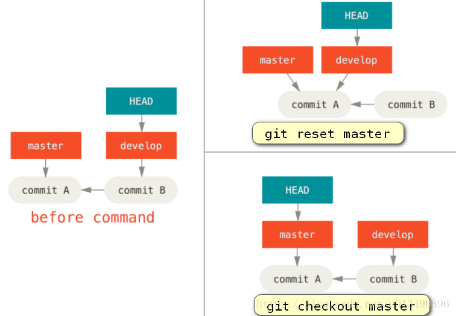
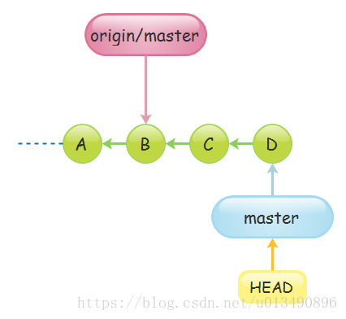
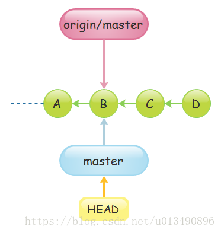

```
-----------------------------------------------------------------
# 基础设置
# "[]"表示可选、"<>"表示必选
1、设置user.name和user.email
	1)git config --global user.name <"your name">
		gitconfig --global user.emai <"your email">
	2)进入~/.gitconfig直接修改
		[user]
            name = lqh
            email = 2931451523@qq.com
    3)查看配置
    	git config --global --list/-l
    	git config --list/-l
2、设置github的ssh key
	将本地git用户关联到github上用户
	1)生成ssh key的公钥和密钥（生成位置在 C:/Users/你的用户名/.ssh）
		 ssh-keygen -t rsa -C "2931451523@qq.com"
	2)将公钥放入github账户上，进行绑定
	3)验证是否绑定成功
		ssh -T git@github.com
3、设置git默认编辑器为vscode
	git config --global core.editor "code --wait"
		--wait:会等待编辑器关闭再继续后续操作
4、github对于大于100M的文件有限制，需要使用git LFS对文件跟踪才能Push
	1)git lfs install
	2)git lfs track "*.pdf"
	3)git add .gitattributes
	注意：若已经Push报错，需要reset撤销当前的commit，重新上一步，再commit、push即可
	
------------------------------------------------------------------
# github上创建仓库,默认仓库地址：https://github.com/用户名/仓库名
# git clone [-b/--branch] [branch_name] git@github.com:用户名/该用户下的仓库名.git
	-b:可以指定克隆远程某一分支，若无默认只会克隆main/master分支
	也可本地文件运行git init初始化仓库
# git add
# git commit -m ["说明"]
	无说明打开默认编辑器
# git status 
	查看哪些没有加入暂存区，那些没有commit
# git log [-p] [filename] [--graphy/--oneline] [origin/main..HEAD]
	查看什么时候git clone\什么时候git commit
	-p:会显示差异: 是每次commit提交的文件，与上一次的差异
	filename:查看指定文件的log
	只会看当前分支或已经被合并分支的信息,如果想看全部的提交历史通过命令git reflog实现
	一般用git log查看分支在哪个提交上，指针在哪个提交或者分支上
	origin/main..HEAD:会查看远程分支的提交和本地仓库的提交的差别
# git push [-u/--set-upstream][remote] [branch]
	-u:在推送的同时，将远程仓库origin设置为本地仓库的上游
		--set-upstream效果类似
	默认remote为origin，branch为当前分支
# git pull <repository> <branch>
	<repository>：指定远程仓库的名称。通常是 origin，但可以是任何已定义的远程仓库。
	<branch>：指定要拉取的远程分支名称，这将会与你当前的本地分支合并。
	若远程仓库和本地仓库没有共同的历史分支，添加参数--allow-unrelated-histories：允许合并没有共同历史的分支。
	
-------------------------------------------------------------------
# git diff的使用
1、git diff [HEAD/分支名]
	HEAD/分支名:查看工作树与本地仓库的差异，若为空表示工作树与暂存区的差异
	
-------------------------------------------------------------------
# 分支操作
# git checkout [-b] <分支/commit_hash/HEAD^> <origin/feature-D>
	-b：创建并切换到分支
	分支：当-b为空时，分支可用-表示切换到上一次分支
	commit_hash:-b为空，commit_hash不为空表示移动HEAD指针与git reset --hard
	origin/feature-D: 在本地创建分支，以远程仓库的feature-D分支为源
# git branch [-m] [分支/更改分支名] [-a] [--allow-unrelated-histories]
	分支：创建分支，若为空表示显示当前分支情况
	-a:若是查看分支情况，表示查看远程和本地仓库的所有分支
	-m:若要更改当前分支名，则-m表示强制更改当前指针指向的分支名
	--allow-unrelated-histories:若要合并两个没有共同历史提交的分支，可以强制合并
1、创建分支、合并分支、删除分支
	创建分支：
		git checkout -b feature-A或者
		git branch feature-A && git checkout feature-A
	push新分支：
		第一次使用需用git push --set-upstream origin feature-A命令
	合并分支：
		若当前分支(main)的HEAD指针指向要合并分支(feature-A)的祖先，git会默认执行快合并(fast-forward merge)，分支会简单地移动到要合并的分支的最新提交，而不会创建新的合并提交，使用--no-ff参数表示创建新的合并提交
		git merge --no-ff feature-A	
	删除分支：
		git branch -d <branch_name>
2、更改提交操作
	1)回溯之前版本并新建分支：修改README.md并提交
		git checkout HEAD^或者git reset --hard HEAD^
		git checkout -b Feature-B
		git add .&& git commit .
	2)回到主分支的最新提交节点
		git checkout main或者git checkout main && git reset --hard <最新一次的提交>
	3)合并当前分支与之前新建的分支，解决冲突,commit提交
		git merge --no-ff Feature-B
		vi README.md解决冲突
		git add . && git commit .
	4)修改之前提交信息
		git commit --amend
			会修改当前HEAD指向的提交信息
			会导致远程仓库和本地仓库不一致，需要强制推送
			相当于撤销当前指针指向的提交，并重新提交
3、rebase的使用将最新提交说明压缩到历史记录说明中
	1)回到最新节点，新建分支feature-C，修改README.md提交
		略
	2)继续修改README.md，提交
		使用 git commit -am "fix feature-c"
	3)第二次提交是独立的，需要将第二次提交压缩到第一次中
		git rebase -i HEAD~2
			-i:默认打开编辑器操作
	4)合并main分支
	
-------------------------------------------------------------------
# 多人协同远程仓库基础
# 新建目录1将本地仓库推送到新的远程仓库
# 新建目录2，从远程仓库克隆，修改信息，push提交
# 回到原目录1，进行pull操作更新信息

1、git remote [add] [set-url] <origin> <url> [-v]
	add:本地仓库与远程仓库绑定
	set-url:本地仓库和远程仓库换绑
	-v:查看当前绑定的远程仓库
2、git checkout [-b] [branch_name] [origin/branchh_name]
	从远程仓库获得分支
3、git pull <远程仓库名> [远程分支名]:<本地分支名>
	更新本地分支branch_name，远程仓库的信息会直接覆盖当前分支上的信息
```

# 1、git checkout 与git reset的区别

```
# HEAD和分支的区别
	HEAD指向分支，分支指向提交

1、git checkout只能移动HEAD指针，不能移动分支
	分离的HEAD，HEAD指针不依赖于分支，在HEAD节点修改代码不会影响分支,一般为新建分支
2、git reset --hard会移动HEAD指针该指针指向的分支
	将HEAD和分支移动到某一提交，原分支的代码会被清除，替换为移动位置的分支代码，相当于为移动位置分支又起了个别名，由于原分支会被清除，所以该操作一般会在分支内操作，如果需要回到最新分支，使用git reflog查看最新分支的hash值，通过git reset --hard <hash>回到最新分支
```



```
3、git reset的用途
	1)需要在本分支之前的某个提交上新建一个分支
		用git checkout HEAD^再新建分支一样的
	2)同步本地仓库和远程仓库,如下图
		git reset --hard origin/master
```






# 2、使用difftool和mergetool打开vscode比较差异

1. 前言

多人协作多分支开发往往会遇到分支合并的问题，一般，我们遇到多个分支的合并，大致是以下流程：

```
diff  => merge => add & commit
```

其中，`git diff` 命令可以查看分支间的差异，清楚知道各个文件的差异，以便我们知道哪些问题有更改。为了可视化显示，我们会使用 `git difftool` 。

其次，`git merge` 命令用于合并分支，如果遇到冲突，则会自动停止，为了可视化解决冲突，我们一般使用 `git mergetool` 来合并文件。

默认情况下，`git difftool` 和 `git mergetool` 会调用类似 `vim` 的命令行工具来实现文件查看和编辑，`vim` 的确很强大，但是得熟悉快捷键，上手有难度。

使用过 `VSCode` 的读者应该都了解，`VSCode` 的编辑器就自带 `diff` 工具，那我们是否可以使用 `VSCode` 来实现 `diff` 和 `merge` 的功能呢？

答案是可以的！下面我们就开始配置。

2. 准备工作

> 由于篇幅有限，如何安装 `VSCode` 的步骤我就不赘述了，没有安装的搜索引擎寻找教程即可。

为了确保配置能够成功，我们需要确定可以在命令行唤起 `VSCode` 的窗口。

在任意位置打开 `Git Bash` 的命令行窗口，输入 `code` ，如果能够唤起 `VSCode` 的窗口，则直接跳到 [下一节](#配置命令).
能够唤起的情况下应该是这样子的：

[](https://fastly.jsdelivr.net/gh/qianfanguojin/ImageHosting_1/hexo/202201152018906.gif)

如果不能唤起，那大概率是没有配置环境变量，在 `Windows` 下，打开 高级系统设置 => 高级 => 环境变量，找到 `PATH`，在最后加上一条，内容为你的 `VSCode` 的安装路径，如 ：

```
C:\Program Files (x86)\Development\Microsoft\Microsoft VS Code
```

具体的路径根据你的安装位置决定，**注意：配置好一定要重启电脑，使环境变量生效**。启动后按照上述方式测试是否能够唤起，确定能够唤起，进入下一步。

3. 配置命令

`git difftool` 以及 `git mergetool` 提供了运行时指定特定工具的参数 `-t --tool`，不过这个工具必须在 `git` 的配置中定义好。

1. 添加 `VSCode` 为 `git difftool` 可使用的工具

   ```
   git config --global difftool.code.cmd "code --wait --diff $LOCAL $REMOTE"
   ```

2. 添加 `VSCode` 为 `git mergetool` 可使用的工具

   ```
   git config --global mergetool.code.cmd "code --wait $MERGED"
   ```

最后，查看配置列表，检查是否配置成功：

```
git config --global -l
```

4. 使用示例

为了使用更加优雅，请先打开 `VSCode` 的窗口。否则每个文件可能都要重新打开一次 `VSCode` 的窗口。

Diff

假设当前为 `main` 分支，我想查看 `dev` 分支和当前分支的不同，使用默认方式为：

```
git difftool dev
```

调用 `VSCode`的命令为：

```
git difftool -t code dev
```

Merge

假设当前为 `main` 分支，我想合并 `dev` 分支到当前分支，使用默认方式为：

```
git merge dev
#如果出现冲突
git mergetool
```

调用 `VSCode`的命令为：

```
git merge dev
#如果出现冲突
git mergetool -t code dev
```


# 3、使用.gitignore忽略不需要git管理的文件

一般我们总会有些文件无需纳入 Git 的管理，也不希望它们总出现在未跟踪文件列表。通常都是些自动生成的文件，比如日志文件，或者编译过程中创建的临时文件等。我们可以创建一个名为 `.gitignore` 的文件，列出要忽略的文件模式。来看一个实际的例子：

```
$ cat .gitignore
# .gitignore默认.git目录为根目录，不需要在文件前面加/
    *.[oa]
    *~
```

第一行告诉 Git 忽略所有以 `.o` 或 `.a` 结尾的文件。一般这类对象文件和存档文件都是编译过程中出现的，我们用不着跟踪它们的版本。第二行告诉 Git 忽略所有以波浪符（`~`）结尾的文件，许多文本编辑软件（比如 Emacs）都用这样的文件名保存副本。此外，你可能还需要忽略 `log`，`tmp` 或者 `pid` 目录，以及自动生成的文档等等。要养成一开始就设置好 `.gitignore` 文件的习惯，以免将来误提交这类无用的文件。

文件 `.gitignore` 的格式规范如下：

- 所有空行或者以注释符号 `＃` 开头的行都会被 Git 忽略。
- 可以使用标准的 glob 模式匹配。
- 匹配模式最后跟反斜杠（`/`）说明要忽略的是目录。
- 要忽略指定模式以外的文件或目录，可以在模式前加上惊叹号（`!`）取反。

所谓的 glob 模式是指 shell 所使用的简化了的正则表达式。星号（`*`）匹配零个或多个任意字符；`[abc]` 匹配任何一个列在方括号中的字符（这个例子要么匹配一个 a，要么匹配一个 b，要么匹配一个 c）；问号（`?`）只匹配一个任意字符；如果在方括号中使用短划线分隔两个字符，表示所有在这两个字符范围内的都可以匹配（比如 `[0-9]` 表示匹配所有 0 到 9 的数字）。

我们再看一个 `.gitignore` 文件的例子：

```
# 此为注释 – 将被 Git 忽略
    # 忽略所有 .a 结尾的文件
    *.a
    # 但 lib.a 除外
    !lib.a
    # 仅仅忽略项目根目录下的 TODO 文件，不包括 subdir/TODO
    /TODO
    # 忽略 build/ 目录下的所有文件
    build/
    # 会忽略 doc/notes.txt 但不包括 doc/server/arch.txt
    doc/*.txt
```


# 4、抓取、处理冲突、合并过程

```
# 方法一
	git fetch origin main  // 抓取远程main分支到本地仓库的origin/main分支，会新建一个分支默认名为origin/main
	git log -p main..origin/main  // 查看本地分支与origin/main分支差异
	git merge origin/main  // 合并
# 方法二
	git fetch origin main[:temp]  // 抓取远程main分支到本地origin/main分支或者temp分支
	git difftool origin/main或者temp  // 比较不同
	git merge origin/main或者temp  // 合并
	git branch -d temp  // 删除多余的temp分支
```


# https://ww-rm.github.io/posts/2024/01/17/githubssh-timeout/