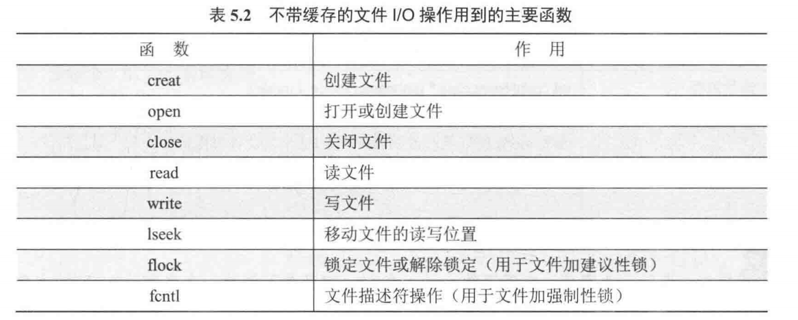
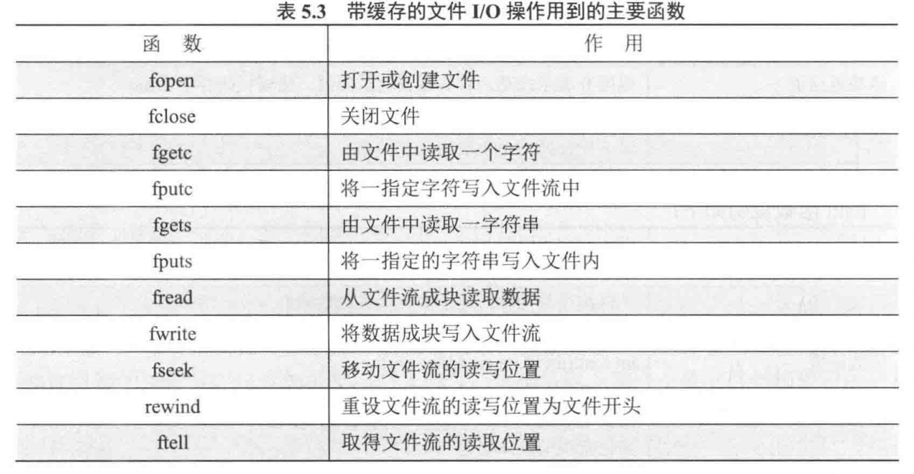
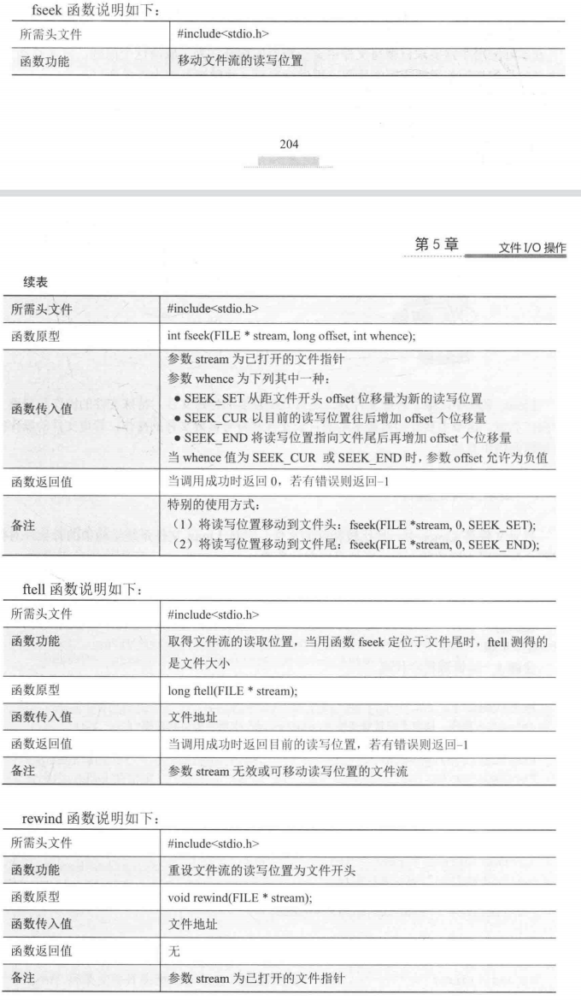

# 文件系统创建

1. 查看系统分区情况
   - fdisk -l
2. 建立分区
   - fdisk /dev/sdb
3. 格式化分区
   - mkfs.ext3 /dev/sdb1
4. 挂载分区
   - mount /dev/sdb1 /test

## 挂载文件系统

```
mount -t type mountpoint device -o options
	很多嵌入式根文件系统是不可写，通过mount -o rw,remount /可重新挂载
	type:nfs可挂载网络文件
```


# 文件系统通用操作

## 不带缓存的文件I/O操作



**1、文件描述符**

- 在linux系统中有三个已经分配的文件描述符，即标准输入(0)、标注输出(1)和标准错误(2)，分别在/dev/stdin、/dev/stdout和/dev/stderr
- 文件描述符范围为0~OPEN_MAX，不同进程的相同的文件描述符可能不是同一个设备

**2、打开创建文件open()、create()函数**

- **open函数**

```
头文件：
	sys/types.hM sys/stat.h和fcntl.h
函数定义：
    int open(const char *pathname, int flags); 
    int open(const char *pathname, int flags, mode_t mode);
	返回值：正常fd/出错-1
	pathname:最大1024字节
	flags:O_RDONLY（0）\O_WRONLY（1）\O_RDWR（2）
		参数flags除了上述三个选项之外，还有一些可选的参数。
        O_APPEND选项：使每次对文件进行写操作都追加到文件的尾端。
        O_CREAT:如果文件不存在则创建它，当使用此选择项时，第三个参数mode需要同时设定，用来说明新文件的权限。
        O_EXCL:查看文件是否存在。如果同时指定了O CREAT,而文件己经存在，会返回错误。用这种方法可以安全地打开一个文件。
        O_TRUNC:将文件长度截断为0。如果此文件存在，并且文件成功打开，则会将其长度截短为0。
        O_NONBLOCK:文件读写时，是非阻塞的
    mode:在flags为0_CREAT时，结合使用配置文件权限问题
    
```

- **create函数**

在 Linux 系统编程里，`create()` 函数属于系统调用，其功能是创建一个新文件或者截断一个已存在的文件。不过，现在 `create()` 函数基本已被 `open()` 函数取代，因为 `open()` 函数具备更多的灵活性。

**函数原型**

```c
#include <fcntl.h>

int create(const char *pathname, mode_t mode);
```

**参数说明**

- `pathname`：这是要创建的文件的路径名，既可以是绝对路径，也可以是相对路径。
- `mode`：此为文件的访问权限模式，使用八进制数表示。例如，`0644` 表示文件所有者有读写权限，而组用户和其他用户仅有读权限。

**返回值**

- 若函数调用成功，会返回一个新的文件描述符。
- 若调用失败，会返回 -1，并设置 `errno` 来表明错误原因。

**等价实现**

`create()` 函数和以下的 `open()` 函数调用是等价的：

```c
open(pathname, O_CREAT | O_WRONLY | O_TRUNC, mode);
```

**示例代码**

下面是一个使用 `create()` 函数创建文件的示例：

```c
#include <stdio.h>
#include <fcntl.h>
#include <unistd.h>

int main() {
    const char *filename = "test.txt";
    int fd;

    // 创建文件
    fd = create(filename, 0644);
    if (fd == -1) {
        perror("create");
        return 1;
    }

    printf("文件创建成功，文件描述符为: %d\n", fd);

    // 关闭文件
    if (close(fd) == -1) {
        perror("close");
        return 1;
    }

    return 0;
}
```

**代码解释**

1. 运用 `create()` 函数创建一个名为 `test.txt` 的文件，文件权限为 `0644`。
2. 若文件创建成功，会打印文件描述符。
3. 最后关闭文件描述符。

**注意事项**

- 由于 `create()` 函数默认以只写模式打开文件，若你需要以读写模式打开文件，就得使用 `open()` 函数。
- 在使用 `create()` 函数时，要注意文件权限的设置，避免因权限问题引发后续操作的错误。

**3、关闭文件close()函数**

```
头文件：
	unistd.h 
函数定义：
	int close(int fd);
	返回值：成功（0）/出错（-1）
```

**4、读取文件read()函数**

**在 Linux 系统里，write 和 read 函数是用于进行底层文件 I/O 操作的系统调用，它们是以二进制形式进行读写的，而非以字符**

```
头文件：
	unistd.h 
函数定义：
	ssize_t read(int fd, void *buf, size_t count);
	返回值：返回读取的字节数/如果到达文件尾（0）/出错（-1）
	ssize_t：具体实现可能为int(4字节)或者long long（8字节）
```

**5、写文件write()函数**

```
头文件：
	unistd.h 
函数定义：
	ssize_t write(int fd, const void *buf, size_t count);
	返回值：返回写入的字节数/出错（-1）
```

**6、文件偏移lseek()函数**

```
头文件：
	unistd.h 
函数定义：
	off_t lseek(int fildes, off_t offset, int whence);
	返回值：返回文件当前偏移量的值/出错（-1）
	这个函数对文件描述符 fildes所代表的文件，按照操作模式 whence 和偏移的大小offset，重新设定文件的偏移量。
    如果 lseek(函数操作成功，则返回新的文件偏移量的值；如果失败返回-1。由于文件的偏移量可以为负值，判断lseek(是否操作成功时，不要使用小于的判断，要使用是否等于-1来判断函数失败。
    参数 whence 和 offset 结合使用。whence 表示操作的模式，offset 是偏移的值，offset的值可以为负值。offset值的含义如下：
    如果 whence 为 SEEK SET，则 offset 为相对文件开始处的值，即将该文件偏移量设为距文件开始处offset个字节。
    如果 whence 为SEEK CUR，则offset 为相对当前位置的值，即将该文件的偏移量设置为其当前值加offset。
    如果 whence 为 SEEK END，则offset 为相对文件结尾的值，即将该文件的偏移量设置为文件长度加 offset。
```

**7、文件空间映射mmap()函数**

```
比较复杂，作用是把文件映射到内存中，对内存的操作会同步到文件中
```

**8、文件输入输出控制ioctl()函数**

```
作用：对设备进行操作
头文件：
	sys/ioctl.h
函数定义：
	int ioctl(int d, int request, ...);
	d：已经打开的设备描述符
	request：具体看驱动
```


## 带缓存的流文件I/O操作



`fopen()` 和 `fclose()` 是 C 语言标准库 `<stdio.h>` 中用于文件操作的重要函数，下面为你详细介绍这两个函数。

### `fopen()` 函数✨

**函数原型**

```c
#include <stdio.h>

FILE *fopen(const char *filename, const char *mode);
```

**参数说明**

- `filename`：要打开的文件的名称，可以是相对路径或绝对路径。

- ```
  mode
  ```

  ：指定文件的打开模式，常见的模式有以下几种：

  - `"r"`：以只读模式打开文件，文件必须存在。
  - `"w"`：以只写模式打开文件，如果文件不存在则创建，如果文件已存在则清空其内容。
  - `"a"`：以追加模式打开文件，如果文件不存在则创建，写入的数据会追加到文件末尾。
  - `"r+"`：以读写模式打开文件，文件必须存在。
  - `"w+"`：以读写模式打开文件，如果文件不存在则创建，如果文件已存在则清空其内容。
  - `"a+"`：以读写模式打开文件，如果文件不存在则创建，写入的数据会追加到文件末尾，并且可以在文件的任何位置进行读取操作。

**返回值**

- 如果文件打开成功，`fopen()` 会返回一个指向 `FILE` 类型对象的指针，后续的文件操作将通过这个指针进行。
- 如果文件打开失败，返回 `NULL`，并设置 `errno` 来指示错误的原因。

**示例代码**

```c
#include <stdio.h>

int main() {
    FILE *fp;
    // 以只读模式打开文件
    fp = fopen("test.txt", "r");
    if (fp == NULL) {
        perror("文件打开失败");
        return 1;
    }
    // 文件操作...
    fclose(fp);
    return 0;
}
```

### `fclose()` 函数

**函数原型**

```c
#include <stdio.h>

int fclose(FILE *stream);
```

**参数说明**

- `stream`：指向要关闭的 `FILE` 对象的指针，该指针通常是由 `fopen()` 函数返回的。

**返回值**

- 如果文件关闭成功，`fclose()` 返回 `0`。
- 如果关闭过程中发生错误，返回 `EOF`（通常为 -1），并设置 `errno` 来指示错误的原因。

**示例代码**

```c
#include <stdio.h>

int main() {
    FILE *fp;
    // 以只写模式打开文件
    fp = fopen("test.txt", "w");
    if (fp == NULL) {
        perror("文件打开失败");
        return 1;
    }
    // 写入一些数据
    fprintf(fp, "Hello, World!\n");
    // 关闭文件
    if (fclose(fp) != 0) {
        perror("文件关闭失败");
        return 1;
    }
    return 0;
}
```

**注意事项**

- 在使用 `fopen()` 打开文件后，务必使用 `fclose()` 关闭文件，以释放系统资源和确保数据被正确写入磁盘。
- 如果在文件操作过程中发生错误，应该及时关闭文件，避免资源泄漏。
- 对于二进制文件，在打开模式中通常需要添加 `b` 字符，例如 `"rb"`、`"wb"` 等，以确保在不同系统上正确处理二进制数据。


`fgetc` 和 `fputc` 是 C 语言标准库 `<stdio.h>` 里用于文件字符操作的函数，下面会详细介绍它们。

### `fgetc` 函数

**函数原型**

```c
#include <stdio.h>

int fgetc(FILE *stream);
```

**参数说明**

- `stream`：这是一个指向 `FILE` 类型对象的指针，它代表了要从中读取字符的文件流。这个指针通常是通过 `fopen` 函数打开文件后得到的。

**返回值**

- 若成功读取到一个字符，`fgetc` 会返回该字符对应的 `int` 类型值（将字符转换为 `int` 类型）。
- 若到达文件末尾，它会返回 `EOF`（通常被定义为 -1）。
- 若读取过程中出现错误，同样会返回 `EOF`，并且可以通过 `ferror` 函数来判断是否是错误导致的返回 `EOF`。

**示例代码**

```c
#include <stdio.h>

int main() {
    FILE *fp;
    int ch;

    // 以只读模式打开文件
    fp = fopen("test.txt", "r");
    if (fp == NULL) {
        perror("文件打开失败");
        return 1;
    }

    // 逐个字符读取文件内容
    while ((ch = fgetc(fp)) != EOF) {
        putchar(ch);
    }

    // 关闭文件
    fclose(fp);
    return 0;
}
```

### `fputc` 函数

**函数原型**

```c
#include <stdio.h>

int fputc(int c, FILE *stream);
```

**参数说明**

- `c`：这是要写入文件的字符，它是 `int` 类型，但实际上存储的是字符的 ASCII 值。
- `stream`：指向 `FILE` 类型对象的指针，代表要写入字符的文件流。

**返回值**

- 若字符写入成功，`fputc` 会返回写入的字符（以 `int` 类型表示）。
- 若写入过程中出现错误，会返回 `EOF`。

**示例代码**

```c
#include <stdio.h>

int main() {
    FILE *fp;
    char str[] = "Hello, World!";
    int i;

    // 以只写模式打开文件
    fp = fopen("test.txt", "w");
    if (fp == NULL) {
        perror("文件打开失败");
        return 1;
    }

    // 逐个字符写入文件
    for (i = 0; str[i] != '\0'; i++) {
        if (fputc(str[i], fp) == EOF) {
            perror("字符写入失败");
            fclose(fp);
            return 1;
        }
    }

    // 关闭文件
    fclose(fp);
    return 0;
}
```

**注意事项**

- 在使用 `fgetc` 和 `fputc` 进行文件操作时，要确保文件已经成功打开，否则可能会导致未定义行为。
- 对于 `fgetc`，返回值是 `int` 类型而不是 `char` 类型，这是为了能够正确区分正常字符和 `EOF`。
- 在使用完文件后，要及时调用 `fclose` 函数关闭文件，以释放系统资源。

## fgets和fpus

`fgets` 和 `fputs` 是 C 语言中用于处理字符串输入和输出的函数。它们的主要功能和用法如下：

### 1. `fgets` 函数(gets)

- **功能**：从指定的文件流中读取一行字符串。

- **函数原型**：

  ```c
  char *fgets(char *str, int n, FILE *stream);
  ```

- **参数**：

  - `str`：指向字符数组的指针，用于存储读取的字符串。
  - `n`：要读取的最大字符数（包括结束的空字符）。

- `stream`：指向 `FILE` 对象的指针，标识要从中读取字符的流（例如 `stdin` 表示标准输入）。

- **返回值**：成功时返回 `str` 的指针，失败或到达文件末尾时返回 `NULL`。

- **示例**：

  ```c
  #include <stdio.h>
  
  int main() {
      char buffer;
      printf("请输入一行文本：");
      if (fgets(buffer, sizeof(buffer), stdin) != NULL) {
          printf("您输入的文本是：%s", buffer);
      }
      return 0;
  }
  ```

  在这个例子中，`fgets` 从标准输入读取一行文本并存储在 `buffer` 中。

- **注意**

  - fgets会将\n读入


### 2. `fputs` 函数(puts)

- **功能**：将字符串写入指定的文件流。

- **函数原型**：

  ```c
  int fputs(const char *str, FILE *stream);
  ```

- **参数**：

  - `str`：要写入的字符串。
  - `stream`：指向 `FILE` 对象的指针，标识要写入的流（例如 `stdout` 表示标准输出）。

- **返回值**：成功时返回非负值，失败时返回 `EOF`。

- **示例**：

  ```c
  #include <stdio.h>
  
  int main() {
      const char *text = "Hello, World!";
      fputs(text, stdout);  // 将字符串输出到标准输出
      return 0;
  }
  ```

  在这个例子中，`fputs` 将字符串 `"Hello, World!"` 输出到标准输出。

### 注意事项

- `fgets` 会包括换行符在内，如果读取的行长度小于 `n-1`，则换行符会被存储在 `str` 中。
- `fputs` 不会自动添加换行符，因此如果需要换行，必须手动添加。
- 配置使用fflush(fd)函数确保数据的写入

这两个函数在处理字符串输入输出时非常有用，能够以格式化的方式读写数据，便于数据的存储和处理。


## fprintf和fscanf

`fprintf` 和 `fscanf` 是 C 语言中用于格式化输出和输入的函数，主要用于文件操作。以下是这两个函数的详细使用方法：

### 1. `fprintf` 函数(printf)

- **功能**：将格式化的数据写入指定的文件流。

- **函数原型**：

  ```c
  int fprintf(FILE *fp, const char *format, ...);
  ```

- **参数**：

  - `fp`：文件指针，指向要写入的文件。
  - `format`：格式控制字符串，指定输出的格式。
  - 后续参数：要写入的数据。

- **示例**：

  ```c
  FILE *fp = fopen("output.txt", "w");
  if (fp != NULL) {
      int i = 10;
      float f = 3.14;
      fprintf(fp, "Integer: %d, Float: %.2f\n", i, f);
      fclose(fp);
  }
  ```

  在这个例子中，整数和浮点数将被写入到 `output.txt` 文件中。

### 2. `fscanf` 函数(scanf)

- **功能**：从指定的文件流中读取格式化的数据。

- **函数原型**：

  ```c
  int fscanf(FILE *fp, const char *format, ...);
  ```

- **参数**：

  - `fp`：文件指针，指向要读取的文件。
  - `format`：格式控制字符串，指定输入的格式。

- 后续参数：用于存储读取数据的变量的地址。

- **示例**：

  ```c
  FILE *fp = fopen("input.txt", "r");
  if (fp != NULL) {
      int i;
      float f;
      fscanf(fp, "Integer: %d, Float: %f", &i, &f);
      printf("Read Integer: %d, Read Float: %.2f\n", i, f);
      fclose(fp);
  }
  ```

  在这个例子中，程序从 `input.txt` 文件中读取一个整数和一个浮点数，并将其打印到控制台。

### 注意事项

- 使用 `fprintf` 时，确保文件已成功打开，并在写入后关闭文件。
- 使用 `fscanf` 时，确保格式字符串与文件中的数据格式匹配，以避免读取错误。

这两个函数在处理文件输入输出时非常有用，能够以格式化的方式读写数据，便于数据的存储和处理

## 以二进制读写文件

`fwrite` 和 `fread` 是 C 语言标准库 `<stdio.h>` 中用于进行文件读写操作的重要函数，它们主要用于二进制文件的读写，也可用于文本文件。下面为你详细介绍这两个函数。

### 1.`fwrite` 函数

**函数原型**

```c
#include <stdio.h>

size_t fwrite(const void *ptr, size_t size, size_t nmemb, FILE *stream);
```

**参数说明**

- `ptr`：指向要写入数据的内存块的指针，这块内存存储着待写入文件的数据。
- `size`：每个数据项的大小（以字节为单位），例如，若要写入 `int` 类型数据，`size` 就是 `sizeof(int)`。
- `nmemb`：要写入的数据项的数量。
- `stream`：指向 `FILE` 对象的指针，代表要写入数据的文件流，该指针通常由 `fopen` 函数返回。

**返回值**

返回实际成功写入的数据项的数量（而非字节数）。若返回值小于 `nmemb`，可能表示在写入过程中出现了错误或者到达了文件系统的限制。可通过 `ferror` 函数检查是否发生错误。

**示例代码**

```c
#include <stdio.h>

typedef struct {
    int id;
    char name[20];
} Person;

int main() {
    FILE *fp;
    Person person = {1, "Alice"};

    // 以二进制写入模式打开文件
    fp = fopen("person.bin", "wb");
    if (fp == NULL) {
        perror("文件打开失败");
        return 1;
    }

    // 写入数据
    size_t written = fwrite(&person, sizeof(Person), 1, fp);
    if (written != 1) {
        perror("数据写入失败");
    }

    // 关闭文件
    fclose(fp);
    return 0;
}
```

### 2.`fread` 函数

**函数原型**

```c
#include <stdio.h>

size_t fread(void *ptr, size_t size, size_t nmemb, FILE *stream);
```

**参数说明**

- `ptr`：指向用于存储读取数据的内存块的指针，读取的数据会被存储到该内存区域。
- `size`：每个数据项的大小（以字节为单位），与 `fwrite` 中的 `size` 概念相同。
- `nmemb`：要读取的数据项的数量。
- `stream`：指向 `FILE` 对象的指针，代表要从中读取数据的文件流。

**返回值**

返回实际成功读取的数据项的数量。若返回值小于 `nmemb`，可能是因为到达了文件末尾或者读取过程中出现了错误。可通过 `feof` 函数判断是否到达文件末尾，通过 `ferror` 函数判断是否发生错误。

**示例代码**

```c
#include <stdio.h>

typedef struct {
    int id;
    char name[20];
} Person;

int main() {
    FILE *fp;
    Person person;

    // 以二进制读取模式打开文件
    fp = fopen("person.bin", "rb");
    if (fp == NULL) {
        perror("文件打开失败");
        return 1;
    }

    // 读取数据
    size_t read_items = fread(&person, sizeof(Person), 1, fp);
    if (read_items != 1) {
        if (feof(fp)) {
            printf("到达文件末尾\n");
        } else {
            perror("数据读取失败");
        }
    } else {
        printf("ID: %d, Name: %s\n", person.id, person.name);
    }

    // 关闭文件
    fclose(fp);
    return 0;
}
```

### 注意事项

- **文件打开模式**：在使用 `fwrite` 时，通常使用 `"wb"`（二进制写入）模式；使用 `fread` 时，使用 `"rb"`（二进制读取）模式，这样可以确保在不同系统上正确处理二进制数据。
- **数据一致性**：`fwrite` 和 `fread` 读写的数据格式要保持一致，即 `size` 和 `nmemb` 的设置要对应，否则可能导致数据读取错误。
- **错误处理**：在使用这两个函数时，要检查返回值并处理可能出现的错误，如文件打开失败、读写错误等。

## 其他函数（fseek/ftell/rewind）

读写位置的最大值取决于文件的大小。对于一个大小为 `N` 字节的文件，合法的读写位置范围是从 0 到 `N`。当读写位置为 `N` 时，表示位于文件末尾之后，此时若进行写操作，会在文件末尾追加数据；若进行读操作，会返回文件结束标志（如 `EOF`）。




# 文件描述符和FILE*区别

在 C 语言中，文件描述符（file descriptor）和`FILE*` 是用于处理文件操作的两种不同方式，它们存在诸多区别，以下从几个方面为你详细介绍：

**本质与类型**

- **文件描述符**：它本质上是一个非负整数，是操作系统内核为了管理已打开的文件所创建的索引。在操作系统层面，每个进程都有一个文件描述符表，这些整数就是该表的索引，用于标识进程打开的文件、设备等资源。比如，标准输入、标准输出和标准错误输出对应的文件描述符通常是 0、1、2。
- **`FILE*`**：这是一个指向`FILE`结构体的指针。`FILE`结构体是标准 C 库定义的，它封装了文件操作所需的各种信息，像文件缓冲区状态、文件指针位置等。它是标准 C 库提供的一种更高级、更抽象的文件操作接口。

**所属层面**

- **文件描述符**：属于系统调用层面的概念，是操作系统提供的底层接口。使用文件描述符进行文件操作时，调用的是如`open`、`read`、`write`、`close`等系统调用函数，这些函数直接与操作系统内核交互。
- **`FILE*`**：属于标准 C 库层面的概念，是对底层文件描述符的封装。标准 C 库提供了像`fopen`、`fread`、`fwrite`、`fclose`等函数来操作`FILE*`，这些函数在底层会调用相应的系统调用，但同时增加了缓冲区管理等功能。

**缓冲区管理**

- **文件描述符**：使用文件描述符进行文件读写操作时，没有内置的缓冲区。每次调用`read`或`write`系统调用，都会直接发起一次系统调用，与磁盘或设备进行数据交互。这意味着频繁的读写操作可能会导致较多的系统开销。
- **`FILE\*`**：标准 C 库为`FILE*`提供了缓冲区管理机制。在进行文件读写时，数据会先被存储在缓冲区中，当缓冲区满或者调用`fflush`函数时，才会将缓冲区中的数据写入磁盘或从磁盘读取数据填充缓冲区。这样可以减少系统调用的次数，提高文件操作的效率。

**可移植性**

- **文件描述符**：文件描述符是操作系统特定的概念，不同的操作系统对文件描述符的实现和管理可能会有所不同。因此，使用文件描述符编写的代码可移植性相对较差。
- **`FILE\*`**：`FILE*`是标准 C 库的一部分，遵循 ANSI C 标准。使用`FILE*`编写的代码具有更好的可移植性，可以在不同的操作系统上编译和运行。

**文件描述符与FILE*的转换**

- FILE*--->文件描述符：

  - ```c
    int fileno(FILE *);
    ```

- 文件描述符--->FILE*：

  - ```c
    FILE *fdopen(int fd, const char *mode);
    ```

    

**示例代码对比**

下面是分别使用文件描述符和`FILE*`进行文件读取的示例代码：

- **使用文件描述符**

```c
#include <stdio.h>
#include <fcntl.h>
#include <unistd.h>

int main() {
    int fd = open("test.txt", O_RDONLY);
    if (fd == -1) {
        perror("open");
        return 1;
    }

    char buffer[100];
    ssize_t bytes_read = read(fd, buffer, sizeof(buffer));
    if (bytes_read == -1) {
        perror("read");
        close(fd);
        return 1;
    }

    printf("Read %zd bytes: %.*s\n", bytes_read, (int)bytes_read, buffer);

    close(fd);
    return 0;
}
```

- **使用`FILE*`**

```c
#include <stdio.h>

int main() {
    FILE *fp = fopen("test.txt", "r");
    if (fp == NULL) {
        perror("fopen");
        return 1;
    }

    char buffer[100];
    size_t bytes_read = fread(buffer, 1, sizeof(buffer), fp);
    if (ferror(fp)) {
        perror("fread");
        fclose(fp);
        return 1;
    }

    printf("Read %zu bytes: %.*s\n", bytes_read, (int)bytes_read, buffer);

    fclose(fp);
    return 0;
}
```

从上述代码可以看出，使用`FILE*`的代码相对更简洁，并且隐藏了底层的系统调用细节。而使用文件描述符的代码则更接近操作系统的底层实现。
