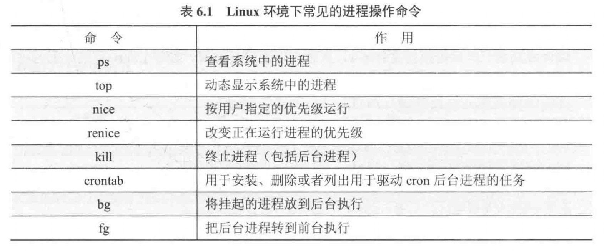
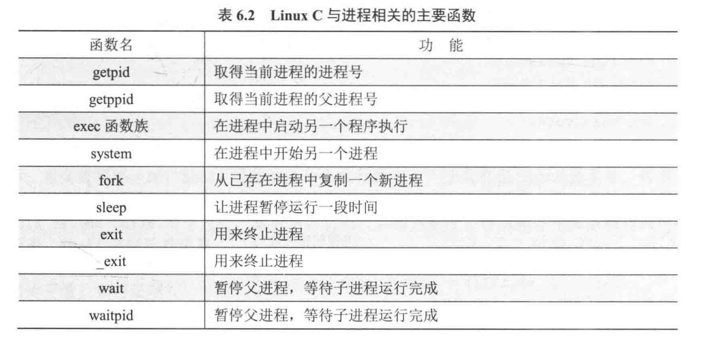
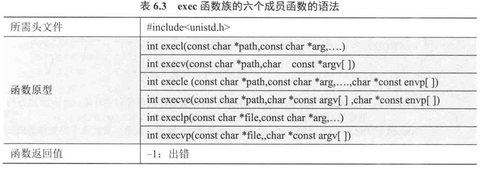
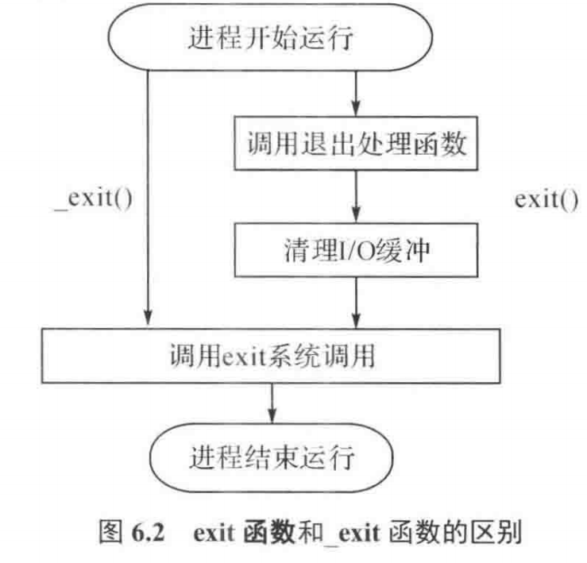
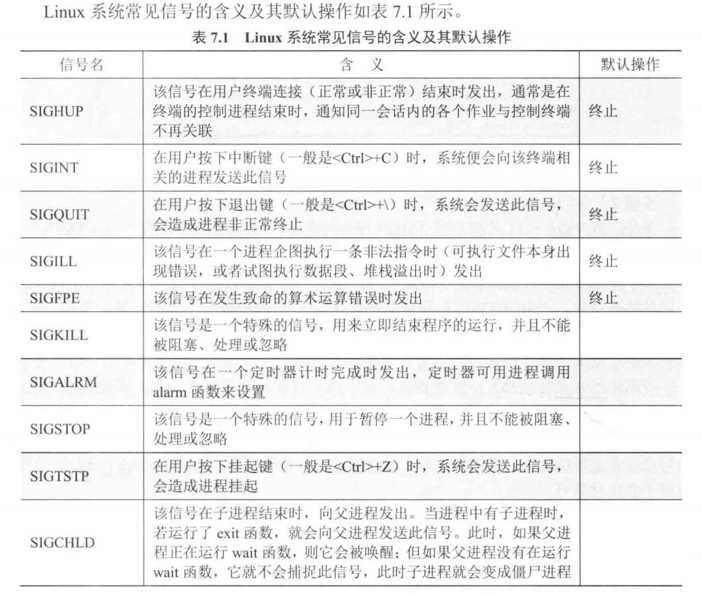
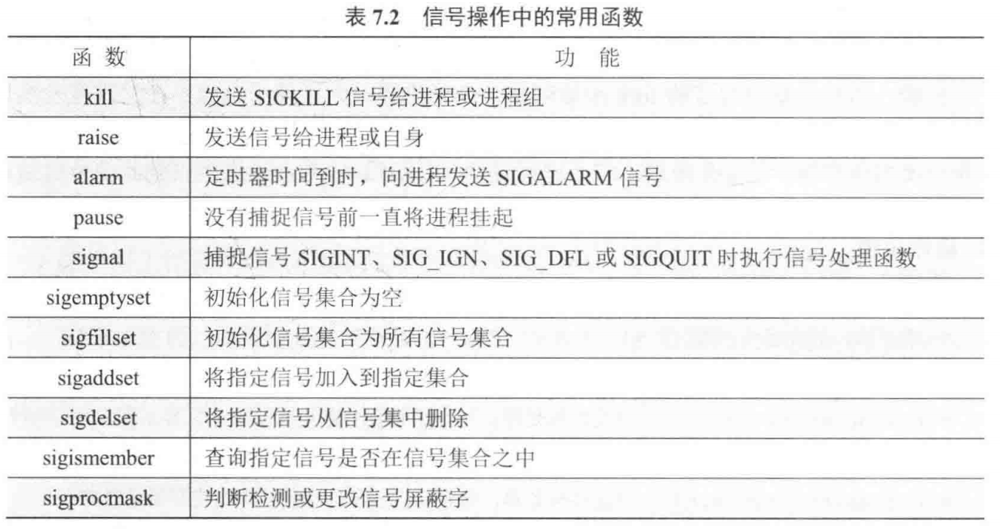
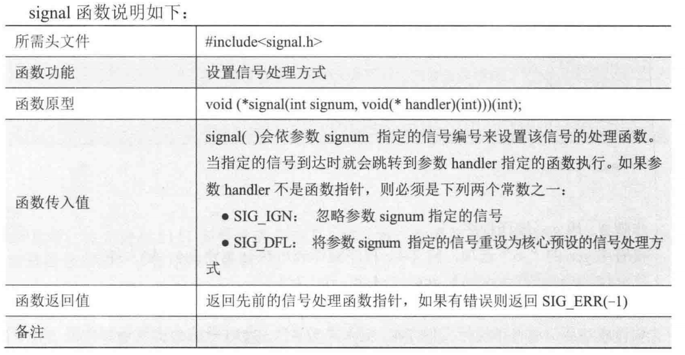
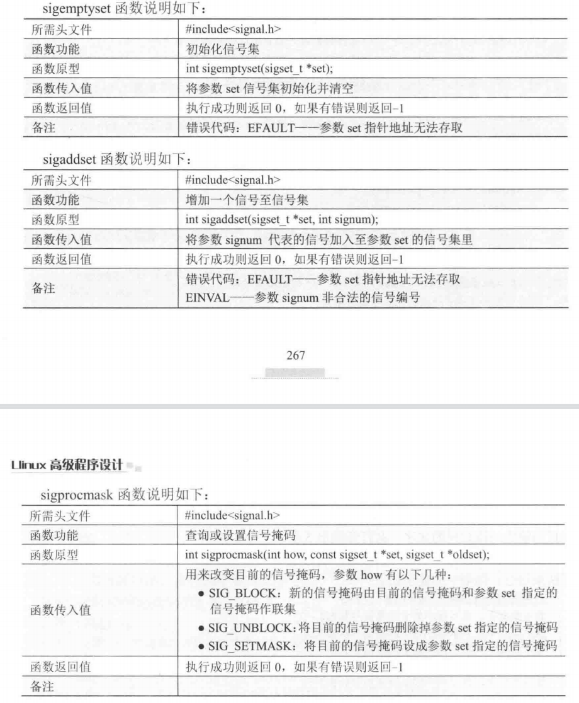

#  进程操作命令



# 进程控制



## **进程创建**

- fork()
  - vfork()确保子进程一定优先于父进程开始执行

- execve
  - 覆盖原进程
  - 
  
- system
  - 底层调用execve，不同的是execve会覆盖原程序，而system会新开一个进程执行

## **进程终止**

- _exit()和exit()
- 
- exit会清理I/O缓存后输出

## **僵尸进程**

- 子进程结束后，父进程没有调用waitpid清理子进程，该子进程即为僵尸进程，若父进程结束，僵尸子进程会被init进程收养，由init进程调用waitpid清理僵尸进程

- **wait的使用**

  - | 所需头文件 | `#include<sys/types.h>` `#include<sys/wait.h>`               |
    | ---------- | ------------------------------------------------------------ |
    | 函数功能   | 等待子进程中断或结束                                         |
    | 函数原型   | `pid_t wait(int *status);`                                   |
    | 函数传入值 | `status`：用于获取子进程状态的指针，通过该指针可获取子进程退出信息（如正常退出状态码或终止信号等） |
    | 函数返回值 | 执行成功则返回终止子进程的进程号（PID）；若有错误发生则返回 -1，失败原因存于 `errno` 中 |
    | 备注       | `wait()` 会暂停目前进程的执行，直到其子进程终止或有信号到达并被处理，该函数用于父进程等待子进程结束，回收子进程资源，避免僵尸进程产生。 |

  - | 宏                     | 功能描述                                                     |
    | ---------------------- | ------------------------------------------------------------ |
    | `WIFEXITED(status)`    | 若子进程正常退出，返回非零值；反之，返回 0。正常退出意味着子进程调用了 `exit` 或者 `_exit` 函数，或者从 `main` 函数中返回。 |
    | `WEXITSTATUS(status)`  | 当 `WIFEXITED(status)` 为真时，此宏可用于获取子进程的退出状态码。子进程通常通过 `exit` 函数或者从 `main` 函数返回一个整数值来设定退出状态码，其取值范围是 0 - 255。 |
    | `WIFSIGNALED(status)`  | 若子进程因接收到信号而终止，返回非零值；否则，返回 0。这表明子进程是被某个信号（如 `SIGKILL` 或 `SIGTERM`）终止的。 |
    | `WTERMSIG(status)`     | 当 `WIFSIGNALED(status)` 为真时，此宏用于获取导致子进程终止的信号编号。例如，`SIGKILL` 的编号是 9，`SIGTERM` 的编号是 15。 |
    | `WIFSTOPPED(status)`   | 若子进程被暂停执行，返回非零值；否则，返回 0。子进程可能因为接收到 `SIGSTOP`、`SIGTSTP` 等信号而暂停。 |
    | `WSTOPSIG(status)`     | 当 `WIFSTOPPED(status)` 为真时，此宏用于获取使子进程暂停的信号编号。 |
    | `WIFCONTINUED(status)` | 若子进程因接收到 `SIGCONT` 信号而继续执行，返回非零值；否则，返回 0。 |

- **waitpid()**

  - `waitpid` 是 Linux 系统下用于等待子进程状态改变（如终止或暂停）的系统调用，常用于父进程回收子进程资源，避免僵尸进程。以下是详细解释：

    ### 1. 函数原型与头文件

    ```c
    #include <sys/types.h>
    #include <sys/wait.h>
    
    pid_t waitpid(pid_t pid, int *status, int options);
    ```

    ### 2. 参数说明

    - `pid`：指定等待的子进程标识，取值及含义如下：
      - `pid < -1`：等待进程组 ID 为 `pid` 绝对值的任意子进程。
      - `pid = -1`：等待任意子进程（等价于 `wait()`）。
      - `pid = 0`：等待进程组 ID 与当前进程相同的子进程。
      - `pid > 0`：等待进程 ID 等于 `pid` 的子进程。
    - `status`：用于获取子进程状态的指针，常通过以下宏解析：
      - `WIFEXITED(status)`：子进程正常退出时返回非零值，可通过 `WEXITSTATUS(status)` 获取退出状态码。
      - `WIFSIGNALED(status)`：子进程因未捕获信号终止时返回非零值，`WTERMSIG(status)` 可获取终止信号编号。
      - `WIFSTOPPED(status)`：子进程被暂停时返回非零值，`WSTOPSIG(status)` 用于获取暂停信号编号。
    - `options`：控制waitpid行为，常用选项：
      - `WNOHANG`：若子进程未结束，立即返回 `0`（非阻塞）；若结束，返回子进程 PID。
      - `WUNTRACED`：子进程进入暂停状态时立即返回（默认只关注终止子进程）。

    ### 3. 返回值

    - 成功：返回终止或暂停子进程的 PID（`options` 为 `WNOHANG` 且子进程未结束时返回 `0`）。
    - 失败：返回 `-1`，如无可用子进程（`errno` 设为 `ECHILD`）或调用被信号中断（`errno` 设为 `EINTR`）。

    ### 4. 示例代码

    ```c
    #include <stdio.h>
    #include <stdlib.h>
    #include <sys/types.h>
    #include <sys/wait.h>
    #include <unistd.h>
    
    int main() {
        pid_t pid, childpid;
        int status;
    
        pid = fork(); // 创建子进程
        if (pid < 0) {
            perror("fork");
            exit(1);
        } else if (pid == 0) { // 子进程
            sleep(2);
            exit(42); // 正常退出，状态码 42
        } else { // 父进程
            do {
                // 非阻塞等待，避免父进程一直阻塞
                childpid = waitpid(pid, &status, WNOHANG);
                if (childpid == 0) {
                    printf("子进程未结束，继续执行其他任务...\n");
                    sleep(1);
                }
            } while (childpid == 0);
    
            if (WIFEXITED(status)) {
                printf("子进程正常退出，退出状态码: %d\n", WEXITSTATUS(status));
            } else if (WIFSIGNALED(status)) {
                printf("子进程被信号 %d 终止\n", WTERMSIG(status));
            }
        }
        return 0;
    }
    ```

    ### 5. 注意事项

    - **避免僵尸进程**：父进程应及时调用 `waitpid` 回收子进程，否则子进程会成为僵尸进程，浪费系统资源。
    - **非阻塞模式**：结合 `WNOHANG` 可让父进程在等待子进程时不被阻塞，继续执行其他任务。
    - **信号处理**：子进程终止时，父进程会收到 `SIGCHLD` 信号，可在信号处理函数中调用 `waitpid` 回收子进程（需注意信号处理函数的可重入性）。

    通过合理使用 `waitpid`，可有效管理子进程生命周期，确保系统资源合理利用。

## **孤儿进程**

- 父进程结束了，子进程还在运行

| **特征**       | **孤儿进程**                       | **僵尸进程**                             |
| -------------- | ---------------------------------- | ---------------------------------------- |
| **父进程状态** | 已终止，子进程被 `init` 收养       | 仍在运行，但未回收子进程状态             |
| **子进程状态** | 正常运行（非终止），PPID=1         | 已终止，状态为 `Z`（僵尸状态）           |
| **资源回收**   | 由 `init` 自动回收（子进程终止时） | 需父进程调用 `wait()` 回收，否则长期残留 |
| **影响**       | 无负面影响                         | 占用进程表资源，可能导致进程创建失败     |
| **处理方式**   | 无需处理                           | 父进程回收或杀死父进程                   |


# 守护进程

## 流程

在 Linux 系统中，守护进程（Daemon Process）是在后台长期运行、不受终端控制的进程，通常用于执行系统服务任务。以下是创建守护进程的标准流程及要点：

### 一、创建流程

1. **创建子进程，终止父进程**

   - 使用 `fork()` 系统调用创建子进程，随后父进程调用 `exit()` 退出。这样做使子进程成为 “孤儿进程”，被 init 进程收养，形式上脱离终端控制（shell 会认为命令已执行完毕）。

   - 代码示例：

     ```c
     pid_t pid = fork();  
     if (pid < 0) {  
         // 错误处理  
     } else if (pid > 0) {  
         exit(EXIT_SUCCESS); // 父进程退出  
     }  
     // 子进程继续执行  
     ```

2. **子进程创建新会话（关键步骤）**

   - 调用 `setsid()` 函数，使子进程成为新会话的首进程，摆脱原会话、进程组和控制终端的关联。
   - 代码：`setsid();`
   - 作用：确保进程完全独立，不再受原有终端的信号（如 `SIGINT`）影响。

3. **改变工作目录**

   - 使用 `chdir("/")` 将工作目录改为根目录（也可改为其他固定目录如 `/tmp`）。避免因守护进程长期运行导致其工作目录所在文件系统无法卸载。
   - 代码：`chdir("/");`

4. **重设文件创建掩码**

   - 调用 `umask(0)` 清除文件创建掩码，确保守护进程创建文件 / 目录时拥有所需权限（避免继承父进程的掩码限制）。

5. **关闭文件描述符**

   - 关闭从父进程继承的已打开文件描述符，释放资源。可通过循环关闭：

     ```c
     #include <sys/resource.h>  
     int maxfd = sysconf(_SC_OPEN_MAX);  
     for (int i = 0; i < maxfd; i++) {  
         close(i);  
     }  
     ```

   - 进一步将标准输入、输出、错误（0、1、2）重定向到/dev/null，防止守护进程进行无效 I/O 操作：

     ```c
     int fd = open("/dev/null", O_RDWR);  
     dup2(fd, STDIN_FILENO);  
     dup2(fd, STDOUT_FILENO);  
     dup2(fd, STDERR_FILENO);  
     if (fd > 2) close(fd);  
     ```

### 二、核心要点

- **脱离终端控制**：通过 `fork()` 后父进程退出、`setsid()` 新建会话，确保守护进程不依赖任何终端。
- **资源清理与独立性**：关闭不必要文件描述符、重设工作目录和文件掩码，避免资源浪费或依赖外部环境（如可卸载的文件系统）。
- **代码健壮性**：添加错误处理（如 `fork()`、`setsid()` 失败时的处理），确保守护进程稳定启动。

### 三、示例代码框架

```c
#include <stdio.h>  
#include <stdlib.h>  
#include <sys/types.h>  
#include <sys/stat.h>  
#include <fcntl.h>  
#include <unistd.h>  

int main() {  
    pid_t pid = fork();  
    if (pid < 0) {  
        perror("fork");  
        return 1;  
    } else if (pid > 0) {  
        exit(EXIT_SUCCESS);  
    }  

    if (setsid() == (pid_t)-1) {  
        perror("setsid");  
        return 1;  
    }  

    if (chdir("/") == -1) {  
        perror("chdir");  
        return 1;  
    }  

    umask(0);  

    int fd = open("/dev/null", O_RDWR);  
    if (fd < 0) {  
        perror("open /dev/null");  
        return 1;  
    }  
    dup2(fd, STDIN_FILENO);  
    dup2(fd, STDOUT_FILENO);  
    dup2(fd, STDERR_FILENO);  
    if (fd > 2) close(fd);  

    // 守护进程核心业务逻辑（如循环执行任务）  
    while (1) {  
        // 具体任务代码  
        sleep(1);  
    }  

    return 0;  
}  
```

通过以上步骤，可将普通进程改造为守护进程，使其在后台稳定运行，执行如日志记录、定时任务、网络监听等系统服务功能。

## 日志输出

```c
#include <stdio.h>
#include <stdlib.h>
#include <sys/types.h>
#include <sys/stat.h>
#include <fcntl.h>
#include <unistd.h>
#include <time.h>

// 记录日志到文件
void log_to_file(const char *message) {
    FILE *log_file = fopen("/var/log/my_daemon.log", "a");
    if (log_file == NULL) {
        return;
    }

    // 获取当前时间
    time_t rawtime;
    struct tm * timeinfo;
    time(&rawtime);
    timeinfo = localtime(&rawtime);
    char time_str[80];
    strftime(time_str, 80, "%Y-%m-%d %H:%M:%S", timeinfo);

    // 写入日志
    fprintf(log_file, "[%s] %s\n", time_str, message);
    fclose(log_file);
}

int main() {
    pid_t pid = fork();
    if (pid < 0) {
        perror("fork");
        return 1;
    } else if (pid > 0) {
        exit(EXIT_SUCCESS);
    }

    if (setsid() == (pid_t)-1) {
        perror("setsid");
        return 1;
    }

    if (chdir("/") == -1) {
        perror("chdir");
        return 1;
    }

    umask(0);

    int fd = open("/dev/null", O_RDWR);
    if (fd < 0) {
        perror("open /dev/null");
        return 1;
    }
    dup2(fd, STDIN_FILENO);
    dup2(fd, STDOUT_FILENO);
    dup2(fd, STDERR_FILENO);
    if (fd > 2) close(fd);

    // 记录日志
    log_to_file("Daemon started");

    // 守护进程核心业务逻辑（如循环执行任务）
    while (1) {
        log_to_file("Daemon is running");
        sleep(10);
    }

    return 0;
}
```


## 守护进程实践

- 守护进程（类似top）
  - signal的使用
- 守护进程（监视文件修改）
  - stat的使用


# 进程通信（IPC）

**参考文献：**

- linux高级程序设计

## 基础知识

**通信方式：**

- **信号**
  - **用户进程对信号响应方式**
    - **执行默认操作**
      - SIGKILL和SIGSTOP信号只能执行默认操作（终止和停止）
    - **捕获信号执行自定义处理函数**
      - sign函数注册信号与函数
    - **忽略信号**
      - sigprocmask添加SIGBLOCK信号阻塞信号集合
- **管道**
  - **无名管道**
    - 父子进程或者兄弟进程之间通信
  - **命名管道**
    - 任何两个进程之间的通信
  - **高级管道**
    - popen
      - system
      - pipe+fork+exec
- 消息队列
- 共享内存
- 信号量
- 套接字


## 一、信号

### 基础知识

**常见的信号值**




**常见的信号操作函数**




### 信号处理(signal)

通过signal函数指定信号的处理函数



### 信号阻塞(sigprocmask)

通过sigprocmask函数阻塞信号集合中的信号




## 二、管道

管道中的数据被读取后会从管道中删除

### 无名管道(pipe)

用于父子进程或者兄弟进程之间的通信，是半双工的，通过对fd的文件描述符的读写操作实现通信

**流程：**

- pipe(pipe_fd)创建管道
- close(pipe_fd[0])关闭管道的读端
- fwrite(writeBuf, sizeof(char), MAXLEN, pipe_fd[1])和读写文件一样写入管道数据
- fread(readBuf, sizeof(char)m MAXLEN, pipe_fd[0])

**注意事项：**

- 如果所有指向管道写入端的文件描述符都关闭了（管道写入端的引用计数等于0），而仍然有进程从管道的读取端读数据，那么管道中剩余的数据都被读取后，再次read会返回0，就像读到文件末尾一样。
- 如果有指向管道写入端的文件描述符没关闭（管道写入端的引用计数大于0），而持有管道写入端的进程也没有向管道中写数据，这时有进程从管道读取端读数据，那么管道中剩余的数据都被读取后，再次read会阻塞，直到管道中有数据可读了才读取数据并返回。
- 如果所有指向管道读取端的文件描述符都关闭了（管道读取端的引用计数等于0），这时有进程向管道的写入端write,那么该进程会收到信号SIGPIPE,通常会导致进程异常终止。
- 如果有指向管道读取端的文件描述符没关闭（管道读取端的引用计数大于0），而持有管道读取端的进程也没有从管道中读数据，这时有进程向管道写入端写数据，那么在管道被写满时再次wite会阻塞，直到管道中有空位置了才写入数据并返回。
- 两个进程通过一个管道只能实现单向通信，如果有时候也需要子进程写父进程读，就必须另开一个管道。

### 命名管道(mkfifo)

**基本概念：**

- 用于任何两个进程之间的通信，是半双工的
- 以文件的形式存在，通过对文件的读写操作实现不同进程的通信

**流程：**

- mkfifo("/path/fifo", 0666)指定路径创建管道文件，设置权限
- fd = open("/path/fifo", O_RDONLY)
- fread()
- close()
- unlink()

#### 实践-命名管道传输图片文件或文字文件

**参考文献：**

- linux高级程序设计第7章实验：思考5

TODO


### 高级管道(popen)

**高级管道等效于：**创建子进程，创建无名管道，在子进程调用exec函数执行shell命令，通过对文件描述符fd的读写操作实现通信

**流程：**

- fd = popen(“shell command”,  type=“r/w”)
- 如果type="r"
  - shell command会立即执行并将输出数据写入管道
  - 通过fread(buff, sizeof(char), sizeof(buffer), fd)函数读取管道数据
- 如果type="w"
  - shell command会读取管道数据作为输入，并直接将输出结果输出到stdout上
  - 通过fputs(buff, sizeof(buff), fd)函数写入管道数据
    - 使用fputs要使用fflush(fp)确保数据写入
- pclose(fd)关闭子进程

### 通过高级管道获取网卡信息

```c
#include <stdio.h>

char buffer[2048];
int main(int argc, char const *argv[]){
    FILE *fp = popen("ifconfig", "r");
    fread(buffer, sizeof(char), sizeof(buffer), fp);
    fprintf(stdout, "Network card information:\n%s", buffer);
    pclose(fp);
    return 0;
}
```


## 三、消息队列

### ftok

`ftok` 是 Unix 和 Linux 系统编程中一个非常重要的函数，主要用于生成 System V IPC（进程间通信）键值。这个键值在创建共享内存段、消息队列以及信号量集时是必不可少的。下面将对 `ftok` 函数进行详细解析。

**函数原型**

```c
#include <sys/types.h>
#include <sys/ipc.h>

key_t ftok(const char *pathname, int proj_id);
```

**参数解读**

- **`pathname`**：这必须是一个已经存在且进程有访问权限的文件或目录路径。`ftok` 函数会利用该文件的索引节点号（inode number）来生成键值。
- **`proj_id`**：这是一个由用户指定的 8 位整数（取值范围为 1 - 255），也被称为项目 ID。`ftok` 函数会将这个值与 `pathname` 对应的文件信息相结合，从而生成最终的键值。

**返回值情况**

- 若函数调用成功，会返回一个 `key_t` 类型的 IPC 键值。
- 若调用失败，则返回-1，同时会设置errno来指示具体的错误原因。常见的错误包括：
  - **`EACCES`**：没有权限访问指定的 `pathname`。
  - **`ENOENT`**：指定的 `pathname` 并不存在。
  - **`ENOTDIR`**：`pathname` 中包含的目录部分不存在。
  - **`EINVAL`**：`proj_id` 的值为 0。

**工作原理**

`ftok` 函数的工作机制是将 `pathname` 对应文件的索引节点号（inode）和 `proj_id` 的低 8 位进行组合，最终生成一个 32 位的键值。需要特别注意的是：

- 只要 `pathname` 和 `proj_id` 保持不变，那么生成的键值也会恒定不变。
- 不同的 `pathname` 和 `proj_id` 组合，通常会生成不同的键值。不过，由于键值的空间是有限的，所以理论上存在哈希冲突的可能性。
- 同一文件和相同的 `proj_id` 始终会生成相同的键值，即便在不同的进程中调用 `ftok` 函数也是如此，这一特性为进程间通信提供了便利。

**注意要点**

1. **文件稳定性**：在使用 `ftok` 函数时，`pathname` 对应的文件必须保持稳定。这意味着在多次调用 `ftok` 期间，该文件不能被删除后重新创建，否则即使文件名相同，其索引节点号也可能发生改变，进而导致生成不同的键值。
2. **项目 ID 范围**：`proj_id` 的有效范围是 1 - 255。如果传入 0，函数会返回错误。
3. 键值冲突：为了降低键值冲突的风险，建议在选择pathname和proj_id时遵循以下原则：
   - 优先使用程序自身能够控制的文件，例如配置文件。
   - `proj_id` 最好使用 ASCII 字符（如 'A'、'X'），这样便于记忆和调试。
4. **替代方案**：如果需要确保键值的唯一性，也可以直接指定一个固定的键值（例如 `0x123456`），不过要注意避免与系统中其他程序使用的键值产生冲突。

### msgget/msgctl

`msgget` 是 Unix 和 Linux 系统编程中用于创建或访问消息队列的函数，属于 System V IPC 机制的一部分。以下是对该函数的详细说明：

**函数原型**

```c
#include <sys/types.h>
#include <sys/ipc.h>
#include <sys/msg.h>

int msgget(key_t key, int msgflg);
int msgctl(int msqid, int cmd, struct msqid_ds *buf);
	参数解析
        msqid
        用途：消息队列的标识符（由 msgget() 返回）。
        cmd
        用途：指定要执行的命令。常用命令如下：
            IPC_STAT：获取消息队列的当前状态，将信息存入 buf。
            IPC_SET：设置消息队列的属性，从 buf 读取新值（需特权用户）。
            IPC_RMID：立即删除消息队列，丢弃所有未读消息（buf 可为 NULL）。
            IPC_INFO（Linux 特有）：获取系统范围内的消息队列限制和状态。
        buf
        用途：
            对于 IPC_STAT：存储消息队列的当前属性。
            对于 IPC_SET：指定要修改的属性。
            对于 IPC_RMID：忽略（传 NULL）。
        返回值
            成功：IPC_INFO 返回索引值，其他命令返回 0。
            失败：返回 -1，并设置 errno，例如：
        EACCES：权限不足。
        EFAULT：buf 指针无效。
        EIDRM：消息队列已被删除。
        EPERM：非所有者 / 管理员尝试修改属性或删除队列。
      
消息队列状态结构（struct msqid_ds）：
struct msqid_ds {
    struct ipc_perm msg_perm;     // 权限和所有者信息
    time_t          msg_stime;    // 最后一次发送消息的时间
    time_t          msg_rtime;    // 最后一次接收消息的时间
    time_t          msg_ctime;    // 最后一次修改队列的时间
    unsigned long   __msg_cbytes; // 当前队列中的字节数（Linux 特有）
    msgqnum_t       msg_qnum;     // 队列中的消息数
    msglen_t        msg_qbytes;   // 队列的最大字节数
    pid_t           msg_lspid;    // 最后发送消息的进程 ID
    pid_t           msg_lrpid;    // 最后接收消息的进程 ID
};

struct ipc_perm {
    key_t          __key;    // 创建队列时的键值
    uid_t          uid;      // 所有者的用户 ID
    gid_t          gid;      // 所有者的组 ID
    uid_t          cuid;     // 创建者的用户 ID
    gid_t          cgid;     // 创建者的组 ID
    unsigned short mode;     // 权限位（如 0666）
    unsigned short __seq;    // 序列号
};
```


**参数解析**

1. **`key`**

   - 类型：`key_t`（通常为 `int`）。
   - 用途：消息队列的键值，用于唯一标识一个消息队列。
   - 来源：
     - 通过 `ftok()` 生成（推荐方式，确保唯一性）。
     - 直接指定特殊键值：
       - `IPC_PRIVATE`（值为 0）：创建一个只属于当前进程的私有消息队列，其他进程无法通过键值访问。

2. **`msgflg`**

   - 类型：`int`，由权限标志和操作标志按位或（`|`）组成。

   - 权限标志

     （必需）：

     - 与文件权限类似，如 `0666`（读写权限）。

   - 操作标志

     （可选）：

     - `IPC_CREAT`：若消息队列不存在，则创建它。
     - `IPC_EXCL`：与 `IPC_CREAT` 联用，若队列已存在则返回错误（类似 `open()` 的 `O_CREAT | O_EXCL`）。

**返回值**

- **成功**：返回消息队列的标识符（非负整数，称为 `msgid`）。
- 失败：返回-1，并设置errno表示错误类型，例如：
  - `EEXIST`：使用 `IPC_CREAT | IPC_EXCL` 时队列已存在。
  - `ENOENT`：队列不存在且未指定 `IPC_CREAT`。
  - `EACCES`：无权限访问队列。
  - `ENOSPC`：系统已达到消息队列的最大限制。

**工作流程**

1. **创建消息队列**：

   ```c
   key_t key = ftok("/path/to/file", 'A');  // 生成键值
   int msgid = msgget(key, IPC_CREAT | 0666);  // 创建或访问队列
   ```

   - 若队列不存在，`IPC_CREAT` 会创建它，并赋予 `0666` 权限。
   - 若队列已存在，直接返回其 `msgid`。

2. **仅创建新队列**：

   ```c
   int msgid = msgget(key, IPC_CREAT | IPC_EXCL | 0666);
   ```

   - 若队列已存在，返回 `-1` 并设置 `errno` 为 `EEXIST`。

3. **仅访问已存在的队列**：

   ```c
   int msgid = msgget(key, 0666);  // 不指定 IPC_CREAT
   ```

   - 若队列不存在，返回 `-1` 并设置 `errno` 为 `ENOENT`。

**消息队列的特性**

- **持久化**：消息队列存储在内核中，进程退出后依然存在，直到被显式删除（`msgctl(IPC_RMID)`）或系统重启。
- 结构：
  - 每个消息由**类型**（`long`）和**数据**（`char[]`）组成。
  - 消息按类型排序，接收时可指定类型读取。
- 限制：
  - 系统对消息队列的数量、单个消息大小、队列总容量等有上限（通过 `sysctl` 或 `/proc/sys/kernel/msg*` 调整）。


### msgrcv/msgsend

`msgsnd` 和 `msgrcv` 是 Unix/Linux 系统中用于操作 System V 消息队列的核心函数，分别用于**发送消息**和**接收消息**。以下是对这两个函数的详细说明：

### **一、msgsnd 函数**

**函数原型**

```c
#include <sys/types.h>
#include <sys/ipc.h>
#include <sys/msg.h>

int msgsnd(int msqid, const void *msgp, size_t msgsz, int msgflg);
```


**参数解析**

1. **`msqid`**

   - 消息队列的标识符（由 `msgget()` 返回）。

2. **`msgp`**

   - 指向消息缓冲区的指针，必须是以下结构的形式：

     ```c
     struct msgbuf {
         long mtype;       // 消息类型（必须 > 0）
         char mtext[1];    // 消息数据（可自定义长度）
     };
     ```

     - `mtype`：接收方据此选择消息。
     - `mtext`：实际数据，长度由 `msgsz` 指定。

3. **`msgsz`**

   - 消息数据部分（`mtext`）的字节数，**不包含 `mtype`**。

4. **`msgflg`**

   - 控制标志，常用值：
     - `0`：若队列满则阻塞，直到有空间。
     - `IPC_NOWAIT`：若队列满则立即返回 `-1`，并设置 `errno` 为 `EAGAIN`。

**返回值**

- **成功**：返回 `0`。
- 失败：返回-1，并设置errno，例如：
  - `EAGAIN`：队列满且 `msgflg` 指定 `IPC_NOWAIT`。
  - `EIDRM`：消息队列已被删除。
  - `EACCES`：无权限访问队列。

**示例：发送消息**

```c
struct msgbuf {
    long mtype;       // 消息类型
    char mtext[100];  // 消息数据
};

// ...

struct msgbuf msg = {1, "Hello, message queue!"};
if (msgsnd(msqid, &msg, sizeof(msg.mtext), 0) == -1) {
    perror("msgsnd failed");
}
```

### **二、msgrcv 函数**

**函数原型**

```c
#include <sys/types.h>
#include <sys/ipc.h>
#include <sys/msg.h>

ssize_t msgrcv(int msqid, void *msgp, size_t msgsz, long msgtyp, int msgflg);
```

**参数解析**

1. **`msqid`**
   - 消息队列的标识符。
2. **`msgp`**
   - 指向接收消息缓冲区的指针，结构与 `msgsnd` 相同。
3. **`msgsz`**
   - 缓冲区 `mtext` 的最大容量（字节数）。
   - 若收到的消息长度超过 `msgsz`，且 `msgflg` 未设置 `MSG_NOERROR`，则返回错误。
4. **`msgtyp`**
   - 指定要接收的消息类型：
     - `msgtyp = 0`：接收队列中的第一条消息（任意类型）。
     - `msgtyp > 0`：接收类型为 `msgtyp` 的第一条消息。
     - `msgtyp < 0`：接收类型**小于等于 `|msgtyp|`** 的最小类型的第一条消息。
5. **`msgflg`**
   - 控制标志，常用值：
     - `0`：若队列中无匹配消息则阻塞。
     - `IPC_NOWAIT`：若无匹配消息则立即返回 `-1`，并设置 `errno` 为 `ENOMSG`。
     - `MSG_NOERROR`：若消息长度超过 `msgsz`，则截断消息而不报错。

**返回值**

- **成功**：返回实际接收的消息数据部分（`mtext`）的字节数（不包含 `mtype`）。
- 失败：返回-1，并设置errno，例如：
  - `ENOMSG`：无匹配消息且 `msgflg` 指定 `IPC_NOWAIT`。
  - `EIDRM`：消息队列已被删除。

**示例：接收消息**

```c
struct msgbuf {
    long mtype;       // 消息类型
    char mtext[100];  // 消息数据
};

// ...

struct msgbuf msg;
ssize_t bytes_received = msgrcv(msqid, &msg, sizeof(msg.mtext), 1, 0);
if (bytes_received == -1) {
    perror("msgrcv failed");
} else {
    printf("Received %ld bytes: %s\n", (long)bytes_received, msg.mtext);
}
```

**三、消息队列的特性**

1. **消息类型机制**
   - 消息按发送顺序排队，但接收时可按类型选择性读取。
   - 例如，进程 A 发送类型 1 和 2 的消息，进程 B 可只接收类型 2 的消息。
2. **持久化**
   - 消息队列在内核中存储，进程退出后消息仍保留，直到被读取或删除。
3. **原子性**
   - 消息要么完整发送 / 接收，要么失败（不会部分传输）。

**四、注意事项**

1. **缓冲区大小**
   - `msgsnd` 的 `msgsz` 必须与 `msgrcv` 的 `msgsz` 匹配，否则可能导致消息截断或错误。
2. **阻塞行为**
   - 若无 `IPC_NOWAIT`，`msgsnd` 在队列满时阻塞，`msgrcv` 在无匹配消息时阻塞。
   - 可通过 `select()`/`poll()` 或信号（如 `SIGALRM`）解除阻塞。
3. **系统限制**
   - 单个消息的最大长度（由 `MSGMAX` 决定，通常为 8KB）。
   - 队列的总容量（由 `MSGMNB` 决定）。
   - 可通过 `sysctl -a | grep kernel.msg` 查看系统限制。
4. **资源清理**
   - 不再使用的队列需通过 `msgctl(msqid, IPC_RMID, NULL)` 删除，避免资源泄漏。


## 四、共享内存

### 父子进程通信/大文件读写

#### mmap和munmap

`mmap` 是 Unix/Linux 系统中用于内存映射的核心函数，可将文件或设备的物理地址直接映射到进程的虚拟地址空间，实现高效的文件 I/O 或进程间通信。以下是对该函数的详细解析：

**一、函数原型与参数**

```c
#include <sys/mman.h>

void* mmap(void* addr, size_t length, int prot, int flags, int fd, off_t offset);
int munmap(void* addr, size_t length);
```


**参数说明**

1. **`addr`**
   - 指定映射的起始虚拟地址（通常传 `NULL`，由系统自动分配）。
   - 若不为 `NULL`，系统会尝试在此地址附近创建映射，但实际地址可能因对齐要求而调整。
2. **`length`**
   - 映射的字节数，需大于 0。若文件长度不足，可能需先扩展文件（如 `ftruncate()`）。
3. **`prot`**
   - 内存保护标志（按位或组合）：
     - `PROT_READ`：可读
     - `PROT_WRITE`：可写
     - `PROT_EXEC`：可执行
     - `PROT_NONE`：不可访问
4. **`flags`**
   - 控制映射的类型和行为（关键标志）：
     - **`MAP_SHARED`**：对映射内存的修改会同步到文件，其他映射同一文件的进程可见。
     - **`MAP_PRIVATE`**：创建写时复制（COW）的私有映射，修改不会同步到文件，对其他进程不可见。
     - `MAP_ANONYMOUS`：不关联文件，内存初始化为 0（此时 `fd` 需为 `-1`，`offset` 需为 0）。
     - `MAP_FIXED`：强制使用 `addr` 指定的地址（危险，可能覆盖已有映射）。
5. **`fd`**
   - 文件描述符，指定要映射的文件。若使用 `MAP_ANONYMOUS`，则传 `-1`。
6. **`offset`**
   - 从文件起始位置的偏移量（需是系统页大小的整数倍，通常为 4KB）。

**二、返回值**

- **成功**：返回映射区域的起始虚拟地址。
- 失败：返回MAP_FAILED（即(void*)-1），并设置errno，例如：
  - `EACCES`：文件权限不足或 `prot` 与文件打开模式冲突。
  - `EINVAL`：参数无效（如 `offset` 非页对齐）。
  - `ENOMEM`：内存不足或进程映射区域超过系统限制。

**三、核心应用场景**

**1. 文件 I/O 加速**

- **传统文件读写**：
  磁盘 → 内核缓冲区 → 用户空间缓冲区 → 进程处理（需 2 次 CPU 拷贝）。
- **内存映射**：
  磁盘 → 内核缓冲区（直接映射到用户空间，无需显式拷贝）。

**示例：读取大文件**

```c
#include <fcntl.h>
#include <sys/mman.h>
#include <unistd.h>
#include <stdio.h>

int main() {
    int fd = open("large_file.txt", O_RDONLY);
    if (fd == -1) {
        perror("open failed");
        return 1;
    }

    // 获取文件大小
    off_t size = lseek(fd, 0, SEEK_END);
    lseek(fd, 0, SEEK_SET);

    // 内存映射文件
    char* data = mmap(NULL, size, PROT_READ, MAP_SHARED, fd, 0);
    if (data == MAP_FAILED) {
        perror("mmap failed");
        close(fd);
        return 1;
    }

    // 直接访问内存即可读取文件内容
    printf("First 10 bytes: %.10s\n", data);

    // 解除映射并关闭文件
    munmap(data, size);
    close(fd);
    return 0;
}
```

**2. 进程间共享内存**

- 使用 `MAP_SHARED | MAP_ANONYMOUS` 创建匿名共享内存，父子进程可通过 `fork()` 继承：

```c
#include <sys/mman.h>
#include <unistd.h>
#include <stdio.h>

int main() {
    // 创建可被父子进程共享的内存区域
    int* shared_data = mmap(NULL, sizeof(int), 
                           PROT_READ | PROT_WRITE,
                           MAP_SHARED | MAP_ANONYMOUS,
                           -1, 0);
    *shared_data = 42;

    pid_t pid = fork();
    if (pid == 0) {  // 子进程
        *shared_data = 99;
        printf("Child modified shared_data to %d\n", *shared_data);
    } else {         // 父进程
        sleep(1);    // 等待子进程修改
        printf("Parent sees shared_data as %d\n", *shared_data);
    }

    munmap(shared_data, sizeof(int));
    return 0;
}
```

**3. 动态加载库 / 执行代码**

- 通过 `PROT_EXEC` 标志创建可执行的内存区域，用于动态代码生成（如 JIT 编译器）。

**四、内存映射的生命周期**

1. **创建映射**：

   - 调用 `mmap()` 时，系统分配虚拟地址空间，但物理内存页在实际访问时才分配（按需分页）。

2. **同步到文件**：

   - 对于MAP_SHARED映射：

     - 修改会自动同步到文件，但何时写入磁盘取决于内核的页缓存策略。

     - 可调用msync()强制同步：

       ```c
       int msync(void* addr, size_t length, int flags);
       // flags 可选：MS_ASYNC（异步）、MS_SYNC（同步）、MS_INVALIDATE（使缓存失效）
       ```

3. **解除映射**：

   - 调用 `munmap()` 时，虚拟地址空间被释放，但文件修改可能尚未完全写入磁盘（需先 `msync()`）。

4. **文件关闭**：

   - 映射创建后，可关闭文件描述符（`close(fd)`），不影响已存在的映射。

**五、与其他 I/O 方式的对比**

| **方式**      | **数据拷贝次数**  | **适用场景**               | **特点**                              |
| ------------- | ----------------- | -------------------------- | ------------------------------------- |
| 传统 `read()` | 2 次（内核→用户） | 小文件、随机读写           | 简单易用，但需显式拷贝                |
| `sendfile()`  | 0 次（零拷贝）    | 文件传输（如网络）         | 仅适用于文件到套接字的传输            |
| `mmap()`      | 0 次（直接映射）  | 大文件读写、进程间共享数据 | 减少 CPU 拷贝，支持随机访问，代码简洁 |

**六、注意事项**

1. **页对齐要求**
   - `offset` 必须是系统页大小（通常 4KB）的整数倍，否则 `mmap()` 会失败。
2. **内存访问越界**
   - 访问超出 `length` 的区域会导致段错误（Segmentation Fault）。
3. **文件大小与映射长度**
   - 若映射长度超过文件实际大小，访问超出部分可能返回 0 或触发错误（取决于文件是否可扩展）。
4. **性能考量**
   - 对于小文件，`mmap()` 的开销可能超过收益；大文件或频繁随机访问时优势明显。
5. **线程安全**
   - 多个线程同时修改共享映射需同步（如使用互斥锁），否则可能导致数据竞争。

**七、常见错误处理**

```c
// 检查 mmap() 返回值
void* ptr = mmap(NULL, size, PROT_READ | PROT_WRITE, MAP_SHARED, fd, 0);
if (ptr == MAP_FAILED) {
    switch (errno) {
        case EACCES:
            fprintf(stderr, "Permission denied\n");
            break;
        case EINVAL:
            fprintf(stderr, "Invalid parameters (offset not page-aligned?)\n");
            break;
        case ENOMEM:
            fprintf(stderr, "Out of memory\n");
            break;
        default:
            perror("mmap failed");
    }
    exit(EXIT_FAILURE);
}
```

**八、总结**

- **核心优势**：
  - 减少 CPU 拷贝，提升 I/O 效率。
  - 简化文件操作（直接内存访问代替 `read()`/`write()`）。
  - 支持进程间高效共享数据。
- **适用场景**：
  - 大文件处理（如数据库、多媒体）。
  - 进程间通信（共享配置、缓存数据）。
  - 动态代码执行（需 `PROT_EXEC`）。
- **关键标志**：
  - `MAP_SHARED` 与 `MAP_PRIVATE` 决定修改是否影响文件和其他进程。
  - `MAP_ANONYMOUS` 用于创建不关联文件的共享内存。

合理使用 `mmap()` 能显著提升系统性能，但需注意内存管理和边界检查。


### 非父子进程通信

#### 使用mmap映射同一文件

**发送进程**

```c
#include <stdio.h>
#include <stdlib.h>
#include <sys/ipc.h>
#include <sys/shm.h>
#include <fcntl.h>
#include <unistd.h>
#include <sys/mman.h>

#define PATHNAME "/tmp/mykeyfile"  // 必须是已存在的文件
#define PROJ_ID 'A'
#define SIZE 1024

int main() {
    // 1. 生成键值
    key_t key = ftok(PATHNAME, PROJ_ID);
    if (key == -1) {
        perror("ftok failed");
        return 1;
    }

    // 2. 使用键值创建文件名（将 key 转换为字符串）
    char filename[256];
    snprintf(filename, sizeof(filename), "/tmp/shared_%x", (unsigned int)key);

    // 3. 创建或打开文件
    int fd = open(filename, O_CREAT | O_RDWR, 0666);
    if (fd == -1) {
        perror("open failed");
        return 1;
    }

    // 4. 调整文件大小
    if (ftruncate(fd, SIZE) == -1) {
        perror("ftruncate failed");
        close(fd);
        return 1;
    }

    // 5. 映射文件到内存
    char* ptr = mmap(NULL, SIZE, PROT_READ | PROT_WRITE, MAP_SHARED, fd, 0);
    if (ptr == MAP_FAILED) {
        perror("mmap failed");
        close(fd);
        return 1;
    }

    // 6. 写入数据
    sprintf(ptr, "Hello from ftok+mmap! Key=%x", (unsigned int)key);

    // 7. 解除映射并关闭文件（文件不会删除）
    munmap(ptr, SIZE);
    close(fd);

    printf("Data written to shared memory. Run receiver now.\n");
    return 0;
}
```


**接受进程**

```c
#include <stdio.h>
#include <stdlib.h>
#include <sys/ipc.h>
#include <fcntl.h>
#include <unistd.h>
#include <sys/mman.h>

#define PATHNAME "/tmp/mykeyfile"
#define PROJ_ID 'A'
#define SIZE 1024

int main() {
    // 1. 生成相同的键值（与发送进程一致）
    key_t key = ftok(PATHNAME, PROJ_ID);
    if (key == -1) {
        perror("ftok failed");
        return 1;
    }

    // 2. 构造相同的文件名
    char filename[256];
    snprintf(filename, sizeof(filename), "/tmp/shared_%x", (unsigned int)key);

    // 3. 打开已存在的文件
    int fd = open(filename, O_RDWR, 0666);
    if (fd == -1) {
        perror("open failed");
        return 1;
    }

    // 4. 映射文件到内存
    char* ptr = mmap(NULL, SIZE, PROT_READ | PROT_WRITE, MAP_SHARED, fd, 0);
    if (ptr == MAP_FAILED) {
        perror("mmap failed");
        close(fd);
        return 1;
    }

    // 5. 读取数据
    printf("Received: %s\n", ptr);

    // 6. 解除映射并关闭文件
    munmap(ptr, SIZE);
    close(fd);

    // 7. 可选：删除文件（需确保所有进程都不再使用）
    unlink(filename);

    return 0;
}
```


#### 使用system V库函数

##### 创建共享内存-shmget

`shmget` 是 Unix/Linux 系统中用于创建或获取 System V 共享内存段的核心函数。以下是对该函数的详细解析：

**一、函数原型与参数**

```c
#include <sys/ipc.h>
#include <sys/shm.h>

int shmget(key_t key, size_t size, int shmflg);
```


**参数说明**

1. **`key`**

   - 共享内存段的键值，用于唯一标识一个共享内存段。
   - 来源：
     - 通过 `ftok()` 生成（推荐，确保唯一性）。
     - 指定特殊值 `IPC_PRIVATE`（值为 0）：创建一个私有的共享内存段，仅当前进程及其子进程可访问。

2. **`size`**

   - 共享内存段的大小（字节）。
   - 若创建新段，`size` 需为正数；若获取已有段，`size` 可设为 0（忽略实际大小）。

3. **`shmflg`**

   - 标志位，由权限标志和操作标志按位或（|）组成：

     - **权限标志**（必需）：类似文件权限（如 `0666` 表示读写权限）。

     - 操作标志

       （可选）：

       - `IPC_CREAT`：若共享内存段不存在，则创建它。
       - `IPC_EXCL`：与 `IPC_CREAT` 联用，若段已存在则返回错误（类似 `open()` 的 `O_CREAT | O_EXCL`）。

**返回值**

- **成功**：返回共享内存段的标识符（非负整数，称为 `shmid`）。
- 失败：返回-1，并设置errno，例如：
  - `EEXIST`：使用 `IPC_CREAT | IPC_EXCL` 时段已存在。
  - `ENOENT`：段不存在且未指定 `IPC_CREAT`。
  - `EACCES`：无权限访问或创建段。
  - `ENOMEM`：内存不足或系统已达到共享内存的最大限制。

**二、核心功能与场景**

**1. 创建共享内存段**

```c
// 生成唯一键值
key_t key = ftok("/tmp/mykeyfile", 'A');  // 确保 /tmp/mykeyfile 存在

// 创建新的共享内存段（若不存在）
int shmid = shmget(key, 1024, IPC_CREAT | 0666);
if (shmid == -1) {
    perror("shmget failed");
    exit(EXIT_FAILURE);
}
```

**2. 仅获取已存在的段**

```c
// 获取已存在的共享内存段（不创建）
int shmid = shmget(key, 0, 0666);  // 不指定 IPC_CREAT
if (shmid == -1 && errno == ENOENT) {
    printf("Shared memory segment does not exist.\n");
}
```

##### 映射共享内存-shmat

`shmat` 是 Unix/Linux 系统中用于将 System V 共享内存段**映射到进程地址空间**的核心函数。通过该函数，进程可以像访问本地内存一样直接读写共享内存，实现高效的进程间通信。以下是对该函数的详细解析：

**一、函数原型与参数**

```c
#include <sys/types.h>
#include <sys/shm.h>

void* shmat(int shmid, const void* shmaddr, int shmflg);
```


**参数说明**

1. **`shmid`**
   - 共享内存段的标识符（由 `shmget()` 返回）。
2. **`shmaddr`**
   - 指定映射的起始地址，有三种情况：
     - **`NULL`**：由系统自动选择合适的地址（推荐方式）。
     - **非 `NULL` 且 `shmflg` 包含 `SHM_RND`**：系统会将地址向下取整到内存页边界（通常为 4KB 的倍数）。
     - **非 `NULL` 且无 `SHM_RND`**：强制映射到指定地址（需谨慎，可能与已有内存冲突）。
3. **`shmflg`**
   - 标志位，常用值：
     - `0`：默认权限，可读可写（需共享内存段本身有写权限）。
     - `SHM_RDONLY`：以只读方式映射（无法修改共享内存）。
     - `SHM_RND`：与 `shmaddr` 联用，指定地址取整规则。
     - `SHM_REMAP`：替换已存在的映射（覆盖原有内容）。

**二、返回值**

- **成功：**返回指向共享内存段的指针（虚拟地址）。
- **失败：**返回(void*)-1，并设置errno，例如：
  - `EACCES`：无权限访问共享内存段（如请求写权限但段只读）。
  - `EINVAL`：`shmid` 无效或 `shmaddr` 不合法。
  - `ENOMEM`：内存不足或进程已达到最大映射数。

##### 解除映射-shmdt

```c
if (shmdt(shmaddr) == -1) {
    perror("shmdt failed");
}
```


##### 删除共享内存-shmctl

```c
if (shmctl(shmid, IPC_RMID, NULL) == -1) {
    perror("shmctl failed");
}
```


# 线程

**参考文献：**

- linux高级程序设计

线程创建

线程同步与互斥

- 互斥锁
- 条件变量
  - 思路：阻塞和通知机制
  - 偏向条件判断
- 信号量
  - 思路：检测计数器判断资源的可用性
  - 偏向控制计数控制

TODO：找一个实践项目


