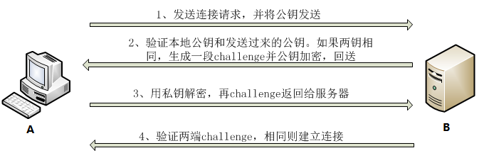

# linux下的一些命令操作

## 解压命令tar

在[Linux系统](https://so.csdn.net/so/search?q=Linux系统&spm=1001.2101.3001.7020)中，`tar`[命令](https://so.csdn.net/so/search?q=命令&spm=1001.2101.3001.7020)用于创建、查看、提取和解压 tar 存档文件。以下是 `tar` 命令的一些常见用法：

### 压缩文件或目录

选项说明：

- `-c`: 创建新的归档文件
- `-z`: 使用 gzip 格式压缩/解压缩
- `-j`: 使用 bzip2 格式压缩/解压缩
- `-J`: 使用 xz 格式压缩/解压缩
- `-v`: 显示详细信息
- `-f`: 指定归档文件名

```
tar -czvf archive.tar.gz /path/to/directory # 压缩目录为 .tar.gz 格式的文件
 
tar -czvf archive.tar.gz file1 file2 file3 # 压缩多个文件为 .tar.gz 格式的文件
 
tar -cjvf archive.tar.bz2 /path/to/directory # 压缩目录为 .tar.bz2 格式的文件
 
tar -cjvf archive.tar.bz2 file1 file2 file3 # 压缩多个文件为 .tar.bz2 格式的文件
 
tar -cJvf archive.tar.xz /path/to/directory # 压缩目录为 .tar.xz 格式的文件
 
tar -cJvf archive.tar.xz file1 file2 file3 # 压缩多个文件为 .tar.xz 格式的文件
```

### 解压文件

选项说明：

- `-x`: 提取文件
- `-z`: 解压 gzip 格式
- `-j`: 解压 bzip2 格式
- `-J`: 解压 xz 格式
- `-v`: 显示详细信息
- `-f`: 指定要解压的文件名

```
tar -xzvf archive.tar.gz # 解压 .tar.gz 格式的文件
 
tar -xjvf archive.tar.bz2 # 解压 .tar.bz2 格式的文件
 
tar -xJvf archive.tar.xz # 解压 .tar.xz 格式的文件
 
tar -xvf archive.tar # 解压 .tar 格式的文件
```


### 查看归档文件内容

选项说明：

- `-t`: 列出归档文件内容

```
tar -tvf archive.tar.gz # 查看 .tar.gz 归档文件内容
 
tar -tvf archive.tar.bz2 # 查看 .tar.bz2 归档文件内容
 
tar -tvf archive.tar.xz # 查看 .tar.xz 归档文件内容
 
tar -tvf archive.tar # 查看 .tar 归档文件内容
```

## 复制命令cp


- 路径以斜杆“/”开头，则第一个斜杆表示根，路径中的其他斜杆只是分隔符
- .：表示当前目录。例如，./file.txt表示当前目录中的文件。
- ..：表示上一级目录。例如，../parent_directory/file.txt表示上一级目录中的文件。
- 目录名：表示当前目录中的子目录。例如，subdir/file.txt表示当前目录下的子目录中的文件。

```
-r：递归复制目录机器内容
-f：强制复制
-a：以归档模式复制，等同于 -dR --preserve=all，保留文件属性（包括符号链接、文件权限、时间戳等）
-i：在覆盖文件之前进行确认
-u：仅当源文件比目标文件新或目标文件不存在时才复制
-v：在复制时显示详细信息
-n：不覆盖已有文件
-p：保留文件属性（权限、时间戳等）
```


### 复制单个文件

- cp 源文件 目标目录
- cp 源文件 目标目录/新文件名

## rm命令

```
1、删除文件
	rm filename # 删除单个文件名
	rm -f test.* # 批量删除文件，且是强制删除
2、删除文件夹
	rmdir dirname # 删除空的文件夹
	rm -rf dirname # 删除非空文件夹，-r是循环在dirname中删除文件
```


## sudo命令

Linux sudo命令以系统管理者的身份执行指令，也就是说，经由 sudo 所执行的指令就好像是 root 亲自执行。

```
1、安装包/移除包
	安装包：
        sudo apt install 包名
        包名 --version #查看安装的包名
     移除包TODO：
     	sudo apt remove pagename
2、查看全部已经安装的包
	sudo apt list --installed
	该命令单独使用无太大意义，经常和grep命令联合使用如：
		sudo apt list --installed | grep aarch64 #表示从所有安装的包中过滤出包名带有aarch64的包
	sudo dpkg -l | grep pagename
		也可看含有pagename的包
3、查看指定目录下的所有文件路径
	sudo find 指定目录地址（绝对地址） #输出该目录地址下的所有文件路径
	该命令单独使用无太大意义，经常和grep命令联合使用如：
		sudo find / | grep aarch64-linux-gnu-gcc #表示从根目录开始过滤出所有带有aarch64-linux-gnu-gcc的文件路径
	举例：
        rlk@rlk:~$ sudo find / | grep aarch64-linux-gnu-gcc
        /home/rlk/tools/gcc-linaro-5.5.0-2017.10-x86_64_aarch64-linux-gnu/share/man/man1/aarch64-linux-gnu-gcc.1
        /home/rlk/tools/gcc-linaro-5.5.0-2017.10-x86_64_aarch64-linux-gnu/bin/aarch64-linux-gnu-gcc-ranlib
        /home/rlk/tools/gcc-linaro-5.5.0-2017.10-x86_64_aarch64-linux-gnu/bin/aarch64-linux-gnu-gcc-ar
        ... ...

		
```


## cat命令

```
1、查看一个文本文件的内容
    cat 文件名
2、将几个文本文件的内容串接在一起输出到某文件或者显示到终端
    1、显示到终端：cat 文件1 文件2
    2、输出到文件：cat 文件1 文件2  > 文件名
3、新建一个文件
    1、以EOF为结束标志   ：cat > 文件名 <<EOF
    2、以eof为结束标志   ：cat > 文件名 <<eof
    3、以ctrl+z为结束标志：cat > 文件名
```

## echo命令

1、查看环境变量的值

linux中常用的环境变量：

- PATH：决定了系统在哪些目录中查找可执行文件。当你输入一个命令时，系统会在PATH中定义的目录中查找该命令的可执行文件。
- HOME：指定当前用户的主目录路径。

- USER：当前用户的用户名。

- SHELL：指定当前用户默认使用的shell。

- LANG：指定系统的默认语言。

- LD_LIBRARY_PATH：指定系统在哪些目录中查找共享库文件。

- TERM：指定当前终端的类型。

- PS1：定义命令行提示符的格式。

- PS2：定义多行命令的提示符的格式。

```
echo $PATH # 查看PATH环境变量的值
```


## whereis命令

TODO

## ps命令

### ps和top的区别

```
ps命令只看到的是命令执行瞬间的进程信息,而top可以持续的监视。
ps只是查看进程,而top还可以监视系统性能,如平均负载,cpu和内存的消耗。
另外top还可以操作进程,如改变优先级(命令r)和关闭进程(命令k)
```

1. **`-e`** 或 **`-A`**：显示所有进程。

   bash

   复制

   ```
   ps -e
   ```

2. **`-f`**：以完整格式显示进程信息。

   bash

   复制

   ```
   ps -ef
   ```

3. **`-u`**：显示特定用户的进程。

   bash

   复制

   ```
   ps -u username
   ```

4. **`-aux`**：显示所有用户的进程，常用于查看进程的详细信息。

   bash

   复制

   ```
   ps aux
   ```

5. **`--sort`**：根据指定字段排序。例如，按内存使用量排序：

   bash

   复制

   ```
   ps aux --sort=-%mem
   ```

6. **`-o`**：自定义输出格式。例如，只显示 PID 和命令名称：

   bash

   复制

   ```
   ps -eo pid,comm
   ```

## ls命令

## export命令

添加指定环境变量（临时，shell关闭后就会消失）

```
export PATH=/.../.../bin:$PATH
```

可通过以下方法永久添加系统环境变量（需要root权限，针对所用用户，永久生效）

```
sudo passwd root # 输入当前用户密码
su # 进入root用户
# 以下添加环境变量
vim /etc/profile
export PATH="/opt/STM/STLinux-2.3/devkit/sh4/bin:$PATH"
# 和./etc/profile类似都是执行文件profile中的语句
source /etc/profile
```

## fdisk命令

用于显示磁盘分区

一般用fdisk -lu显示所有磁盘分区（-u表示为units）

```
使用sudo fdisk /dev/sda进入sda设备进行操作
	常用如下：
		-m（帮助）、-n（新建分区）、-d（删除分区）、-w（保存修改）、-q（退出不保存）
通过fdisk对磁盘分区后，需要格式化、挂载到系统中才能使用
	sudo mkfs.ext4 /dev/sdb1 #格式化为ext4格式
	sudo mkdir /oracle、sudo mount /dev/sdb1 /oracle # 挂载到/oracle下
通过df命令查看分区挂载情况
	df -h
```


## dd命令

dd命令的基本语法如下：

dd if=<输入文件> of=<输出文件> [选项]
1
在这里，if代表输入文件，of代表输出文件。

Linux dd命令的常用选项或参数说明
以下是dd命令的一些常用选项：

选项	描述
if	输入文件
of	输出文件
bs	设置每次读写的字节数（块大小）
count	设置写入的块数

### 使用dd命令备份磁盘数据

```
#在linux中,/dev/zero是特殊的设备文件，提供无限的零字节流
status=progress&&sync
	progress:显示烧录进展
	sync:将每个输入块填充到 ibs 个字节，不足部分用空（NUL）字符补齐,确保所有的写入缓存都被刷新到磁盘上，确保数据完整性。

查看磁盘分区，确定要备份的磁盘
	fdisk -lu
使用dd命令备份磁盘
	dd if=/dev/sda of=/dev/sdb status=progress
	dd if=/dev/sda of=~/sda_bak.img status=progress
	也可对img文件进行压缩
		dd if=/dev/sda | gzip > sda_bak.img.gz
获取磁盘数据
	gzip -dc /sda_bak.img.gz | dd of=/dev/sda status=progress
```

### 使用dd命令制作启动盘

```
1. 插入U盘并确保其已经被正确挂载，可以使用以下命令查看已经挂载的设备：
	df -h
2. 使用以下命令卸载U盘，确保它不被任何程序使用：
	umount /dev/sdX
   	注意，其中的`/dev/sdX`是U盘的设备名称，具体名称可能是sda、sdb等，可以用`df -h`命令查看。
3. 使用以下命令制作U盘启动盘，其中`/path/to/iso`是ISO文件的路径，`/dev/sdX`是U盘的设备名称：
	sudo dd if=/path/to/iso of=/dev/sdX bs=4M status=progress && sync
   	注意，这个命令会把整个U盘格式化，其中的所有数据都将被清空，请务必在执行前备份重要数据。
4. 制作完成后，使用以下命令卸载U盘：
	sudo umount /dev/sdX
```


### dd和cp的区别

区别一如图，只会覆盖指定大小的空间，区别二则是dd是对块操作，而cp是对文件操作


## mount\unmount命令

 mount将新的文件系统关联至当前根文件系统，直接输入mount显示当前已挂载的文件系统。

   umount将某文件系统与当前根文件系统的关联关系予以移除;

```
1．命令格式：

mount:挂载

 格式： mount 设备 挂载点    Usage: mount /dev/sda5 /mnt/test

        设备：

            设备文件：/dev/sda5

             卷标：LABEL=""

              UUID：UUID=""

         挂载点：目录

             要求：

                 1、此目录没有被其他进程使用；

                 2、目录得事先存在；

                 3、目录中的原有的文件将会暂时隐藏；

  挂载完成后，要通过挂载点访问对应文件系统上的文件。

直接输入mount：显示当前系统已经挂载的设备及挂载点；


[root@xuelinux test]# mount

/dev/sda2 on / type ext4 (rw)

proc on /proc type proc (rw)

sysfs on /sys type sysfs (rw)

devpts on /dev/pts type devpts (rw,gid=5,mode=620)

tmpfs on /dev/shm type tmpfs (rw,rootcontext="system_u:object_r:tmpfs_t:s0")

/dev/sda1 on /boot type ext4 (rw)

/dev/sda3 on /home type ext4 (rw)

/dev/sda7 on /tmp type ext4 (rw)

/dev/sda5 on /usr type ext4 (rw)

none on /proc/sys/fs/binfmt_misc type binfmt_misc (rw)

---------------------------------------------------------------------------------------
umount：卸载某文件系统

 格式： umount 设备  或者  umount 挂载点  Usage: umount /dev/sda5 或者 umount /mnt/test

    卸载注意事项：

           挂载的设备没有进程使用；否则无法卸载。


2．命令功能：

mount将新的文件系统挂载关联至当前根文件系统,或者显示当前已经挂载的文件系统

umount将某文件系统与当前根文件系统的关联关系予以移除;

3．命令参数：

mount [options] [-o options] device mount_point

      -a：表示挂载/etc/fstab文件中定义的所有文件系统

      -n：默认情况下，mount命令每挂载一个设备，都会把挂载的设备信息保存至/etc/mtab

          文件；使用-n选项意味着挂载设备时，不把信息写入此文件；

      -t FSTYPE(文件类型)：指定正在挂载设备上的文件系统的类型；不使用此选项时，mount会

                           调用blkid命令获取对应文件系统的类型；

      -r：只读挂载

      -w：读写挂载，如果挂载的设备不支持写操作，直接挂载为读。

      -o：指定额外的挂载选项，也即指定文件系统启用的属性。

           remount：重新挂载当前文件系统

            ro：挂载为只读

            rw：挂载为读写

            nosuid：禁止设置suid

            loop：挂载本地回环设备


4．命令实例：
    1、mount /dev/sda5 /mnt/test
    2、mount -o remount,ro /dev/sda5 重新挂载并挂载为只读
```


## apt命令

### 1.1常识

软件包后缀
centos： *.rpm
Ubuntu *.deb

```javascript
源配置文件：
修改完源后需执行apt update
Ubuntu: /etc/apt/sources.list
清华大学: https://mirrors.tuna.tsinghua.edu.cn/help/ubuntu/
阿里云开源镜像站: https://developer.aliyun.com/mirror/ubuntu?spm=a2c6h.13651102.0.0.3e221b118zsOVM


网卡配置文件:
Ubuntu:  /etc/netplan/00-installer-config.yaml
```

### 1.2 apt软件包管理

#### 1.2.1 安装软件包

```ruby
root@ubuntu-06:/etc/apt# apt install vim
Reading package lists... Done
Building dependency tree       
Reading state information... Done
vim is already the newest version (2:8.0.1453-1ubuntu1.8).
vim set to manually installed.
0 upgraded, 0 newly installed, 0 to remove and 0 not upgraded.
```

#### 1.2.2 移除软件包

```perl
root@ubuntu-06:/etc/apt# apt remove curl -y
Reading package lists... Done
Building dependency tree       
Reading state information... Done
The following package was automatically installed and is no longer required:
  libcurl4
Use 'apt autoremove' to remove it.
The following packages will be REMOVED:
  curl pollinate ubuntu-server
0 upgraded, 0 newly installed, 3 to remove and 0 not upgraded.
After this operation, 500 kB disk space will be freed.
(Reading database ... 67415 files and directories currently installed.)
Removing ubuntu-server (1.417.5) ...
Removing pollinate (4.33-0ubuntu1~18.04.2) ...
Removing curl (7.58.0-2ubuntu3.19) ...
Processing triggers for man-db (2.8.3-2ubuntu0.1) ...
```

#### 1.2.3 移除软件包及配置文件

```ruby
root@ubuntu-06:/etc/apt# apt purge nginx
```

#### 1.2.4 刷新存储库

```ruby
root@ubuntu-06:/etc/apt# apt update
```

#### 1.2.5 升级所有可用软件包

```perl
apt upgrade
Reading package lists... Done
Building dependency tree       
Reading state information... Done
Calculating upgrade... Done
```

#### 1.2.6 自动删除不需要的包

```perl
root@ubuntu-06:~# apt autoremove
Reading package lists... Done
Building dependency tree       
Reading state information... Done
The following packages will be REMOVED:
```

#### 1.2.7 在升级软件包自动处理依赖关系

```ruby
root@ubuntu-06:~# apt full-upgrade 
```

#### 1.2.8 搜索应用

```ruby
root@ubuntu-06:~# apt search nginx
```

#### 1.2.9 显示安装细节

```makefile
root@ubuntu-06:~# apt show nginx
Package: nginx
Version: 1.14.0-0ubuntu1.11
Priority: optional
Section: web
Origin: Ubuntu
```

#### 1.2.10 列出所有包

```ruby
列出所有包
root@ubuntu-06:~# apt list
列出所有已安装的包
root@ubuntu-06:/etc# apt list --installed

列出所有可升级的包
root@ubuntu-06:/etc# apt list --upgradable 
```

#### 1.2.11 安装源中指定的所有版本

```scss
root@ubuntu-06:/etc# apt-cache madison nginx
nginx | 1.14.0-0ubuntu1.11 | http://mirrors.aliyun.com/ubuntu bionic-updates/main amd64 Packages
nginx | 1.14.0-0ubuntu1.11 | http://mirrors.aliyun.com/ubuntu bionic-security/main amd64 Packages
nginx | 1.14.0-0ubuntu1 | http://mirrors.aliyun.com/ubuntu bionic/main amd64 Packages

查看这个包有哪些依赖
root@ubuntu-06:/etc# apt-cache depends nginx
nginx
 |Depends: nginx-core
 |Depends: nginx-full
 |Depends: nginx-light
  Depends: nginx-extras
 |Depends: nginx-core
 |Depends: nginx-full
 |Depends: nginx-light
  Depends: nginx-extras
```

### 1.3 dpkg包管理

#### 1.3.1 安装软件包

```css
dpkg -i package.deb
```

#### 1.3.2 卸载软件包

```ruby
# 不建议、不自动卸载依赖它的包
root@ubuntu-06:~# dpkg -r package.deb

# 删除包（包括配置文件）
root@ubuntu-06:~# dpkg -P package.deb
```

#### 1.3.3 使用dkpg查看软件包

```ruby
#列出当前已经按照的包，类似于rpm -qa
root@ubuntu-06:~# dpkg -l
```

#### 1.3.4 列出该包所包含的文件

```ruby
#列出该包所包含的文件，类似于rpm -ql
root@ubuntu-06:~# dpkg -L package
```

#### 1.3.5 查看文件所属的那个包

```bash
root@ubuntu-06:/etc# dpkg -S sshd
openssh-server: /etc/pam.d/sshd
vim-runtime: /usr/share/vim/vim80/syntax/sshdconfig.vim
openssh-server: /usr/share/openssh/sshd_config.md5sum
cloud-init: /etc/systemd/system/sshd-keygen@.service.d/disable-sshd-keygen-if-cloud-init-active.conf
cloud-init: /etc/systemd/system/sshd-keygen@.service.d
openssh-server: /usr/sbin/sshd
openssh-server: /usr/share/man/man5/sshd_config.5.gz
openssh-server: /usr/share/openssh/sshd_config
openssh-server: /usr/share/man/man8/sshd.8.gz
```

#### 1.3.6 列出deb包中的所有文件

```ruby
root@ubuntu-06:/etc#  dpkg -c xxx.deb
```


## gcc命令

### 1.1 gcc下默认文件扩展名


1. 预处理

   ```bash
   gcc -E string.c
   获得string.c预处理之后的文件string.i
   ```

   

2. 汇编语言

   ```bash
   gcc -S string.c
   #获得string.c汇编之后的文件string.s
   ```

   


### 1.2 gcc编译下默认头文件，库文件路径


### 1.3 静态链接库

```bash
1、生成静态链接库
	ar -rcs libstr.a string.o
	# 注意：ar命令只适用与目标文件，且库文件名称前缀为lib
2、使用静态链接库
	gcc -o test main.c libstr.a
	gcc -o test main.c -lstr
	gcc -o test main.c -L./ -lstr
```


### 1.4 动态链接库

```bash
1、生成动态链接库
	gcc -shared -fPIC -Wl, -soname, libstr.so, -o #libstr.so.1 string.c
2、使用动态链接库
	1、复制到系统的库目录中如/usr/lib或/usr/local/lib
		sudo cp libmylib.so /usr/lib/
		sudo ldconfig # 运行ldconfig命令,更新动态链接库的缓存，使系统能找到新的库文件
	2、ldconfig ~/lib # 暂时使得系统共享~/lib/下的库文件，若重新运行sudo ldconfig命令，则失效
3、动态链接库管理命令ldconfig
	1、自定义系统共享库
		1）/etc/ld.so.conf 文件中列出的目录下搜索可共享的动态链接库
		2）修改/etc/ld.so.conf文件指定库的路径
		3)修改后运行ldconfig目录更新库缓存
	
```


### 1.5 动态加载库（模块、插件核心）⭐⭐⭐

在 Linux 中，动态加载库（Dynamic Loading Libraries）是一种在程序运行时加载共享库的机制。这种方式与静态链接不同，静态链接是在编译时将库的代码直接嵌入到可执行文件中。动态加载库的主要优点是可以在运行时根据需要加载和卸载库，从而节省内存和提高灵活性。

#### 动态加载库的基本概念

1. **动态加载**: 动态加载允许程序在运行时加载共享库，而不是在启动时加载所有库。这使得程序可以根据需要加载特定功能的库。
2. **API 函数**: 在 C 语言中，动态加载库通常使用以下几个函数：
   - `dlopen()`: 打开一个动态库并返回一个句柄。
   - `dlsym()`: 根据符号名称查找库中的函数或变量。
   - `dlerror()`: 返回描述最后一个错误的字符串。
   - `dlclose()`: 关闭一个动态库。

#### 使用示例

以下是一个简单的示例，展示如何在 C 程序中动态加载库：

```c
#include <stdio.h>
#include <stdlib.h>
#include <dlfcn.h>

int main() {
    // 打开动态库
    void *handle = dlopen("libmylib.so", RTLD_LAZY);
    if (!handle) {
        fprintf(stderr, "%s\n", dlerror());
        exit(1);
    }

    // 清除之前的错误
    dlerror();

    // 查找符号
    void (*hello)() = dlsym(handle, "hello");
    const char *dlsym_error = dlerror();
    if (dlsym_error) {
        fprintf(stderr, "%s\n", dlsym_error);
        dlclose(handle);
        exit(1);
    }

    // 调用函数
    hello();

    // 关闭动态库
    dlclose(handle);
    return 0;
}
```

在这个示例中，程序首先使用 `dlopen()` 打开名为 `libmylib.so` 的动态库，然后使用 `dlsym()` 查找名为 `hello` 的函数，并最终调用该函数。

#### 动态加载库的优点

- **内存效率**: 只有在需要时才加载库，减少了内存占用。
- **灵活性**: 可以在运行时决定加载哪个库，支持插件架构。
- **版本管理**: 可以轻松替换库的实现而无需重新编译依赖于该库的程序。

动态加载库在许多应用程序中都非常有用，尤其是在需要插件或模块化设计的情况下。

------

Learn more:

1. [Linux C 动态库（.so）的生成和加载_c代码编译so库,显示没有头文件-CSDN博客](https://blog.csdn.net/wangqingchuan92/article/details/104478084)
2. [一文读懂Linux下动态链接库版本管理及查找加载方式 | IdeaWand](http://blog.ideawand.com/2020/02/15/how-does-linux-shared-library-versioning-works/)
3. [深入理解Linux动态库加载：路径、问题与解决方案-阿里云开发者社区](https://developer.aliyun.com/article/1466188)


### 1.6 GCC常用选项

在使用 `gcc` 编译器时，有一些重要的选项可以帮助您生成和使用动态加载库。以下是与动态库相关的常用 `gcc` 选项：

1. **-shared**: 该选项用于生成动态链接库（共享库）。使用此选项时，编译器会创建一个 `.so` 文件，而不是默认的可执行文件。例如：

   ```bash
   gcc -shared -fPIC -o libmylib.so mylib.c
   ```

2. **-fPIC**: 该选项用于生成位置无关代码（Position Independent Code），这是创建动态库所必需的。它确保生成的代码可以在内存中的任何位置运行。

3. **-L**: 该选项用于指定动态库的搜索路径。在链接时，编译器会在指定的目录中查找库文件。例如：

   ```bash
   gcc -o main main.c -L/usr/local/lib -lmylib
   ```

4. **-l**: 该选项用于链接库文件。您需要去掉库文件名前的 `lib` 和后缀 `.so`。例如，如果库文件名为 `libmylib.so`，则使用 `-lmylib`。

5. **-o** : 该选项用于指定输出文件的名称。默认情况下，`gcc` 会生成名为 `a.out` 的可执行文件。

6. **-Wl,-rpath,**: 该选项用于设置运行时库搜索路径，确保在运行时能够找到动态库。

通过合理使用这些选项，您可以轻松地创建和管理动态链接库，从而提高程序的灵活性和可维护性。

------

Learn more:

1. [使用gcc生成动态库及使用动态库的方法_gcc 动态库 集成-CSDN博客](https://blog.csdn.net/lzg_zone/article/details/83541906)
2. [GCC 指令详解及动态库、静态库的使用 - MElephant - 博客园](https://www.cnblogs.com/hyacinthLJP/p/16839524.html)
3. [GCC生成动态链接库（.so文件）：-shared和-fPIC选项 - 心田居士 - 博客园](https://www.cnblogs.com/liuzhenbo/p/11030946.html)


# linux的其他知识（常识）

快捷键的使用：ctrl + alt + t快速打开一个shell

## 特殊符号使用

- $
  - $ 变量 # 表示取变量的值，常常与echo连着使用

## linux进入root的方法

首先打开终端（Ctrl+Alt+T）


 

在这里解释一下bwj@ubuntu:~$这句话的含义：

[](javascript:void(0);)

```
bwj是用户名，也就是你自己起的名字。

@是分割的符号

ubuntu是主机名，也就是你所使用的机器的名称

~是当前目录，"~"表示根目录

$是提示符，当进入root时，会变成#
```

[](javascript:void(0);)

现在开始介绍**第一种方法：sudo（暂时的）**

如果是使用root权限而不是直接进入，那么sudo + <指令> 即可。如：sudo chmod 777 /etc/sudoers。（这是最常用且推荐的方式）　　


输入sudo后显示了可以输入的指令

[](javascript:void(0);)

```
sudo 
-b：在后台执行指令
-h：帮助
-H：将HOME环境变量设为新身份的HOME环境变量
-k：结束密码的有效期限，即下次再执行sudo时需要输入密码
-l：列出目前用户可执行与无法执行的指令
-p：改变询问密码的提示符号
-s<shell>：执行指定的shell
-u<用户>：以指定的用户作为新的身份
-v：延长密码有效期限5分钟
-V ：显示版本信息
```

[](javascript:void(0);)

 

这里我们输入sudo -i，再输入你的用户密码，就会进入root模式了。

但是这个方法持续的时间只有五分钟，想要延长时间可以用sudo -v再延长五分钟。

**第二种方法：root（非暂时的）**
直接sudo su切换到root用户

输入sudo passwd root （注意passwd的拼写），再输入用户密码，接下来会让你设置root密码，并再次确认。          

 

接下来输入su，再输入刚刚设置的root密码就可以进入root了。


 

 之后想要退出输入exit即可。

## dpkg和rpm常识

dpkg和rpm是不同的系统包管理工具

- dpkg：Debian、Ubuntu
- rpm：Redhat、Centos、Fedora

RPM与DPKG只能做到检查相依性，在安装或移除时告知相依性的不满足，皆下来就需要使用者自行去找出所需的套件来安装。 这样的确是有点不方便，因此产生了前端工具软体- APT及YUM。

- apt：一般与dpkg联系，是在dpkg外套了壳子，真正的安装，修改，删除，其实都是dpkg完成的
  - apt-get和apt不同，推荐一律使用apt命令
  - apt update和apt upgrade的区别：
    - apt update是更新包数据库（只包含包的最新版本、仓库、依赖等）
    - apt upgrade是将目前系统使用的包版本更新为包数据库中最新的版本
- yum：一般与rpm联系

## gcc预处理、编译、汇编、链接

注意：不像 Windows，[Linux](https://docs.oldtimes.me/c.biancheng.net/linux_tutorial/index.html) 不以文件后缀来区分可执行文件，Linux 下的可执行文件后缀理论上可以是任意的，这里的`.out`只是用来表明它是 GCC 的输出文件。不管源文件的名字是什么，GCC 生成的可执行文件的默认名字始终是`a.out`。 **Linux 下可执行文件的后缀仅仅是一种形式上的（表面上的），所以可执行文件也可以不带后缀**

- 预处理（生成.i），编译（生成.s），汇编（生成.o），链接（将.o文件链接成一个可执行程序文件）
- 注意：gcc 编译选项会区分大小写。因此`-o`选项和`-O`选项的效果是不一样的。前者表示源文件编译成为可执行文件，后者表示将源文件编译成为可执行文件并且进行一级优化。
- `-E` ：仅执行预处理（不要编译、汇编或链接）。
- `-S` ：只编译（不汇编或链接）。
- `-c` ：编译和汇编，但不链接。
- `-o <file>` ：指定输出文件，若不指定输出文件则只会将处理后的信息输出到shell上不会形成一个文件
- `-L[dir]`：指定-l（小写-L）所使用到的库文件所在路径
  - `-l[lib]`：（这里是小写的L，命令无中括号，下同）指定程序要链接的库，[lib]为库文件名称。如果gcc编译选项中加入了“-static”表示寻找静态库文件
- `-g`：生成调试信息，方便gdb调试

```
基本语法：gcc [options] [infilenames] -o [outfilenames]
1、生成可执行程序
	gcc filename # 默认生成可执行文件名为a.out的文件
	gcc infilename -o outfilename # 指定生成的可执行文件名位置和文件名
	通过./filename执行可执行文件
2、预处理 gcc -E main.c -o main.i
3、编译 gcc -S main.i -o main.s
4、汇编 gcc -c main.s -o main.o
5、链接 gcc main.c -static -L. -lfunc -o main

直接通过gcc main.c -o main得到对应的可执行文件
```

## linux下一些目录作用

```
1、/ 根目录 --------- 所有目录挂在其下

2、/boot　--------- 存放Ubuntu内核和系统启动文件。系统启动时这些文件先被装载。

3、/etc　--------- 系统的配置文件目录。密码文件、设置网卡信息、环境变量的设置等都在此目录中，许多网络配置文件也在其中。

4、/lib   --------- 根文件系统目录下程序和核心模块的共享库。这个目录里存放着系统最基本的动态链接共享库，类似于Windows下的system32目录，几乎所有的应用程序都需要用到这些共享库。

5、/media   --------- 主要用于挂载多媒体设备。ubuntu系统自动挂载的光驱、usb设备，存放临时读入的文件。

6、/proc   --------- 这个目录是系统内存的映射，我们可以直接访问这个目录来获取系统信息。也就是说，这个目录的内容不在硬盘上而是在内存里。

7、/sbin 　    --------- s就是Super User的意思，这里存放的是系统管理员使用的系统管理程序，如系统管理、目录查询等关键命令文件。

8、/tmp         --------- 这个目录是用来存放一些临时文件的，所有用户对此目录都有读写权限。

9、/home　   --------- 用户的主目录。下面是自己定义的用户名的文件夹。每个用户的设置文件，用户的桌面文件夹，还有用户的数据都放在这里。

10、/mnt  　 --------- 此目录主要是作为挂载点使用。通常包括系统引导后被挂载的文件系统的挂载点。如挂载Windows下的某个分区。
```

## linux中文件后缀

```
1、.ko文件是kernel object文件（内核模块），该文件的意义就是把内核的一些功能移动到内核外边， 需要的时候插入内核，不需要时卸载。
	装入内核模块：inmod modename
	卸载内核模块: rmmod modename
	查看已经装入的模块信息: lsmode
```


# 一些运维操作（git）
![[Pasted image 20241204102953.png]]

# 在linux中使用vim

# makefile是什么

# Linux中使用GDB调试程序

常见命令：

- list（l）：列出源代码，从上次的位置往下列10行
  - list 行号、list 函数名、list -从上次调用list命令往前的10行程序代码
- break（b） [行号|函数名]：
  - info breakpoints # 查看当前设置了哪些断点，断点编号
  - disable breakpoints [断点编号|没有该参数表示全部禁用] # 可用disable
  - enable breakpoints [断点编号|没有该参数表示全部启用] # 可用enable
  - delete breakpoints [断点编号|没有该参数表示全部删除] # 可用delete
- run（r）：
- 调试手段
  - print（p）：打印表达式的值
  - step（s）：下一步（有函数会进入函数）
  - nest（n）：下一条语句（不会进入函数）
  - continue（c）：执行到下一个断点


# gcc版本控制

```
sudo apt install gcc-7 g++-7   #安装指定版本的gcc与g++，一般会出错，默认源一般不包含较老版本gcc，g++程序
1、向源仓库中添加地址
sudo add-apt-repository ppa:ubuntu-toolchain-r/test 
add-apt-repository:表示向apt源仓库添加（/etc/apt/source.list.d文件）
ppa:个人存档包（非官方的软件源）
ubuntu-toolchain-r/test：维护ppa的团队名称，test是具体名称
```

# 前台与后台进程切换

```
通过jobs查看后台进程
将前台进程切换后台
	ctrl + z、&
将后台进程切换前台
	fg%number
运行/停止后台进程
	运行后台进程：bg%number、kill -18 pid/%number
	暂停后台进程：kill -19 pid/%number
	
```

# tftp服务器

```
1、安装包
	sudo apt install tftp-hpa # 客户端包
	sudo apt install tftpd-hpa # 服务端包（d--daemon）
2、创建tftp目录
	sudo mkdir ~/tftp-server
	sudo chmode 777 tftp-server -R
3、修改配置文件
	sudo nano /etc/default/tftpd-hpa
	修改以下参数：
		tftp_directory="~/tftp-server"
		tftp_options="-l -c -s"
			-l log启动日志
			-c create运行客户端创建不存在的文件
			-s secure指定tftp_directory为根目录，保证了安全性
4、sudo service tftpd-hpa restart
5、客户端使用tftp
	tftp <server_ip>
	get、put
```

# ssh服务器

## ssh公钥和私钥原理

主要有两种登录方式：第一种为密码口令登录，第二种为公钥登录

#### 一、密码登录

整个过程是这样的：

（1）远程主机收到用户的登录请求，把自己的公钥发给用户。

（2）用户使用这个公钥，将登录密码加密后，发送到远程主机。（客户端输入密码的过程）

（3）远程主机用自己的私钥，解密登录密码，如果密码正确，就同意用户登录。

　　这个过程本身是安全的，但是实施的时候存在一个风险：如果有人截获了登录请求，然后冒充远程主机，将伪造的公钥发给用户，那么用户很难辨别真伪。因为不像https协议，SSH协议的公钥是没有证书中心（CA）公证的，也就是说，都是自己签发的。

如果你是第一次登录对方主机，系统会出现下面的提示：

```
　$ ``ssh` `user@host` `The authenticity of host ``'host (12.18.429.21)'` `can't be established.` `RSA key fingerprint is 98:2e:d7:e0:de:9f:ac:67:28:c2:42:2d:37:16:58:4d.` `Are you sure you want to ``continue` `connecting (``yes``/no``)?
```

这段话的意思是，无法确认host主机的真实性，只知道它的公钥指纹，问你还想继续连接吗？

所谓"公钥指纹"，是指公钥长度较长（这里采用RSA算法，长达1024位），很难比对，所以对其进行MD5计算，将它变成一个128位的指纹。上例中是98:2e:d7:e0:de:9f:ac:67:28:c2:42:2d:37:16:58:4d，再进行比较，就容易多了。

很自然的一个问题就是，用户怎么知道远程主机的公钥指纹应该是多少？回答是没有好办法，远程主机必须在自己的网站上贴出公钥指纹，以便用户自行核对。

假定经过风险衡量以后，用户决定接受这个远程主机的公钥。

当远程主机的公钥被接受以后，它就会被保存在文件$HOME/.ssh/known_hosts之中。下次再连接这台主机，系统就会认出它的公钥已经保存在本地了，从而跳过警告部分，直接提示输入密码。

每个SSH用户都有自己的known_hosts文件，此外系统也有一个这样的文件，通常是/etc/ssh/ssh_known_hosts，保存一些对所有用户都可信赖的远程主机的公钥。

#### 二、公钥登录

　　公钥登录是为了解决每次登录服务器都要输入密码的问题，流行使用RSA加密方案，主要流程包含：

　　　　1、客户端生成RSA公钥和私钥

　　　　2、客户端将自己的公钥存放到服务器

　　　　3、客户端请求连接服务器，服务器将一个随机字符串发送给客户端

　　　　4、客户端根据自己的私钥加密这个随机字符串之后再发送给服务器

　　　　5、服务器接受到加密后的字符串之后用公钥解密，如果正确就让客户端登录，否则拒绝。这样就不用使用密码了。

　　

　　**公钥和私钥：**

1. 一个公钥对应一个私钥。
2. 密钥对中，让大家都知道的是公钥，不告诉大家，只有自己知道的，是私钥。
3. 如果用其中一个密钥加密数据，则只有对应的那个密钥才可以解密。
4. 如果用其中一个密钥可以进行解密数据，则该数据必然是对应的那个密钥进行的加密。

　　 RSA算法的作用：**
**　　**1、加密：公钥加密私钥解密**

　　**主要用于将数据资料加密不被其他人非法获取，保证数据安全性。**使用公钥将数据资料加密，只有私钥可以解密。即使密文在网络上被第三方获取由于没有私钥则无法解密。从而保证数据安全性。　　　　　

1. 1. A在自己电脑上生成RSA钥匙文件，一个私钥文件一个公钥文件，并将他的公钥传送给B。
   2. 此时B要传送信息给A，于是B用A的公钥加密他的消息，然后传送给A。【网络上传输的密文，没有A的私钥无法解密，其他人获取之后也没用】
   3. A用他的私钥解密B的消息。

　　**2、认证：私钥加密公钥解密**

　　　 **主要用于身份验证，判断某个身份的真实性。**使用私钥加密之后，用对应的公钥解密从而验证身份真实性。

　　　　 A要验证B是否是真实用户

　　　　1、B将自己公钥给A

​       2、B将文件用自己私钥加密传送给A

　　　　3、A根据B的公钥解密，如果成功则为真实身份用户

   SSH公钥登录则用的是第二种功能。

   安全性： 这种算法非常[可靠](http://en.wikipedia.org/wiki/RSA_Factoring_Challenge)，密钥越长，它就越难破解。根据已经披露的文献，目前被破解的最长RSA密钥是768个二进制位。也就是说，长度超过768位的密钥，还无法破解（至少没人公开宣布）。因此可以认为，1024位的RSA密钥基本安全，2048位的密钥极其安全。所以我们在用ssh-keygen命令时候要注意密钥长度，具体参数为：

```
-b bits
   指定密钥长度。对于RSA密钥，最小要求768位，默认是2048位。DSA密钥必须恰好是1024位(FIPS 186-2 标准的要求)。
```

 至少不能少于768。一般不用写默认就是2048了。哈哈！

   总结：

　公钥与私钥使用场景：
　(1)私钥用来进行解密和签名，是给自己用的。
　(2)公钥由本人公开，用于加密和验证签名，是给别人用的。
  (3)当该用户发送文件时，用私钥签名，别人用他给的公钥验证签名，可以保证该信息是由他发送的。当该用户接受文件时，别人用他的公钥加密，他用私钥解密，可以保证该信息只能由他接收到。

注意：ssh 和 https 协议的区别，ssh 没有CA认证中心的说法

## ssh应用

```
1、scp用于传输文件
	scp <文件名> username@ipaddr:save_file_to_path
2、ssh连接
	安装ssh客户端或者服务端
        sudo apt-get install openssh-client 
        sudo apt-get install openssh-server 
    启动ssh服务端
    	sudo systemctl start ssh
    	sudo systemctl enable ssh # 开机自启
    连接ssh
    	ssh username@ipaddr
```


# 守护线程的实现

### 僵尸进程、孤儿进程和守护进程

```
僵尸进程：子进程退出，父进程一直在运行
孤儿进程：子进程运行，父进程退出
守护进程：子进程一直运行，父进程退出
```

### 守护进程实现

```c
1、自定义实现守护进程
#include <stdio.h>
#include <stdlib.h>
#include <string.h>
#include <time.h>
#include <unistd.h>
#include <sys/param.h>
#include <sys/types.h>
#include <sys/stat.h>
#include <fcntl.h>

// 守护进程初始化函数
void init_daemon()
{
    pid_t pid;
    int i = 0;

    if ((pid = fork()) == -1) {
        printf("Fork error !\n");
        exit(1);
    }
    if (pid != 0) {
        exit(0);        // 父进程退出
    }

    setsid();           // 子进程开启新会话，并成为会话首进程和组长进程
    if ((pid = fork()) == -1) {
        printf("Fork error !\n");
        exit(-1);
    }
    if (pid != 0) {
        exit(0);        // 结束第一子进程，第二子进程不再是会话首进程
    }
    chdir("/tmp");      // 改变工作目录
    umask(0);           // 重设文件掩码
    for (; i < getdtablesize(); ++i) {
       close(i);        // 关闭打开的文件描述符
    }

    return;
}

int main(int argc, char *argv[])
{
    int fp;
    time_t t;
    char buf[] = {"This is a daemon:  "};
    char *datetime;
    int len = 0;
    //printf("The NOFILE is: %d\n", NOFILE);
    //printf("The tablesize is: %d\n", getdtablesize());
    //printf("The pid is: %d\n", getpid());

    // 初始化 Daemon 进程
    init_daemon();

    // 每隔一分钟记录运行状态
    while (1) {
        if (-1 == (fp = open("/tmp/daemon.log", O_CREAT|O_WRONLY|O_APPEND, 0600))) {
          printf("Open file error !\n");
          exit(1);
        }
        len = strlen(buf);
        write(fp, buf, len);
        t = time(0);
        datetime = asctime(localtime(&t));
        len = strlen(datetime);
        write(fp, datetime, len);
        close(fp);
        sleep(60);
    }

    return 0;
}
--------------------------------------------------------------------------------------------------------------
2、用库函数daemon()实现守护进程
    #include <unistd.h>
    int daemon(int nochdir, int noclose);
    DESCRIPTION
           The daemon() function is for programs wishing to detach themselves from
           the controlling terminal and run in the background as system daemons.

           If nochdir is zero, daemon()  changes  the  process’s  current  working
           directory to the root directory ("/"); otherwise,

           If  noclose is zero, daemon() redirects standard input, standard output
           and standard error to /dev/null; otherwise,  no  changes  are  made  to
           these file descriptors.
    功能：创建一个守护进程
    参数：
    nochdir：=0将当前目录更改至“/”
    noclose：=0将标准输入、标准输出、标准错误重定向至“/dev/null”
    返回值
    成功：0
    失败：-1
               
               
#include <stdio.h>
#include <unistd.h>
#include <stdlib.h>
#include <time.h>
#include <fcntl.h>
#include <string.h>
#include <sys/stat.h>

int main(void)
{
    time_t t;
    int fd;
    if(daemon(0,0) == -1)
        ERR_EXIT("daemon error");
    while(1){
        fd = open("daemon.log",O_WRONLY|O_CREAT|O_APPEND,0644);
        if(fd == -1)
            ERR_EXIT("open error");
        t = time(0);
        char *buf = asctime(localtime(&t));
        write(fd,buf,strlen(buf));
        close(fd);
        sleep(60);

    }
    return 0;
}
```


# 协程的概念


把协程理解为用户级线程，即用户可以操作的线程，那么可以在协程IO阻塞时程序员进行异步操作操作