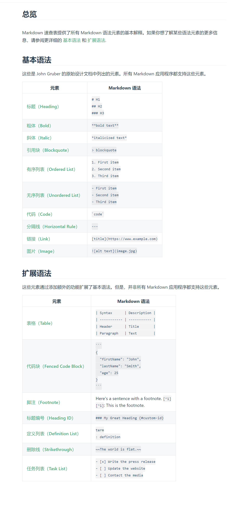

# 标题
```
# 
##
###
```
# 加粗/斜体
```
**加粗**
*斜体*
***加粗并斜体***
```
# 引用
```
>引用
>>引用
```
# 代码块
	代码块
	   ```
	   ```
# 有序/无序/定义/任务列表

1、有序列表
	1.
	2.
2、无序列表
	-.
	-.
3、定义列表
	任务
		:定义列表
		:定义列表
4、任务列表
	-[x]任务一
	-[]任务二
```
