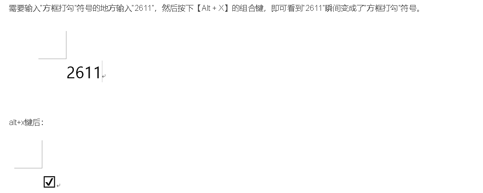

# Word方括号打勾☑

# 一、基础格式设置

## 1. 一级标题（标题 1）

- **字体**：黑体 / 宋体加粗，**14pt-18pt**（学术论文常用 14pt，商务文档可用 15pt，公文用 22pt）。

- **对齐方式**：居中（适用于章节标题）或左对齐（适用于条款类文档）。

- 段落间距

  ：

  - **学术场景**：段前 18pt、段后 13pt（约 2.5mm/1.8mm）。
  - **商务场景**：段前 / 后 6pt（约 0.8mm）。
  - **公文场景**：无段落间距。

- 编号

  ：

  - **学术**："第 1 章"（数字为 Times New Roman，中间空 1 字符）。
  - **商务**："1. 项目背景"（编号后接空格或点号）。
  - **公文**："一、"（全角中文数字，后接顿号）。

## 2. 二级标题（标题 2）

- **字体**：黑体 / 宋体，**12pt-16pt**（比一级标题小 2-4pt）。

- **对齐方式**：左对齐（默认）。

- **段落间距**：段前 / 后 6pt（或与正文间距一致）。

- 编号

  ：

  - **学术**："1.1 研究方法"（数字后接实心点）。
  - **商务**："1.1 项目目标"（编号与标题间空 1 字符）。
  - **公文**："（一）"（全角括号，无标点）。

## 3. 三级标题（标题 3）

- **字体**：宋体，**10.5pt-12pt**（与正文一致或略小），可加粗。

- **对齐方式**：左对齐，首行缩进 2 字符（或与正文对齐）。

- **段落间距**：与正文一致（如单倍行距）。

- 编号

  ：

  - **学术**："1.1.1 实验设计"（数字后接实心点）。
  - **商务**："1.1.1 任务分解"（编号后接空格）。
  - **公文**："1."（半角数字，后接实心点）。

## 4. 正文

- **字体**：宋体 / 仿宋，**10.5pt-12pt**（学术论文常用 12pt，公文用 16pt）。

- 段落格式

  ：

  - **行距**：1.5 倍行距（约 20pt）或固定值 28pt（公文）。
  - **缩进**：首行缩进 2 字符（约 7pt），段前 / 后 0 行。
  - **对齐**：两端对齐（默认）。

## 5. 磅值与传统字号对照

| 中文字号 | 磅值（pt） | 实际高度（mm） | 适用场景         |
| -------- | ---------- | -------------- | ---------------- |
| 初号     | 42         | 14.82          | 封面标题         |
| 小初     | 36         | 12.70          | 海报标题         |
| 一号     | 26         | 9.17           | 书籍章节目录     |
| 二号     | 22         | 7.76           | 公文一级标题     |
| 小二     | 18         | 6.35           | 学术论文一级标题 |
| 三号     | 16         | 5.64           | 公文正文         |
| 四号     | 14         | 4.94           | 学术论文正文     |
| 小四号   | 12         | 4.23           | 商务报告正文     |
| 五号     | 10.5       | 3.70           | 注释文本         |
| 六号     | 7.5        | 2.56           | 图表小字         |

# **语录：**

加上指标数据

- 一页PPT就讲一个内容
- 端边云是别人已经提出来的，IP核移植
- 成果1：

强调时间同步、文字太多

中船709学习项目3加入题目《》

**response:**

- 让审稿人能回忆起审稿的论文
- 

