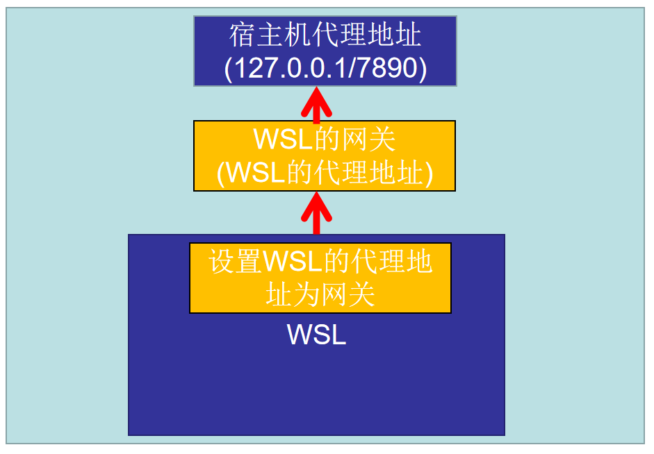
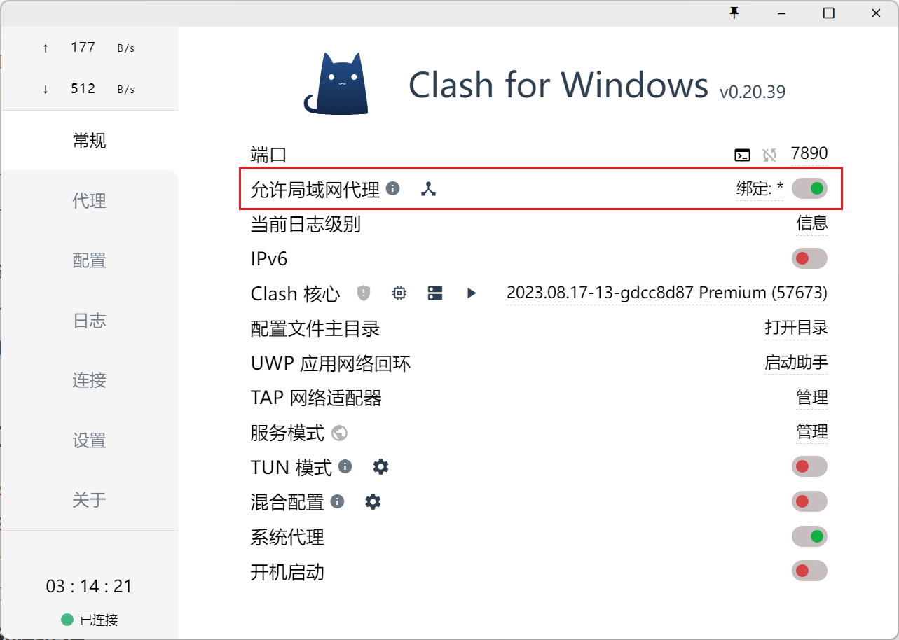
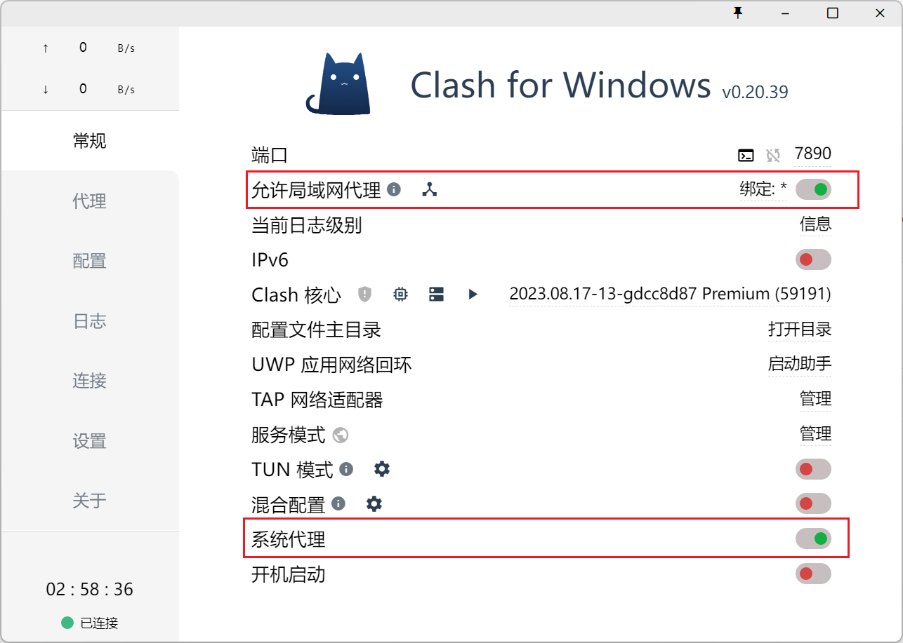

# WSL2

# 基础知识

# 安装WSL2

- **前置条件**

  - cpu虚拟化

  - 开启虚拟化平台、适用于linux的windows子系统、windows虚拟机监控程序平台

  - cmd进入管理员，在挂梯子的情况下使用以下命令下载安装wsl2

    ```linux
    wsl --install --web-download
    ```

- **常用命令**

  - 查看、新增、删除、修改默认wsl中存在的linux版本

    ```linux
    查看可安装的系统：wsl --list --online
    查看wsl中存在的系统：wsl --list -v
    在wsl中安装系统：wsl --install <OSname> --web-download
    设置wsl默认启动系统：wsl --set-default <OSname>
    删除wsl安装的系统：wsl --unregister <OSname>
    ```

  - 进入、退出

    ```
    wsl -d <OSname>
    exit
    ```

  - 镜像导出、导入

    ```
    wsl --export <OSname> <Export name>
    wsl --import <ubuntu2> <D:\wsl\> <D:\soft\ubuntu.tar>
    ```

    

# VScode/Cursor使用WSL环境


- 插件安装

  - Remote-WSL扩展、Remote Development扩展

    

- 左下角点击远程，选择wsl启动

  


### 在WSL中启动vscode/cursor

在WSL中输入以下命令安装vscode

```
code
```

在WSL中进入项目下，直接使用code .可打开文件

### 在vscode/cursor中连接WSL

1. 启动VS Code。
2. 按F1键，或者左下角的WSL按钮。选择 **Remote-WSL: New Window**打开一个新的窗口，或为特定发行版选择“**Remote-WSL: New Window using Distro**”。
3. 使用文件菜单打开您的文件夹。


# 解决WSL代理问题

**参考文献：**

- [Linux 命令行设置网络代理 - Mysticbinary - 博客园 (cnblogs.com)](https://www.cnblogs.com/mysticbinary/p/14522644.html#:~:text=通过在当前的终端窗口输入**proxy 、 noproxy **命令，就是打开 或 关闭代理。 注意：需要在每个终端窗口都打开一次。 HTTP,HTTP Proxy off 测试 如果用bash，可以直接上面命令的 ~%2F.zshrc 换成 ~%2F.bashrc。)

**问题描述：**

```
wsl: 检测到 localhost 代理配置，但未镜像到 WSL。NAT 模式下的 WSL 不支持 localhost 代理。
```

## 修改WSL网络模式为mirror

**解决方法：**

在win的/users/username/下添加.wslconfig文件，加入以下

```
[experimental]
autoMemoryReclaim=gradual  
networkingMode=mirrored  // 修改为镜像
dnsTunneling=true
firewall=true
autoProxy=true
```

之后在wsl中设置代理为本地

```
#sudo nano /etc/profile
	添加以下内容：
		export http_proxy="http://127.0.0.1:7890/"
        export https_proxy="http://127.0.0.1:7890/"
        export ftp_proxy="http://127.0.0.1:7890/"
#curl -I www.google.com 
```

如果需要通过proxy和noproxy开启关闭代理，可以通过以下命令编辑/etc/profile文件

```
#sudo nano /etc/profile
# wsl使用代理
# proxy开启代理noproxy关闭代理
proxy () {
        export http_proxy="http://127.0.0.1:7890/"
        export https_proxy="http://127.0.0.1:7890/"
        export ftp_proxy="http://127.0.0.1:7890/"
        echo "HTTP Proxy on"
}
noproxy () {
        unset http_proxy
        unset https_proxy
        unset ftp_proxy
        echo "HTTP Proxy off"
}
```

## 保持WSL网络模式为NAT

**参考文献：**

- 如何让Windows的代理作用于wsl2? - 解渴的回答 - 知乎https://www.zhihu.com/question/435906813/answer/3379440145
- 如何让Windows的代理作用于wsl2? - Doraemon的回答 - 知乎https://www.zhihu.com/question/435906813/answer/3019277074

**思路：**

- 在WSL中设置代理地址为网关地址
  - 需要开启自动生成resolv配置文件，用于生成dns
  - 然后手工设置网关

- 在win下设置代理软件clash允许局域网代理（IP地址填WSL的网关地址）

​	


**在WSL设置代理地址为网关地址**

```
#route -n可查看网关地址
#win下通过ipconfig也可查看WSL的网关地址
修改/etc/profile，代理地址写网关地址即可
```

**clash软件**




# 解决WSL在NAT下的ssh问题

**参考文献：**

- [windows下wsl2网络配置实现局域网机器直接访问wsl内linux系统服务_局域网访问wsl-CSDN博客](https://blog.csdn.net/visket2008/article/details/142822361)
- [WSL SSH 设置和开机启动 | HeyFE](https://blog.heyfe.org/blog/wsl-ssh-startup-set.html)
- [windows通过wsl2安装linux系统之Ubuntu，傻瓜式安装_wsl2 ubuntu-CSDN博客](https://blog.csdn.net/visket2008/article/details/142059132)

本地能通过ssh访问WSL，外部机器能通过ssh访问WSL

**思路：**

- 将本地端口与WSL的上的服务绑定，每次只需要通过宿主机的IP和端口即可连接WSL上的sshd

  - 这里是将宿主机的端口2222与WSL上的sshd服务（IP/PORT=2222）绑定

  - ```
    #listenport=外部宿主机端口
    #connectport=内部wsl虚拟机端口
    #connectaddress=执行wsl hostname -I 查看的非127.0.0.1的ip地址
    netsh interface portproxy add v4tov4 listenport=1521 listenaddress=0.0.0.0 connectport=3006 connectaddress=172.31.32.124
    ```


# ssh/wsl连接后copilot问题

## ssh连接后copilot问题

- 问题描述：copilot显示需要登陆，点击登录无反应

- 解决方法：在vscode中设置代理
  - [vscode copilot长时间没反应_vscode中copilot总是卡住-CSDN博客](https://blog.csdn.net/C_C666/article/details/131537804)
  - 需要宿主机开启clash代理软件
    - 


## wsl连接后copilot问题

- **问题描述：**copilot显示无网络连接
- **解决方法：关闭宿主机的系统代理（原理未知）**
  - 可以关闭后重新打开，原copilot还能用《奇葩的问题》


