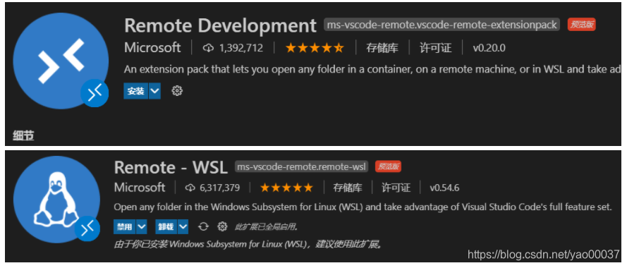
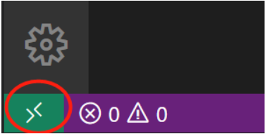

# WSL2

- **前置条件**

  - cpu虚拟化

  - 开启虚拟化平台、适用于linux的windows子系统、windows虚拟机监控程序平台

  - cmd进入管理员，在挂梯子的情况下使用以下命令下载安装wsl2

    ```linux
    wsl --install --web-download
    ```

- **常用命令**

  - 查看、新增、删除、修改默认wsl中存在的linux版本

    ```linux
    查看可安装的系统：wsl --list --online
    查看wsl中存在的系统：wsl --list -v
    在wsl中安装系统：wsl --install <OSname> --web-download
    设置wsl默认启动系统：wsl --set-default <OSname>
    删除wsl安装的系统：wsl --unregister <OSname>
    ```

  - 进入、退出

    ```
    wsl -d <OSname>
    exit
    ```

  - 镜像导出、导入

    ```
    wsl --export <OSname> <Export name>
    wsl --import <ubuntu2> <D:\wsl\> <D:\soft\ubuntu.tar>
    ```

    

# VScode/Cursor使用WSL环境


- 插件安装

  - Remote-WSL扩展、Remote Development扩展

    

- 左下角点击远程，选择wsl启动

  


### 在WSL中启动vscode/cursor

在WSL中输入以下命令安装vscode

```
code -install-extension ms-vscode-remote.remote-wsl
```

在WSL中进入项目下，直接使用code .可打开文件

### 在vscode/cursor中连接WSL

1. 启动VS Code。
2. 按F1键，或者左下角的WSL按钮。选择 **Remote-WSL: New Window**打开一个新的窗口，或为特定发行版选择“**Remote-WSL: New Window using Distro**”。
3. 使用文件菜单打开您的文件夹。


