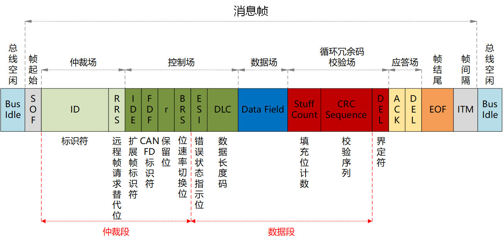
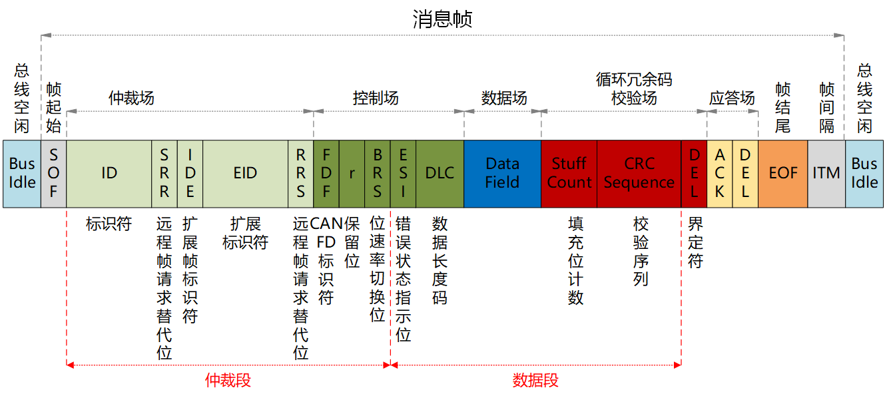
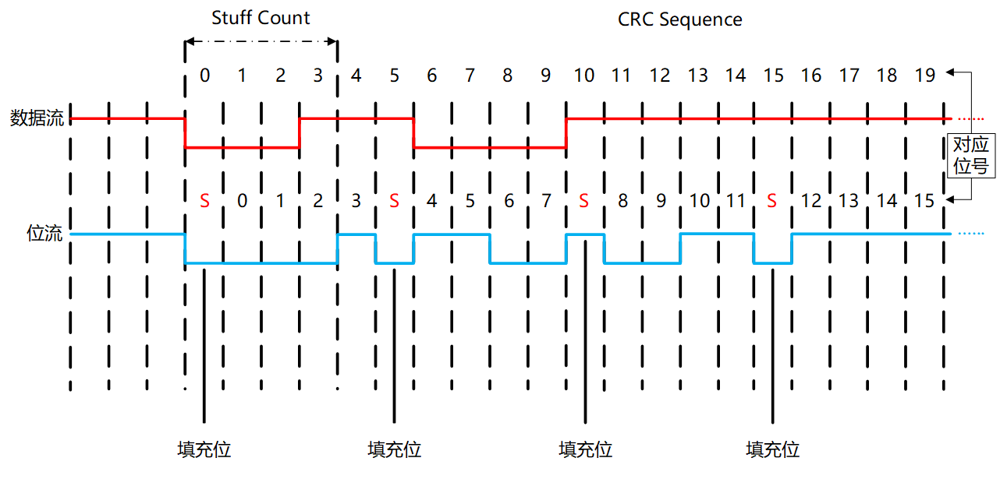
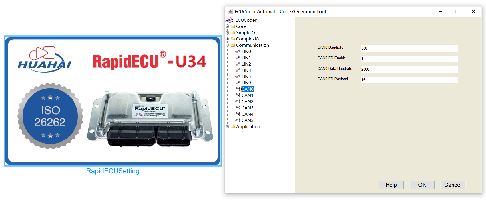
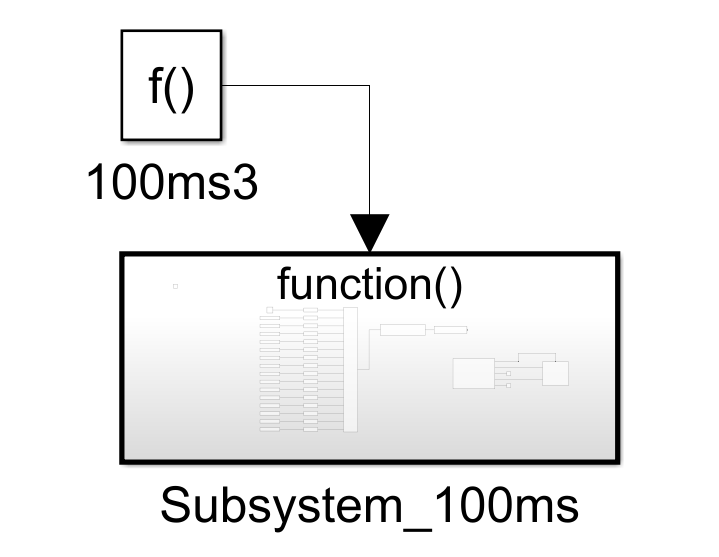
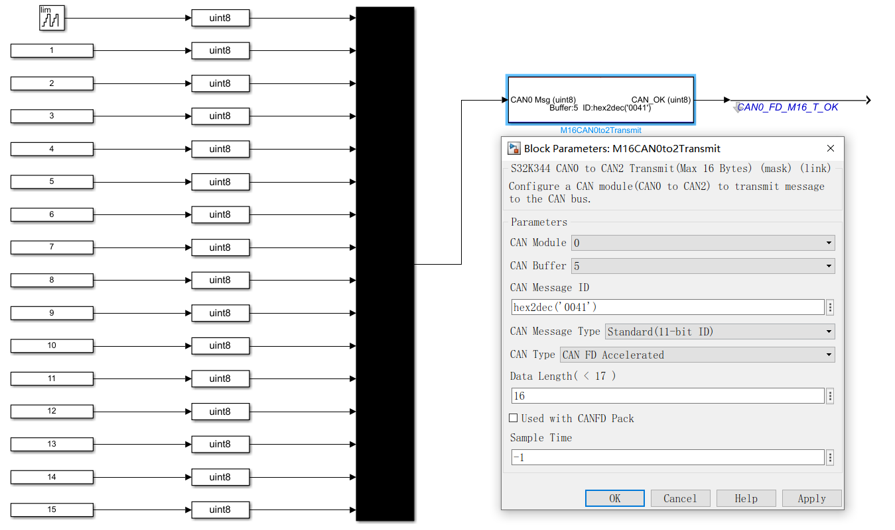
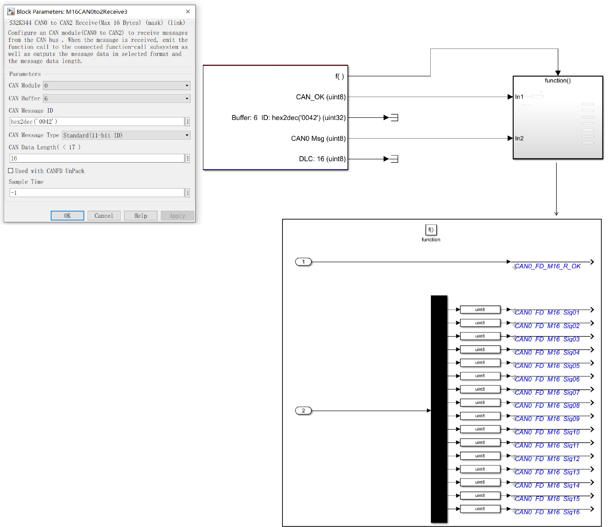
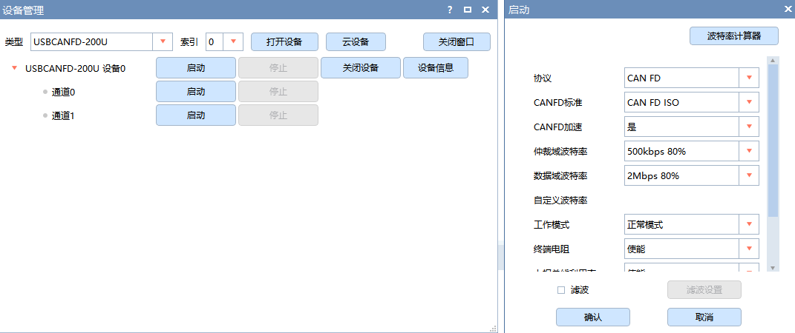
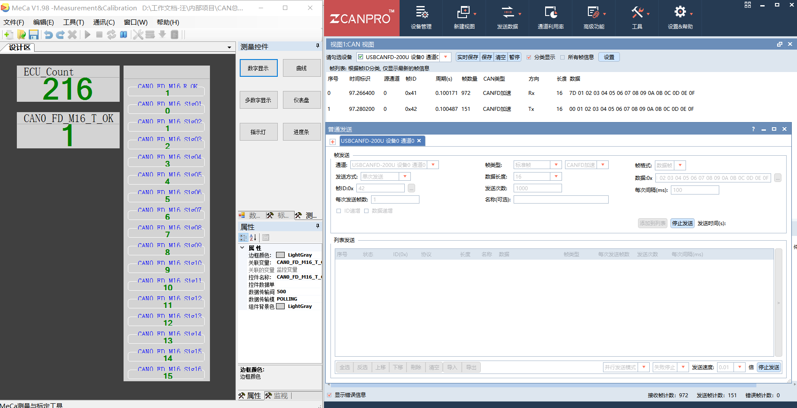

<<<<<<< HEAD


# CAN基础知识


CAN FD基础知识
=======
# 问题

```
1、CAN发送时广播的，不同ECU之间如何确定消息报文是发送给自己的
	根据CAN ID选择性丢弃，注意优先级也是看ID字段
```

# CAN基础知识

https://blog.csdn.net/is_yaoyao/article/details/130286527#11_193


# CAN FD基础知识
>>>>>>> origin/main

随着车辆ECU的数量不断增多，总线上传输的报文数量也越来越多，而在传统CAN网络中，每帧报文只能携带8个字节的数据，CAN总线最大只能支持1Mb/s的传输速率，为了增加CAN总线的利用率，在CAN的基础上推出了CAN FD（Flexible Data-rate）标准。

CAN FD相较于传统CAN，支持更高的传输数率，并且支持变速功能，即在仲裁段使用较低的传输数率进行总线仲裁，赢得仲裁后，再以高速率传输数据段中的数据，最高支持8Mb/s的传输速率，CAN FD的数据场长度也得到了扩充，一次最大可传输64个字节。

在硬件方面的改动相对较小，若是ECU自身的CAN控制器与CAN收发器支持CAN FD功能，硬件方面则不需要作任何修改。

在通信协议方面发生了一定的变动，CAN FD消息帧包括CAN FD标准帧和CAN FD扩展帧，取消了远程帧功能。

## 一.CAN FD消息帧

CAN FD报文具体结构如图1-1，1-2所示。

**CAN-FD打包到TSN中，主要是转换CAN-FD的ID字段和Data字段**



图1-1 CANFD 标准帧格式



图1-2 CANFD 扩展帧格式

帧起始（SOF）：长度1bit，表示数据帧的开始，总线上表现为一个显性位边沿信号，与传统CAN相同。

仲裁场：在标准帧格式中，由11位标识符和RRS位组成，在扩展帧格式中，由29位标识符和SRR位、IDE位、RRS位组成，ID值越小，优先级越高。

- RRS：长度1bit，远程请求替代位，因为CANFD取消了远程帧，所以这个一帧成为了保留位，默认显性位0。
- IDE：长度1bit，表示标识符扩展位，0表示标准帧，1表示扩展帧，与传统CAN相同。
- FDF：长度1bit，CANFD标志位，该位值为0时，代表传统CAN报文，该位值为1时，代表CANFD报文。
- SRR：长度1bit，在扩展帧格式中始终设定为隐性位1，与传统CAN相同。

控制场：由保留位和DLC组成，在标准帧格式中，IDE与保留位相同为显性位0。

- r：长度1bit，保留位。
- BRS：长度1bit，位速率切换位，当该位为0时，表示CANFD报文保持恒定速率传输，当该位为1时，数据段的传输速率将切换至高速率模式。
- ESI：长度1bit，错误状态指示位，当该位为0时，表示当前发送节点处于主动错误状态，当该为为1时，表示当前发送节点处于被动错误状态。
- DLC：长度4bit，数据长度码，当数据在0-8的范围内，数据场场的长度就是对应的数值，当该值在9~15的范围内，对应的数据场长度如表1-1所示：

| DLC      | 9(0x9)  | 10(0xA) | 11(0xB) | 12(0xC) | 13(0xD) | 14(0xE) | 15(0xF) |
| -------- | ------- | ------- | ------- | ------- | ------- | ------- | ------- |
| 数据长度 | 12Bytes | 16Bytes | 20Bytes | 24Bytes | 32Bytes | 48Bytes | 64Bytes |

表1-1 DLC对应数据场长度

数据场(Data Field)：0~64个字节，用于节点之间传递有效数据。

CRC场：长度22bit或者26bit，包括Stuff Count，CRC序列和CRC界定符，用于校验数据的准确性，由于CAN FD数据场长度的不确定性，CAN FD会根据不同的数据场长度，使用不同的CRC校验公式。

- Stuff Count：长度4bit，填充位计数，SOF~Data Field的填充位个数，进行模8运算，并以格雷编码形式（Gray Coded），存放在前高3位中，最后一位（Parity Bit）用奇偶校验，如下表所示。

  | Number of Stuff Bits | Gray Coded | Parity Bit |
  | -------------------- | ---------- | ---------- |
  | 0                    | 000        | 0          |
  | 1                    | 001        | 1          |
  | 2                    | 011        | 0          |
  | 3                    | 010        | 1          |
  | 4                    | 110        | 0          |
  | 5                    | 111        | 1          |
  | 6                    | 101        | 0          |
  | 7                    | 100        | 1          |

- CRC Sequence：长度17bit或者21bit，校验序列，当数据场长度≤16字节时，使用17位的校验序列，当数据场长度>16字节时，使用21位的校验序列，与传统CAN不同，CAN FD会将校验场之前的动态填充位也计算在内。

- DEL：长度1bit，隐性界定符，与传统CAN相同。

应答场：长度2bit，由应答间隙和应答界定符组成，与传统CAN相同。

- ACK：发送方将发送隐性位1，由节点应答则返回一个隐性位0，否则保持隐性位1，与传统CAN相同。

帧结尾（EOF）：长度7bit，由7个连续的隐性位组成，表示帧结束，与传统CAN相同。

## 二.CAN FD位填充

CAN FD拥有两种位填充方式，CRC场之前，即从SOF到Data Field最后一个字节与传统CAN的填充方式相同，当检测到发送位中5个极性相同的连续位时，将自动插入一个极性相反的填充位，而CRC场则采用了固定位置的位填充方式，每4个位后增加一个前一位的极性相反位作为填充位，CRC场的填充位如图2-1所示：



图2-1 CAN FD 填充位

17位的校验序列的对应多项式：

G（x）=x17+x16+x14+x13+x11+x8+x4+x3+x1+1，即11 0110 1001 0001 1011。

21位的校验序列的对应多项式：

G（x）=x21+x20+x13+x11+x7+x4+x3+1，即11 0000 0010 1000 1001 1001。

## 三.CAN FD与传统CAN的区别

1. 波特率

   传统CAN最高支持1Mb/s的传输速率，CAN FD仲裁段支持的最高传输速率与传统CAN相同，为1Mb/s，数据段最高支持8Mb/s的传输速率。

2. 波特率加速

   传统CAN的一帧报文是以相同速率进行传输的，而CAN FD可以通过设置BRS（位速率切换位），将仲裁段与数据段分为两种速率进行报文传输，在仲裁段使用较低的传输数率进行总线仲裁，赢得仲裁后，再以高速率传输数据段中的数据。

3. 数据场

   传统CAN每帧报文最大只能传输8个字节的数据，CAN FD最大可以一次传输64个字节。

4. 远程帧

   传统CAN支持远程帧功能，CAN FD则取消了远程帧功能。

## 四.使用控制器收发CAN FD报文

RapidECU有些型号提供了若干CAN FD通道，比如RapidECU-U34控制器提供了6个CAN FD通道，其它型号控制器类似。使用带CAN FD通道的控制器可以收发CAN FD报文。ECUCoder提供了CANFDCommucation CANFD通信模块库，库中的模块用于收发CAN FD报文。

本文示例使用RapidECU - U34控制器演示，使用周立功USBCANFD 200U配合ZCANPRO与U34控制器进行通信。

### 4.1.CAN FD模块初始化设置

双击RapidECUSetting模块，出现控制器设置图形化界面，从左边的树中选择Communication-CAN0选项，如图4.1-1所示。开启CAN FD功能，仲裁域波特率为500kbps，数据域波特率为2Mbps，一帧CAN FD报文允许的数据场最大长度为16个字节。



图4.1-1 CAN FD初始化设置

控制器的CAN通道波特率（CAN Baudrate）默认设置为500kbps，如果CAN总线波特率为其它数值，则需要修改 Baudrate的值，可供设定的范围为：1000、500、250、125，对应1Mbps、500kbps、250kbps、125Kbps，如果填写其他数值，控制器则自动设定为500。

CAN FD Enable默认设置为0，控制器默认不开启CAN FD功能，将CAN FD Enable设为1，开启CAN FD功能。

若发送与接收CAN FD消息帧，仲裁域与数据域速率相同，均采用Baudrate设定的波特率；若发送与接收CAN FD加速帧，仲裁域仍采用Baudrate设定的波特率，数据域则采用Data Baudrate设定的波特率。Data Baudrate默认设置为2000，即2Mbps。Data Baudrate可供设定的范围为：4000、2000、1000、500、250、125，对应4Mbps、2Mbps、1Mbps、500kbps、250kbps、125kbps。如果填写其他数值，控制器则自动设定为500。

FD Payload为数据场最大负载，请按照CAN FD总线协议中数据场最长的报文设定，可供设定的范围为8，16，32，64，如果填写其他数值，控制器则自动设定为8。

### 4.2.发送CAN FD报文

请根据实际的通信协议建立时间调度，周期性发送CAN FD报文，本示例每100ms发送一帧CAN FD报文，如图4.2-1所示。



图4.2-1 100ms时间调度

在Subsystem_100ms中建立发送CAN FD报文的模型，根据初始化设置中的FD Payload值选择对应的CAN FD子库，即FD Payload设定16，则选用Max16Bytes子库中的发送模块（M16CAN0to2Transmit），进行必要的设置，如图4.2-2所示。



图4.2-2 发送CAN FD报文

- CAN Module选择CAN0通道发送报文；
- CAN Buffer选择为5号缓存区，同一路CAN通道的收发不允许使用同一块缓存区；
- CAN Message ID 为0x41；
- CAN Message Types为标准帧格式；
- CAN Type为CAN FD加速帧；
- Data Length为数据场长度16Bytes。

### 4.3.定时接收指定ID的CAN FD报文

请根据实际的通信协议建立时间调度，周期性接收CAN FD报文，本案例每100ms接收一帧CAN FD报文，在Subsystem_100ms中建立接收CAN FD报文的模型。

根据初始化设置中的FD Payload的值选择对应的CAN FD子库，FD Payload设定16，则选用Max16Bytes子库中的接收模块（M16CAN0to2Receive），进行必要的设置，如图4.3-1所示。



图4.3-1 定时接收指定ID的CAN FD报文

- CAN Module选择CAN0通道发送报文；
- CAN Buffer选择为6号缓存区，同一路CAN通道的收发不允许使用同一块缓存区；
- CAN Message ID 为0x42；
- CAN Message Types为标准帧格式；
- Data Length为数据场长度16Bytes。

### 4.4.CAN FD通信演示

连接PC与控制器，将上述模型烧录至控制器，打开ZCANPRO，建立连接，选择CAN卡（USBCANFD - 200U），协议CAN FD，开启CAN FD加速，仲裁域波特率500kbps，数据域波特率2Mbps与控制器初始化设定中对应。如图4.4-1所示。



图4.4-1 PC与控制器建立连接

控制器端发送报文ID0x41，接收报文ID0x42；PC端接收报文ID0x41，发送报文ID0x42。查看MeCa与ZCANPRO软件，收发正常，如图4.4-2所示。



图4.4-2 PC与控制器进行CAN FD通信

## 五.CAN FD的兼容性

### 5.1.ISO CAN FD与non-ISO CAN FD的兼容性

CAN FD的ISO标准是2015年发布的，而CAN FD是在2012年推出的，2012年底到2015年中之前有很多厂家已经开发了CAN FD产品，但是那个是非ISO标准的CAN FD产品，并且已经有少部分产品已经在市场流通。

非ISO CAN FD与 ISO CAN FD的共同点在于：传输速率一致，数据长度一致；区别在于：后者引入了一个3位的填充位计数器以及额外的校验位，另外，CRC计算值也不同。所以两者是不兼容的。因此CiA建议所有的CAN FD应用需注明ISO CAN FD或non-ISO CAN FD。

2015年之后推出的CAN FD产品基本都是符合ISO标准的CAN FD产品，有些产品则同时支持ISO CAN FD与non-ISO CAN FD，用户只需要在软件上选择使用即可。

### 5.2.CAN FD与传统CAN的兼容性

CAN FD节点可以发送CAN FD报文与传统CAN报文，CAN FD节点可以接收CAN FD报文与传统CAN报文，因此，通常说法是CAN FD兼容传统CAN。

传统CAN节点只能发送传统CAN报文而不能发送CAN FD报文，传统CAN节点只能接收传统CAN报文而不能接收CAN FD报文。在大部分情况下，如果传统CAN总线上添加了一个CAN FD节点并往总线上发送CAN FD报文的话，会出现错误帧。

在实际应用中，很长一段时间内都会有CAN FD节点与CAN节点共存于同一辆车上的情况。此时，推荐的做法是CAN FD节点与传统CAN节点分别组网，两路总线之间通过网关来交换信息。比如RapidECU-U34控制器提供了6个CAN FD通道，每个通道均支持CAN FD或者传统CAN，此时U34控制器就可以作为网关来使用。

## 六.CAN FD的前景

1. 2020年后推出的主流微控制器均由传统CAN升级到了CAN FD，比如恩智浦、英飞凌、意法等的新微控制器产品均支持CAN FD。
2. 2021年后推出的主流电控单元ECU均由传统CAN升级到了CAN FD，比如RapidECU-U34、F23等产品均支持CAN FD。
3. CAN FD产品在成本与售价上相比传统CAN产品并无明显区别。
4. CAN FD在部分性能（比如传输速率）上远超传统CAN，在另外部分性能（比如传输可靠性）上与传统CAN一致。
5. CAN FD兼容CAN，用户可以把CAN FD当成传统CAN来使用。
6. MATLAB/Simulink 2019a及以上版本提供了完整的CAN FD功能支持，Simulink提供的CAN FD相关模块既可以仿真，也可以生成C代码。

综上，CAN FD应用前景广阔，是传统CAN总线升级换代的理想选择。


