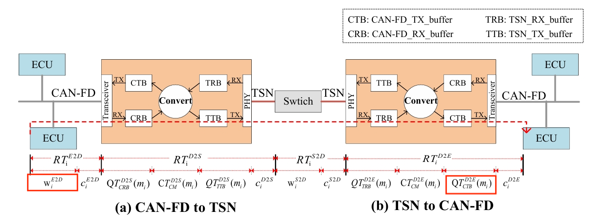
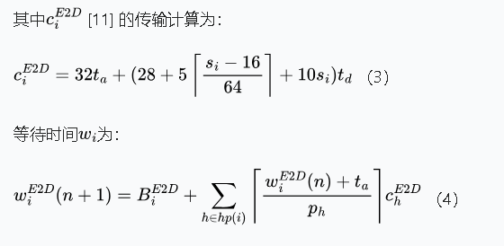
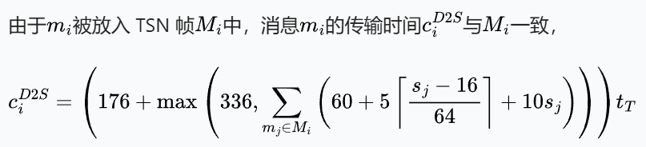
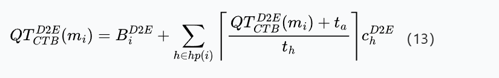
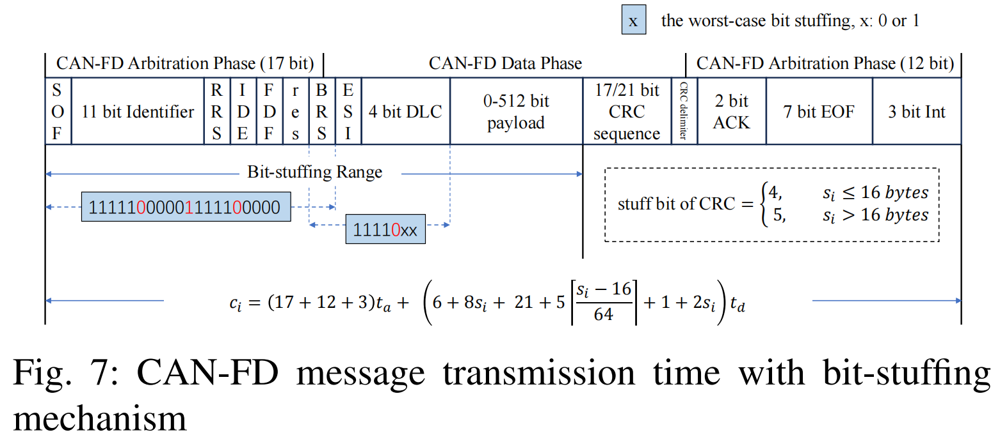

- [x] 分布式架构、域集中式架构、中央式架构
- [x] can-fd和can
- [ ] 汽车软件
- [x] ECU\DCU

### abstract:

在域集中式架构下，跨域的端到端响应时间评估（跨TSN和CAN-FD）。针对CAN-FD到TSN的不同转换（一对一或多对一），消息在DCU(域控制单元)的不同等待时间,评估不同的响应时间

### introduction:

1.汽车分布式到集中式架构转变
2.CAN到CAN-FD的转变
3.两个工作:分析跨域的端到端通信响应时间,不同转换策略下DCU中混合关键信息的等待时间

### architecture and models

1.解释域集中式架构CAN-FD和TSN的互相转换架构图

2.消息模型mi={tyi,srci,desi,pi,si,di}

- tyi:消息类型1表示关键消息,否则为非关键消息
- srci和desi:源ECU和目的ECU
- pi:周期
- si:大小
- di:截止时间

### RTA of cross-domain end-to-end communication

​	1.响应时间分析(RTA): 排队和传输时间
​	2.计算ECU到DCU的RTA

1. **ECU到DCU的RT的计算：**

- 为传输时间和等待（排队）时间之和

- 传输计算和等待（排队）计算如下:

  - ***排队时间计算***
  
  

​	

​	**2.DCU到交换机的RT计算**

- 分成四部分，**1)**从CAN-FD到DCU缓冲区的排队时间，**2)**从DCU输出区到交换机的传输时间，**3)**从DCU缓冲区到到交换机的时间， **4）**CAN-FD到TSN的转换时间
  - 对于关键帧，其***1)***时间为0，非关键帧其***1)***为打包到同一TSN帧中的最早帧和最晚帧的差值时间
  - 对于***3)***的时间，由于可以配置门控，使得其排队时间为0
  - 对于***4）***的时间，其为小常数时间
  - 对于***2）***的时间，其传输时间如下计算
    - 

**3.交换机到DCU的RT计算**

- 分成两部分，第一部分为传输时间，第二部分为等待时间
  - 传输时间与"2"中传输时间计算一致
  - 等待时间通过配置门控可达到0

**4.DCU到ECU的RT计算**

- 分为四部分，**1)**交换机到DCU缓冲区的等待时间，**2）**DCU发送缓冲区到开始发送的等待时间， **3）**从DCU发送到ECU的传输时间， **4）**转换时间
  - 对于***1）***的时间，为0
  - 对于***4）***的时间，为小常数时间
  - 对于***3）***的时间，公式3式子得到
  - 对于***2）***的时间，需要考虑不同CAN-FD的优先级,以及目的域的高优先级干扰,计算如下
    - ***排队时间计算***
    - 

### experimental results

### 基础知识

