# 工具

## 网络调试助手NetAssist


## 抓包工具Wireshark


# 基础知识

带宽

```
概念：数据带宽是正在使用的数据传输速率的同义词，定义了一个数据链路的最大容量
例如
    一个10Mbps的铜线局域网不能承受速率高于10Mbps的流量
    一个使用600MBps调制解调器的卫星链路不能传输任何高于600Mbps的流量
```

吞吐量

```
概念：吞吐量是通过网络传输的真实数据量，也可以认为是在单位时间内通过网络从你的计算机到WEB服务器来回传输的真实数据量
```

信道利用率

```
信道利用率=吞吐量/带宽*100%
```

## NAT

NAT 是网络地址转换（Network Address Translation）的缩写，它是一种在计算机网络中广泛使用的技术。以下是关于 NAT 的详细介绍：

- **原理**：NAT 允许将一个 IP 地址域转换为另一个 IP 地址域，主要用于实现私有网络与公共网络之间的地址转换。在私有网络中，设备使用私有 IP 地址进行通信，这些私有 IP 地址在互联网上是不可路由的。当私有网络中的设备需要访问互联网时，NAT 设备会将其私有 IP 地址转换为公共 IP 地址，使得这些设备能够与互联网上的其他设备进行通信。
- 作用
  - **节省公网 IP 地址**：由于公网 IP 地址资源有限，通过 NAT 技术，多个私有网络中的设备可以共享一个或少数几个公网 IP 地址来访问互联网，从而有效地节省了公网 IP 地址资源。
  - **增强网络安全性**：NAT 隐藏了内部私有网络的 IP 地址结构，外部网络只能看到 NAT 设备的公网 IP 地址，无法直接访问内部私有网络中的设备，这在一定程度上提高了内部网络的安全性，减少了遭受网络攻击的风险。
- 工作方式
  - **静态 NAT**：将内部网络中的一个私有 IP 地址与一个公网 IP 地址进行一对一的固定映射。这种方式适用于需要对外提供服务的服务器等设备，确保外部网络能够通过固定的公网 IP 地址访问到内部特定设备。
  - **动态 NAT**：从一个公网 IP 地址池中动态地为内部网络中的设备分配公网 IP 地址。当内部设备需要访问互联网时，NAT 设备会从地址池中选取一个未被使用的公网 IP 地址进行映射，使用完毕后再将其释放回地址池。
  - **网络地址端口转换（NAPT）**：也称为端口复用 NAT，它允许将多个内部私有 IP 地址映射到同一个公网 IP 地址的不同端口上。通过这种方式，多个内部设备可以同时使用同一个公网 IP 地址访问互联网，NAT 设备根据端口号来区分不同的内部设备，实现了多个私有 IP 地址与一个公网 IP 地址的多对一映射。

NAT 技术在现代网络中起着至关重要的作用，它使得私有网络能够便捷地接入互联网，同时解决了公网 IP 地址短缺和网络安全等问题。

---

# 命令

## ping/pathping

`ping`和`pathping`是 Windows 系统中用于网络诊断和测试的两个命令，它们的功能和使用方法如下：

### 1.`ping`命令

- **功能**：主要用于测试网络连接的可达性。它通过向目标主机发送 Internet 控制消息协议（ICMP）数据包，并接收目标主机返回的响应，以此来判断源主机与目标主机之间的网络连接是否正常。

- **语法**：`ping [参数] <目标IP地址或域名>`。

- 常见参数

  ：

  - **`-t`**：持续发送 ICMP 数据包，直到用户手动停止。例如，`ping -t 192.168.1.1`，常用于检查网络连接的稳定性。
  - **`-n count`**：指定要发送的 ICMP 数据包数量，`count`为具体的数字。如`ping -n 10 192.168.1.1`，表示发送 10 个数据包，默认是 4 个。
  - **`-l size`**：指定发送的 ICMP 数据包的大小，`size`为字节数。默认情况下，数据包大小为 32 字节，例如`ping -l 1024 192.168.1.1`，可用于测试网络对不同大小数据包的传输能力。
  - **`-r count`**：记录路由，`count`指定记录的跃点数，范围是 1 到 9。如`ping -r 9 www.baidu.com`，尝试记录数据包到达目标地址所经过的路由，但该功能的准确性依赖于中间路由器的设置，不一定能完整显示所有路径。

- **示例**：在命令提示符中输入`ping www.qq.com`，系统会向腾讯的服务器发送 ICMP 数据包，并显示返回的信息，包括每个数据包的往返时间、是否丢失等，以此判断与腾讯服务器的网络连接状况。

### 2.`pathping`命令

- **功能**：结合了`ping`和`traceroute`的功能，不仅能显示数据包到达目标主机所经过的路径，还能提供每个中间节点的网络延迟和丢包率等信息，有助于更全面地分析网络问题。

- **语法**：`pathping [参数] <目标IP地址或域名>`。

- 常见参数

  ：

  - **`-n`**：不将 IP 地址解析为计算机名，加快命令的执行速度，尤其在目标主机的域名解析可能存在问题或不需要显示主机名时使用。例如`pathping -n 192.168.1.1`。
  - **`-h maximum_hops`**：指定搜索目标的最大跃点数，`maximum_hops`为数字。默认值为 30，如`pathping -h 40 www.baidu.com`，可根据网络拓扑结构和实际需求调整该值。
  - **`-p milliseconds`**：指定在每个中间节点等待的时间（以毫秒为单位）。默认是 250 毫秒，例如`pathping -p 500 www.163.com`，增加等待时间可能有助于获取更准确的信息，特别是在网络拥塞或设备响应较慢的情况下。

- **示例**：运行`pathping www.sina.com.cn`，命令会先显示从本地计算机到新浪服务器经过的各个路由器的 IP 地址，然后经过一段时间的数据包收集（默认是 250 秒），显示每个路由器的丢包率和平均延迟等统计信息，帮助用户判断网络中哪些节点可能存在问题。

总的来说，`ping`命令主要用于快速检查网络连接的基本状态，而`pathping`命令则更侧重于深入分析网络路径和诊断网络故障，在网络维护和故障排除中都起着重要作用。

## curl

`curl` 是一个强大的开源命令行工具，用于在命令行中进行网络数据传输，支持众多网络协议，以下是关于它的完整说明及常用用法。

**基本介绍]**

`curl` 全称为 Client URL，它允许用户通过命令行与服务器进行通信，支持超过 20 种网络协议，如 HTTP、HTTPS、FTP、FTPS、SMTP、POP3、IMAP 等。可以用来下载文件、发送请求、上传数据等，在网络开发、系统管理、自动化脚本等场景中广泛应用。

**安装**

- **Linux**：大多数 Linux 发行版默认安装了 `curl`。如果未安装，可使用包管理器进行安装，如在 Ubuntu 或 Debian 系统中使用 `sudo apt-get install curl`；在 CentOS 或 Fedora 系统中使用 `sudo yum install curl`。
- **macOS**：macOS 系统自带 `curl`，无需额外安装。
- **Windows**：可以从 [curl 官网](https://curl.se/windows/) 下载预编译的二进制文件，解压后将其所在目录添加到系统环境变量 `PATH` 中。

**常用用法**

**1. 简单的 GET 请求**

获取网页内容，直接在命令行输入 `curl` 加上目标 URL。

```bash
curl https://www.example.com
```

此命令会将 `https://www.example.com` 页面的 HTML 内容显示在终端。

**2. 保存下载内容到文件**

- `-o`（小写）：可指定保存文件的名称。

```bash
curl -o example.html https://www.example.com
```

上述命令会将 `https://www.example.com` 的内容保存为 `example.html` 文件。

- `-O`（大写）：使用远程文件的文件名作为本地保存的文件名。

```bash
curl -O https://example.com/file.zip
```

该命令会将 `https://example.com/file.zip` 文件下载到当前目录。

**3. 发送 POST 请求**

- `-X` 指定请求方法，`-d` 传递 POST 数据。发送 JSON 数据的示例如下：

```bash
curl -X POST -H "Content-Type: application/json" -d '{"key1": "value1", "key2": "value2"}' https://example.com/api
```

这里 `-X POST` 指定请求方法为 POST，`-H "Content-Type: application/json"` 设置请求头表明发送的数据是 JSON 格式，`-d` 后面跟具体的 JSON 数据。

- 发送表单数据：

```bash
curl -X POST -d "username=admin&password=123456" https://example.com/login
```

**4. 自定义请求头**

使用 `-H` 参数添加自定义请求头。例如添加 `Authorization` 头进行身份验证：

```bash
curl -H "Authorization: Bearer your_token_here" https://example.com/protected_api
```

**5. 显示详细请求信息**

`-v` 参数可显示详细的请求和响应信息，包括请求头、响应头、请求时间等，有助于调试和分析网络请求。

```bash
curl -v https://www.example.com
```

**6. 跟随重定向**

当服务器返回重定向响应时，`-L` 参数可让 `curl` 自动跟随重定向。

```bash
curl -L https://example.com/redirecting_url
```

**7. 仅获取 HTTP 头部信息**

`-I`（或 `--head`）参数用于仅获取服务器返回的 HTTP 头部信息，不获取实际的响应体内容。

```bash
curl -I https://www.example.com
```

**8. 限制下载速度**

`--limit-rate` 参数可限制下载速度，例如限制下载速度为 100KB/s：

```bash
curl --limit-rate 100K -O https://example.com/bigfile.zip
```

**9. 模拟用户代理**

使用 `-A` 参数可以模拟不同的用户代理，让服务器认为请求来自特定的浏览器或设备。

```bash
curl -A "Mozilla/5.0 (Windows NT 10.0; Win64; x64) AppleWebKit/537.36 (KHTML, like Gecko) Chrome/91.0.4472.124 Safari/537.36" https://www.example.com
```

**10. 断点续传**

使用 `-C -` 参数可以实现断点续传，当下载中断后，再次使用该命令可从上次中断的位置继续下载。

```bash
curl -C - -O https://example.com/largefile.iso
```

- **脚本化使用**

`curl` 可集成到脚本中实现自动化任务。以下是一个使用 Shell 脚本定期检查网站可用性的示例：

```bash
#!/bin/bash
URL="https://www.example.com"
RESPONSE=$(curl -s -o /dev/null -w "%{http_code}" $URL)
if [ $RESPONSE -eq 200 ]; then
    echo "网站正常访问"
else
    echo "网站访问异常，状态码: $RESPONSE"
fi
```

在这个脚本中，`-s` 参数用于静默模式，不显示进度信息；`-o /dev/null` 将响应内容丢弃；`-w "%{http_code}"` 只输出 HTTP 状态码。

# 网络编程

## 网络四层


## socket 套接口数据结构✨

```
sockaddr、sockaddr_in、sockaddr_un、sockaddr_ll的区别以及使用场景
sockaddr*数据结构，sockaddr_in用于网络层通信（IP），sockaddr_ll用于数据链路层通信（mac）
	1)sockaddr：
        struct sockaddr
          { 
            sa_family_t sa_family; // 2字节
            char sa_data[14] //14字节
          };
    2)sockaddr_in
        struct sockaddr_in
          {
            sa_family_t sin_family;//协议族 2字节，一般为AF_INET
            in_port_t sin_port;//端口号 2字节, 使用网络字节顺序
            struct in_addr sin_addr;//ip地址 4字节
            char sin_zero[8]//填充，不起什么作用 8字节
          };
      3)sockaddr_un
      	sockaddr_un 主要用于 UNIX 域套接字（Unix Domain Sockets），通常与 AF_UNIX 地址族一起使用
      4)sockaddr_ll
      	sockaddr_ll 主要用于链路层（Link Layer）通信，通常与 PF_PACKET 地址族一起使用
      	struct sockaddr_ll {
            unsigned short sll_family;    // 地址族，通常为 PF_PACKET
            __be16 sll_protocol;          // 上层协议类型
            int sll_ifindex;              // 接口索引
            unsigned short sll_hatype;    // 硬件类型
            unsigned char sll_pkttype;    // 包类型
            unsigned char sll_halen;      // 地址长度
            unsigned char sll_addr;    // 物理层地址（如 MAC 地址）
    	};
```

### sockaddr

- **定义**：这是一个通用的套接字地址结构体，其定义位于 `<sys/socket.h>` 头文件中。

```c
struct sockaddr {
    sa_family_t sa_family;  // 地址族
    char        sa_data[14];  // 信息
};
```

- **解释：**
  - `sa_family`：用于表明地址族（如 AF_INET 代表 IPv4，AF_INET6 代表 IPv6 等）。
  - `sa_data`：用来存储地址信息，不过其使用方式缺乏针对性。
- **使用场景**：由于 `sockaddr` 是通用的结构体，所以在很多网络编程函数（像 `bind()`、`connect()` 等）中被当作参数类型。但在实际使用时，通常会先使用具体的地址结构体（如 `sockaddr_in`），之后再将其强制转换为 `sockaddr` 类型。

---

### sockaddr_un

- **定义**：这是用于 Unix 域套接字的套接字地址结构体，定义在 `<sys/un.h>` 头文件中。

```c
struct sockaddr_un {
    sa_family_t sun_family;               /* AF_UNIX */
    char        sun_path[108];            /* pathname */
};
```

- **解释：**
  - `sun_family`：固定为 `AF_UNIX`，表示使用 Unix 域套接字地址族。
  - `sun_path`：是一个字符串，用于指定 Unix 域套接字的文件路径。
- **使用场景**：Unix 域套接字用于在同一台主机上的进程间进行通信，它能够提供可靠的字节流（SOCK_STREAM）或数据报（SOCK_DGRAM）服务。当需要在本地进程间进行高效通信时，就可以使用 `sockaddr_un`。

---

### sockaddr_in

- **使用场景：**`sockaddr_in` 结构体是用于处理 IPv4 地址的结构体，通常在网络编程中用于指定套接字的地址信息。它定义在 `<netinet/in.h>` 头文件中，主要用于 TCP 和 UDP 协议的网络通信。

- #### sockaddr_in 结构体的定义


```c
struct sockaddr_in {
    short int sin_family;         // 地址族，通常为 AF_INET
    unsigned short int sin_port;  // 端口号，使用网络字节顺序
    struct in_addr sin_addr;      // IPv4 地址
    unsigned char sin_zero;    // 填充字节，保持结构体大小一致
};
```

- **结构体成员解释**
  - **sin_family**: 表示地址族，通常设置为 `AF_INET`，表示使用 IPv4。
  - **sin_port**: 存储端口号，必须使用网络字节顺序（可以使用 `htons` 函数进行转换）。
  - **sin_addr**: 存储 IP 地址，使用 `struct in_addr` 结构体，通常通过 `inet_addr` 函数将字符串形式的 IP 地址转换为网络格式。
  - **sin_zero**: 用于填充字节，使 `sockaddr_in` 和 `sockaddr` 结构体的大小一致，通常不使用。

#### 如何使用 sockaddr_in✨
1. **创建套接字**:
   使用 `socket` 函数创建一个套接字。

   ```c
   int sock_fd = socket(AF_INET, SOCK_STREAM, 0);
   ```

2. **填充 sockaddr_in 结构体**:
   在使用套接字之前，需要填充 `sockaddr_in` 结构体的各个字段。

   ```c
   struct sockaddr_in serv_addr;
   memset(&serv_addr, 0, sizeof(serv_addr)); // 清零结构体
   serv_addr.sin_family = AF_INET;            // 设置地址族
   serv_addr.sin_port = htons(12345);         // 设置端口号，使用网络字节顺序
   serv_addr.sin_addr.s_addr = inet_addr("192.168.0.1"); // 设置 IP 地址
   ```

3. **绑定套接字**:
   使用 `bind` 函数将套接字与地址绑定。

   ```c
   bind(sock_fd, (struct sockaddr *)&serv_addr, sizeof(serv_addr));
   ```

4. **连接到服务器**（对于客户端）:
   使用 `connect` 函数连接到服务器。

   ```c
   connect(sock_fd, (struct sockaddr *)&serv_addr, sizeof(serv_addr));
   ```

5. **发送和接收数据**:
   使用 `send` 和 `recv` 函数进行数据传输。

通过以上步骤，您可以使用 `sockaddr_in` 结构体在网络编程中实现 IPv4 地址的处理和套接字的操作。

---
Learn more:
1. [sockaddr\_in结构体详解\_sockaddin-CSDN博客](https://blog.csdn.net/renchunlin66/article/details/52351751)
2. [sockaddr和sockaddr\_in详解 - chuyaoxin - 博客园](https://www.cnblogs.com/cyx-b/p/12450811.html)
3. [sockaddr和sockaddr\_in结构体、以及inet\_ntoa()和inet\_addr()函数的用法-CSDN博客](https://blog.csdn.net/bhniunan/article/details/104005751)

---

### sockaddr_ll

- **使用场景:**`sockaddr_ll` 结构体是 Linux 中用于处理数据链路层（Layer 2）地址的一个重要结构，通常用于原始套接字（raw socket）编程。它允许用户直接与网络接口进行交互，接收和发送以太网帧。

- **sockaddr_ll 结构体的定义**

```c
struct sockaddr_ll {
    unsigned short sll_family;    // 地址族，通常为 PF_PACKET
    __be16 sll_protocol;          // 上层协议类型
    int sll_ifindex;              // 接口索引
    unsigned short sll_hatype;    // 硬件类型
    unsigned char sll_pkttype;    // 包类型
    unsigned char sll_halen;      // 地址长度
    unsigned char sll_addr;    // 物理层地址（如 MAC 地址）
};
```

- **结构体成员解释**
  - **sll_family**: 地址族，通常设置为 `PF_PACKET`，表示使用数据链路层协议。
  - **sll_protocol**: 表示上层协议类型，例如以太网协议（如 `ETH_P_IP` 表示 IPv4）。
  - **sll_ifindex**: 网络接口的索引，指示数据包将通过哪个接口发送或接收。
  - **sll_hatype**: 硬件类型，通常用于 ARP 协议。
  - **sll_pkttype**: 包类型，指示数据包的类型（如本地主机、广播、多播等）。
  - **sll_halen**: 物理地址的长度，通常为 6（对于以太网）。
  - **sll_addr**: 物理层地址，通常是 MAC 地址。

#### 如何使用 sockaddr_ll✨
1. **创建原始套接字**:
   使用 `socket` 函数创建一个原始套接字，指定协议族为 `PF_PACKET`，类型为 `SOCK_RAW`。

   ```c
   int sock_fd = socket(PF_PACKET, SOCK_RAW, htons(ETH_P_ALL));
   ```

2. **填充 sockaddr_ll 结构体**:
   在发送或接收数据包之前，需要填充 `sockaddr_ll` 结构体的各个字段。

   ```c
   struct sockaddr_ll sa;
   memset(&sa, 0, sizeof(sa)); // 清零结构体
   sa.sll_family = PF_PACKET;   // 设置地址族
   sa.sll_protocol = htons(ETH_P_IP); // 设置协议类型
   sa.sll_ifindex = if_nametoindex("eth0"); // 获取接口索引
   sa.sll_halen = ETH_ALEN;     // 设置地址长度
   memcpy(sa.sll_addr, "\x01\x02\x03\x04\x05\x06", ETH_ALEN); // 设置 MAC 地址
   ```

3. **发送数据包**:
   使用 `sendto` 函数发送数据包。

   ```c
   sendto(sock_fd, buffer, buffer_length, 0, (struct sockaddr*)&sa, sizeof(sa));
   ```

4. **接收数据包**:
   使用 `recvfrom` 函数接收数据包。

   ```c
   recvfrom(sock_fd, buffer, buffer_length, 0, (struct sockaddr*)&sa, &addr_len);
   ```

通过以上步骤，您可以使用 `sockaddr_ll` 结构体在 Linux 中实现数据链路层的原始套接字编程，进行网络数据包的发送和接收。

---
Learn more:
1. [详解sockaddr\_ll 设备无关的物理层地址结构\_struct sockaddr sll的头文件-CSDN博客](https://blog.csdn.net/sinat_27261621/article/details/52709443)
2. [linux sockaddr结构体,网络编程之sockaddr\_ll结构体 | 人人学技术-CSDN博客](https://blog.csdn.net/weixin_29035405/article/details/116948611)
3. [(十三)Packet socket 和 sockaddr\_ll - xtusir - 博客园](https://www.cnblogs.com/zhangshenghui/p/6097492.html)

## 辅助函数✨

- **inet_addr/inet_ntoa**

  - **inet_addr：**将点分十进制字符串转化为整形用于网络传输
  - **inet_ntoa：**将网络ip地址整形转化为点分十进制整形

- **htons/ntohs**

  - **htons：**将主机序转化为网络序
  - **ntohs：**将网络序转化为主机序

- **system**

  - ```c
    system("ifconfig | grep inet");  // 用于调用bash命令
    	//不会输出到缓冲区而是直接输出
    ```
  
- **getsockname**

  - ```c
    // 用于获取本地sockaddr_in
    getsockname(sockfd, (struct sockaddr *)&localAddr, &addrLen)
    	-1表示错误
    ```


### pthread_create

在 C 语言里，`pthread_create` 是 POSIX 线程库中的一个函数，其作用是创建新线程。下面会详细介绍如何使用 `pthread_create` 创建多线程，包含函数原型、参数解释、示例代码以及代码说明。

**fork和pthread_create的区别：**

- fork是创建子进程，pthread_create是创建子线程

**函数原型**

```c
#include <pthread.h>

int pthread_create(pthread_t *thread, const pthread_attr_t *attr,
                   void *(*start_routine) (void *), void *arg);
```

**参数解释**

- `thread`：指向 `pthread_t` 类型变量的指针，用来存储新创建线程的 ID。
- `attr`：指向 `pthread_attr_t` 类型的指针，用于设置线程的属性。若传入 `NULL`，则使用默认属性。
- `start_routine`：这是一个函数指针，指向新线程要执行的函数。该函数返回类型为 `void *`，参数类型为 `void *`。
- `arg`：传递给 `start_routine` 函数的参数。若无需传递参数，可传入 `NULL`。

**返回值**

- 若成功创建线程，`pthread_create` 会返回 `0`。
- 若创建线程失败，会返回一个非零的错误码。

**示例代码**

下面是一个使用 `pthread_create` 创建多线程的示例：

```c
#include <stdio.h>
#include <pthread.h>

// 定义一个结构体，用于封装多个参数
typedef struct {
    int num1;
    int num2;
    int result;
} ThreadArgs;

// 线程函数，接收结构体指针作为参数
void* add_numbers(void* arg) {
    ThreadArgs* args = (ThreadArgs*)arg;
    args->result = args->num1 + args->num2;
    printf("The sum of %d and %d is %d\n", args->num1, args->num2, args->result);
    pthread_exit(NULL);
}

int main() {
    pthread_t thread;
    ThreadArgs args;
    int rc;

    // 初始化结构体参数
    args.num1 = 10;
    args.num2 = 20;

    // 创建线程并传递结构体指针
    rc = pthread_create(&thread, NULL, add_numbers, &args);
    if (rc) {
        printf("ERROR; return code from pthread_create() is %d\n", rc);
        return -1;
    }

    // 等待线程结束
    pthread_join(thread, NULL);

    printf("Main thread: The result is %d\n", args.result);

    return 0;
}
```

**代码说明**

1. **线程函数**：`thread_function` 是每个线程要执行的函数。它接收一个参数 `arg`，该参数是一个指向 `int` 类型的指针，代表线程的 ID。在函数内部，它会打印出自己的线程 ID。
2. **主线程**：在 `main` 函数中，首先定义了线程的数量 `num_threads`，接着创建一个 `pthread_t` 类型的数组来存储线程 ID，以及一个 `int` 类型的数组来存储每个线程的 ID。
3. **创建线程**：使用 `pthread_create` 函数创建多个线程，每个线程都会执行 `thread_function` 函数，并传递相应的线程 ID 作为参数。
4. **等待线程结束**：使用 `pthread_join` 函数等待所有线程结束，确保主线程在所有子线程执行完毕后才退出。

**编译和运行**

要编译这个程序，可使用以下命令：

```sh
gcc -o multithreaded_program multithreaded_program.c -lpthread
```

运行程序：

```sh
./multithreaded_program
```

运行之后，你会看到每个线程打印出自己的线程 ID，最后主线程会输出所有线程都已完成的信息。

在 Linux 编程里，`gethostbyname` 函数主要用于通过主机名来获取对应的 IP 地址信息。不过需要注意的是，该函数的参数应该是主机名而非 IP 地址，以下是详细介绍。

#### 0. I/O复用

在 Linux 网络编程里，`select` 和 `fcntl` 是两个十分关键的函数，下面为你详细介绍它们。

I/O 复用（I/O Multiplexing）是一种高效处理并发 I/O 操作的技术，允许一个进程同时监控多个文件描述符（如套接字、管道等），并在其中任意一个或多个描述符准备好 I/O 操作时被唤醒，从而避免阻塞等待单个 I/O 操作完成。

**核心作用**

1. **单进程处理多连接**：无需为每个连接创建单独线程或进程，节省资源。
2. **减少上下文切换**：通过事件驱动机制，降低系统开销。
3. **支持非阻塞 I/O**：与非阻塞模式结合，实现异步处理。

**常见实现方式**

1. **`select`**
   - 通过 `fd_set` 集合监控文件描述符。
   - 限制：单个进程最多监控 1024 个描述符。
   - 示例：服务器端使用 `select` 同时监听新连接和已有客户端的数据。
2. **`poll`**
   - 通过 `pollfd` 结构体数组监控，无描述符数量限制。
   - 性能略优于 `select`。
3. **`epoll`**
   - 基于事件通知机制，性能最佳，适合高并发场景。
   - Linux 特有的高效实现。

**结合 TCP 网络编程的实践**

在之前的示例中，服务器端通过以下方式实现 I/O 复用：

1. **初始化阶段**

   - 创建监听套接字并绑定端口。
   - 使用 `fcntl` 将套接字设置为非阻塞模式。

2. **`select` 循环**

   ```c
   FD_ZERO(&reads);
   FD_SET(serv_sock, &reads);  // 监听新连接
   while (1) {
       cpy_reads = reads;
       timeout.tv_sec = 5;
       if (select(fd_max+1, &cpy_reads, NULL, NULL, &timeout) < 0) {
           break;
       }
       // 遍历所有可能的描述符
       for (i = 0; i <= fd_max; i++) {
           if (FD_ISSET(i, &cpy_reads)) {
               if (i == serv_sock) {
                   // 处理新连接
                   clnt_sock = accept(...);
                   FD_SET(clnt_sock, &reads);
               } else {
                   // 处理客户端数据
                   str_len = read(i, buf, BUF_SIZE);
                   write(i, buf, str_len);
               }
           }
       }
   }
   ```
   
3. **关键优势**

   - 单进程处理多个客户端连接，无需多线程。
   - 通过非阻塞 I/O 和 `select` 结合，避免阻塞在 `accept` 或 `read` 操作上。

**优缺点对比**

| 方法     | 优点                       | 缺点                     |
| -------- | -------------------------- | ------------------------ |
| `select` | 跨平台支持                 | 描述符数量限制，效率较低 |
| `poll`   | 无描述符限制，性能更好     | 仍需遍历所有描述符       |
| `epoll`  | 高效事件通知，支持大量连接 | Linux 专有               |

**适用场景**

- **高并发服务器**：如 Web 服务器、游戏服务器。
- **资源受限环境**：嵌入式系统或单核 CPU 设备。
- **需要异步处理的场景**：如实时数据采集与处理。

通过 I/O 复用，开发者可以在保证性能的同时，简化并发编程的复杂度。

#### 1. `select` 函数

**功能**

`select` 函数的主要功能是对多个文件描述符进行监视，判断它们是否处于可读、可写或者异常状态，从而实现 I/O 多路复用。这意味着，一个进程能够同时处理多个文件描述符上的 I/O 操作，而不必为每个文件描述符创建一个单独的线程或进程。

**函数原型**

```c
#include <sys/select.h>

int select(int nfds, fd_set *readfds, fd_set *writefds,
           fd_set *exceptfds, struct timeval *timeout);
```

**参数说明**

- `nfds`：所有文件描述符集合中的最大值加 1。
- `readfds`：指向可读文件描述符集合的指针。
- `writefds`：指向可写文件描述符集合的指针。
- `exceptfds`：指向异常文件描述符集合的指针。
- `timeout`：用于设置超时时间。如果设置为 `NULL`，则会一直阻塞直到有文件描述符就绪；若设置为 `{0, 0}`，则会立即返回，即进行非阻塞检查。

**返回值**

- 若返回值大于 0，代表就绪的文件描述符的总数。
- 若返回值为 0，意味着超时。
- 若返回值为 -1，表明出现错误。

**宏定义使用说明：**

- **`FD_ZERO（fd_list *）`**：清空文件描述符集合。
- **`FD_SET(int，fd_list *)`**：将文件描述符加入集合。
-  **`FD_CLR(int, fd_list *)`**：从集合中移除文件描述符。
- **`FD_ISSET(int, fd_)`**：检查文件描述符是否在集合中。

**注意说明：**

- readfds和writefds是可读和可写的集合，意味着暂时阻塞的读和写会被移除

**示例代码**

```c
FD_ZERO(&reads);
FD_SET(serv_sock, &reads);  // 监听新连接
while (1) {
    cpy_reads = reads;
    timeout.tv_sec = 5;
    if (select(fd_max+1, &cpy_reads, NULL, NULL, &timeout) < 0) {
        break;
    }
    // 遍历所有可能的描述符
    for (i = 0; i <= fd_max; i++) {
        if (FD_ISSET(i, &cpy_reads)) {
            if (i == serv_sock) {
                // 处理新连接
                clnt_sock = accept(...);
                FD_SET(clnt_sock, &reads);
            } else {
                // 处理客户端数据
                str_len = read(i, buf, BUF_SIZE);
                write(i, buf, str_len);
            }
        }
    }
}
```

#### 2. `fcntl` 函数

**功能**

`fcntl` 函数可对已打开的文件描述符进行各种控制操作，例如获取或设置文件状态标志、复制文件描述符等。

**函数原型**

```c
#include <unistd.h>
#include <fcntl.h>

int fcntl(int fd, int cmd, ... /* arg */ );
```

**参数说明**

- `fd`：要操作的文件描述符。

- ```
  cmd
  ```

  ：指定要执行的操作命令，常见的命令有：

  - `F_DUPFD`：复制文件描述符。
  - `F_GETFL`：获取文件状态标志。
  - `F_SETFL`：设置文件状态标志。

- `...`：某些命令需要额外的参数。

**返回值**

- 不同的命令有不同的返回值，一般来说，成功时返回非负整数，失败时返回 -1。

**示例代码**

```c
#include <stdio.h>
#include <fcntl.h>
#include <unistd.h>

int main() {
    int fd = open("test.txt", O_RDONLY);
    if (fd == -1) {
        perror("open");
        return 1;
    }

    int flags = fcntl(fd, F_GETFL);
    if (flags == -1) {
        perror("fcntl");
        close(fd);
        return 1;
    }

    flags |= O_NONBLOCK;
    if (fcntl(fd, F_SETFL, flags) == -1) {
        perror("fcntl");
        close(fd);
        return 1;
    }

    close(fd);
    return 0;
}
```

**总结**

- `select` 函数用于实现 I/O 多路复用，能让一个进程同时处理多个文件描述符的 I/O 操作。
- `fcntl` 函数可对已打开的文件描述符进行各种控制操作，例如设置非阻塞模式。

### gethostbyname

**函数原型**

```c
#include <netdb.h>

struct hostent *gethostbyname(const char *name);
```

**参数**

- `name`：这是一个指向以空字符结尾的字符串的指针，代表要查询的主机名，比如 `"www.example.com"`。

**返回值**

- 若查询成功，`gethostbyname` 会返回一个指向 `struct hostent` 结构体的指针，该结构体包含了主机的相关信息。
- 若查询失败，返回 `NULL`，同时可以通过 `h_errno` 这个全局变量来获取具体的错误信息。

 **`struct hostent`结构体**

```c
struct hostent {
    char  *h_name;            /* 主机的正式名称 */
    char **h_aliases;         /* 主机的别名列表 */
    int    h_addrtype;        /* 地址类型，通常为 AF_INET（IPv4） */
    int    h_length;          /* 地址长度，对于 IPv4 是 4 字节 */
    char **h_addr_list;       /* 主机的 IP 地址列表 */
};
#define h_addr h_addr_list[0] /* 第一个 IP 地址 */
```

**函数作用**

`gethostbyname` 函数的核心作用是实现主机名到 IP 地址的转换。在网络编程中，通常会使用主机名来标识一个网络主机，但计算机在进行网络通信时需要使用 IP 地址。因此，借助 `gethostbyname` 函数，可以将用户输入的主机名转换为对应的 IP 地址，从而进行网络连接和数据传输。

**示例代码**

```c
#include <stdio.h>
#include <netdb.h>
#include <arpa/inet.h>

int main() {
    const char *hostname = "www.example.com";
    struct hostent *host_info;

    // 获取主机信息
    host_info = gethostbyname(hostname);
    if (host_info == NULL) {
        herror("gethostbyname");
        return 1;
    }

    // 输出主机的正式名称
    printf("主机正式名称: %s\n", host_info->h_name);

    // 输出主机的别名
    printf("主机别名: ");
    for (int i = 0; host_info->h_aliases[i] != NULL; i++) {
        printf("%s ", host_info->h_aliases[i]);
    }
    printf("\n");

    // 输出主机的 IP 地址
    printf("主机 IP 地址: ");
    for (int i = 0; host_info->h_addr_list[i] != NULL; i++) {
        struct in_addr addr;
        memcpy(&addr, host_info->h_addr_list[i], sizeof(struct in_addr));
        printf("%s ", inet_ntoa(addr));
    }
    printf("\n");

    return 0;
}
```

**代码解释**

- 此示例中，首先指定要查询的主机名 `"www.example.com"`。
- 接着调用 `gethostbyname` 函数获取主机信息。
- 若查询成功，会输出主机的正式名称、别名以及 IP 地址列表。

**注意事项**

- `gethostbyname` 函数仅支持 IPv4 地址查询。若需要支持 IPv6 地址查询，可以使用 `getaddrinfo` 函数。
- 该函数是一个阻塞函数，在进行查询时可能会耗费一定时间，特别是在网络状况不佳的情况下。

## 基于TCP的常用收发函数


### **基于TCP编程分为服务器端程序设计与客户端程序设计：**


​	服务器调用socket()、bind()、listen()完成初始化后，调用accept(()阻塞等待，处于监听端口的状态；客户端调用socket()初始化后，调用connect()发出同步信号SYN,并阻塞等待服务器应答。服务器应答一个同步-应答信号SYN-ACK,客户端收到后从connect(()返回，同时应答一个ACK,服务器收到后从accept()返回。

​	建立连接后，TCP协议提供全双工的通信服务，但是一般的客户端/服务器程序的流程是由客户端主动发起请求，服务器被动处理请求，一问一答的方式。因此，服务器从accept(()返回后立刻调用read(),读socket就像读管道一样，如果没有数据到达就阻塞等待，这时
客户端调用write()发送请求给服务器，服务器收到后从read()返回，对客户端的请求进行处理。在此期间，客户端调用read()阻塞等待服务器的应答，服务器调用writel()将处理结果发回给客户端，再次调用read()阻塞等待下一条请求，客户端收到后从read()返回，发送下一条请求，如此循环下去。

​	如果客户端没有更多的请求了，就调用clos()关闭连接，就像写入端关闭的管道一样，服务器的read()返回0，这样服务器就知道客户端关闭了连接，也调用close()关闭连接。当任何一方调用clos()后，连接的两个传输方向都关闭，不能再发送数据了。如果一方调用shutdown(),则连接处于半关闭状态，仍可接收对方发来的数据。

### connect

- **功能**：客户端使用此函数连接到服务器。
- **原型**

```c
#include <sys/socket.h>
int connect(int sockfd, const struct sockaddr *addr, socklen_t addrlen);
```

- 参数：
  - `sockfd`：客户端的套接字文件描述符。
  - `addr`：指向 `struct sockaddr` 类型的指针，包含服务器的地址和端口信息。
  - `addrlen`：`addr` 结构体的长度。
- 返回值：
  - 成功时返回 0。
  - 失败时返回 -1，并设置 `errno` 指示错误类型。
- **示例**：

```c
#include <sys/socket.h>
#include <arpa/inet.h>
#include <stdio.h>

int main() {
    int sockfd = socket(AF_INET, SOCK_STREAM, 0);
    if (sockfd == -1) {
        perror("socket creation failed");
        return 1;
    }

    struct sockaddr_in server_addr;
    server_addr.sin_family = AF_INET;
    server_addr.sin_addr.s_addr = inet_addr("127.0.0.1");
    server_addr.sin_port = htons(8888);

    if (connect(sockfd, (struct sockaddr *)&server_addr, sizeof(server_addr)) == -1) {
        perror("connect failed");
        return 1;
    }
    printf("Connected to server\n");
    return 0;
}
```

### listen

- **功能**：将套接字设置为监听模式，使服务器能够接受客户端的连接请求。
- **原型**：

```c
#include <sys/socket.h>
int listen(int sockfd, int backlog);
```

- 参数：
  - `sockfd`：要设置为监听模式的套接字文件描述符。
  - `backlog`：指定允许的最大连接请求队列长度，即等待处理的连接请求的最大数量。
- 返回值：
  - 成功时返回 0。
  - 失败时返回 -1，并设置 `errno` 指示错误类型。
- **示例**：

```c
#include <sys/socket.h>
#include <arpa/inet.h>
#include <stdio.h>

int main() {
    int sockfd = socket(AF_INET, SOCK_STREAM, 0);
    if (sockfd == -1) {
        perror("socket creation failed");
        return 1;
    }

    struct sockaddr_in server_addr;
    server_addr.sin_family = AF_INET;
    server_addr.sin_addr.s_addr = INADDR_ANY;
    server_addr.sin_port = htons(8888);

    if (bind(sockfd, (struct sockaddr *)&server_addr, sizeof(server_addr)) == -1) {
        perror("bind failed");
        return 1;
    }

    if (listen(sockfd, 5) == -1) {
        perror("listen failed");
        return 1;
    }
    printf("Listening on port 8888...\n");
    return 0;
}
```

### accept

- **功能**：从监听队列中取出一个连接请求，创建一个新的套接字用于与客户端进行通信。
- **原型**：

```c
#include <sys/socket.h>
int accept(int sockfd, struct sockaddr *addr, socklen_t *addrlen);
```

- 参数：
  - `sockfd`：处于监听状态的套接字文件描述符。
  - `addr`：指向 `struct sockaddr` 类型的指针，用于存储客户端的地址信息。
  - `addrlen`：指向 `socklen_t` 类型的指针，传入 `addr` 结构体的长度，返回实际存储的地址长度。
- 返回值：
  - 成功时返回一个新的套接字文件描述符，用于与客户端通信。
  - 失败时返回 -1，并设置 `errno` 指示错误类型。
- **示例**：

```c
#include <sys/socket.h>
#include <arpa/inet.h>
#include <stdio.h>

int main() {
    int sockfd = socket(AF_INET, SOCK_STREAM, 0);
    if (sockfd == -1) {
        perror("socket creation failed");
        return 1;
    }

    struct sockaddr_in server_addr;
    server_addr.sin_family = AF_INET;
    server_addr.sin_addr.s_addr = INADDR_ANY;
    server_addr.sin_port = htons(8888);

    if (bind(sockfd, (struct sockaddr *)&server_addr, sizeof(server_addr)) == -1) {
        perror("bind failed");
        return 1;
    }

    if (listen(sockfd, 5) == -1) {
        perror("listen failed");
        return 1;
    }

    struct sockaddr_in client_addr;
    socklen_t client_addr_len = sizeof(client_addr);
    int new_sockfd = accept(sockfd, (struct sockaddr *)&client_addr, &client_addr_len);
    if (new_sockfd == -1) {
        perror("accept failed");
        return 1;
    }
    printf("Accepted connection from %s:%d\n", inet_ntoa(client_addr.sin_addr), ntohs(client_addr.sin_port));
    // inet_ntoa将网络字节序IPV4转化为点分十进制
    // inet_ntop是IPV6
    return 0;
}
```

### send/recv

**在TCP用的多，因为是面向连接的，所以不需要目的主机的socket数据结构**

#### `send()`

- **功能**：向连接的对方发送数据。
- **原型**：

```c
#include <sys/socket.h>
ssize_t send(int sockfd, const void *buf, size_t len, int flags);
```

- 参数：
  - `sockfd`：用于通信的套接字文件描述符。
  - `buf`：指向要发送的数据的指针。
  - `len`：要发送的数据的长度。
  - `flags`：通常设为 0，可用于设置一些特殊的发送选项。
- 返回值：
  - 成功时返回实际发送的字节数。
  - 失败时返回 -1，并设置 `errno` 指示错误类型。

#### `recv()`

- **功能**：从连接的对方接收数据。
- **原型**:

```c
#include <sys/socket.h>
ssize_t recv(int sockfd, void *buf, size_t len, int flags);
```

- 参数：
  - `sockfd`：用于通信的套接字文件描述符。
  - `buf`：指向用于存储接收到的数据的缓冲区的指针。
  - `len`：缓冲区的最大长度。
  - `flags`：通常设为 0，可用于设置一些特殊的接收选项。
- 返回值：
  - 成功时返回实际接收到的字节数。
  - 连接关闭时返回 0。
  - 失败时返回 -1，并设置 `errno` 指示错误类型。

### write/send

#### `read()` 

**功能**

`read()` 函数用于从文件描述符所关联的文件、设备或套接字中读取数据到指定的缓冲区。在 TCP 网络编程中，可用于从已连接的套接字读取客户端或服务器发送的数据。

**原型**

```c
#include <unistd.h>
ssize_t read(int fd, void *buf, size_t count);
```

**参数**

- `fd`：文件描述符，对于 TCP 网络编程，通常是 `accept()` 或 `socket()` 返回的套接字描述符。
- `buf`：指向用于存储读取数据的缓冲区的指针。
- `count`：指定要读取的最大字节数。

**返回值**

- 成功时，返回实际读取的字节数。若返回值为 0，表示连接已关闭（对于套接字而言）。
- 失败时，返回 -1，并设置 `errno` 来指示错误类型。

**示例**

```c
#include <stdio.h>
#include <unistd.h>
#include <sys/socket.h>
#include <arpa/inet.h>

#define BUFFER_SIZE 1024

int main() {
    int sockfd;
    struct sockaddr_in server_addr;
    char buffer[BUFFER_SIZE];

    // 创建套接字
    sockfd = socket(AF_INET, SOCK_STREAM, 0);
    if (sockfd == -1) {
        perror("socket creation failed");
        return 1;
    }

    // 设置服务器地址
    server_addr.sin_family = AF_INET;
    server_addr.sin_addr.s_addr = inet_addr("127.0.0.1");
    server_addr.sin_port = htons(8888);

    // 连接到服务器
    if (connect(sockfd, (struct sockaddr *)&server_addr, sizeof(server_addr)) == -1) {
        perror("connect failed");
        return 1;
    }

    // 读取服务器发送的数据
    ssize_t bytes_read = read(sockfd, buffer, BUFFER_SIZE);
    if (bytes_read == -1) {
        perror("read failed");
        return 1;
    } else if (bytes_read == 0) {
        printf("Connection closed by server\n");
    } else {
        buffer[bytes_read] = '\0';
        printf("Received: %s\n", buffer);
    }

    // 关闭套接字
    close(sockfd);
    return 0;
}
```

#### `write()` 

**功能**

`write()` 函数用于将指定缓冲区中的数据写入到文件描述符所关联的文件、设备或套接字中。在 TCP 网络编程中，可用于向已连接的套接字发送数据到客户端或服务器。

**原型**

```c
#include <unistd.h>
ssize_t write(int fd, const void *buf, size_t count);
```

**参数**

- `fd`：文件描述符，对于 TCP 网络编程，通常是 `accept()` 或 `socket()` 返回的套接字描述符。
- `buf`：指向包含要写入数据的缓冲区的指针。
- `count`：指定要写入的字节数。

**返回值**

- 成功时，返回实际写入的字节数。
- 失败时，返回 -1，并设置 `errno` 来指示错误类型。

**示例**

```c
#include <stdio.h>
#include <unistd.h>
#include <sys/socket.h>
#include <arpa/inet.h>

#define BUFFER_SIZE 1024

int main() {
    int sockfd;
    struct sockaddr_in server_addr;
    const char *message = "Hello, server!";

    // 创建套接字
    sockfd = socket(AF_INET, SOCK_STREAM, 0);
    if (sockfd == -1) {
        perror("socket creation failed");
        return 1;
    }

    // 设置服务器地址
    server_addr.sin_family = AF_INET;
    server_addr.sin_addr.s_addr = inet_addr("127.0.0.1");
    server_addr.sin_port = htons(8888);

    // 连接到服务器
    if (connect(sockfd, (struct sockaddr *)&server_addr, sizeof(server_addr)) == -1) {
        perror("connect failed");
        return 1;
    }

    // 向服务器发送数据
    ssize_t bytes_written = write(sockfd, message, strlen(message));
    if (bytes_written == -1) {
        perror("write failed");
        return 1;
    } else {
        printf("Sent %zd bytes to server\n", bytes_written);
    }

    // 关闭套接字
    close(sockfd);
    return 0;
}
```

### `read()`、`write()` 与 `recv()`、`send()` 的区别

**功能通用性**

- **`read()` 和 `write()`**：是通用的 I/O 操作函数，不仅可以用于套接字，还可以用于文件、管道、设备等各种文件描述符的读写操作。
- **`recv()` 和 `send()`**：是专门为套接字设计的函数，主要用于网络通信中的数据收发。

**选项参数**

- **`read()` 和 `write()`**：没有额外的选项参数，只能进行基本的读写操作。
- `recv()` 和 `send()`：有一个flag参数，可以通过设置不同的标志来实现一些特殊的功能，例如：
  - `MSG_DONTWAIT`：以非阻塞方式进行数据收发。
  - `MSG_OOB`：发送或接收带外数据（紧急数据）。

**语义和错误处理**

- 在处理套接字时，`recv()` 和 `send()` 在语义上更明确地表示网络数据的收发，并且在处理网络相关的错误时可能会更方便。例如，当连接被重置时，`recv()` 会返回 -1 并设置 `errno` 为 `ECONNRESET`。

综上所述，在 TCP 网络编程中，如果只需要进行基本的、无特殊需求的数据读写操作，`read()` 和 `write()` 是简单易用的选择；如果需要使用一些网络特定的功能，如非阻塞 I/O、带外数据处理等，则应该使用 `recv()` 和 `send()` 函数。


---

## 基于UDP的常用收发函数


---

```
sendto函数
bind函数
	作用，定义
	atoi函数:将字符串转换为整数
		int atoi(const char *str);
			1)会忽视开头的空格或制表符
			2)遇到非数字停止转换并返回
			3)若str中无数字或为空,返回0
	inet_addr函数：将点分十进制ip地址转换为整形数据
		用在网络信息结构体的ip地址上
recvfrom函数
```

### sendto/recvfrom

**在UDP用的比较多，面向非连接的，每一次发包都需要指定目的主机的IP/端口，也在MAC通信比较多**

#### sendto

```
#include <sys/types.h>
#include <sys/socket.h>
ssize_t sendto(int sockfd, const void *buf, size_t len, int flags,
               const struct sockaddr *dest_addr, socklen_t addrlen);
               
1)功能： sendto函数用于通过套接字发送数据。
2)参数：
    sockfd：文件描述符，由socket函数返回。
    buf：指向要发送数据的缓冲区的指针。
    len：要发送的数据的长度。
    flags：标志位，用于指定发送操作的行为。常见的标志位有：
    0：阻塞模式，函数会一直等待直到数据发送完成。
    MSG_DONTWAIT：非阻塞模式，如果数据不能立即发送，函数会立即返回错误。
    dest_addr：指向目的网络信息结构体的指针，用于指定数据发送的目标地址。
    addrlen：目的网络信息结构体的长度。
3)返回值：
    成功：返回发送的字节数。
    失败：返回-1，并设置errno以指示错误原因。
sendto函数是网络编程中常用的函数之一，它允许我们向指定的目标地址发送数据。在使用该函数时，我们需要正确地指定目的地址和地址长度，以确保数据能够准确地发送到目标。同时，我们也需要注意选择合适的标志位，以满足不同的发送需求。
```

#### recvfrom

```
#include <sys/types.h>
#include <sys/socket.h>
 
ssize_t recvfrom(int sockfd, void *buf, size_t len, int flags,
                 struct sockaddr *src_addr, socklen_t *addrlen);
                 
功能：
    接收数据
参数：
    sockfd：文件描述符，socket的返回值
    buf：保存接收的数据
    len：buf的长度
    flags：标志位
        0 阻塞
        MSG_DONTWAIT 非阻塞
    src_addr：源的网络信息结构体（自动填充，定义变量传参即可）
    addrlen：src_addr的长度
返回值：
    成功：接收的字节数
    失败：-1
```

---


### bind

***由于服务器是被动的，客户端是主动的，所以一般先运行服务器，后运行客户端，所以服务器需要固定自己的信息（ip地址和端口号），这样客户端才可以找到服务器并与之通信，但是客户端一般不需要bind绑定，因为系统会自动给客户端分配ip地址和端口号,端口号可能会动态变化***

```
#include <sys/types.h>
#include <sys/socket.h>
int bind(int sockfd, const struct sockaddr *addr, socklen_t addrlen);

功能：
    将套接字与网络信息结构体绑定
参数：
    sockfd：文件描述符，socket的返回值
    addr：网络信息结构体
        通用结构体（一般不用）
            struct sockaddr
        网络信息结构体 
            sockaddr_in:#include <netinet/in.h>
            sockaddr_ll:#include <linux/if_packet.h>
    addrlen：addr的大小
返回值：
    成功：0
    失败：-1
```


-----

```
socket()函数解析
   AF与PF的定义
   AF_INET和AF_PACKET的作用
   SOCK_STREAM、SOCK_RAW和SOCK_DGRAM三者有什么区别、三者的数据包处理是怎样的
   htons函数（网络字节序与主机字节序的转换）
   		大端序和小端序
   		网络字节序和主机字节序
   	htonl处理32位数据，用于ipv4
```

## socket函数✨

**参考文献：**

- [socket编程：socket接口创建套接字（原始套接字）使用说明_socket监听网卡全部报文-CSDN博客](https://blog.csdn.net/wangquan1992/article/details/90256693#:~:text=本文详细介绍了原始套接字的使用场景，包括监听所有本机收发的数据和构造IP头的能力。 原始套接字分为处理IP层和数据链路层的两类，分别通过socket (AF_INET%2C,SOCK_RAW%2C...)和socket (PF_PACKET%2C SOCK_DGRAM%2C0)创建。 内容涵盖套接字的功能、限制以及如何设置混杂模式进行数据帧监听。)

**一般第一个参数domain只会使用AF_INET或PF_PACKET，第一个表示处理IP层及以上数据，第二个表示处理数据链路层及以上数据**

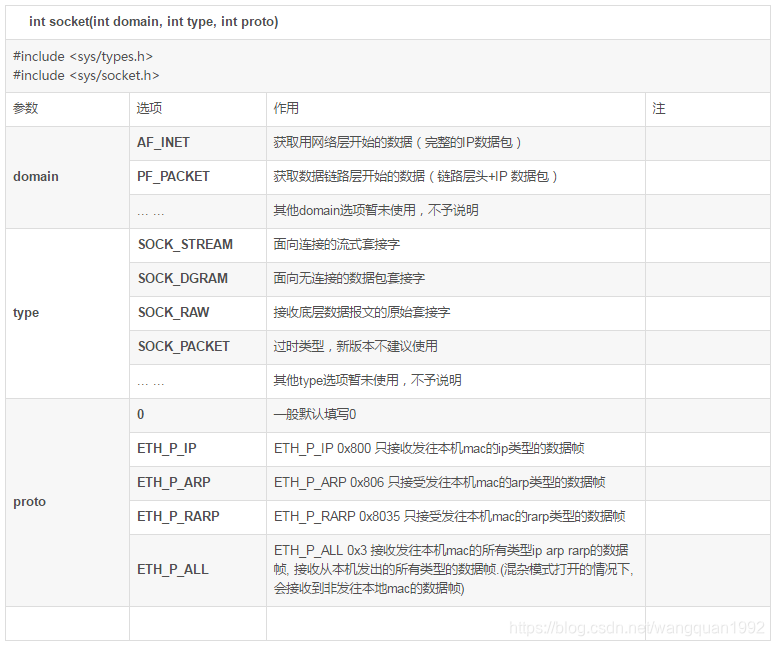

```
int socket(int domain,int type,int protocol)；
	1）domain：指定协议族，它决定了套接字的地址类型。常见的协议族有：
        AF_INET：这是最常用的协议族，用于IPv4网络协议。它使用32位的地址，通常以点分十进制的形式表示，例如 192.168.1.1。
        AF_INET6：用于IPv6网络协议。它使用128位的地址，通常以冒号分隔的十六进制形式表示，例如 2001:0db8:85a3:0000:0000:8a2e:0370:7334。
        AF_UNIX：用于Unix域协议，它允许在同一台机器上的进程之间进行通信。Unix域套接字使用文件系统路径名作为地址。
        AF_UNSPEC：不指定协议族，通常用于地址信息的初始化，允许套接字与任何协议族兼容。
        AF_NETLINK：用于用户空间和内核空间之间的通信。
        AF_PACKET：用于直接访问网络层，通常用于创建原始套接字以接收或发送链路层帧。
-------------------------------------------------------------------------------------------------------------
这些协议族定义了套接字可以使用的地址格式和通信范围。根据你的应用程序需要连接的网络类型，你会选择合适的协议族。例如，如果你正在编写一个需要与互联网上的其他主机通信的应用程序，你会使用 AF_INET 或 AF_INET6。如果你正在编写一个在同一台机器上的进程间进行通信的应用程序，你可能会使用 AF_UNIX。
-------------------------------------------------------------------------------------------------------------
    2）type：指定套接字的类型，决定了数据传输的格式和方式。常见的套接字类型有：
        SOCK_STREAM：提供一个有序、可靠、双向字节流，通常使用TCP协议。
        	需要配合connect()函数使用
        SOCK_DGRAM：提供数据报文服务，是无连接的，不可靠的，通常使用UDP协议。
        	UDP无连接的服务,已经构造好部分的数据包
        SOCK_RAW：提供原始网络协议访问。
        	自行构造数据包
    3）protocol：指定具体的协议类型。通常这个参数设置为0，表示默认协议，会根据domain和type选择合适的协议。
    	如果domain为AF_PACKET，type为SOCK_RAW，该值应为自定义的协议，ETH_P_ALL表示所有协议类型的数据包
    4）函数返回值：
        成功时，返回一个非负整数，称为套接字描述符（socket descriptor），它是后续所有套接字操作的标识。
        失败时，返回-1，并设置errno来指示错误。
```

- 可以理解AF_INET + SOCK_RAW表示内核自动封装IP层协议头，只能发送包含 TCP 报头或 UDP 报头或包含其他传输协议的报头
  - 接收方获取IP层及以上的所有报头和数据
- 可以理解AF_PACKET+SOCK_RAW表示，内核不做任何处理，需要自定义数据链路层、IP层、TCP/UDP、应用层数据
  - 如果我只需要数据链路层+数据可以使用
  - 接收方获取数据链路层及以上的所有报头和数据
- 数据链路层报头12+2
  - 12表示目的mac和源mac，2表示类型字段/长度
- IP层报头20字节
- TCP/UDP报头8/20字节

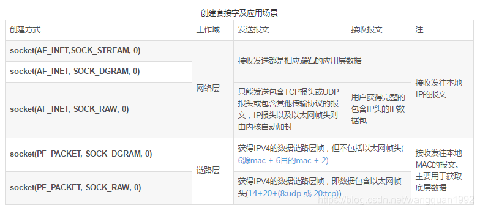


## close函数

- **功能**：关闭套接字，释放相关的系统资源。
- **原型**：

```c
#include <unistd.h>
int close(int fd);
```

- 参数：
  - `fd`：要关闭的套接字文件描述符。
- 返回值：
  - 成功时返回 0。
  - 失败时返回 -1，并设置 `errno` 指示错误类型。

# 大小端/网络主机 字节序

不同CPU中，4字节整数1在内存空间的存储方式是不同的。4字节整数1可用2进制表示如下：

00000000 00000000 00000000 00000001

有些CPU以上面的顺序存储到内存，另外一些CPU则以倒序存储，如下所示：

00000001 00000000 00000000 00000000

若不考虑这些就收发数据会发生问题，因为保存顺序的不同意味着对接收数据的解析顺序也不同。

### 大端序和小端序

CPU向内存保存数据的方式有两种：

- 大端序（Big Endian）：高位字节存放到低位地址（高位字节在前）。
- 小端序（Little Endian）：高位字节存放到高位地址（低位字节在前）。

仅凭描述很难解释清楚，不妨来看一个实例。假设在 0x20 号开始的地址中保存4字节 int 型数据 0x12345678，对于大端序，最高位字节 0x12 存放到低位地址，最低位字节 0x78 存放到高位地址。

大端序CPU保存方式如下图所示：


 																				图1：整数 0x12345678 的大端序字节表示

小端序的保存方式如下图所示：


 																				图2：整数 0x12345678 的小端序字节表示

### 网络字节序和主机字节序

网络字节序是确定的，而主机字节序是多样的。

网络字节序统一为大端序。

主机字节序既可以是大端的，也可以是小端的，现代计算机大多采用小端字节序。

不同CPU保存和解析数据的方式不同（主流的Intel系列CPU为小端序），小端序系统和大端序系统通信时会发生数据解析错误。

为了避免这个问题，约定数据在不同计算机之间传递时都采用大端字节序，也叫作网络字节序。通信时，发送方需要把数据转换成网络字节序（大端字节序）之后再发送，接收方再把网络字节序转成自己的字节序。主机A先把数据转换成大端序再进行网络传输，主机B收到数据后先转换为自己的格式再解析。

### 网络字节序转换函数(htons)

htons() 用来将当前主机字节序转换为网络字节序，其中`h`代表主机（host）字节序，`n`代表网络（network）字节序，`s`代表short，htons 是 h、to、n、s 的组合，可以理解为”将short型数据从当前主机字节序转换为网络字节序“。

常见的网络字节转换函数有：

- htons()：host to network short，将short类型数据从主机字节序转换为网络字节序。
- ntohs()：network to host short，将short类型数据从网络字节序转换为主机字节序。
- htonl()：host to network long，将long类型数据从主机字节序转换为网络字节序。
- ntohl()：network to host long，将long类型数据从网络字节序转换为主机字节序。

通常，以`s`为后缀的函数中，`s`代表2个字节short，因此用于端口号转换；以`l`为后缀的函数中，`l`代表4个字节的long，因此用于IP地址转换。

例（在这个例子中使用了htons函数）：

```
//创建sockaddr_in结构体变量
struct sockaddr_in serv_addr;
memset(&serv_addr, 0, sizeof(serv_addr));  //每个字节都用0填充
serv_addr.sin_family = AF_INET;  //使用IPv4地址
serv_addr.sin_addr.s_addr = inet_addr("127.0.0.1");  //具体的IP地址
serv_addr.sin_port = htons(1234);  //端口号
```

---


# UDP客户端服务端通信实践✨

## 客户端与服务端字符串的传递

**参考文献：**

- [UDP编程流程（UDP客户端、服务器互发消息流程）-CSDN博客](https://blog.csdn.net/BEIFEN13/article/details/138424120)

---

### 客户端代码

1、本地IP、本地端口（我是谁）

2、目的IP、目的端口（发给谁）

3、在客户端的代码中，我们只设置了目的IP、目的端口

客户端的本地ip、本地port是我们调用sendto的时候linux系统底层自动给客户端分配 的；分配端口的方式为随机分配，即每次运行系统给的port不一样

```c
#include <stdio.h>
#include <stdlib.h>
#include <netinet/in.h>
#include <arpa/inet.h>
#include <unistd.h>
#include <string.h>

int main(int argc, char const *argv[]){
    // 格式判断
    if (argc != 3) {
        fprintf(stderr, "Usage: %s <ip> <port>\n", argv[0]);
        exit(1);
    }
    int sockfd;
    struct sockaddr_in serveraddr;
    socklen_t addrlen = sizeof(serveraddr);
    char send_buf[32] = "", recv_buf[32] = "";

    // 创建套接字
    if ((sockfd = socket(AF_INET, SOCK_DGRAM, 0)) < 0) {
        perror("fail to build socket");
        exit(1);
    }

    // 填充服务器网络信息结构体
    serveraddr.sin_family = AF_INET;
    serveraddr.sin_addr.s_addr = inet_addr(argv[1]);  // 将服务端IP字符串转为整形
    serveraddr.sin_port = htons(atoi(argv[2]));  // 将字符型转为整形

    // 与服务器通信
    while (1){
        // 填充要发送数据缓存
        fgets(send_buf, sizeof(send_buf), stdin);
        // fgets会将换行符读入，将最后的换行符替代为\0
        send_buf[strlen(send_buf) - 1] = '\0';
        if (sendto(sockfd, send_buf, sizeof(send_buf), 0, (struct sockaddr *)&serveraddr, sizeof(serveraddr)) < 0){
            perror("fail to sendto");
            exit(1);
        }

        // 接受服务器发送过来的数据
        if (recvfrom(sockfd, recv_buf, sizeof(recv_buf), 0, (struct sockaddr *)&serveraddr, &addrlen) < 0){
            perror("fail to recvfrom");
            exit(1);
        }
        fprintf(stdout, "from server:%s\n", recv_buf);
    }
    close(sockfd);
    return 0;
}   
```

### 服务端代码

1、服务器之所以要bind是因为它的本地port需要是固定，而不是随机的

2、服务器也可以主动地给客户端发送数据

3、客户端也可以用bind，这样客户端的本地端口就是固定的了，但一般不这样做

```c
#include <stdio.h>
#include <stdlib.h>
#include <sys/socket.h>
#include <netinet/in.h>
#include <arpa/inet.h>
#include <unistd.h>
#include <string.h>

int main(int argc, char const *argv[]){
    // 格式判断
    if (argc != 3){
        fprintf(stderr, "Usage: %s <ip> <port>\n", argv[0]);
        exit(1);
    }

    int socket_fd;
    struct sockaddr_in serveraddr, clinetaddr;
    char recv_buf[32] = "", send_buf[32] = "";
    socklen_t addrlen = sizeof(serveraddr);

    // 创建socket
    if ((socket_fd = socket(AF_INET, SOCK_DGRAM, 0)) < 0){
        perror("faile to build socket");
        exit(1);
    }
    // 填充服务器网络数据结构
    serveraddr.sin_family = AF_INET;
    serveraddr.sin_addr.s_addr = inet_addr(argv[1]);
    serveraddr.sin_port = htons(atoi(argv[2]));
    // 绑定socket
    if ((bind(socket_fd, (struct sockaddr *)&serveraddr, addrlen)) < 0){
        perror("faile to bind");
        exit(1);
    }
    // 开始通信
    while (1){
        if (recvfrom(socket_fd, recv_buf, sizeof(recv_buf), 0, (struct sockaddr *)&clinetaddr, &addrlen) < 0){
            perror("faile to recvfrom");
            exit(1);
        }
        fprintf(stdout, "[%s - %d]:%s\n", inet_ntoa(clinetaddr.sin_addr), ntohs(clinetaddr.sin_port), recv_buf);

        // 将受到的数据进行处理，再发送给客户端
        strcpy(send_buf, recv_buf);
        strcat(send_buf, "*_*");
        if (sendto(socket_fd, send_buf, sizeof(send_buf), 0, (struct sockaddr *)&clinetaddr, addrlen) < 0){
            perror("fail to sendto");
            exit(1);
        }
    }
    close(socket_fd);
    return 0;
    
}
```

# TCP客户端服务端通信实践✨

## 1.客户端与服务端字符串的传递

**参考文献：**

- 书籍《linux高级程序设计》TCP编程9.1

需要注意发送buf和接受buf要一致

### 客户端代码

 1. 创建套接字
 2. 连接服务器
 3. 发送数据
 4. 关闭套接字

```c
/*
 * 头文件说明:
 *
 * #include <stdio.h>
 *   - 提供标准输入输出操作的功能，例如 printf 和 scanf。
 *
 * #include <stdlib.h>
 *   - 包含内存分配、进程控制、转换以及其他实用功能，例如 malloc、free 和 exit。
 *
 * #include <string.h>
 *   - 包含用于操作 C 字符串和内存块的函数，例如 strcpy、strlen 和 memset。
 *
 * #include <unistd.h>
 *   - 声明标准符号常量和类型，并提供对 POSIX 操作系统 API 的访问，例如 close、read 和 write。
 *
 * #include <arpa/inet.h>
 *   - 提供用于网络操作的定义，例如 IP 地址和端口号的转换函数，如 inet_pton 和 htons。
 *
 * #include <sys/socket.h>
 *   - 包含用于套接字编程的定义，包括套接字创建、绑定、监听和接受连接。
 *
 * #include <netinet/in.h>
 *   - 定义了互联网域地址所需的常量和结构，例如 sockaddr_in 和 INADDR_ANY。
 * 
 */
#include <stdio.h>
#include <stdlib.h>
#include <string.h>
#include <unistd.h>
#include <arpa/inet.h>
#include <sys/socket.h>
#include <netinet/in.h>
#include <time.h>

char time_str[64];  // 存储目前时间

char *getTime();  // 获得目前时间

/**
 * 客户端程序
 * 1.创建套接字
 * 2.连接服务器
 * 3.发送数据
 * 4.关闭套接字
 */
int main(int argc, char const *argv[]) {
    // 格式判断
    if (argc != 3) {
        fprintf(stderr, "Usage: %s <ip> <port>\n", argv[0]);
        exit(1);
    }
    int socked_fd;
    struct sockaddr_in serveraddr;
    char recv_buf[200] = "", send_buf[200] = "";

    // 创建套接字
    if((socked_fd = socket(AF_INET, SOCK_STREAM, 0)) == -1) {
        perror("fail to build socket");
        exit(1);
    }

    // 填充服务器网络数据结构
    serveraddr.sin_family = AF_INET;
    serveraddr.sin_addr.s_addr = inet_addr(argv[1]);
    serveraddr.sin_port = htons(atoi(argv[2]));
    bzero(&(serveraddr.sin_zero), 8);

    // 连接
    if (connect(socked_fd, (struct sockaddr *)&serveraddr, sizeof(serveraddr)) == -1) {
        perror("connect failed");
        exit(1);
    }

    // 接受连接成功信息
    if (!fork()) {
        // 子进程代码
        int recv_len = 0;
        recv_len = recv(socked_fd, recv_buf, sizeof(recv_buf), 0);
        if (recv_len == -1) {
            perror("faile to recv");
            exit(1);
        }
        getTime();
        fprintf(stdout, "\n%s\n", recv_buf);
        exit(0);
    }

    // 通信
    int recv_len = 0;
    while (1) {
        fgets(send_buf, sizeof(send_buf), stdin);
        // fgets会将换行符读入，将最后的换行符替代为\0
        send_buf[strlen(send_buf) - 1] = '\0';
        if ((send(socked_fd, send_buf, sizeof(send_buf), 0)) == -1) {
            perror("send failde");
            exit(1);
        }
        recv_len = recv(socked_fd, recv_buf, sizeof(recv_buf), 0);
        recv_buf[recv_len] = '\0';
        if (recv_len == -1) {
            perror("faile to recv");
            exit(1);
        }
        getTime();
        fprintf(stdout, "\n[%s]:%s\n", time_str, recv_buf);
    }
    close(socked_fd);
    
    return 0;
}

char *getTime() {
    time_t now = time(NULL);
    struct tm *local_time = localtime(&now);
    strftime(time_str, sizeof(time_str), "%Y-%m-%d %H:%M:%S", local_time);
    return time_str;
}
```


### 服务端代码

1.创建TCP套接字
2.绑定套接字到指定的IP地址和端口号
3.监听连接请求
4.接受连接请求
5.接收数据
6.处理数据
7.发送数据
8.关闭套接字

```c
/*
 * 头文件说明:
 *
 * #include <stdio.h>
 *   - 提供标准输入输出操作的功能，例如 printf 和 scanf。
 *
 * #include <stdlib.h>
 *   - 包含内存分配、进程控制、转换以及其他实用功能，例如 malloc、free 和 exit。
 *
 * #include <string.h>
 *   - 包含用于操作 C 字符串和内存块的函数，例如 strcpy、strlen 和 memset。
 *
 * #include <unistd.h>
 *   - 声明标准符号常量和类型，并提供对 POSIX 操作系统 API 的访问，例如 close、read 和 write。
 *
 * #include <arpa/inet.h>
 *   - 提供用于网络操作的定义，例如 IP 地址和端口号的转换函数，如 inet_pton 和 htons。
 *
 * #include <sys/socket.h>
 *   - 包含用于套接字编程的定义，包括套接字创建、绑定、监听和接受连接。
 *
 * #include <netinet/in.h>
 *   - 定义了互联网域地址所需的常量和结构，例如 sockaddr_in 和 INADDR_ANY。
 * 
 */
#include <stdio.h>
#include <stdlib.h>
#include <string.h>
#include <unistd.h>
#include <arpa/inet.h>
#include <sys/socket.h>
#include <netinet/in.h>
#include <time.h>

#define BACKLOG 10  // TCP最大连接数

char time_str[64];  // 存储目前时间

char *getTime();  // 获得目前时间
/*
    服务器端代码
    1.创建TCP套接字
    2.绑定套接字到指定的IP地址和端口号
    3.监听连接请求
    4.接受连接请求
    5.接收数据
    6.处理数据
    7.发送数据
    8.关闭套接字
*/
int main(int argc, char const *argv[]) {
    // 格式判断
    if (argc != 3) {
        fprintf(stderr, "Usage: %s <ip> <port>\n", argv[0]);
        exit(1);
    }
    int socket_fd, client_fd;
    struct sockaddr_in serveraddr, clientaddr;
    char recv_buf[200] = "", send_buf[200] = "";
    socklen_t addrlen = sizeof(serveraddr);

    // 创建socket
    if ((socket_fd = socket(AF_INET,SOCK_STREAM,0)) == -1) {
        perror("fail to build socket");
        exit(1);
    }

    // 填充服务器网络数据结构
    serveraddr.sin_family = AF_INET;
    serveraddr.sin_addr.s_addr = inet_addr(argv[1]);
    serveraddr.sin_port = htons(atoi(argv[2])); // 使用 atoi 将字符串转换为整数
    bzero(&(serveraddr.sin_zero), 8);

    // 绑定socket
    if ((bind(socket_fd, (struct sockaddr *)&serveraddr, addrlen)) == -1) {
        perror("fail to bind");
        exit(1);
    }
    
    // 监听连接请求
    if ((listen(socket_fd, BACKLOG)) == -1) {
        perror("listen failed");
        exit(1);
    }
    
    // 接受连接请求
    int clientlen = sizeof(struct sockaddr_in);
    client_fd = accept(socket_fd, (struct sockaddr *)&clientaddr, &clientlen);
    if (client_fd == -1){
        perror("accept failed");
        exit(1);
    }

    // 打印客户端连接信息
    if (!fork()) {
        // 子进程代码
        // 获取当前系统时间
        getTime();
        fprintf(stdout, "\n[%s]:连接客户端成功\n  ip:%s  port:%d\n", 
                time_str, inet_ntoa(clientaddr.sin_addr), ntohs(clientaddr.sin_port));
        // 发送连接成功信息
        sprintf(send_buf, "[%s]:连接服务端成功\n  ip:%s  port:%d\n", time_str, argv[1], atoi(argv[2]));
        if((send(client_fd, send_buf, sizeof(send_buf), 0)) == -1) {
            perror("fail to send");
            exit(1);
        }
        exit(0);
    }

    
    // 通信部分
    int recv_len = 0;
    while (1) {
        recv_len = recv(client_fd, recv_buf, sizeof(recv_buf), 0);
        if (recv_len == -1) {
            perror("faile to recv");
            exit(1);
        }
        recv_buf[recv_len] = '\0'; // 确保字符串以 '\0' 结尾
        char modified_buf[200]; // 假设 recv_buf 最大长度为 32，加上头尾字符需要额外空间
        getTime();
        sprintf(modified_buf, "*_*%s*_*", recv_buf);
        fprintf(stdout, "\n[%s]:%s\n", time_str, modified_buf);
        if ((send(client_fd, modified_buf, sizeof(modified_buf), 0)) == -1) {
            perror("send failde");
            exit(1);
        }
    }
    close(client_fd);
    close(socket_fd);
    return 0;
}


char *getTime() {
    time_t now = time(NULL);
    struct tm *local_time = localtime(&now);
    strftime(time_str, sizeof(time_str), "%Y-%m-%d %H:%M:%S", local_time);
    return time_str;
}
```


## 2.客户端与服务端双向聊天

**参考文献：**

- 书籍《linux高级程序设计》TCP编程9.2.6程序扩展思考

**思路：**

- 这个程序既集成了客户端，也集成了服务器端：当没有参数时，程序是服务器端；当有作为IP地址和端口的参数时，程序是客户端。
- 程序的服务端运行一开始就会有提示，显示自己服务器端主机的P地址，以方便客户端连接。
- 程序每次聊天信息的发出都会附加上时间，并且退出后会有聊天的记录和退出的记录。
- 程序中使用了多线程的方法，解决了程序阻塞的问题，使得聊天程序不用等待（回答和响应可同时运行）。

### 全部代码(服务端单线程)

```c
#include <stdio.h>      // 标准输入输出头文件，用于printf、scanf等函数
#include <stdlib.h>     // 标准库头文件，用于malloc、free、exit等函数
#include <string.h>     // 字符串操作头文件，用于strlen、strcpy等函数
#include <unistd.h>     // UNIX标准头文件，用于read、write、close等系统调用
#include <arpa/inet.h>  // 提供IP地址转换函数和网络编程相关定义
#include <sys/socket.h> // 套接字编程头文件，用于socket、bind、listen等函数
#include <time.h>       // 时间相关头文件，用于获取和操作时间
#include <pthread.h>   // 线程编程头文件，用于创建和管理线程
#include <netinet/in.h> // 提供互联网地址族的定义和结构体

#define BACKLOG 10  // TCP最大连接数
#define SERVER_PORT 9999  // 默认端口号
#define EXIT "exit"  // 退出命令

typedef struct {
    int sockFd; // 套接字
    char type[10];  // 标识客户端/服务器
    char *ip; // IP地址
} threadArgs;  // 用于传递多线程参数

char sendBuf[200] = "", recvBuf[200] = "";
char time_str[64];  // 存储目前时间
void *PthreadRecv(void *arg);  // 新建一个子线程处理recv
char *getTime();  // 获得目前时间
FILE *fp; // 文件指针，用于记录聊天信息

/*
- 这个程序既集成了客户端，也集成了服务器端：当没有参数时，程序是服务器端；当有作为IP地址和端口的参数时，程序是客户端。
- 程序的服务端运行一开始就会有提示，显示自己服务器端主机的IP地址，以方便客户端连接。
- 程序每次聊天信息的发出都会附加上时间，并且退出后会有聊天的记录和退出的记录。
- 程序中使用了多线程的方法，解决了程序阻塞的问题，使得聊天程序不用等待（回答和响应可同时运行）。
*/
int main(int argc, char const *argv[]) {
    if (argc != 1 && argc != 3) {
        fprintf(stdout, "Usage: %s or %s <ip> <port>\n", argv[0], argv[0]);
        exit(1);
    }
    /**
     * 服务端代码
     * TODO：服务端添加文件操作
     * 1.sockServer, sockClient
     * 2.bind
     * 3.listen
     * 4.accept
     * 5.send/recv
     * 注意：
     *  1.recv与send需要两个线程控制
     *  2.文件要记录
     *      [时间] 聊天者(服务端/客户端)：内容
     *      ----聊天者，离开了---
     */
    if (argc == 1) {
        struct sockaddr_in sockServer, sockClient;
        int sockServerFd, sockClientFd;
        socklen_t sockClientLen = sizeof(sockClient);
        sockServerFd = socket(AF_INET, SOCK_STREAM, 0);
        if (sockServerFd == -1) {
            fprintf(stderr, "[%s] fail to create socket\n", getTime());
            exit(1);
        }
        // 需要将输入保存到日志中
        if ((fp = fopen("log_server.txt", "a+")) == NULL) {
            fprintf(stderr, "[%s] fail to open file\n", getTime());
            exit(1);
        }
        sockServer.sin_family = AF_INET;
        sockServer.sin_addr.s_addr = INADDR_ANY;  // 绑定到所有可用的IP地址
        sockServer.sin_port = htons(SERVER_PORT);
        bzero(&(sockServer.sin_zero), 8);
        if (bind(sockServerFd, (struct sockaddr *)&sockServer, sizeof(sockServer)) == -1) {
            fprintf(stderr, "[%s] fail to bind\n", getTime());
            exit(1);
        }
        //输出服务器的IP地址，端口号
        fprintf(stdout, "Server IP:");
        fflush(stdout);
        system("ifconfig | grep inet | head -n 1 | awk '{print $2}'");
        fprintf(stdout, "Server Port:%d\n", SERVER_PORT);
        if (listen(sockServerFd, BACKLOG) == -1) {
            fprintf(stderr, "[%s] fail to listen\n", getTime());
            exit(1);
        }
        // 循环accept，确保每一个客户端都能连接
        while (1) {
            if ((sockClientFd = accept(sockServerFd, (struct sockaddr *)&sockClient, &sockClientLen)) == -1) {
                fprintf(stderr, "[%s] fail to accept\n", getTime());
                continue;
                // TODO：真正的循环accept
            } else break;
        }
        //向客户端发送连接成功的消息，本地打印远程连接客户端的IP地址
        fprintf(stdout, "[%s] 成功连接到客户端：%s:%d\n", getTime(), inet_ntoa(sockClient.sin_addr), ntohs(sockClient.sin_port));
        strcpy(sendBuf, "成功连接到服务器");
        if (send(sockClientFd, sendBuf, sizeof(sendBuf), 0) == -1) {
            fprintf(stderr, "[%s] fail to send\n", getTime());
            exit(1);
        }
        //多线程处理recv
        pthread_t pthreadId;
        threadArgs args = {sockClientFd, "client", inet_ntoa(sockClient.sin_addr)};
        if ((pthread_create(&pthreadId, NULL, PthreadRecv, &args)) != 0) {
            fprintf(stderr, "[%s] fail to create thread\n", getTime());
            exit(1);
        }
        //当前进程处理send
        while (1) {
            fgets(sendBuf, sizeof(sendBuf), stdin);
            // fgets会将\n读入，需要替换为\0
            sendBuf[strlen(sendBuf) - 1] = '\0';
            // 记录聊天信息到文件
            fprintf(fp, "[%s] %s(%s): %s\n", getTime(), inet_ntoa(sockClient.sin_addr), args.type, sendBuf);
            fflush(fp);  // 实时刷新文件
            if ((send(sockClientFd, sendBuf, sizeof(sendBuf), 0)) == -1) {
                fprintf(stderr, "[%s] faile to send\n", getTime());
                exit(1);
            }
            if (strcmp(sendBuf, EXIT) == 0) {
                fprintf(stdout, "[%s] 服务端已退出\n", getTime());
                fprintf(fp, "[%s] 服务端已退出\n", getTime());
                fflush(fp);  // 实时刷新文件
                break;
            }
        }
        close(sockClientFd);
        fclose(fp);
        close(sockServerFd);
    } else {
        /**
         * 客户端代码
         * 1.sockServer
         * 2.connect
         * 3.send/recv
         * 注意：
         *  1.recv与send需要两个线程控制
         *  2.文件要记录
         *      [时间] 聊天者(服务端/客户端)：内容
         *      ----聊天者，离开了---
         */
        if ((fp = fopen("log_client.txt", "a+")) == NULL) {
            fprintf(stderr, "[%s] fail to open file\n", getTime());
            exit(1);
        }
        struct sockaddr_in sockServer;
        int sockfd = socket(AF_INET, SOCK_STREAM, 0);
        if (sockfd == -1) {
            fprintf(stderr, "[%s] fail to create socket\n", getTime());
            exit(1);
        }
        sockServer.sin_family = AF_INET;
        sockServer.sin_addr.s_addr = inet_addr(argv[1]);   
        sockServer.sin_port = htons(atoi(argv[2]));  // 使用 atoi 将字符串转换为整数
        bzero(&(sockServer.sin_zero), 8);
        if (connect(sockfd, (struct sockaddr *)&sockServer, sizeof(sockServer)) == -1) {
            fprintf(stderr, "[%s] fail to connect\n", getTime());
            exit(1);
        }
        // 在和服务器端建立连接后，需要获取本地IP
        struct sockaddr_in localAddr;
        socklen_t addrLen = sizeof(localAddr);
        if (getsockname(sockfd, (struct sockaddr *)&localAddr, &addrLen) == -1) {
            fprintf(stderr, "[%s] fail to get local IP\n", getTime());
            exit(1);
        }
        fprintf(stdout, "[%s] Client IP: %s, Client Port: %d\n", 
                getTime(), inet_ntoa(localAddr.sin_addr), ntohs(localAddr.sin_port));


        //接收连接成功的消息
        int recvBytes = recv(sockfd, recvBuf, sizeof(recvBuf), 0);
        if (recvBytes == -1) {
            fprintf(stderr, "[%s] fail to recv\n", getTime());
            exit(1);
        }
        recvBuf[recvBytes] = '\0';
        fprintf(stdout, "[%s] %s ServerIP: %s ServerPort: %d\n", getTime(), recvBuf, inet_ntoa(sockServer.sin_addr), ntohs(sockServer.sin_port));
        //多线程处理recv
        pthread_t pthreadId;
        threadArgs args = {sockfd, "server", inet_ntoa(sockServer.sin_addr)};
        if ((pthread_create(&pthreadId, NULL, PthreadRecv, &args)) != 0) {
            fprintf(stderr, "[%s] fail to create thread\n", getTime());
            exit(1);
        }  
        //当前进程处理send
        while (1) {
            fgets(sendBuf, sizeof(sendBuf), stdin);
            // fgets会将\n读入，需要替换为\0
            sendBuf[strlen(sendBuf) - 1] = '\0';
            // 记录聊天信息到文件
            fprintf(fp, "[%s] %s(%s): %s\n", getTime(), inet_ntoa(sockServer.sin_addr), args.type, sendBuf);
            fflush(fp);  // 实时刷新文件
            if ((send(sockfd, sendBuf, sizeof(sendBuf), 0)) == -1) {
                fprintf(stderr, "[%s] faile to send\n", getTime());
                exit(1);
            }
            if (strcmp(sendBuf, EXIT) == 0) {
                fprintf(stdout, "[%s] 客户端已退出\n", getTime());
                fprintf(fp, "[%s] 客户端已退出\n", getTime());
                fflush(fp);  // 实时刷新文件
                break;
            }
        }
        close(sockfd);
        fclose(fp);
    }
    return 0;
}

void *PthreadRecv(void *arg) {
    threadArgs args = *(threadArgs *)arg;
    int recvBytes = 0;
    while (1) {
        recvBytes = recv(args.sockFd, recvBuf, sizeof(recvBuf), 0);
        if (recvBytes == -1) {
            fprintf(stderr, "[%s] fail to recv\n", getTime());
            exit(1);
        } else if (strcmp(recvBuf, EXIT) == 0) {
            fprintf(stdout, "[%s] 对方(%s)已退出\n", getTime(), args.ip);
            fprintf(fp, "[%s] 对方(%s)已退出\n", getTime(), args.ip);
            fflush(fp);  // 实时刷新文件
            fclose(fp);
            exit(0);  // 不需要关闭套接字，因为主进程发送要用到
        }
        recvBuf[recvBytes] = '\0';
        fprintf(stdout, "[%s] %s(%s): %s\n", getTime(), args.ip, args.type, recvBuf);
        // 记录聊天信息到文件
        fprintf(fp, "[%s] %s(%s): %s\n", getTime(), args.ip, args.type, recvBuf);
        fflush(fp);  // 实时刷新文件
    }
    pthread_exit((void *)1);
}

char *getTime() {
    time_t now = time(NULL);
    struct tm *local_time = localtime(&now);
    strftime(time_str, sizeof(time_str), "%Y-%m-%d %H:%M:%S", local_time);
    return time_str;
}
```

### 全部代码（服务端多线程处理TCP连接，多线程处理recv消息）✨✨

```c
#include <stdio.h>      // 标准输入输出头文件，用于printf、scanf等函数
#include <stdlib.h>     // 标准库头文件，用于malloc、free、exit等函数
#include <string.h>     // 字符串操作头文件，用于strlen、strcpy等函数
#include <unistd.h>     // UNIX标准头文件，用于read、write、close等系统调用
#include <arpa/inet.h>  // 提供IP地址转换函数和网络编程相关定义
#include <sys/socket.h> // 套接字编程头文件，用于socket、bind、listen等函数
#include <time.h>       // 时间相关头文件，用于获取和操作时间
#include <pthread.h>   // 线程编程头文件，用于创建和管理线程
#include <netinet/in.h> // 提供互联网地址族的定义和结构体

#define BACKLOG 10  // TCP最大连接数
#define SERVER_PORT 9999  // 默认端口号
#define EXIT "exit"  // 退出命令

typedef struct {
    int sockFd; // 套接字
    char type[10];  // 标识客户端/服务器
    char *ip; // IP地址
} threadArgs;  // 用于传递多线程参数

typedef struct {
    int sockFd; // 套接字
    struct sockaddr_in clientAddr; // 客户端地址
} threadArgsServer;  // 主线程开辟多个子线程处理TCP连接

char sendBuf[200] = "", recvBuf[200] = "";
char time_str[64];  // 存储目前时间
FILE *fp; // 文件指针，用于记录聊天信息
int sockClientFdList[1024], cntList;

void *PthreadRecv(void *arg);  // 新建一个子线程处理recv
char *getTime();  // 获得目前时间
void *handleClient(void *args);  // 新建一个子线程处理TCP连接


/*
- 这个程序既集成了客户端，也集成了服务器端：当没有参数时，程序是服务器端；当有作为IP地址和端口的参数时，程序是客户端。
- 程序的服务端运行一开始就会有提示，显示自己服务器端主机的IP地址，以方便客户端连接。
- 程序每次聊天信息的发出都会附加上时间，并且退出后会有聊天的记录和退出的记录。
- 程序中使用了多线程的方法，解决了程序阻塞的问题，使得聊天程序不用等待（回答和响应可同时运行）。
多线程进行recv和send，存在的问题：
    对于服务端的send，只有一个线程可以fgets输入，其他线程无法输入。
    	解决方法：记录每一个通信套接字，接受stdin的内容后统一发送
*/
int main(int argc, char const *argv[]) {
    if (argc != 1 && argc != 3) {
        fprintf(stdout, "Usage: %s or %s <ip> <port>\n", argv[0], argv[0]);
        exit(1);
    }
    /**
     * 服务端代码
     * TODO：服务端添加文件操作
     * 1.sockServer, sockClient
     * 2.bind
     * 3.listen
     * 4.accept
     * 5.send/recv
     * 注意：
     *  1.recv与send需要两个线程控制
     *  2.文件要记录
     *      [时间] 聊天者(服务端/客户端)：内容
     *      ----聊天者，离开了---
     */
    if (argc == 1) {
        struct sockaddr_in sockServer, sockClient;
        int sockServerFd, sockClientFd;
        socklen_t sockClientLen = sizeof(sockClient);
        sockServerFd = socket(AF_INET, SOCK_STREAM, 0);
        if (sockServerFd == -1) {
            fprintf(stderr, "[%s] fail to create socket\n", getTime());
            exit(1);
        }
        // 需要将输入保存到日志中
        if ((fp = fopen("log_server.txt", "a+")) == NULL) {
            fprintf(stderr, "[%s] fail to open file\n", getTime());
            exit(1);
        }
        sockServer.sin_family = AF_INET;
        sockServer.sin_addr.s_addr = INADDR_ANY;  // 绑定到所有可用的IP地址
        sockServer.sin_port = htons(SERVER_PORT);
        bzero(&(sockServer.sin_zero), 8);
        if (bind(sockServerFd, (struct sockaddr *)&sockServer, sizeof(sockServer)) == -1) {
            fprintf(stderr, "[%s] fail to bind\n", getTime());
            exit(1);
        }
        //输出服务器的IP地址，端口号
        fprintf(stdout, "Server IP:");
        fflush(stdout);
        system("ifconfig | grep inet | head -n 1 | awk '{print $2}'");
        fprintf(stdout, "Server Port:%d\n", SERVER_PORT);
        if (listen(sockServerFd, BACKLOG) == -1) {
            fprintf(stderr, "[%s] fail to listen\n", getTime());
            exit(1);
        }
        // 循环accept，确保客户端能连接
        while (1) {
            if ((sockClientFd = accept(sockServerFd, (struct sockaddr *)&sockClient, &sockClientLen)) == -1) {
                fprintf(stderr, "[%s] fail to accept\n", getTime());
                continue;
            }
            sockClientFdList[cntList++] = sockClientFd;
            //向客户端发送连接成功的消息，本地打印远程连接客户端的IP地址
            fprintf(stdout, "[%s] 成功连接到客户端：%s:%d\n", getTime(), inet_ntoa(sockClient.sin_addr), ntohs(sockClient.sin_port));
            strcpy(sendBuf, "成功连接到服务器");
            if (send(sockClientFd, sendBuf, sizeof(sendBuf), 0) == -1) {
                fprintf(stderr, "[%s] fail to send\n", getTime());
                exit(1);
            }
            /**
             * 需要开一个线程处理这个TCP连接的通信，主进程只需要连接TCP即可
             */
            // 为每个客户端创建线程
            pthread_t clientThread;
            // 将子线程需要的通信套接字、客户端地址传入
            // 我们需要Malloc一个结构体来传递参数,不可以直接传递局部变量，因为下一个线程会覆盖掉
            threadArgsServer *args = (threadArgsServer *)malloc(sizeof(threadArgsServer));
            if (args == NULL) {
                fprintf(stderr, "[%s] fail to allocate memory\n", getTime());
                close(sockClientFd);
                continue;
            }
            args->sockFd = sockClientFd;
            args->clientAddr = sockClient;
            if (pthread_create(&clientThread, NULL, handleClient, args) != 0) {
                fprintf(stderr, "[%s] fail to create thread\n", getTime());
                close(sockClientFd);
            } else {
                // 分离线程，避免资源泄漏
                pthread_detach(clientThread);
            }
        }
        close(sockServerFd);
        fclose(fp);
    } else {
        /**
         * 客户端代码
         * 1.sockServer
         * 2.connect
         * 3.send/recv
         * 注意：
         *  1.recv与send需要两个线程控制
         *  2.文件要记录
         *      [时间] 聊天者(服务端/客户端)：内容
         *      ----聊天者，离开了---
         */
        if ((fp = fopen("log_client.txt", "a+")) == NULL) {
            fprintf(stderr, "[%s] fail to open file\n", getTime());
            exit(1);
        }
        struct sockaddr_in sockServer;
        int sockfd = socket(AF_INET, SOCK_STREAM, 0);
        if (sockfd == -1) {
            fprintf(stderr, "[%s] fail to create socket\n", getTime());
            exit(1);
        }
        sockServer.sin_family = AF_INET;
        sockServer.sin_addr.s_addr = inet_addr(argv[1]);   
        sockServer.sin_port = htons(atoi(argv[2]));  // 使用 atoi 将字符串转换为整数
        bzero(&(sockServer.sin_zero), 8);
        if (connect(sockfd, (struct sockaddr *)&sockServer, sizeof(sockServer)) == -1) {
            fprintf(stderr, "[%s] fail to connect\n", getTime());
            exit(1);
        }
        // 在和服务器端建立连接后，需要获取本地IP
        struct sockaddr_in localAddr;
        socklen_t addrLen = sizeof(localAddr);
        if (getsockname(sockfd, (struct sockaddr *)&localAddr, &addrLen) == -1) {
            fprintf(stderr, "[%s] fail to get local IP\n", getTime());
            exit(1);
        }
        fprintf(stdout, "[%s] Client IP: %s, Client Port: %d\n", 
                getTime(), inet_ntoa(localAddr.sin_addr), ntohs(localAddr.sin_port));


        //接收连接成功的消息
        int recvBytes = recv(sockfd, recvBuf, sizeof(recvBuf), 0);
        if (recvBytes == -1) {
            fprintf(stderr, "[%s] fail to recv\n", getTime());
            exit(1);
        }
        recvBuf[recvBytes] = '\0';
        fprintf(stdout, "[%s] %s ServerIP: %s ServerPort: %d\n", getTime(), recvBuf, inet_ntoa(sockServer.sin_addr), ntohs(sockServer.sin_port));
        //多线程处理recv
        pthread_t pthreadId;
        threadArgs args = {sockfd, "server", inet_ntoa(sockServer.sin_addr)};
        if ((pthread_create(&pthreadId, NULL, PthreadRecv, &args)) != 0) {
            fprintf(stderr, "[%s] fail to create thread\n", getTime());
            exit(1);
        }  
        //当前进程处理send
        while (1) {
            fgets(sendBuf, sizeof(sendBuf), stdin);
            // fgets会将\n读入，需要替换为\0
            sendBuf[strlen(sendBuf) - 1] = '\0';
            // 记录聊天信息到文件
            fprintf(fp, "[%s] %s(%s): %s\n", getTime(), inet_ntoa(sockServer.sin_addr), args.type, sendBuf);
            fflush(fp);  // 实时刷新文件
            if ((send(sockfd, sendBuf, sizeof(sendBuf), 0)) == -1) {
                fprintf(stderr, "[%s] faile to send\n", getTime());
                exit(1);
            }
            if (strcmp(sendBuf, EXIT) == 0) {
                fprintf(stdout, "[%s] 客户端已退出\n", getTime());
                fprintf(fp, "[%s] 客户端已退出\n", getTime());
                fflush(fp);  // 实时刷新文件
                break;
            }
        }
        close(sockfd);
        fclose(fp);
    }
    return 0;
}

void *PthreadRecv(void *arg) {
    char str[200] = "";
    threadArgs args = *(threadArgs *)arg;
    int recvBytes = 0;
    while (1) {
        recvBytes = recv(args.sockFd, str, sizeof(str), 0);
        if (recvBytes == -1) {
            fprintf(stderr, "[%s] fail to recv\n", getTime());
            exit(1);
        } else if (strcmp(str, EXIT) == 0) {
            fprintf(stdout, "[%s] 对方(%s)已退出\n", getTime(), args.ip);
            fprintf(fp, "[%s] 对方(%s)已退出\n", getTime(), args.ip);
            fflush(fp);  // 实时刷新文件
            exit(0);  // 子线程不需要关闭文件，因为主线程要用
        } else {
            str[recvBytes] = '\0';
            fprintf(stdout, "[%s] %s(%s): %s\n", getTime(), args.ip, args.type, str);
            // 记录聊天信息到文件
            fprintf(fp, "[%s] %s(%s): %s\n", getTime(), args.ip, args.type, str);
            fflush(fp);  // 实时刷新文件
        }
    }
    pthread_exit((void *)1);
}

char *getTime() {
    time_t now = time(NULL);
    struct tm *local_time = localtime(&now);
    strftime(time_str, sizeof(time_str), "%Y-%m-%d %H:%M:%S", local_time);
    return time_str;
}

void *handleClient(void *arg) {
    threadArgsServer argsServer = *(threadArgsServer *)arg;
    int sockClientFd = argsServer.sockFd;
    struct sockaddr_in sockClient = argsServer.clientAddr;
    //多线程处理recv
    pthread_t pthreadId;
    threadArgs args = {sockClientFd, "client", inet_ntoa(sockClient.sin_addr)};
    if ((pthread_create(&pthreadId, NULL, PthreadRecv, &args)) != 0) {
        fprintf(stderr, "[%s] fail to create thread\n", getTime());
        exit(1);
    }
    //当前进程处理send
    while (1) {
        fgets(sendBuf, sizeof(sendBuf), stdin);
        // fgets会将\n读入，需要替换为\0
        sendBuf[strlen(sendBuf) - 1] = '\0';
        // 记录聊天信息到文件
        fprintf(fp, "[%s] %s(%s): %s\n", getTime(), inet_ntoa(sockClient.sin_addr), args.type, sendBuf);
        fflush(fp);  // 实时刷新文件
        for (int i = 0; i < cntList; ++i) {
            if ((send(sockClientFdList[i], sendBuf, sizeof(sendBuf), 0)) == -1) {
                fprintf(stderr, "[%s] faile to send\n", getTime());
                exit(1);
            }
        }
        if (strcmp(sendBuf, EXIT) == 0) {
            fprintf(stdout, "[%s] 服务端已退出\n", getTime());
            fprintf(fp, "[%s] 服务端已退出\n", getTime());
            fflush(fp);  // 实时刷新文件
            break;
        }
    }
    for (int i = 0; i < cntList; ++i) 
        close(sockClientFdList[i]);
    pthread_exit((void *)1);
}
```

### 全部代码（服务端使用select实现非阻塞TCP连接，select实现非阻塞处理recv消息，select实现非阻塞处理send消息）✨✨

**参考文献：**

- [细谈select函数（C语言）_c语言 select-CSDN博客](https://blog.csdn.net/engineer0/article/details/120668996)

**需求：**


**思路(服务端)：**

- 在linsten之后调用select监控网络套接字和stdin
  - select超时：表示没有连接请求/没有数据接受/stdin没有输入
  - select返回大于0：
    - 有连接请求：将新的套接字加入监控集合
    - 有输入接受：输出到stdou上
    - stdin有输入：发送给客户端

#### 客户端代码

```c
#include <stdio.h>      // 标准输入输出头文件，用于printf、scanf等函数
#include <stdlib.h>     // 标准库头文件，用于malloc、free、exit等函数
#include <string.h>     // 字符串操作头文件，用于strlen、strcpy等函数
#include <unistd.h>     // UNIX标准头文件，用于read、write、close等系统调用
#include <arpa/inet.h>  // 提供IP地址转换函数和网络编程相关定义
#include <sys/socket.h> // 套接字编程头文件，用于socket、bind、listen等函数
#include <time.h>       // 时间相关头文件，用于获取和操作时间
#include <pthread.h>   // 线程编程头文件，用于创建和管理线程
#include <netinet/in.h> // 提供互联网地址族的定义和结构体
#include <sys/select.h>  // 提供select函数的头文件

#define max(a,b) ((a) > (b) ? (a) : (b))

char time_str[64];  // 存储目前时间

char *getTime();

/**
 * 客户端代码
 * 1.sockServer
 * 2.connect
 * 3.send/recv
 * 注意：
 *  1.recv与send需要两个线程控制
 *  2.文件要记录
 *      [时间] 聊天者(服务端/客户端)：内容
 *      ----聊天者，离开了---
 */
int main(int argc, char const *argv[]) {
    // 格式判断
    if (argc != 3) {
        fprintf(stderr, "Usage: %s <ip> <port>\n", argv[0]);
        exit(1);
    }
    int socked_fd;
    struct sockaddr_in serveraddr;
    char recv_buf[200] = "", send_buf[200] = "";

    // 创建套接字
    if((socked_fd = socket(AF_INET, SOCK_STREAM, 0)) == -1) {
        perror("fail to build socket");
        exit(1);
    }

    // 填充服务器网络数据结构
    serveraddr.sin_family = AF_INET;
    serveraddr.sin_addr.s_addr = inet_addr(argv[1]);
    serveraddr.sin_port = htons(atoi(argv[2]));
    bzero(&(serveraddr.sin_zero), 8);

    // 连接
    if (connect(socked_fd, (struct sockaddr *)&serveraddr, sizeof(serveraddr)) == -1) {
        perror("connect failed");
        exit(1);
    }
    /**
     * 使用select将stdin和socked_fd加入监听，处理recv和send
     *  stdin用于发送消息
     *  socked_fd用于接受消息
     */

    fd_set listenList, cpyList;
    FD_ZERO(&listenList);
    FD_SET(fileno(stdin), &listenList);
    FD_SET(socked_fd, &listenList);
    int maxFd = max(fileno(stdin), socked_fd) + 1;
    while (1) {
        cpyList = listenList;
        int res = select(maxFd, &cpyList, NULL, NULL, NULL);
        if (res < 1) {
            perror("select failed");
            break;
        }
        for (int i = 0; i < maxFd; ++i) {
            if (FD_ISSET(i, &cpyList)) {
                if (i == fileno(stdin)) {
                    // stdin有数据
                    fgets(send_buf, sizeof(send_buf), stdin);
                    // fgets会将换行符读入，将最后的换行符替代为\0
                    send_buf[strlen(send_buf) - 1] = '\0';
                    if ((send(socked_fd, send_buf, sizeof(send_buf), 0) == -1)) {
                        perror("send failed");
                        break;
                    }
                    if (strcmp(send_buf, "exit") == 0) {
                        fprintf(stdout, "exit\n");
                        close(socked_fd);
                        exit(0);
                    }
                } else if (i == socked_fd) {
                    // 服务器端有数据
                    int recvBytes = recv(socked_fd, recv_buf, sizeof(recv_buf), 0);
                    if (recvBytes == -1) {
                        perror("recv failed");
                        break;
                    } else if (recvBytes == 0) {
                        fprintf(stdout, "server closed\n");
                        close(socked_fd);
                        exit(0);
                    } else {
                        recv_buf[recvBytes] = '\0';
                        getTime();
                        fprintf(stdout, "\n[%s]:%s\n", time_str, recv_buf);
                    }
                }
            }
        }
    }
    close(socked_fd);
    
    return 0;
}

char *getTime() {
    time_t now = time(NULL);
    struct tm *local_time = localtime(&now);
    strftime(time_str, sizeof(time_str), "%Y-%m-%d %H:%M:%S", local_time);
    return time_str;
}
```


#### 服务端代码

```c
/*
 * 头文件说明:
 *
 * #include <stdio.h>
 *   - 提供标准输入输出操作的功能，例如 printf 和 scanf。
 *
 * #include <stdlib.h>
 *   - 包含内存分配、进程控制、转换以及其他实用功能，例如 malloc、free 和 exit。
 *
 * #include <string.h>
 *   - 包含用于操作 C 字符串和内存块的函数，例如 strcpy、strlen 和 memset。
 *
 * #include <unistd.h>
 *   - 声明标准符号常量和类型，并提供对 POSIX 操作系统 API 的访问，例如 close、read 和 write。
 *
 * #include <arpa/inet.h>
 *   - 提供用于网络操作的定义，例如 IP 地址和端口号的转换函数，如 inet_pton 和 htons。
 *
 * #include <sys/socket.h>
 *   - 包含用于套接字编程的定义，包括套接字创建、绑定、监听和接受连接。
 *
 * #include <netinet/in.h>
 *   - 定义了互联网域地址所需的常量和结构，例如 sockaddr_in 和 INADDR_ANY。
 * 
 */
#include <stdio.h>
#include <stdlib.h>
#include <string.h>
#include <unistd.h>
#include <arpa/inet.h>
#include <sys/socket.h>
#include <netinet/in.h>
#include <time.h>
#include <sys/select.h>

#define BACKLOG 10  // TCP最大连接数
#define max(a,b) ((a) > (b) ? (a) : (b))

char time_str[64];  // 存储目前时间
int sockClientFdList[1024], cntList; // 用于存储客户端套接字列表

char *getTime();  // 获得目前时间
/*
    服务器端代码
    1.创建TCP套接字
    2.绑定套接字到指定的IP地址和端口号
    3.监听连接请求
    4.接受连接请求
    5.接收数据
    6.处理数据
    7.发送数据
    8.关闭套接字
*/
int main(int argc, char const *argv[]) {
    // 格式判断
    if (argc != 3) {
        fprintf(stderr, "Usage: %s <ip> <port>\n", argv[0]);
        exit(1);
    }
    for (int i = 0; i < 1024; ++i) sockClientFdList[i] = -1;
    int socket_fd, client_fd;
    struct sockaddr_in serveraddr, clientaddr;
    char recv_buf[200] = "", send_buf[200] = "";
    socklen_t addrlen = sizeof(serveraddr);

    // 创建socket
    if ((socket_fd = socket(AF_INET,SOCK_STREAM,0)) == -1) {
        perror("fail to build socket");
        exit(1);
    }

    // 填充服务器网络数据结构
    serveraddr.sin_family = AF_INET;
    serveraddr.sin_addr.s_addr = inet_addr(argv[1]);
    serveraddr.sin_port = htons(atoi(argv[2])); // 使用 atoi 将字符串转换为整数
    bzero(&(serveraddr.sin_zero), 8);

    // 绑定socket
    if ((bind(socket_fd, (struct sockaddr *)&serveraddr, addrlen)) == -1) {
        perror("fail to bind");
        exit(1);
    }
    
    // 监听连接请求
    if ((listen(socket_fd, BACKLOG)) == -1) {
        perror("listen failed");
        exit(1);
    }

    /**
     * 使用select监听socket_fd、stdin、sockClientFdList
     *  socket_fd用于接受连接请求
     *  stdin用于发送消息
     *  sockClientFdList用于接受消息套接字
     */
    fd_set listenList, cpyList;
    FD_ZERO(&listenList);
    FD_SET(fileno(stdin), &listenList);
    FD_SET(socket_fd, &listenList);
    int maxFd = max(fileno(stdin), socket_fd) + 1;
    while (1) {
        cpyList = listenList;
        int res = select(maxFd, &cpyList, NULL, NULL, NULL);
        if (res < 1) {
            perror("select failed");
            break;
        }
        for (int i = 0; i < maxFd; ++i) {
            if (FD_ISSET(i, &cpyList)) {
                if (i == fileno(stdin) && cntList) {
                    // 处理标准输入
                    fgets(send_buf, sizeof(send_buf), stdin);
                    send_buf[strlen(send_buf) - 1] = '\0'; // 去掉换行符
                    int j = 0;
                    while (j < cntList) {
                        if (sockClientFdList[j] == -1) {
                            ++j;
                            continue;
                        }
                        if ((send(sockClientFdList[j], send_buf, sizeof(send_buf), 0)) == -1) {
                            perror("send failed");
                            exit(1);
                        }
                        ++j;
                    }
                } else if (i == socket_fd) {
                    // 接受连接请求
                    socklen_t clientlen = sizeof(clientaddr);
                    client_fd = accept(socket_fd, (struct sockaddr *)&clientaddr, &clientlen);
                    if (client_fd == -1){
                        perror("accept failed");
                        exit(1);
                    }
                    for (int i = 0; i < 1024; ++i) {
                        if (sockClientFdList[i] == -1) {
                            sockClientFdList[i] = client_fd;
                            ++cntList;
                            break;
                        }
                    }
                    FD_SET(client_fd, &listenList);
                    // 这个很重要，需要实时更新最大文件句柄
                    maxFd = max(maxFd, client_fd) + 1;
                    getTime();
                    fprintf(stdout, "\n[%s]:连接客户端成功\n  ip:%s  port:%d\n", 
                            time_str, inet_ntoa(clientaddr.sin_addr), ntohs(clientaddr.sin_port));
                    // 发送连接成功信息
                    sprintf(send_buf, "[%s]:连接服务端成功\n  ip:%s  port:%d\n", time_str, argv[1], atoi(argv[2]));
                    if((send(client_fd, send_buf, sizeof(send_buf), 0)) == -1) {
                        perror("fail to send");
                        exit(1);
                    }
                } else {
                    int recvBytes = recv(i, recv_buf, sizeof(recv_buf), 0);
                    if (recvBytes == -1) {
                        perror("recv failed");
                        exit(1);
                    } else if (recvBytes == 0) {
                        // 客户端关闭连接
                        close(i);
                        FD_CLR(i, &listenList);
                        for (int j = 0; j < cntList; ++j) {
                            if (sockClientFdList[j] == i) {
                                sockClientFdList[j] = -1;
                                --cntList;
                                break;
                            }
                        }
                        fprintf(stdout, "[%s]:客户端已断开连接\n", getTime());
                    } else {
                        recv_buf[recvBytes] = '\0'; // 确保字符串以 '\0' 结尾
                        getTime();
                        fprintf(stdout, "\n[%s]:%s\n", time_str, recv_buf);
                    }
                }
            }
        }
    }
    close(client_fd);
    close(socket_fd);
    return 0;
}


char *getTime() {
    time_t now = time(NULL);
    struct tm *local_time = localtime(&now);
    strftime(time_str, sizeof(time_str), "%Y-%m-%d %H:%M:%S", local_time);
    return time_str;
}
```


## 3.客户端发送文件到服务端

**参考文献：**

- 书籍《linux高级程序设计》TCP编程

客户端在Linux下运行，服务端在win下编译运行

```bash
gcc -o recvFile.exe recvFile.c -lwsock32
```

### 客户端代码

```c
#include <stdio.h>      // 标准输入输出库，用于文件操作、输入输出等功能
#include <stdlib.h>     // 标准库，提供内存分配、进程控制、随机数生成等功能
#include <string.h>     // 字符串操作库，提供字符串处理函数，如strlen, strcpy等
#include <netinet/in.h> // 定义Internet地址族相关的结构和常量，如sockaddr_in结构
#include <sys/socket.h> // 提供套接字编程的基本接口，如socket, bind, listen, accept等
#include <sys/types.h>  // 定义数据类型，用于与系统调用相关的操作
#include <netdb.h>      // 提供与网络数据库相关的操作，如主机名和IP地址的解析
#include <arpa/inet.h>  // 提供 inet_addr 函数的声明
#include <unistd.h>  // 提供 close 函数的声明
#include <time.h>  // 提供 time 函数的声明

char *getTime();  // 函数声明，用于获取当前时间的字符串

#define SIGN 0xAABBCCDD // 检验标记
#define MAXSIZE 1024 // 最大数据包大小

typedef struct {
    int sign; // 检验标记
    int fileSize; // 文件字节大小
    char fileName[256]; // 文件名
} headData; // 头数据包结构体

char sendBuf[MAXSIZE];  // 发送缓冲区
char time_str[64];  // 存储目前时间

/**
 * 从文件中读取二进制数据发送
 */
int main(int argc, char const *argv[]) {
    if(argc != 4) {
        fprintf(stderr, "Usage: %s <ip> <port> <filename>\n", argv[0]);
        exit(1);
    }
    /**
     * 1.sock
     * 2.connect
     * 3.send
     */
    int sockFd;
    struct sockaddr_in sockServer;
    sockFd = socket(AF_INET, SOCK_STREAM, 0);
    if (sockFd == -1) {
        fprintf(stderr, "[%s] fail to create socket\n", getTime());
        exit(1);
    }
    sockServer.sin_family = AF_INET;
    sockServer.sin_addr.s_addr = inet_addr(argv[1]);
    sockServer.sin_port = htons(atoi(argv[2]));
    memset(&(sockServer.sin_zero), 0, 8); // 清零结构体的剩余部分
    if (connect(sockFd, (struct sockaddr *)&sockServer, sizeof(struct sockaddr)) == -1) {
        fprintf(stderr, "[%s] fail to connect\n", getTime());
        exit(1);
    }
    /**
     * 初始化头数据包
     *  1.检验标记
     *  2.文件字节大小
     *  3.文件名
     * 将头数据通过memcpy拷贝到字符串数组发送到服务器，服务器端接收后，使用memcpy将数据拷贝到头数据包结构体中
     */
    headData head;
    head.sign = SIGN;
    strcpy(head.fileName, argv[3]);
    FILE *fp = fopen(argv[3], "rb+");
    fseek(fp, 0, SEEK_END);
    head.fileSize = ftell(fp);
    fseek(fp, 0, SEEK_SET);
    // 通过memcpy将头数据拷贝到发送缓冲区, 需要注意先通过memcpy将发送缓冲区清零
    memset(sendBuf, 0, sizeof(sendBuf));
    memcpy(sendBuf, &head, sizeof(head));
    printf("file size: %d\n", head.fileSize);
    if ((send(sockFd, sendBuf, sizeof(head), 0)) == -1) {
        fprintf(stderr, "[%s] fail to send\n", getTime());
        exit(1);
    }
    /**
     * 发送文件的二进制数据
     * 1.每次读取MAXSIZE大小的数据
     * 2.通过send发送数据实际读取的字节大小
     * 3.通过feof判断文件是否读取完毕
     */
    int readBytes = 0;
    while (!feof(fp)) {
        readBytes = fread(sendBuf, sizeof(char), MAXSIZE, fp);
        if (readBytes == -1) {
            fprintf(stderr, "[%s] fail to read file\n", getTime());
            exit(1);
        }
        if ((send(sockFd, sendBuf, readBytes, 0)) == -1) {
            fprintf(stderr, "[%s] fail to send file\n", getTime());
            exit(1);
        }
    }
    /**
     * 关闭套接字、文件描述符
     */
    close(sockFd);
    fclose(fp);
    fprintf(stdout, "[%s] file %d size %s send success\n", getTime(), head.fileSize, argv[3]);

    return 0;
}

char *getTime() {
    time_t now = time(NULL);
    struct tm *local_time = localtime(&now);
    strftime(time_str, sizeof(time_str), "%Y-%m-%d %H:%M:%S", local_time);
    return time_str;
}
```


### 服务端代码

```c
#include <stdio.h>      // 标准输入输出库，用于文件操作、输入输出等功能
#include <stdlib.h>     // 标准库，用于内存分配、进程控制等功能
#include <string.h>     // 字符串处理库，用于字符串操作函数
#include <time.h>      // 时间处理库，用于获取当前时间
#include <winsock2.h>  // Windows Socket API，用于网络编程

#define SIGN 0xAABBCCDD // 检验标记
#define MAXSIZE 1024 // 最大数据包大小

typedef struct {
    int sign; // 检验标记
    int fileSize; // 文件字节大小
    char fileName[256]; // 文件名
} headData; // 头数据包结构体

char recvBuf[MAXSIZE];  // 接受缓冲区
FILE *fp; // 文件指针

/**
 * 从网络接受二进制数据，存到文件中
 */
int main(int argc, char const *argv[]) {
    if (argc != 3) {
        printf("Usage: %s <ip> <port>\n", argv[0]);
        exit(1);
    }
    /**
     * 1.sock,sockaddr_in
     * 2.bind
     * 3.listen
     * 4.accept
     * 5.recv
     */
    WSADATA wsa;
    WSAStartup(MAKEWORD(2, 2), &wsa); // 初始化Winsock

    SOCKET sockFd, remoteFd;
    struct sockaddr_in sockServer, sockRemote;
    sockFd = socket(AF_INET, SOCK_STREAM, IPPROTO_TCP);
    if (sockFd == -1) {
        printf("fail to create socket\n");
        exit(1);
    }
    sockServer.sin_family = AF_INET;
    sockServer.sin_addr.s_addr = inet_addr(argv[1]); // 绑定到所有可用的接口
    sockServer.sin_port = htons(atoi(argv[2]));
    memset(&(sockServer.sin_zero), 0, 8); // 清零结构体的剩余部分
    if (bind(sockFd, (struct sockaddr *)&sockServer, sizeof(sockServer)) == -1) {
        printf("fail to bind\n");
        WSACleanup(); // 清理Winsock
        exit(1);
    }
    // 通过getsockbyname函数得到本地的IP和端口
    // char hostName[256];
    // HOSTENT *hostent = NULL;
    // gethostname(hostName, sizeof(hostName));
    // hostent = gethostbyname(hostName);
    // if (hostent == NULL) {
    //     printf("fail to get host name\n");
    //     WSACleanup(); // 清理Winsock
    //     exit(1);
    // }
    // struct in_addr *hostAddr = (struct in_addr *)*(hostent->h_addr_list);
    printf("IP: %s Port: %s\n", argv[1], argv[2]);
    if (listen(sockFd, 10) == -1) {
        printf("fail to listen\n");
        WSACleanup(); // 清理Winsock
        exit(1);
    }
    int addrLen = sizeof(struct sockaddr_in);
    while (1) {
        printf("waiting for client...\n");
        remoteFd = accept(sockFd, (struct sockaddr *)&sockRemote, &addrLen);
        if (remoteFd == -1) {
            printf("fail to accept\n");
            WSACleanup(); // 清理Winsock
            exit(1);
        }
        // 对于每一个TCP连接，都要打印发送端的IP和端口
        printf("RemoteIP: %s RemotePort: %d\n", inet_ntoa(sockRemote.sin_addr), ntohs(sockRemote.sin_port));
        /**
         * 1.接收头数据包
         *      1.检验标记
         *      2.初始化头数据包
         * 2.接收文件数据
         * 3.保存文件
         */
        headData head;
        int recvSize = recv(remoteFd, recvBuf, sizeof(headData), 0);
        if (recvSize == -1) {
            printf("fail to recv\n");
            WSACleanup(); // 清理Winsock
            exit(1);
        }
        memcpy(&head, recvBuf, sizeof(headData)); // 将接收到的数据拷贝到头数据包结构体中
        if (head.sign != SIGN) {
            // 签名有问题，需要重新接受文件
            printf("sign error\n");
        } else {
            // 签名没有问题
            fp = fopen(head.fileName, "wb+");
            int writeBytes = 0, remainBytes = head.fileSize;
            while (writeBytes < head.fileSize) {
                if ((recvSize = recv(remoteFd, recvBuf, MAXSIZE, 0)) == -1) {
                    printf("fail to recv file\n");
                    WSACleanup(); // 清理Winsock
                    exit(1);
                }
                if (remainBytes >= MAXSIZE) {
                    fwrite(recvBuf, sizeof(char), MAXSIZE, fp);
                    writeBytes += MAXSIZE;
                    remainBytes -= MAXSIZE;
                }else {
                    fwrite(recvBuf, sizeof(char), remainBytes, fp);
                    writeBytes += remainBytes;
                    remainBytes = 0;
                }
                printf("\rFinished:%.2f%% total %d bytes, recved %d bytes", writeBytes * 1.0 / head.fileSize * 100, head.fileSize, writeBytes);
            }
            printf("recv file %s success, total %d bytes\n", head.fileName, head.fileSize);
            fclose(fp);
        }
    }
    WSACleanup(); // 清理Winsock
    return 0;
}
```


# 原始套接字服务端通信实践✨

## IP层及以上协议（需要网卡IP地址）

**AF_INET+SOCK_PACKET**

TODO:LINUX网络编程11.4复现ARP、第13章复现代码

## 数据链路层及以上协议（需要网卡MAC地址）✨✨✨

**参考文献：**

- [原始套接字 - 常羲和 - 博客园 (cnblogs.com)](https://www.cnblogs.com/dijun666/articles/17761033.html)

**AF_PACKET+SOCK_PACKET**

**与TCP/UDP不同的在于需要填充socket_ll结构体，需要根据网卡昵称获取网卡的index索引值**

### 1. 原始套接字的概述

> 原始套接字(SOCK_RAM)的可执行文件必须`sudo`执行

- 一种不同于SOCK_STREAM、SOCK_DGRAM的套接字，它实现于系统核心
- 可以接收本机网卡上所有的数据帧(数据包)，对于监听网络流量和分析网络数据很有作用
- 开发人员可发送自己组装的数据包到网络上
- 广泛应用于高级网络编程

不同套接字之间的比较：

- 流式套接字(SOCK_STREAM)只能收发TCP协议的数据
- 数据报套接字(SOCK_DGRAM)只能收发UDP协议的数据
- 原始套接字(SOCK_RAW)可以收发
  - 内核没有处理的数据包，因此而访问其他协议
  - 发送的数据需要使用原始套接字(SOCK_RAW)

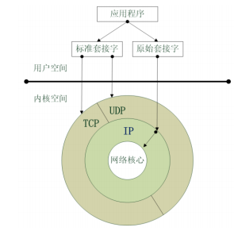


### 2.1 recvfrom接收数据报

#### 2.1.1 接收mac报文数据

```c
ssize_t recvfrom(int socket,void *restrict buffer,size_t length,int flags,struct sockaddr *restrict_address,socket_len *restrict_address_len);
```

【注】因为接收的数据在链路层，无法确认IP地址及端口号，因此最后两个参数置为NULL

#### 2.1.2 组包与解包

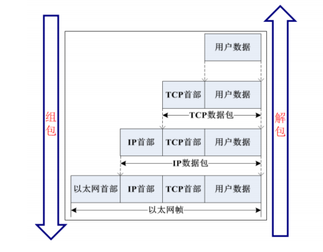

创建原始套接字：

```c
// 创建原始套接字
int sock_fd = socket(PF_PACKET, SOCK_RAW, htons(ETH_P_ALL));
if (sock_fd < 0)
{
    perror("raw socket");
    return -1;
}
printf("原始套接字创建成功\n");
```

接连接层的数据报文

```c
unsigned char buf[1518]="";
int len = recvfrom(sock_fd,buf,sizeof(buf),0,NULL,NULL);
if(len<18)
{
    perror("recvfrom");
    continue;
}
```

MAC数据报文拆解

```c
unsigned char dst_mac[18] = "";
unsigned char src_mac[18] = "";
unsigned short mac_type = ntohs(*((unsigned short *)(buf + 12)));
sprintf(dst_mac, "%02x:%02x:%02x:%02x:%02x:%02x",
buf[0], buf[1], buf[2], buf[3], buf[4], buf[5]);
sprintf(src_mac, "%02x:%02x:%02x:%02x:%02x:%02x",
buf[6], buf[7], buf[8], buf[9], buf[10], buf[11]);
// if (strncmp(src_mac, "00:00:00", 8) != 0)
printf("%s->%s type(%04x)\n", src_mac, dst_mac, mac_type);
```

IP报文拆解

```c
if(mac_type==0x800)
{
    printf("-----ip数据报------\n");
    //拆解IP数据报
    unsigned char*ip_buf = buf+14;
    //读取IP首部长度：单位是4字节
    unsigned char ip_head_len = (ip_buf[0]&0x0f)*4;
    printf("IP数据报的首部长度：%d bytes\n",ip_head_len);
    //读取协议类型
    unsigned char ip_type = ip_buf[9];
    //读取源IP和目的IP
    unsigned char src_ip[16]="";
    unsigned char dst_ip[16]="";
    inet_ntop(AF_INET,(unsigned int*)(ip_buf + 12),src_ip,16);
    inet_ntop(AF_INET,(unsigned int*)(ip_buf + 16),src_ip,16);
    switch(ip_type)
    {
        case 1:
            printf("\t----ICMP数据报-----\n");
            break;
        case 2:
            printf("\t----IGMP数据报-----\n");
            break;
        case 6:
            printf("\t----TCP数据报-----\n");
            break;
        case 17:
            printf("\t----UDP数据报-----\n");
            break;
    }
    printf("\t %s -> %s\n",src_ip,dst_ip);
}
```

UDP报文拆解：

```c
//拆解UDP的数据报
unsigned char *udp_buf = ip_buf + ip_head_len;
unsigned short src_port = ntohs(*((unsigned short *)udp_buf));
unsigned short dst_port = ntohs(*((unsigned short *)(udp_buf+2)));
//UDP的数据报的长度，由首部+数据长度(偶数)
unsigned short udp_buf_len = ntohs(*((unsigned short *)(udp_buf+4)));
char udp_data[128]="";
strncpy(udp_data,udp_buf+8,udp_buf_len-8);
printf("\t\t %d -> %d data: %s\n",src_port,dst_port,udp_data);
```

【注】程序最后需要关闭原始套接字：close(sock_fd);

### 3.2 sendto发送数据

#### 3.2.1 发送帧数据

```c
int snedto(sock_raw_fd,msg,msg_len,0,(struct sockaddr*)&sll,sizeof(sll));
```

参数说明：

- sock_raw_fd：原始套接字
- msg：发送的消息(封装好的协议数据)
- sll：本机网络接口，指发送的数据应该从本机的哪个网卡出去，而不是以前的目的地址

#### 3.2.2 sockaddr_ll结构体

sll的类型struct sockaddr_ll

```cpp
#include <netpacket/packet.h>
struct sockaddr_ll sll;
```

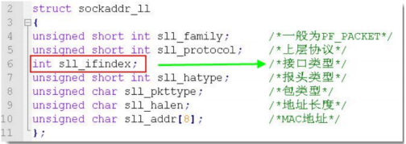

只需要对sll.sll_ifindex赋值即可，最好也对其他赋值

#### 3.2.3 ioctl获取网络接口

```cpp
#include <sys/ioctl.h>
int ioctl(int fd, int request, void *ifreq_val);
```

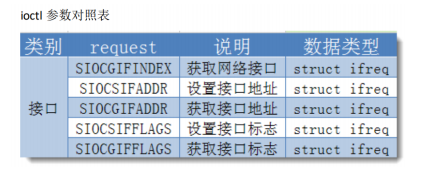

ifreq结构体：它是POSIX标准中定义的

```c
#include <net/if.h>
IFNAMSIZ 16

struct ifreq {
    char ifr_name[IFNAMSIZ]; /* 接口名称 */
    union {
        struct sockaddr ifr_addr; /* 接口地址 */
        struct sockaddr ifr_dstaddr; /* 目标地址 */
        struct sockaddr ifr_broadaddr; /* 广播地址 */
        struct sockaddr ifr_netmask; /* 子网掩码 */
        struct sockaddr ifr_hwaddr; /* 硬件地址 */
        short ifr_flags; /* 接口标志 */
        int ifr_ifindex; /* 接口索引 */
        int ifr_metric; /* 接口度量值 */
        int ifr_mtu; /* 最大传输单元 */
        ...
    } ifr_data;
};
```

#### 3.2.4 封装sendto函数

```c
ssize_t my_sendto(int socket, const void *message, size_t length, char *if_name)
{
    //获取接口
    struct ifreq ethreq;
    strncpy(ethreq.ifr_name, if_name, IFNAMSIZ);
    if (-1 == ioctl(socket, SIOCGIFINDEX, &ethreq))
    {
        perror("ioctl");
        close(socket);
        _exit(-1);
    }
    //定义接口结构
    struct sockaddr_ll sll;
    bzero(&sll, sizeof(sll));
    sll.sll_ifindex = ethreq.ifr_ifindex;
    //发送帧数据
    int len = sendto(socket, message, length, 0, (struct sockaddr *)&sll,sizeof(sll));
    return len;
}
```

如：

arp报文简化说明：

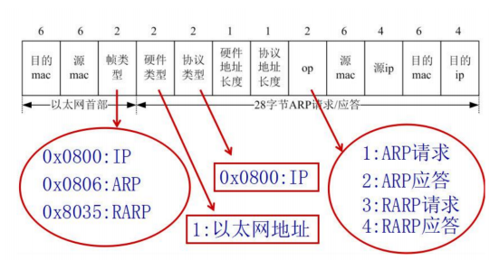

单播ARP应答

```c
#include <arpa/inet.h>
#include <netinet/ether.h>
#include <netinet/in.h>
#include <netpacket/packet.h>
#include <sys/ioctl.h>
#include <net/if.h>
#include <unistd.h>
#include <string.h>
#include <stdio.h>

ssize_t send_datapacket(int fd, unsigned char *buf, ssize_t buf_size, const char *ether_name)
{
    // 1. 获取网络接口类型
    struct ifreq ether_req;
    bzero(&ether_req, sizeof(ether_req));
    strncpy(ether_req.ifr_name, ether_name, IF_NAMESIZE);
    if (ioctl(fd, SIOCGIFINDEX, &ether_req) == -1)
    {
        perror("ioctl");
        return -1;
    }
    // 2. 选择发送数据的网络接口索引
    struct sockaddr_ll sll;
    bzero(&sll, sizeof(sll));
    sll.sll_ifindex = ether_req.ifr_ifindex;
    // 3. 发送数据
    ssize_t len = sendto(fd, buf, buf_size, 0, (struct sockaddr *)&sll,sizeof(sll));
    return len;
}

int main(int argc, char const *argv[])
{
    // 创建原始套接字
    int sock_fd = socket(PF_PACKET, SOCK_RAW, htons(ETH_P_ALL));
    if (sock_fd < 0)
    {
        perror("raw socket");
        return -1;
    }
    // 组ARP应答报文 (如果是ARP欺骗， 则源mac全为0)
    uint32_t src_ip = inet_addr("10.12.156.207");
    uint32_t dst_ip = inet_addr("10.12.156.223");
    unsigned char *src_ip_p = (unsigned char *)&src_ip;
    unsigned char *dst_ip_p = (unsigned char *)&dst_ip;
    unsigned char buf[] = {
        0x00, 0x0c, 0x29, 0xe3, 0x4e, 0x7c, /*目标的mac*/
        0x00, 0x0c, 0x29, 0x81, 0x71, 0x7b, /*源的mac*/
        0x08, 0x06, /*ARP帧类型*/
        0x00, 0x1, /*硬件类型*/
        0x08, 0x00, /*协议类型*/
        6, 4, /*硬件地址长度和协议地址长度*/
        0, 2, /*OP, 2表示应答ARP*/
        0x00, 0x0c, 0x29, 0x81, 0x71, 0x7b, /*发送端mac*/
        src_ip_p[0], src_ip_p[1], src_ip_p[2], src_ip_p[3], /*发送端的IP*/
        0x00, 0x0c, 0x29, 0xe3, 0x4e, 0x7c, /*接收端的mac*/
        dst_ip_p[0], dst_ip_p[1], dst_ip_p[2], dst_ip_p[3] /*接收端的IP*/
    };
    // 单播 发送arp应答
    ssize_t len = send_datapacket(sock_fd, buf, sizeof(buf), "ens33");
    if (len > 0)
    {
        printf("发送ARP应答报文成功\n");
    }
    close(sock_fd);
    return 0;
}
```


# TSN协议报文格式✨

**参考文献：**

- [QinQ帧格式 - IP 报文格式大全 - 华为 (huawei.com)](https://support.huawei.com/enterprise/zh/doc/EDOC1100174722/e4e9d43e)
- [IEEE 802.1Q封装的VLAN数据帧格式 - 华为 (huawei.com)](https://support.huawei.com/enterprise/zh/doc/EDOC1100088136)
- [时间敏感网络 - 维基百科，自由的百科全书 --- Time-Sensitive Networking - 维基百科，自由的百科全书 (wikipedia.org)](https://en.wikipedia.org/wiki/Time-Sensitive_Networking)

## 普通的VLAN帧格式

要使交换机能够分辨不同VLAN的报文，需要在报文中添加标识VLAN信息的字段。IEEE 802.1Q协议规定，在以太网数据帧的目的MAC地址和源MAC地址字段之后、协议类型字段之前加入4个字节的VLAN标签（又称VLAN Tag，简称Tag），用于标识数据帧所属的VLAN。VLAN标签在VLAN数据帧中的位置如[图1-1](https://support.huawei.com/enterprise/zh/doc/EDOC1100088136#zh-cn_topic_0000002119205817_fig208591149121117)所示。

**图1-1** IEEE 802.1Q封装的VLAN数据帧格式
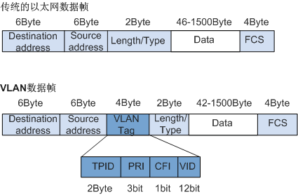

在一个VLAN交换网络中，以太网帧主要有以下两种形式：

- 有标记帧（Tagged帧）：加入了4字节VLAN标签的帧。
- 无标记帧（Untagged帧）：原始的、未加入4字节VLAN标签的帧。

以太网链路包括接入链路（Access Link）和干道链路（Trunk Link）。接入链路用于连接交换机和用户终端（如用户主机、服务器、傻瓜交换机等），只可以承载1个VLAN的数据帧。干道链路用于交换机间互连或连接交换机与路由器，可以承载多个不同VLAN的数据帧。在接入链路上传输的帧都是Untagged帧，在干道链路上传输的数据帧都是Tagged帧。

交换机内部处理的数据帧一律都是Tagged帧。从用户终端接收无标记帧后，交换机会为无标记帧添加VLAN标签，重新计算帧校验序列(FCS)，然后通过干道链路发送帧；向用户终端发送帧前，交换机会去除VLAN标签，并通过接入链路向终端发送无标记帧。

VLAN标签包含4个字段，各字段含义如[表1-1](https://support.huawei.com/enterprise/zh/doc/EDOC1100088136#zh-cn_topic_0000002119205817_table986072415153)所示：

**表1-1** VLAN标签各字段含义

| 字段 | 长度  | 含义                                                         | 取值                                                         |
| ---- | ----- | ------------------------------------------------------------ | ------------------------------------------------------------ |
| TPID | 2Byte | Tag Protocol Identifier（标签协议标识符），表示数据帧类型。  | 取值为0x8100时表示IEEE 802.1Q的VLAN数据帧。如果不支持802.1Q的设备收到这样的帧，会将其丢弃。各设备厂商可以自定义该字段的值。当邻居设备将TPID值配置为非0x8100时， 为了能够识别这样的报文，实现互通，必须在本设备上修改TPID值，确保和邻居设备的TPID值配置一致。 |
| PRI  | 3bit  | Priority，表示数据帧的802.1p优先级。                         | 取值范围为0～7，值越大优先级越高。当网络阻塞时，交换机优先发送优先级高的数据帧。 |
| CFI  | 1bit  | Canonical Format Indicator（标准格式指示位），表示MAC地址在不同的传输介质中是否以标准格式进行封装，用于兼容以太网和令牌环网。 | CFI取值为0表示MAC地址以标准格式进行封装，为1表示以非标准格式封装。在以太网中，CFI的值为0。 |
| VID  | 12bit | VLAN ID，表示该数据帧所属VLAN的编号。                        | VLAN ID取值范围是0～4095。由于0和4095为协议保留取值，所以VLAN ID的有效取值范围是1～4094。 |


## QinQ报文封装格式（VLAN帧扩展）

因为IEEE 802.1Q中定义的VLAN Tag域只有12个比特，仅能表示4096个VLAN，无法满足城域以太网中标识大量用户的需求，于是产生了QinQ技术，拓展VLAN的数量空间。QinQ在原有的802.1Q报文的基础上增加一层802.1Q标签，使得VLAN数量增加到4094×4094。

在公网的传输过程中，设备只根据外层VLAN Tag转发报文，并根据报文的外层VLAN Tag进行MAC地址学习，而用户的内层VLAN Tag将被当作报文的数据部分进行传输。QinQ的内外层标签可以代表不同的信息，如内层标签代表用户，外层标签代表业务。

**图1-2** 802.1Q封装和QinQ封装
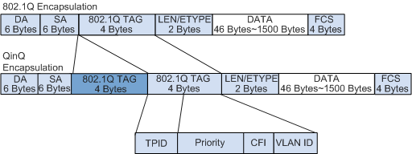

**帧大小**

QinQ报文比802.1Q报文多四个字节，因此建议用户在组网时适当增加运营商网络中各接口的最大帧长（至少为1504 字节）。目前交换机缺省支持的最大帧长超过1504字节，不需要手动配置。

**TPID**

不同运营商的系统可能将QinQ帧外层VLAN标记的TPID设置为不同值。为实现与这些系统的兼容性，可以修改TPID值，使QinQ帧发送到公网时，承载与特定运营商相同的TPID值，从而实现与该运营商设备之间的互操作性。VLAN数据帧的TPID与不带VLAN标记的帧的协议类型字段位置相同，为避免在网络中转发和处理数据包时出现问题，不可将TPID值设置为[表1-2](https://support.huawei.com/enterprise/zh/doc/EDOC1100088136#zh-cn_topic_0000002083646078_table1682372219449)中的任意值。

**表1-2** 协议类型字段数值及其表示的协议

| 对应值               | 协议类型 |
| -------------------- | -------- |
| 0x0806               | ARP      |
| 0x8035               | RARP     |
| 0x0800               | IP       |
| 0x86DD               | IPv6     |
| 0x8863/0x8864        | PPPoE    |
| 0x8847/0x8848        | MPLS     |
| 0x8137               | IPX/SPX  |
| 0x8809               | LACP     |
| 0x888E               | 802.1x   |
| 0x88A7               | HGMP     |
| 0xFFFD/0xFFFE/0xFFFF | 设备保留 |


# 其他协议报文格式✨✨✨

> 使用原始套接字进行编程开发时，首先要对不同协议的数据包进行学习，需要手动对IP、TCP、UDP、ICMP等包头进行组装或者拆解

**2.1 协议在各层的关系**

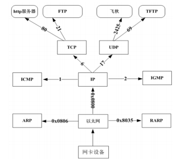

**2.2 组装/拆解数据包流程**

【MAC|ARP|RARP】【IP|ICMP|IGMP】【TCP|UDP】【数据】

> 发送方：组装数据报文
>
> 接收方：拆解数据报文

**2.3 UDP报文格式**

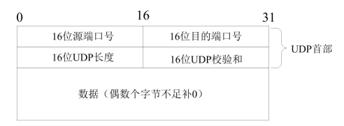

- 源端口号：发送方端口号
- 目的端口号：接收方端口号
- 长度：UDP用户数据包的长度，最小值是8字节(仅有首部)
- 校验和：检测UDP用户数据报在传输中是否有错，有错就丢弃

**2.4 IP报文**

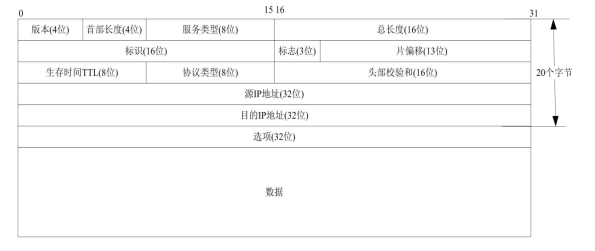

首部长度占4位：单位是4字节

协议类型：1- ICMP 2- IGMP 6- TCP 17-UDP

**2.5 MAC报文**

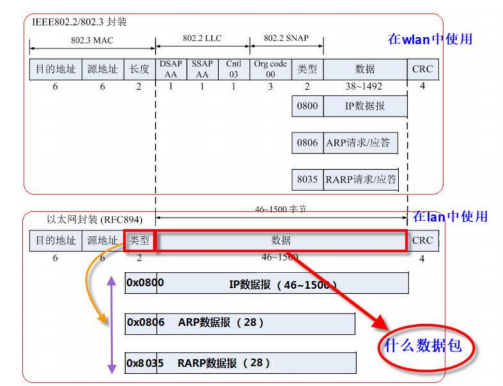

以太网的MAC报文

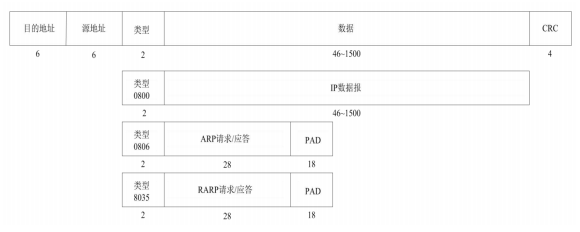

**2.6 TCP报文**

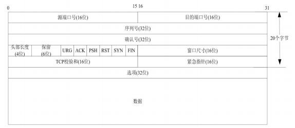

- 源端口号：发送方端口号
- 目的端口号：接收方端口号
- 序列号：本报文段的数据的第一个字节的序号
- 确认序号：期望收到对方下一个报文段的第一个数据字节的序号
- 首部长度(数据偏移)：TCP报文段的数据起始处距离TCP报文段的起始处有多远，即首部长度，单位：32位，即以4字节为计算单位
- 保留：占6位，保留为今后使用，目前应置为0
- 紧急URG：此位置1，表明紧急指针字段有效，它告诉系统此报文段中有紧急数据，应尽快传送
- 确认ACK：仅当ACK=1时确认字段才有效，TCP规定，在连接建立后所有传达的报文段都必须把ACK置1
- 推送PSH：当两个应用进程进行交互式的通信时，有时在一端的应用进程希望在键入一个命令后立即就能收到对方的响应，在这种情况下，TCP就可以使用推送(push)操作，这时，发送方TCP把PSH置1，并立即创建一个报文段发送出去，接收方收到PSH=1的报文段，就尽快地(即“推送”向前)交付给接收应用进程，而不再等到整个缓存都填满后再向上交付
- 复位RST：用于复位相应的TCP连接
- 同步SYN：仅在三次握手建立TCP连接时有效，当SYN=1而ACK=0时，表明这时一个连接请求报文段，对方若同意建立连接，则应在相应的报文段中使用SYN=1和ACK=1，因此SYN置1就表示这是一个连接请求或连接接收报文
- 终止FIN：用来释放一个连接。当FIN=1时，表明此报文段中的紧急数据的字节数(紧急数据结束后就是普通数据)，即指出了紧急数据的末尾在报文中的位置，注意：即使窗口为零时也可以发送紧急数据
- 选项：长度可变，最长达40字节，当没有使用选项时，TCP首部长度是20字节

**2.7 ICMP报文**

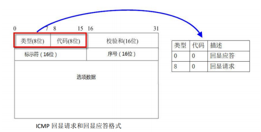

【注】不同的类型值以及代码值，代表不同的功能

**2.8 ARP报文**

###### 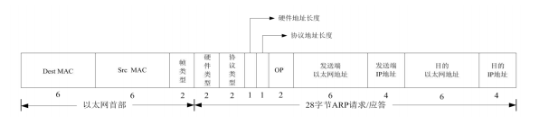

- Dest MAC：目的MAC地址
- Src MAC：源MAC地址
- 帧类型： 0x0806
- 硬件类型：1(以太网)
- 协议类型：0x0800(IP)
- 硬件地址长度：6
- 协议地址长度：4
- OP：1(ARP请求) ，2(ARP应答)，3(RARP请求)，4(RARP应答)


