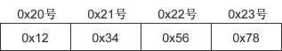

# 工具

## 网络调试助手NetAssist


## 抓包工具Wireshark


# 基础知识

带宽

```
概念：数据带宽是正在使用的数据传输速率的同义词，定义了一个数据链路的最大容量
例如
    一个10Mbps的铜线局域网不能承受速率高于10Mbps的流量
    一个使用600MBps调制解调器的卫星链路不能传输任何高于600Mbps的流量
```

吞吐量

```
概念：吞吐量是通过网络传输的真实数据量，也可以认为是在单位时间内通过网络从你的计算机到WEB服务器来回传输的真实数据量
```

信道利用率

```
信道利用率=吞吐量/带宽*100%
```


# 网络编程

## 网络四层


## socket 套接口数据结构✨

```
sockaddr、sockaddr_in、sockaddr_un、sockaddr_ll的区别以及使用场景
sockaddr*数据结构，sockaddr_in用于网络层通信（IP），sockaddr_ll用于数据链路层通信（mac）
	1)sockaddr：
        struct sockaddr
          { 
            sa_family_t sa_family; // 2字节
            char sa_data[14] //14字节
          };
    2)sockaddr_in
        struct sockaddr_in
          {
            sa_family_t sin_family;//协议族 2字节，一般为AF_INET
            in_port_t sin_port;//端口号 2字节, 使用网络字节顺序
            struct in_addr sin_addr;//ip地址 4字节
            char sin_zero[8]//填充，不起什么作用 8字节
          };
      3)sockaddr_un
      	sockaddr_un 主要用于 UNIX 域套接字（Unix Domain Sockets），通常与 AF_UNIX 地址族一起使用
      4)sockaddr_ll
      	sockaddr_ll 主要用于链路层（Link Layer）通信，通常与 AF_PACKET 地址族一起使用
      	struct sockaddr_ll {
            unsigned short sll_family;    // 地址族，通常为 AF_PACKET
            __be16 sll_protocol;          // 上层协议类型
            int sll_ifindex;              // 接口索引
            unsigned short sll_hatype;    // 硬件类型
            unsigned char sll_pkttype;    // 包类型
            unsigned char sll_halen;      // 地址长度
            unsigned char sll_addr;    // 物理层地址（如 MAC 地址）
    	};
```

### sockaddr

- **定义**：这是一个通用的套接字地址结构体，其定义位于 `<sys/socket.h>` 头文件中。

```c
struct sockaddr {
    sa_family_t sa_family;  // 地址族
    char        sa_data[14];  // 信息
};
```

- **解释：**
  - `sa_family`：用于表明地址族（如 AF_INET 代表 IPv4，AF_INET6 代表 IPv6 等）。
  - `sa_data`：用来存储地址信息，不过其使用方式缺乏针对性。
- **使用场景**：由于 `sockaddr` 是通用的结构体，所以在很多网络编程函数（像 `bind()`、`connect()` 等）中被当作参数类型。但在实际使用时，通常会先使用具体的地址结构体（如 `sockaddr_in`），之后再将其强制转换为 `sockaddr` 类型。

---

### sockaddr_un

- **定义**：这是用于 Unix 域套接字的套接字地址结构体，定义在 `<sys/un.h>` 头文件中。

```c
struct sockaddr_un {
    sa_family_t sun_family;               /* AF_UNIX */
    char        sun_path[108];            /* pathname */
};
```

- **解释：**
  - `sun_family`：固定为 `AF_UNIX`，表示使用 Unix 域套接字地址族。
  - `sun_path`：是一个字符串，用于指定 Unix 域套接字的文件路径。
- **使用场景**：Unix 域套接字用于在同一台主机上的进程间进行通信，它能够提供可靠的字节流（SOCK_STREAM）或数据报（SOCK_DGRAM）服务。当需要在本地进程间进行高效通信时，就可以使用 `sockaddr_un`。

---

### sockaddr_in

- **使用场景：**`sockaddr_in` 结构体是用于处理 IPv4 地址的结构体，通常在网络编程中用于指定套接字的地址信息。它定义在 `<netinet/in.h>` 头文件中，主要用于 TCP 和 UDP 协议的网络通信。

- #### sockaddr_in 结构体的定义


```c
struct sockaddr_in {
    short int sin_family;         // 地址族，通常为 AF_INET
    unsigned short int sin_port;  // 端口号，使用网络字节顺序
    struct in_addr sin_addr;      // IPv4 地址
    unsigned char sin_zero;    // 填充字节，保持结构体大小一致
};
```

- **结构体成员解释**
  - **sin_family**: 表示地址族，通常设置为 `AF_INET`，表示使用 IPv4。
  - **sin_port**: 存储端口号，必须使用网络字节顺序（可以使用 `htons` 函数进行转换）。
  - **sin_addr**: 存储 IP 地址，使用 `struct in_addr` 结构体，通常通过 `inet_addr` 函数将字符串形式的 IP 地址转换为网络格式。
  - **sin_zero**: 用于填充字节，使 `sockaddr_in` 和 `sockaddr` 结构体的大小一致，通常不使用。

#### 如何使用 sockaddr_in✨
1. **创建套接字**:
   使用 `socket` 函数创建一个套接字。

   ```c
   int sock_fd = socket(AF_INET, SOCK_STREAM, 0);
   ```

2. **填充 sockaddr_in 结构体**:
   在使用套接字之前，需要填充 `sockaddr_in` 结构体的各个字段。

   ```c
   struct sockaddr_in serv_addr;
   memset(&serv_addr, 0, sizeof(serv_addr)); // 清零结构体
   serv_addr.sin_family = AF_INET;            // 设置地址族
   serv_addr.sin_port = htons(12345);         // 设置端口号，使用网络字节顺序
   serv_addr.sin_addr.s_addr = inet_addr("192.168.0.1"); // 设置 IP 地址
   ```

3. **绑定套接字**:
   使用 `bind` 函数将套接字与地址绑定。

   ```c
   bind(sock_fd, (struct sockaddr *)&serv_addr, sizeof(serv_addr));
   ```

4. **连接到服务器**（对于客户端）:
   使用 `connect` 函数连接到服务器。

   ```c
   connect(sock_fd, (struct sockaddr *)&serv_addr, sizeof(serv_addr));
   ```

5. **发送和接收数据**:
   使用 `send` 和 `recv` 函数进行数据传输。

通过以上步骤，您可以使用 `sockaddr_in` 结构体在网络编程中实现 IPv4 地址的处理和套接字的操作。

---
Learn more:
1. [sockaddr\_in结构体详解\_sockaddin-CSDN博客](https://blog.csdn.net/renchunlin66/article/details/52351751)
2. [sockaddr和sockaddr\_in详解 - chuyaoxin - 博客园](https://www.cnblogs.com/cyx-b/p/12450811.html)
3. [sockaddr和sockaddr\_in结构体、以及inet\_ntoa()和inet\_addr()函数的用法-CSDN博客](https://blog.csdn.net/bhniunan/article/details/104005751)

---

### sockaddr_ll

- **使用场景:**`sockaddr_ll` 结构体是 Linux 中用于处理数据链路层（Layer 2）地址的一个重要结构，通常用于原始套接字（raw socket）编程。它允许用户直接与网络接口进行交互，接收和发送以太网帧。

- **sockaddr_ll 结构体的定义**

```c
struct sockaddr_ll {
    unsigned short sll_family;    // 地址族，通常为 AF_PACKET
    __be16 sll_protocol;          // 上层协议类型
    int sll_ifindex;              // 接口索引
    unsigned short sll_hatype;    // 硬件类型
    unsigned char sll_pkttype;    // 包类型
    unsigned char sll_halen;      // 地址长度
    unsigned char sll_addr;    // 物理层地址（如 MAC 地址）
};
```

- **结构体成员解释**
  - **sll_family**: 地址族，通常设置为 `AF_PACKET`，表示使用数据链路层协议。
  - **sll_protocol**: 表示上层协议类型，例如以太网协议（如 `ETH_P_IP` 表示 IPv4）。
  - **sll_ifindex**: 网络接口的索引，指示数据包将通过哪个接口发送或接收。
  - **sll_hatype**: 硬件类型，通常用于 ARP 协议。
  - **sll_pkttype**: 包类型，指示数据包的类型（如本地主机、广播、多播等）。
  - **sll_halen**: 物理地址的长度，通常为 6（对于以太网）。
  - **sll_addr**: 物理层地址，通常是 MAC 地址。

#### 如何使用 sockaddr_ll✨
1. **创建原始套接字**:
   使用 `socket` 函数创建一个原始套接字，指定协议族为 `PF_PACKET`，类型为 `SOCK_RAW`。

   ```c
   int sock_fd = socket(PF_PACKET, SOCK_RAW, htons(ETH_P_ALL));
   ```

2. **填充 sockaddr_ll 结构体**:
   在发送或接收数据包之前，需要填充 `sockaddr_ll` 结构体的各个字段。

   ```c
   struct sockaddr_ll sa;
   memset(&sa, 0, sizeof(sa)); // 清零结构体
   sa.sll_family = AF_PACKET;   // 设置地址族
   sa.sll_protocol = htons(ETH_P_IP); // 设置协议类型
   sa.sll_ifindex = if_nametoindex("eth0"); // 获取接口索引
   sa.sll_halen = ETH_ALEN;     // 设置地址长度
   memcpy(sa.sll_addr, "\x01\x02\x03\x04\x05\x06", ETH_ALEN); // 设置 MAC 地址
   ```

3. **发送数据包**:
   使用 `sendto` 函数发送数据包。

   ```c
   sendto(sock_fd, buffer, buffer_length, 0, (struct sockaddr*)&sa, sizeof(sa));
   ```

4. **接收数据包**:
   使用 `recvfrom` 函数接收数据包。

   ```c
   recvfrom(sock_fd, buffer, buffer_length, 0, (struct sockaddr*)&sa, &addr_len);
   ```

通过以上步骤，您可以使用 `sockaddr_ll` 结构体在 Linux 中实现数据链路层的原始套接字编程，进行网络数据包的发送和接收。

---
Learn more:
1. [详解sockaddr\_ll 设备无关的物理层地址结构\_struct sockaddr sll的头文件-CSDN博客](https://blog.csdn.net/sinat_27261621/article/details/52709443)
2. [linux sockaddr结构体,网络编程之sockaddr\_ll结构体 | 人人学技术-CSDN博客](https://blog.csdn.net/weixin_29035405/article/details/116948611)
3. [(十三)Packet socket 和 sockaddr\_ll - xtusir - 博客园](https://www.cnblogs.com/zhangshenghui/p/6097492.html)

## 辅助函数✨

- **inet_addr/inet_ntoa**

  - **inet_addr：**将点分十进制字符串转化为整形用于网络传输
  - **inet_ntoa：**将网络ip地址整形转化为点分十进制整形

- **htons/ntohs**

  - **htons：**将主机序转化为网络序
  - **ntohs：**将网络序转化为主机序

- **system**

  - ```c
    system("ifconfig | grep inet");  // 用于调用bash命令
    	//不会输出到缓冲区而是直接输出
    ```
  
- **getsockname**

  - ```
    // 用于获取本地sockaddr_in
    getsockname(sockfd, (struct sockaddr *)&localAddr, &addrLen)
    	-1表示错误
    ```


#### pthread

在 C 语言里，`pthread_create` 是 POSIX 线程库中的一个函数，其作用是创建新线程。下面会详细介绍如何使用 `pthread_create` 创建多线程，包含函数原型、参数解释、示例代码以及代码说明。

**fork和pthread_create的区别：**

- fork是创建子进程，pthread_create是创建子线程

**函数原型**

```c
#include <pthread.h>

int pthread_create(pthread_t *thread, const pthread_attr_t *attr,
                   void *(*start_routine) (void *), void *arg);
```

**参数解释**

- `thread`：指向 `pthread_t` 类型变量的指针，用来存储新创建线程的 ID。
- `attr`：指向 `pthread_attr_t` 类型的指针，用于设置线程的属性。若传入 `NULL`，则使用默认属性。
- `start_routine`：这是一个函数指针，指向新线程要执行的函数。该函数返回类型为 `void *`，参数类型为 `void *`。
- `arg`：传递给 `start_routine` 函数的参数。若无需传递参数，可传入 `NULL`。

**返回值**

- 若成功创建线程，`pthread_create` 会返回 `0`。
- 若创建线程失败，会返回一个非零的错误码。

**示例代码**

下面是一个使用 `pthread_create` 创建多线程的示例：

```c
#include <stdio.h>
#include <pthread.h>

// 定义一个结构体，用于封装多个参数
typedef struct {
    int num1;
    int num2;
    int result;
} ThreadArgs;

// 线程函数，接收结构体指针作为参数
void* add_numbers(void* arg) {
    ThreadArgs* args = (ThreadArgs*)arg;
    args->result = args->num1 + args->num2;
    printf("The sum of %d and %d is %d\n", args->num1, args->num2, args->result);
    pthread_exit(NULL);
}

int main() {
    pthread_t thread;
    ThreadArgs args;
    int rc;

    // 初始化结构体参数
    args.num1 = 10;
    args.num2 = 20;

    // 创建线程并传递结构体指针
    rc = pthread_create(&thread, NULL, add_numbers, &args);
    if (rc) {
        printf("ERROR; return code from pthread_create() is %d\n", rc);
        return -1;
    }

    // 等待线程结束
    pthread_join(thread, NULL);

    printf("Main thread: The result is %d\n", args.result);

    return 0;
}
```

**代码说明**

1. **线程函数**：`thread_function` 是每个线程要执行的函数。它接收一个参数 `arg`，该参数是一个指向 `int` 类型的指针，代表线程的 ID。在函数内部，它会打印出自己的线程 ID。
2. **主线程**：在 `main` 函数中，首先定义了线程的数量 `num_threads`，接着创建一个 `pthread_t` 类型的数组来存储线程 ID，以及一个 `int` 类型的数组来存储每个线程的 ID。
3. **创建线程**：使用 `pthread_create` 函数创建多个线程，每个线程都会执行 `thread_function` 函数，并传递相应的线程 ID 作为参数。
4. **等待线程结束**：使用 `pthread_join` 函数等待所有线程结束，确保主线程在所有子线程执行完毕后才退出。

**编译和运行**

要编译这个程序，可使用以下命令：

```sh
gcc -o multithreaded_program multithreaded_program.c -lpthread
```

运行程序：

```sh
./multithreaded_program
```

运行之后，你会看到每个线程打印出自己的线程 ID，最后主线程会输出所有线程都已完成的信息。

## 基于TCP的常用收发函数


### **基于TCP编程分为服务器端程序设计与客户端程序设计：**


​	服务器调用socket()、bind()、listen()完成初始化后，调用accept(()阻塞等待，处于监听端口的状态；客户端调用socket()初始化后，调用connect()发出同步信号SYN,并阻塞等待服务器应答。服务器应答一个同步-应答信号SYN-ACK,客户端收到后从connect(()返回，同时应答一个ACK,服务器收到后从accept()返回。

​	建立连接后，TCP协议提供全双工的通信服务，但是一般的客户端/服务器程序的流程是由客户端主动发起请求，服务器被动处理请求，一问一答的方式。因此，服务器从accept(()返回后立刻调用read(),读socket就像读管道一样，如果没有数据到达就阻塞等待，这时
客户端调用write()发送请求给服务器，服务器收到后从read()返回，对客户端的请求进行处理。在此期间，客户端调用read()阻塞等待服务器的应答，服务器调用writel()将处理结果发回给客户端，再次调用read()阻塞等待下一条请求，客户端收到后从read()返回，发送下一条请求，如此循环下去。

​	如果客户端没有更多的请求了，就调用clos()关闭连接，就像写入端关闭的管道一样，服务器的read()返回0，这样服务器就知道客户端关闭了连接，也调用close()关闭连接。当任何一方调用clos()后，连接的两个传输方向都关闭，不能再发送数据了。如果一方调用shutdown(),则连接处于半关闭状态，仍可接收对方发来的数据。

### connect

- **功能**：客户端使用此函数连接到服务器。
- **原型**

```c
#include <sys/socket.h>
int connect(int sockfd, const struct sockaddr *addr, socklen_t addrlen);
```

- 参数：
  - `sockfd`：客户端的套接字文件描述符。
  - `addr`：指向 `struct sockaddr` 类型的指针，包含服务器的地址和端口信息。
  - `addrlen`：`addr` 结构体的长度。
- 返回值：
  - 成功时返回 0。
  - 失败时返回 -1，并设置 `errno` 指示错误类型。
- **示例**：

```c
#include <sys/socket.h>
#include <arpa/inet.h>
#include <stdio.h>

int main() {
    int sockfd = socket(AF_INET, SOCK_STREAM, 0);
    if (sockfd == -1) {
        perror("socket creation failed");
        return 1;
    }

    struct sockaddr_in server_addr;
    server_addr.sin_family = AF_INET;
    server_addr.sin_addr.s_addr = inet_addr("127.0.0.1");
    server_addr.sin_port = htons(8888);

    if (connect(sockfd, (struct sockaddr *)&server_addr, sizeof(server_addr)) == -1) {
        perror("connect failed");
        return 1;
    }
    printf("Connected to server\n");
    return 0;
}
```

### listen

- **功能**：将套接字设置为监听模式，使服务器能够接受客户端的连接请求。
- **原型**：

```c
#include <sys/socket.h>
int listen(int sockfd, int backlog);
```

- 参数：
  - `sockfd`：要设置为监听模式的套接字文件描述符。
  - `backlog`：指定允许的最大连接请求队列长度，即等待处理的连接请求的最大数量。
- 返回值：
  - 成功时返回 0。
  - 失败时返回 -1，并设置 `errno` 指示错误类型。
- **示例**：

```c
#include <sys/socket.h>
#include <arpa/inet.h>
#include <stdio.h>

int main() {
    int sockfd = socket(AF_INET, SOCK_STREAM, 0);
    if (sockfd == -1) {
        perror("socket creation failed");
        return 1;
    }

    struct sockaddr_in server_addr;
    server_addr.sin_family = AF_INET;
    server_addr.sin_addr.s_addr = INADDR_ANY;
    server_addr.sin_port = htons(8888);

    if (bind(sockfd, (struct sockaddr *)&server_addr, sizeof(server_addr)) == -1) {
        perror("bind failed");
        return 1;
    }

    if (listen(sockfd, 5) == -1) {
        perror("listen failed");
        return 1;
    }
    printf("Listening on port 8888...\n");
    return 0;
}
```

### accept

- **功能**：从监听队列中取出一个连接请求，创建一个新的套接字用于与客户端进行通信。
- **原型**：

```c
#include <sys/socket.h>
int accept(int sockfd, struct sockaddr *addr, socklen_t *addrlen);
```

- 参数：
  - `sockfd`：处于监听状态的套接字文件描述符。
  - `addr`：指向 `struct sockaddr` 类型的指针，用于存储客户端的地址信息。
  - `addrlen`：指向 `socklen_t` 类型的指针，传入 `addr` 结构体的长度，返回实际存储的地址长度。
- 返回值：
  - 成功时返回一个新的套接字文件描述符，用于与客户端通信。
  - 失败时返回 -1，并设置 `errno` 指示错误类型。
- **示例**：

```c
#include <sys/socket.h>
#include <arpa/inet.h>
#include <stdio.h>

int main() {
    int sockfd = socket(AF_INET, SOCK_STREAM, 0);
    if (sockfd == -1) {
        perror("socket creation failed");
        return 1;
    }

    struct sockaddr_in server_addr;
    server_addr.sin_family = AF_INET;
    server_addr.sin_addr.s_addr = INADDR_ANY;
    server_addr.sin_port = htons(8888);

    if (bind(sockfd, (struct sockaddr *)&server_addr, sizeof(server_addr)) == -1) {
        perror("bind failed");
        return 1;
    }

    if (listen(sockfd, 5) == -1) {
        perror("listen failed");
        return 1;
    }

    struct sockaddr_in client_addr;
    socklen_t client_addr_len = sizeof(client_addr);
    int new_sockfd = accept(sockfd, (struct sockaddr *)&client_addr, &client_addr_len);
    if (new_sockfd == -1) {
        perror("accept failed");
        return 1;
    }
    printf("Accepted connection from %s:%d\n", inet_ntoa(client_addr.sin_addr), ntohs(client_addr.sin_port));
    // inet_ntoa将网络字节序IPV4转化为点分十进制
    // inet_ntop是IPV6
    return 0;
}
```

### send/recv

#### `send()`

- **功能**：向连接的对方发送数据。
- **原型**：

```c
#include <sys/socket.h>
ssize_t send(int sockfd, const void *buf, size_t len, int flags);
```

- 参数：
  - `sockfd`：用于通信的套接字文件描述符。
  - `buf`：指向要发送的数据的指针。
  - `len`：要发送的数据的长度。
  - `flags`：通常设为 0，可用于设置一些特殊的发送选项。
- 返回值：
  - 成功时返回实际发送的字节数。
  - 失败时返回 -1，并设置 `errno` 指示错误类型。

#### `recv()`

- **功能**：从连接的对方接收数据。
- **原型**:

```c
#include <sys/socket.h>
ssize_t recv(int sockfd, void *buf, size_t len, int flags);
```

- 参数：
  - `sockfd`：用于通信的套接字文件描述符。
  - `buf`：指向用于存储接收到的数据的缓冲区的指针。
  - `len`：缓冲区的最大长度。
  - `flags`：通常设为 0，可用于设置一些特殊的接收选项。
- 返回值：
  - 成功时返回实际接收到的字节数。
  - 连接关闭时返回 0。
  - 失败时返回 -1，并设置 `errno` 指示错误类型。

### write/send

#### `read()` 

**功能**

`read()` 函数用于从文件描述符所关联的文件、设备或套接字中读取数据到指定的缓冲区。在 TCP 网络编程中，可用于从已连接的套接字读取客户端或服务器发送的数据。

**原型**

```c
#include <unistd.h>
ssize_t read(int fd, void *buf, size_t count);
```

**参数**

- `fd`：文件描述符，对于 TCP 网络编程，通常是 `accept()` 或 `socket()` 返回的套接字描述符。
- `buf`：指向用于存储读取数据的缓冲区的指针。
- `count`：指定要读取的最大字节数。

**返回值**

- 成功时，返回实际读取的字节数。若返回值为 0，表示连接已关闭（对于套接字而言）。
- 失败时，返回 -1，并设置 `errno` 来指示错误类型。

**示例**

```c
#include <stdio.h>
#include <unistd.h>
#include <sys/socket.h>
#include <arpa/inet.h>

#define BUFFER_SIZE 1024

int main() {
    int sockfd;
    struct sockaddr_in server_addr;
    char buffer[BUFFER_SIZE];

    // 创建套接字
    sockfd = socket(AF_INET, SOCK_STREAM, 0);
    if (sockfd == -1) {
        perror("socket creation failed");
        return 1;
    }

    // 设置服务器地址
    server_addr.sin_family = AF_INET;
    server_addr.sin_addr.s_addr = inet_addr("127.0.0.1");
    server_addr.sin_port = htons(8888);

    // 连接到服务器
    if (connect(sockfd, (struct sockaddr *)&server_addr, sizeof(server_addr)) == -1) {
        perror("connect failed");
        return 1;
    }

    // 读取服务器发送的数据
    ssize_t bytes_read = read(sockfd, buffer, BUFFER_SIZE);
    if (bytes_read == -1) {
        perror("read failed");
        return 1;
    } else if (bytes_read == 0) {
        printf("Connection closed by server\n");
    } else {
        buffer[bytes_read] = '\0';
        printf("Received: %s\n", buffer);
    }

    // 关闭套接字
    close(sockfd);
    return 0;
}
```

#### `write()` 

**功能**

`write()` 函数用于将指定缓冲区中的数据写入到文件描述符所关联的文件、设备或套接字中。在 TCP 网络编程中，可用于向已连接的套接字发送数据到客户端或服务器。

**原型**

```c
#include <unistd.h>
ssize_t write(int fd, const void *buf, size_t count);
```

**参数**

- `fd`：文件描述符，对于 TCP 网络编程，通常是 `accept()` 或 `socket()` 返回的套接字描述符。
- `buf`：指向包含要写入数据的缓冲区的指针。
- `count`：指定要写入的字节数。

**返回值**

- 成功时，返回实际写入的字节数。
- 失败时，返回 -1，并设置 `errno` 来指示错误类型。

**示例**

```c
#include <stdio.h>
#include <unistd.h>
#include <sys/socket.h>
#include <arpa/inet.h>

#define BUFFER_SIZE 1024

int main() {
    int sockfd;
    struct sockaddr_in server_addr;
    const char *message = "Hello, server!";

    // 创建套接字
    sockfd = socket(AF_INET, SOCK_STREAM, 0);
    if (sockfd == -1) {
        perror("socket creation failed");
        return 1;
    }

    // 设置服务器地址
    server_addr.sin_family = AF_INET;
    server_addr.sin_addr.s_addr = inet_addr("127.0.0.1");
    server_addr.sin_port = htons(8888);

    // 连接到服务器
    if (connect(sockfd, (struct sockaddr *)&server_addr, sizeof(server_addr)) == -1) {
        perror("connect failed");
        return 1;
    }

    // 向服务器发送数据
    ssize_t bytes_written = write(sockfd, message, strlen(message));
    if (bytes_written == -1) {
        perror("write failed");
        return 1;
    } else {
        printf("Sent %zd bytes to server\n", bytes_written);
    }

    // 关闭套接字
    close(sockfd);
    return 0;
}
```

### `read()`、`write()` 与 `recv()`、`send()` 的区别

#### 功能通用性

- **`read()` 和 `write()`**：是通用的 I/O 操作函数，不仅可以用于套接字，还可以用于文件、管道、设备等各种文件描述符的读写操作。
- **`recv()` 和 `send()`**：是专门为套接字设计的函数，主要用于网络通信中的数据收发。

#### 选项参数

- **`read()` 和 `write()`**：没有额外的选项参数，只能进行基本的读写操作。
- `recv()` 和 `send()`：有一个flag参数，可以通过设置不同的标志来实现一些特殊的功能，例如：
  - `MSG_DONTWAIT`：以非阻塞方式进行数据收发。
  - `MSG_OOB`：发送或接收带外数据（紧急数据）。

#### 语义和错误处理

- 在处理套接字时，`recv()` 和 `send()` 在语义上更明确地表示网络数据的收发，并且在处理网络相关的错误时可能会更方便。例如，当连接被重置时，`recv()` 会返回 -1 并设置 `errno` 为 `ECONNRESET`。

综上所述，在 TCP 网络编程中，如果只需要进行基本的、无特殊需求的数据读写操作，`read()` 和 `write()` 是简单易用的选择；如果需要使用一些网络特定的功能，如非阻塞 I/O、带外数据处理等，则应该使用 `recv()` 和 `send()` 函数。


---

## 基于UDP的常用收发函数


---

```
sendto函数
bind函数
	作用，定义
	atoi函数:将字符串转换为整数
		int atoi(const char *str);
			1)会忽视开头的空格或制表符
			2)遇到非数字停止转换并返回
			3)若str中无数字或为空,返回0
	inet_addr函数：将点分十进制ip地址转换为整形数据
		用在网络信息结构体的ip地址上
recvfrom函数
```

### sendto

```
#include <sys/types.h>
#include <sys/socket.h>
ssize_t sendto(int sockfd, const void *buf, size_t len, int flags,
               const struct sockaddr *dest_addr, socklen_t addrlen);
               
1)功能： sendto函数用于通过套接字发送数据。
2)参数：
    sockfd：文件描述符，由socket函数返回。
    buf：指向要发送数据的缓冲区的指针。
    len：要发送的数据的长度。
    flags：标志位，用于指定发送操作的行为。常见的标志位有：
    0：阻塞模式，函数会一直等待直到数据发送完成。
    MSG_DONTWAIT：非阻塞模式，如果数据不能立即发送，函数会立即返回错误。
    dest_addr：指向目的网络信息结构体的指针，用于指定数据发送的目标地址。
    addrlen：目的网络信息结构体的长度。
3)返回值：
    成功：返回发送的字节数。
    失败：返回-1，并设置errno以指示错误原因。
sendto函数是网络编程中常用的函数之一，它允许我们向指定的目标地址发送数据。在使用该函数时，我们需要正确地指定目的地址和地址长度，以确保数据能够准确地发送到目标。同时，我们也需要注意选择合适的标志位，以满足不同的发送需求。
```

### bind

***由于服务器是被动的，客户端是主动的，所以一般先运行服务器，后运行客户端，所以服务器需要固定自己的信息（ip地址和端口号），这样客户端才可以找到服务器并与之通信，但是客户端一般不需要bind绑定，因为系统会自动给客户端分配ip地址和端口号,端口号可能会动态变化***

```
#include <sys/types.h>
#include <sys/socket.h>
int bind(int sockfd, const struct sockaddr *addr, socklen_t addrlen);

功能：
    将套接字与网络信息结构体绑定
参数：
    sockfd：文件描述符，socket的返回值
    addr：网络信息结构体
        通用结构体（一般不用）
            struct sockaddr
        网络信息结构体 
            sockaddr_in:#include <netinet/in.h>
            sockaddr_ll:#include <linux/if_packet.h>
    addrlen：addr的大小
返回值：
    成功：0
    失败：-1
```

### recvfrom

```
#include <sys/types.h>
#include <sys/socket.h>
 
ssize_t recvfrom(int sockfd, void *buf, size_t len, int flags,
                 struct sockaddr *src_addr, socklen_t *addrlen);
                 
功能：
    接收数据
参数：
    sockfd：文件描述符，socket的返回值
    buf：保存接收的数据
    len：buf的长度
    flags：标志位
        0 阻塞
        MSG_DONTWAIT 非阻塞
    src_addr：源的网络信息结构体（自动填充，定义变量传参即可）
    addrlen：src_addr的长度
返回值：
    成功：接收的字节数
    失败：-1
```

---


-----

```
socket()函数解析
   AF与PF的定义
   AF_INET和AF_PACKET的作用
   SOCK_STREAM、SOCK_RAW和SOCK_DGRAM三者有什么区别、三者的数据包处理是怎样的
   htons函数（网络字节序与主机字节序的转换）
   		大端序和小端序
   		网络字节序和主机字节序
   	htonl处理32位数据，用于ipv4
```

## socket函数✨

```
int socket(int domain,int type,int protocol)；
	1）domain：指定协议族，它决定了套接字的地址类型。常见的协议族有：
        AF_INET：这是最常用的协议族，用于IPv4网络协议。它使用32位的地址，通常以点分十进制的形式表示，例如 192.168.1.1。
        AF_INET6：用于IPv6网络协议。它使用128位的地址，通常以冒号分隔的十六进制形式表示，例如 2001:0db8:85a3:0000:0000:8a2e:0370:7334。
        AF_UNIX：用于Unix域协议，它允许在同一台机器上的进程之间进行通信。Unix域套接字使用文件系统路径名作为地址。
        AF_UNSPEC：不指定协议族，通常用于地址信息的初始化，允许套接字与任何协议族兼容。
        AF_NETLINK：用于用户空间和内核空间之间的通信。
        AF_PACKET：用于直接访问网络层，通常用于创建原始套接字以接收或发送链路层帧。
-------------------------------------------------------------------------------------------------------------
这些协议族定义了套接字可以使用的地址格式和通信范围。根据你的应用程序需要连接的网络类型，你会选择合适的协议族。例如，如果你正在编写一个需要与互联网上的其他主机通信的应用程序，你会使用 AF_INET 或 AF_INET6。如果你正在编写一个在同一台机器上的进程间进行通信的应用程序，你可能会使用 AF_UNIX。
-------------------------------------------------------------------------------------------------------------
    2）type：指定套接字的类型，决定了数据传输的格式和方式。常见的套接字类型有：
        SOCK_STREAM：提供一个有序、可靠、双向字节流，通常使用TCP协议。
        	需要配合connect()函数使用
        SOCK_DGRAM：提供数据报文服务，是无连接的，不可靠的，通常使用UDP协议。
        	UDP无连接的服务,已经构造好部分的数据包
        SOCK_RAW：提供原始网络协议访问。
        	自行构造数据包
    3）protocol：指定具体的协议类型。通常这个参数设置为0，表示默认协议，会根据domain和type选择合适的协议。
    	如果domain为AF_PACKET，type为SOCK_RAW，该值应为自定义的协议，ETH_P_ALL表示所有协议类型的数据包
    4）函数返回值：
        成功时，返回一个非负整数，称为套接字描述符（socket descriptor），它是后续所有套接字操作的标识。
        失败时，返回-1，并设置errno来指示错误。
```


## close函数

- **功能**：关闭套接字，释放相关的系统资源。
- **原型**：

```c
#include <unistd.h>
int close(int fd);
```

- 参数：
  - `fd`：要关闭的套接字文件描述符。
- 返回值：
  - 成功时返回 0。
  - 失败时返回 -1，并设置 `errno` 指示错误类型。

# 大小端/网络主机 字节序

不同CPU中，4字节整数1在内存空间的存储方式是不同的。4字节整数1可用2进制表示如下：

00000000 00000000 00000000 00000001

有些CPU以上面的顺序存储到内存，另外一些CPU则以倒序存储，如下所示：

00000001 00000000 00000000 00000000

若不考虑这些就收发数据会发生问题，因为保存顺序的不同意味着对接收数据的解析顺序也不同。

### 大端序和小端序

CPU向内存保存数据的方式有两种：

- 大端序（Big Endian）：高位字节存放到低位地址（高位字节在前）。
- 小端序（Little Endian）：高位字节存放到高位地址（低位字节在前）。

仅凭描述很难解释清楚，不妨来看一个实例。假设在 0x20 号开始的地址中保存4字节 int 型数据 0x12345678，对于大端序，最高位字节 0x12 存放到低位地址，最低位字节 0x78 存放到高位地址。

大端序CPU保存方式如下图所示：



 																				图1：整数 0x12345678 的大端序字节表示

小端序的保存方式如下图所示：


 																				图2：整数 0x12345678 的小端序字节表示

### 网络字节序和主机字节序

网络字节序是确定的，而主机字节序是多样的。

网络字节序统一为大端序。

主机字节序既可以是大端的，也可以是小端的，现代计算机大多采用小端字节序。

不同CPU保存和解析数据的方式不同（主流的Intel系列CPU为小端序），小端序系统和大端序系统通信时会发生数据解析错误。

为了避免这个问题，约定数据在不同计算机之间传递时都采用大端字节序，也叫作网络字节序。通信时，发送方需要把数据转换成网络字节序（大端字节序）之后再发送，接收方再把网络字节序转成自己的字节序。主机A先把数据转换成大端序再进行网络传输，主机B收到数据后先转换为自己的格式再解析。

### 网络字节序转换函数(htons)

htons() 用来将当前主机字节序转换为网络字节序，其中`h`代表主机（host）字节序，`n`代表网络（network）字节序，`s`代表short，htons 是 h、to、n、s 的组合，可以理解为”将short型数据从当前主机字节序转换为网络字节序“。

常见的网络字节转换函数有：

- htons()：host to network short，将short类型数据从主机字节序转换为网络字节序。
- ntohs()：network to host short，将short类型数据从网络字节序转换为主机字节序。
- htonl()：host to network long，将long类型数据从主机字节序转换为网络字节序。
- ntohl()：network to host long，将long类型数据从网络字节序转换为主机字节序。

通常，以`s`为后缀的函数中，`s`代表2个字节short，因此用于端口号转换；以`l`为后缀的函数中，`l`代表4个字节的long，因此用于IP地址转换。

例（在这个例子中使用了htons函数）：

```
//创建sockaddr_in结构体变量
struct sockaddr_in serv_addr;
memset(&serv_addr, 0, sizeof(serv_addr));  //每个字节都用0填充
serv_addr.sin_family = AF_INET;  //使用IPv4地址
serv_addr.sin_addr.s_addr = inet_addr("127.0.0.1");  //具体的IP地址
serv_addr.sin_port = htons(1234);  //端口号
```

---


# UDP客户端服务端通信实践✨

## 客户端与服务端字符串的传递

**参考文献：**

- [UDP编程流程（UDP客户端、服务器互发消息流程）-CSDN博客](https://blog.csdn.net/BEIFEN13/article/details/138424120)

---

### 客户端代码

1、本地IP、本地端口（我是谁）

2、目的IP、目的端口（发给谁）

3、在客户端的代码中，我们只设置了目的IP、目的端口

客户端的本地ip、本地port是我们调用sendto的时候linux系统底层自动给客户端分配 的；分配端口的方式为随机分配，即每次运行系统给的port不一样

```c
#include <stdio.h>
#include <stdlib.h>
#include <netinet/in.h>
#include <arpa/inet.h>
#include <unistd.h>
#include <string.h>

int main(int argc, char const *argv[]){
    // 格式判断
    if (argc != 3) {
        fprintf(stderr, "Usage: %s <ip> <port>\n", argv[0]);
        exit(1);
    }
    int sockfd;
    struct sockaddr_in serveraddr;
    socklen_t addrlen = sizeof(serveraddr);
    char send_buf[32] = "", recv_buf[32] = "";

    // 创建套接字
    if ((sockfd = socket(AF_INET, SOCK_DGRAM, 0)) < 0) {
        perror("fail to build socket");
        exit(1);
    }

    // 填充服务器网络信息结构体
    serveraddr.sin_family = AF_INET;
    serveraddr.sin_addr.s_addr = inet_addr(argv[1]);  // 将服务端IP字符串转为整形
    serveraddr.sin_port = htons(atoi(argv[2]));  // 将字符型转为整形

    // 与服务器通信
    while (1){
        // 填充要发送数据缓存
        fgets(send_buf, sizeof(send_buf), stdin);
        // fgets会将换行符读入，将最后的换行符替代为\0
        send_buf[strlen(send_buf) - 1] = '\0';
        if (sendto(sockfd, send_buf, sizeof(send_buf), 0, (struct sockaddr *)&serveraddr, sizeof(serveraddr)) < 0){
            perror("fail to sendto");
            exit(1);
        }

        // 接受服务器发送过来的数据
        if (recvfrom(sockfd, recv_buf, sizeof(recv_buf), 0, (struct sockaddr *)&serveraddr, &addrlen) < 0){
            perror("fail to recvfrom");
            exit(1);
        }
        fprintf(stdout, "from server:%s\n", recv_buf);
    }
    close(sockfd);
    return 0;
}   
```

### 服务端代码

1、服务器之所以要bind是因为它的本地port需要是固定，而不是随机的

2、服务器也可以主动地给客户端发送数据

3、客户端也可以用bind，这样客户端的本地端口就是固定的了，但一般不这样做

```c
#include <stdio.h>
#include <stdlib.h>
#include <sys/socket.h>
#include <netinet/in.h>
#include <arpa/inet.h>
#include <unistd.h>
#include <string.h>

int main(int argc, char const *argv[]){
    // 格式判断
    if (argc != 3){
        fprintf(stderr, "Usage: %s <ip> <port>\n", argv[0]);
        exit(1);
    }

    int socket_fd;
    struct sockaddr_in serveraddr, clinetaddr;
    char recv_buf[32] = "", send_buf[32] = "";
    socklen_t addrlen = sizeof(serveraddr);

    // 创建socket
    if ((socket_fd = socket(AF_INET, SOCK_DGRAM, 0)) < 0){
        perror("faile to build socket");
        exit(1);
    }
    // 填充服务器网络数据结构
    serveraddr.sin_family = AF_INET;
    serveraddr.sin_addr.s_addr = inet_addr(argv[1]);
    serveraddr.sin_port = htons(atoi(argv[2]));
    // 绑定socket
    if ((bind(socket_fd, (struct sockaddr *)&serveraddr, addrlen)) < 0){
        perror("faile to bind");
        exit(1);
    }
    // 开始通信
    while (1){
        if (recvfrom(socket_fd, recv_buf, sizeof(recv_buf), 0, (struct sockaddr *)&clinetaddr, &addrlen) < 0){
            perror("faile to recvfrom");
            exit(1);
        }
        fprintf(stdout, "[%s - %d]:%s\n", inet_ntoa(clinetaddr.sin_addr), ntohs(clinetaddr.sin_port), recv_buf);

        // 将受到的数据进行处理，再发送给客户端
        strcpy(send_buf, recv_buf);
        strcat(send_buf, "*_*");
        if (sendto(socket_fd, send_buf, sizeof(send_buf), 0, (struct sockaddr *)&clinetaddr, addrlen) < 0){
            perror("fail to sendto");
            exit(1);
        }
    }
    close(socket_fd);
    return 0;
    
}
```

# TCP客户端服务端通信实践✨

## 客户端与服务端字符串的传递

**参考文献：**

- 书籍《linux高级程序设计》TCP编程9.1

需要注意发送buf和接受buf要一致

### 客户端代码

 1. 创建套接字
 2. 连接服务器
 3. 发送数据
 4. 关闭套接字

```c
/*
 * 头文件说明:
 *
 * #include <stdio.h>
 *   - 提供标准输入输出操作的功能，例如 printf 和 scanf。
 *
 * #include <stdlib.h>
 *   - 包含内存分配、进程控制、转换以及其他实用功能，例如 malloc、free 和 exit。
 *
 * #include <string.h>
 *   - 包含用于操作 C 字符串和内存块的函数，例如 strcpy、strlen 和 memset。
 *
 * #include <unistd.h>
 *   - 声明标准符号常量和类型，并提供对 POSIX 操作系统 API 的访问，例如 close、read 和 write。
 *
 * #include <arpa/inet.h>
 *   - 提供用于网络操作的定义，例如 IP 地址和端口号的转换函数，如 inet_pton 和 htons。
 *
 * #include <sys/socket.h>
 *   - 包含用于套接字编程的定义，包括套接字创建、绑定、监听和接受连接。
 *
 * #include <netinet/in.h>
 *   - 定义了互联网域地址所需的常量和结构，例如 sockaddr_in 和 INADDR_ANY。
 * 
 */
#include <stdio.h>
#include <stdlib.h>
#include <string.h>
#include <unistd.h>
#include <arpa/inet.h>
#include <sys/socket.h>
#include <netinet/in.h>
#include <time.h>

char time_str[64];  // 存储目前时间

char *getTime();  // 获得目前时间

/**
 * 客户端程序
 * 1.创建套接字
 * 2.连接服务器
 * 3.发送数据
 * 4.关闭套接字
 */
int main(int argc, char const *argv[]) {
    // 格式判断
    if (argc != 3) {
        fprintf(stderr, "Usage: %s <ip> <port>\n", argv[0]);
        exit(1);
    }
    int socked_fd;
    struct sockaddr_in serveraddr;
    char recv_buf[200] = "", send_buf[200] = "";

    // 创建套接字
    if((socked_fd = socket(AF_INET, SOCK_STREAM, 0)) == -1) {
        perror("fail to build socket");
        exit(1);
    }

    // 填充服务器网络数据结构
    serveraddr.sin_family = AF_INET;
    serveraddr.sin_addr.s_addr = inet_addr(argv[1]);
    serveraddr.sin_port = htons(atoi(argv[2]));
    bzero(&(serveraddr.sin_zero), 8);

    // 连接
    if (connect(socked_fd, (struct sockaddr *)&serveraddr, sizeof(serveraddr)) == -1) {
        perror("connect failed");
        exit(1);
    }

    // 接受连接成功信息
    if (!fork()) {
        // 子进程代码
        int recv_len = 0;
        recv_len = recv(socked_fd, recv_buf, sizeof(recv_buf), 0);
        if (recv_len == -1) {
            perror("faile to recv");
            exit(1);
        }
        getTime();
        fprintf(stdout, "\n%s\n", recv_buf);
        exit(0);
    }

    // 通信
    int recv_len = 0;
    while (1) {
        fgets(send_buf, sizeof(send_buf), stdin);
        // fgets会将换行符读入，将最后的换行符替代为\0
        send_buf[strlen(send_buf) - 1] = '\0';
        if ((send(socked_fd, send_buf, sizeof(send_buf), 0)) == -1) {
            perror("send failde");
            exit(1);
        }
        recv_len = recv(socked_fd, recv_buf, sizeof(recv_buf), 0);
        recv_buf[recv_len] = '\0';
        if (recv_len == -1) {
            perror("faile to recv");
            exit(1);
        }
        getTime();
        fprintf(stdout, "\n[%s]:%s\n", time_str, recv_buf);
    }
    close(socked_fd);
    
    return 0;
}

char *getTime() {
    time_t now = time(NULL);
    struct tm *local_time = localtime(&now);
    strftime(time_str, sizeof(time_str), "%Y-%m-%d %H:%M:%S", local_time);
    return time_str;
}
```


### 服务端代码

1.创建TCP套接字
2.绑定套接字到指定的IP地址和端口号
3.监听连接请求
4.接受连接请求
5.接收数据
6.处理数据
7.发送数据
8.关闭套接字

```c
/*
 * 头文件说明:
 *
 * #include <stdio.h>
 *   - 提供标准输入输出操作的功能，例如 printf 和 scanf。
 *
 * #include <stdlib.h>
 *   - 包含内存分配、进程控制、转换以及其他实用功能，例如 malloc、free 和 exit。
 *
 * #include <string.h>
 *   - 包含用于操作 C 字符串和内存块的函数，例如 strcpy、strlen 和 memset。
 *
 * #include <unistd.h>
 *   - 声明标准符号常量和类型，并提供对 POSIX 操作系统 API 的访问，例如 close、read 和 write。
 *
 * #include <arpa/inet.h>
 *   - 提供用于网络操作的定义，例如 IP 地址和端口号的转换函数，如 inet_pton 和 htons。
 *
 * #include <sys/socket.h>
 *   - 包含用于套接字编程的定义，包括套接字创建、绑定、监听和接受连接。
 *
 * #include <netinet/in.h>
 *   - 定义了互联网域地址所需的常量和结构，例如 sockaddr_in 和 INADDR_ANY。
 * 
 */
#include <stdio.h>
#include <stdlib.h>
#include <string.h>
#include <unistd.h>
#include <arpa/inet.h>
#include <sys/socket.h>
#include <netinet/in.h>
#include <time.h>

#define BACKLOG 10  // TCP最大连接数

char time_str[64];  // 存储目前时间

char *getTime();  // 获得目前时间
/*
    服务器端代码
    1.创建TCP套接字
    2.绑定套接字到指定的IP地址和端口号
    3.监听连接请求
    4.接受连接请求
    5.接收数据
    6.处理数据
    7.发送数据
    8.关闭套接字
*/
int main(int argc, char const *argv[]) {
    // 格式判断
    if (argc != 3) {
        fprintf(stderr, "Usage: %s <ip> <port>\n", argv[0]);
        exit(1);
    }
    int socket_fd, client_fd;
    struct sockaddr_in serveraddr, clientaddr;
    char recv_buf[200] = "", send_buf[200] = "";
    socklen_t addrlen = sizeof(serveraddr);

    // 创建socket
    if ((socket_fd = socket(AF_INET,SOCK_STREAM,0)) == -1) {
        perror("fail to build socket");
        exit(1);
    }

    // 填充服务器网络数据结构
    serveraddr.sin_family = AF_INET;
    serveraddr.sin_addr.s_addr = inet_addr(argv[1]);
    serveraddr.sin_port = htons(atoi(argv[2])); // 使用 atoi 将字符串转换为整数
    bzero(&(serveraddr.sin_zero), 8);

    // 绑定socket
    if ((bind(socket_fd, (struct sockaddr *)&serveraddr, addrlen)) == -1) {
        perror("fail to bind");
        exit(1);
    }
    
    // 监听连接请求
    if ((listen(socket_fd, BACKLOG)) == -1) {
        perror("listen failed");
        exit(1);
    }
    
    // 接受连接请求
    int clientlen = sizeof(struct sockaddr_in);
    client_fd = accept(socket_fd, (struct sockaddr *)&clientaddr, &clientlen);
    if (client_fd == -1){
        perror("accept failed");
        exit(1);
    }

    // 打印客户端连接信息
    if (!fork()) {
        // 子进程代码
        // 获取当前系统时间
        getTime();
        fprintf(stdout, "\n[%s]:连接客户端成功\n  ip:%s  port:%d\n", 
                time_str, inet_ntoa(clientaddr.sin_addr), ntohs(clientaddr.sin_port));
        // 发送连接成功信息
        sprintf(send_buf, "[%s]:连接服务端成功\n  ip:%s  port:%d\n", time_str, argv[1], atoi(argv[2]));
        if((send(client_fd, send_buf, sizeof(send_buf), 0)) == -1) {
            perror("fail to send");
            exit(1);
        }
        exit(0);
    }

    
    // 通信部分
    int recv_len = 0;
    while (1) {
        recv_len = recv(client_fd, recv_buf, sizeof(recv_buf), 0);
        if (recv_len == -1) {
            perror("faile to recv");
            exit(1);
        }
        recv_buf[recv_len] = '\0'; // 确保字符串以 '\0' 结尾
        char modified_buf[200]; // 假设 recv_buf 最大长度为 32，加上头尾字符需要额外空间
        getTime();
        sprintf(modified_buf, "*_*%s*_*", recv_buf);
        fprintf(stdout, "\n[%s]:%s\n", time_str, modified_buf);
        if ((send(client_fd, modified_buf, sizeof(modified_buf), 0)) == -1) {
            perror("send failde");
            exit(1);
        }
    }
    close(client_fd);
    close(socket_fd);
    return 0;
}


char *getTime() {
    time_t now = time(NULL);
    struct tm *local_time = localtime(&now);
    strftime(time_str, sizeof(time_str), "%Y-%m-%d %H:%M:%S", local_time);
    return time_str;
}
```


## 客户端与服务端双向聊天

**参考文献：**

- 书籍《linux高级程序设计》TCP编程9.2.6程序扩展思考

**思路：**

- 这个程序既集成了客户端，也集成了服务器端：当没有参数时，程序是服务器端；当有作为IP地址和端口的参数时，程序是客户端。
- 程序的服务端运行一开始就会有提示，显示自己服务器端主机的P地址，以方便客户端连接。
- 程序每次聊天信息的发出都会附加上时间，并且退出后会有聊天的记录和退出的记录。
- 程序中使用了多线程的方法，解决了程序阻塞的问题，使得聊天程序不用等待（回答和响应可同时运行）。

### 全部代码(服务端单线程)

```c
#include <stdio.h>      // 标准输入输出头文件，用于printf、scanf等函数
#include <stdlib.h>     // 标准库头文件，用于malloc、free、exit等函数
#include <string.h>     // 字符串操作头文件，用于strlen、strcpy等函数
#include <unistd.h>     // UNIX标准头文件，用于read、write、close等系统调用
#include <arpa/inet.h>  // 提供IP地址转换函数和网络编程相关定义
#include <sys/socket.h> // 套接字编程头文件，用于socket、bind、listen等函数
#include <time.h>       // 时间相关头文件，用于获取和操作时间
#include <pthread.h>   // 线程编程头文件，用于创建和管理线程
#include <netinet/in.h> // 提供互联网地址族的定义和结构体

#define BACKLOG 10  // TCP最大连接数
#define SERVER_PORT 9999  // 默认端口号
#define EXIT "exit"  // 退出命令

typedef struct {
    int sockFd; // 套接字
    char type[10];  // 标识客户端/服务器
    char *ip; // IP地址
} threadArgs;  // 用于传递多线程参数

char sendBuf[200] = "", recvBuf[200] = "";
char time_str[64];  // 存储目前时间
void *PthreadRecv(void *arg);  // 新建一个子线程处理recv
char *getTime();  // 获得目前时间
FILE *fp; // 文件指针，用于记录聊天信息

/*
- 这个程序既集成了客户端，也集成了服务器端：当没有参数时，程序是服务器端；当有作为IP地址和端口的参数时，程序是客户端。
- 程序的服务端运行一开始就会有提示，显示自己服务器端主机的IP地址，以方便客户端连接。
- 程序每次聊天信息的发出都会附加上时间，并且退出后会有聊天的记录和退出的记录。
- 程序中使用了多线程的方法，解决了程序阻塞的问题，使得聊天程序不用等待（回答和响应可同时运行）。
*/
int main(int argc, char const *argv[]) {
    if (argc != 1 && argc != 3) {
        fprintf(stdout, "Usage: %s or %s <ip> <port>\n", argv[0], argv[0]);
        exit(1);
    }
    /**
     * 服务端代码
     * TODO：服务端添加文件操作
     * 1.sockServer, sockClient
     * 2.bind
     * 3.listen
     * 4.accept
     * 5.send/recv
     * 注意：
     *  1.recv与send需要两个线程控制
     *  2.文件要记录
     *      [时间] 聊天者(服务端/客户端)：内容
     *      ----聊天者，离开了---
     */
    if (argc == 1) {
        struct sockaddr_in sockServer, sockClient;
        int sockServerFd, sockClientFd;
        socklen_t sockClientLen = sizeof(sockClient);
        sockServerFd = socket(AF_INET, SOCK_STREAM, 0);
        if (sockServerFd == -1) {
            fprintf(stderr, "[%s] fail to create socket\n", getTime());
            exit(1);
        }
        // 需要将输入保存到日志中
        if ((fp = fopen("log_server.txt", "a+")) == NULL) {
            fprintf(stderr, "[%s] fail to open file\n", getTime());
            exit(1);
        }
        sockServer.sin_family = AF_INET;
        sockServer.sin_addr.s_addr = INADDR_ANY;  // 绑定到所有可用的IP地址
        sockServer.sin_port = htons(SERVER_PORT);
        bzero(&(sockServer.sin_zero), 8);
        if (bind(sockServerFd, (struct sockaddr *)&sockServer, sizeof(sockServer)) == -1) {
            fprintf(stderr, "[%s] fail to bind\n", getTime());
            exit(1);
        }
        //输出服务器的IP地址，端口号
        fprintf(stdout, "Server IP:");
        fflush(stdout);
        system("ifconfig | grep inet | head -n 1 | awk '{print $2}'");
        fprintf(stdout, "Server Port:%d\n", SERVER_PORT);
        if (listen(sockServerFd, BACKLOG) == -1) {
            fprintf(stderr, "[%s] fail to listen\n", getTime());
            exit(1);
        }
        // 循环accept，确保每一个客户端都能连接
        while (1) {
            if ((sockClientFd = accept(sockServerFd, (struct sockaddr *)&sockClient, &sockClientLen)) == -1) {
                fprintf(stderr, "[%s] fail to accept\n", getTime());
                continue;
                // TODO：真正的循环accept
            } else break;
        }
        //向客户端发送连接成功的消息，本地打印远程连接客户端的IP地址
        fprintf(stdout, "[%s] 成功连接到客户端：%s:%d\n", getTime(), inet_ntoa(sockClient.sin_addr), ntohs(sockClient.sin_port));
        strcpy(sendBuf, "成功连接到服务器");
        if (send(sockClientFd, sendBuf, sizeof(sendBuf), 0) == -1) {
            fprintf(stderr, "[%s] fail to send\n", getTime());
            exit(1);
        }
        //多线程处理recv
        pthread_t pthreadId;
        threadArgs args = {sockClientFd, "client", inet_ntoa(sockClient.sin_addr)};
        if ((pthread_create(&pthreadId, NULL, PthreadRecv, &args)) != 0) {
            fprintf(stderr, "[%s] fail to create thread\n", getTime());
            exit(1);
        }
        //当前进程处理send
        while (1) {
            fgets(sendBuf, sizeof(sendBuf), stdin);
            // fgets会将\n读入，需要替换为\0
            sendBuf[strlen(sendBuf) - 1] = '\0';
            // 记录聊天信息到文件
            fprintf(fp, "[%s] %s(%s): %s\n", getTime(), inet_ntoa(sockClient.sin_addr), args.type, sendBuf);
            fflush(fp);  // 实时刷新文件
            if ((send(sockClientFd, sendBuf, sizeof(sendBuf), 0)) == -1) {
                fprintf(stderr, "[%s] faile to send\n", getTime());
                exit(1);
            }
            if (strcmp(sendBuf, EXIT) == 0) {
                fprintf(stdout, "[%s] 服务端已退出\n", getTime());
                fprintf(fp, "[%s] 服务端已退出\n", getTime());
                fflush(fp);  // 实时刷新文件
                break;
            }
        }
        close(sockClientFd);
        fclose(fp);
        close(sockServerFd);
    } else {
        /**
         * 客户端代码
         * 1.sockServer
         * 2.connect
         * 3.send/recv
         * 注意：
         *  1.recv与send需要两个线程控制
         *  2.文件要记录
         *      [时间] 聊天者(服务端/客户端)：内容
         *      ----聊天者，离开了---
         */
        if ((fp = fopen("log_client.txt", "a+")) == NULL) {
            fprintf(stderr, "[%s] fail to open file\n", getTime());
            exit(1);
        }
        struct sockaddr_in sockServer;
        int sockfd = socket(AF_INET, SOCK_STREAM, 0);
        if (sockfd == -1) {
            fprintf(stderr, "[%s] fail to create socket\n", getTime());
            exit(1);
        }
        sockServer.sin_family = AF_INET;
        sockServer.sin_addr.s_addr = inet_addr(argv[1]);   
        sockServer.sin_port = htons(atoi(argv[2]));  // 使用 atoi 将字符串转换为整数
        bzero(&(sockServer.sin_zero), 8);
        if (connect(sockfd, (struct sockaddr *)&sockServer, sizeof(sockServer)) == -1) {
            fprintf(stderr, "[%s] fail to connect\n", getTime());
            exit(1);
        }
        // 在和服务器端建立连接后，需要获取本地IP
        struct sockaddr_in localAddr;
        socklen_t addrLen = sizeof(localAddr);
        if (getsockname(sockfd, (struct sockaddr *)&localAddr, &addrLen) == -1) {
            fprintf(stderr, "[%s] fail to get local IP\n", getTime());
            exit(1);
        }
        fprintf(stdout, "[%s] Client IP: %s, Client Port: %d\n", 
                getTime(), inet_ntoa(localAddr.sin_addr), ntohs(localAddr.sin_port));


        //接收连接成功的消息
        int recvBytes = recv(sockfd, recvBuf, sizeof(recvBuf), 0);
        if (recvBytes == -1) {
            fprintf(stderr, "[%s] fail to recv\n", getTime());
            exit(1);
        }
        recvBuf[recvBytes] = '\0';
        fprintf(stdout, "[%s] %s ServerIP: %s ServerPort: %d\n", getTime(), recvBuf, inet_ntoa(sockServer.sin_addr), ntohs(sockServer.sin_port));
        //多线程处理recv
        pthread_t pthreadId;
        threadArgs args = {sockfd, "server", inet_ntoa(sockServer.sin_addr)};
        if ((pthread_create(&pthreadId, NULL, PthreadRecv, &args)) != 0) {
            fprintf(stderr, "[%s] fail to create thread\n", getTime());
            exit(1);
        }  
        //当前进程处理send
        while (1) {
            fgets(sendBuf, sizeof(sendBuf), stdin);
            // fgets会将\n读入，需要替换为\0
            sendBuf[strlen(sendBuf) - 1] = '\0';
            // 记录聊天信息到文件
            fprintf(fp, "[%s] %s(%s): %s\n", getTime(), inet_ntoa(sockServer.sin_addr), args.type, sendBuf);
            fflush(fp);  // 实时刷新文件
            if ((send(sockfd, sendBuf, sizeof(sendBuf), 0)) == -1) {
                fprintf(stderr, "[%s] faile to send\n", getTime());
                exit(1);
            }
            if (strcmp(sendBuf, EXIT) == 0) {
                fprintf(stdout, "[%s] 客户端已退出\n", getTime());
                fprintf(fp, "[%s] 客户端已退出\n", getTime());
                fflush(fp);  // 实时刷新文件
                break;
            }
        }
        close(sockfd);
        fclose(fp);
    }
    return 0;
}

void *PthreadRecv(void *arg) {
    threadArgs args = *(threadArgs *)arg;
    int recvBytes = 0;
    while (1) {
        recvBytes = recv(args.sockFd, recvBuf, sizeof(recvBuf), 0);
        if (recvBytes == -1) {
            fprintf(stderr, "[%s] fail to recv\n", getTime());
            exit(1);
        } else if (strcmp(recvBuf, EXIT) == 0) {
            fprintf(stdout, "[%s] 对方(%s)已退出\n", getTime(), args.ip);
            fprintf(fp, "[%s] 对方(%s)已退出\n", getTime(), args.ip);
            fflush(fp);  // 实时刷新文件
            fclose(fp);
            exit(0);  // 不需要关闭套接字，因为主进程发送要用到
        }
        recvBuf[recvBytes] = '\0';
        fprintf(stdout, "[%s] %s(%s): %s\n", getTime(), args.ip, args.type, recvBuf);
        // 记录聊天信息到文件
        fprintf(fp, "[%s] %s(%s): %s\n", getTime(), args.ip, args.type, recvBuf);
        fflush(fp);  // 实时刷新文件
    }
    pthread_exit((void *)1);
}

char *getTime() {
    time_t now = time(NULL);
    struct tm *local_time = localtime(&now);
    strftime(time_str, sizeof(time_str), "%Y-%m-%d %H:%M:%S", local_time);
    return time_str;
}
```

### 全部代码（服务端多线程处理TCP连接）

```c
#include <stdio.h>      // 标准输入输出头文件，用于printf、scanf等函数
#include <stdlib.h>     // 标准库头文件，用于malloc、free、exit等函数
#include <string.h>     // 字符串操作头文件，用于strlen、strcpy等函数
#include <unistd.h>     // UNIX标准头文件，用于read、write、close等系统调用
#include <arpa/inet.h>  // 提供IP地址转换函数和网络编程相关定义
#include <sys/socket.h> // 套接字编程头文件，用于socket、bind、listen等函数
#include <time.h>       // 时间相关头文件，用于获取和操作时间
#include <pthread.h>   // 线程编程头文件，用于创建和管理线程
#include <netinet/in.h> // 提供互联网地址族的定义和结构体

#define BACKLOG 10  // TCP最大连接数
#define SERVER_PORT 9999  // 默认端口号
#define EXIT "exit"  // 退出命令

typedef struct {
    int sockFd; // 套接字
    char type[10];  // 标识客户端/服务器
    char *ip; // IP地址
} threadArgs;  // 用于传递多线程参数

typedef struct {
    int sockFd; // 套接字
    struct sockaddr_in clientAddr; // 客户端地址
} threadArgsServer;  // 主线程开辟多个子线程处理TCP连接

char sendBuf[200] = "", recvBuf[200] = "";
char time_str[64];  // 存储目前时间
FILE *fp; // 文件指针，用于记录聊天信息

void *PthreadRecv(void *arg);  // 新建一个子线程处理recv
char *getTime();  // 获得目前时间
void *handleClient(void *args);  // 新建一个子线程处理TCP连接


/*
- 这个程序既集成了客户端，也集成了服务器端：当没有参数时，程序是服务器端；当有作为IP地址和端口的参数时，程序是客户端。
- 程序的服务端运行一开始就会有提示，显示自己服务器端主机的IP地址，以方便客户端连接。
- 程序每次聊天信息的发出都会附加上时间，并且退出后会有聊天的记录和退出的记录。
- 程序中使用了多线程的方法，解决了程序阻塞的问题，使得聊天程序不用等待（回答和响应可同时运行）。
*/
int main(int argc, char const *argv[]) {
    if (argc != 1 && argc != 3) {
        fprintf(stdout, "Usage: %s or %s <ip> <port>\n", argv[0], argv[0]);
        exit(1);
    }
    /**
     * 服务端代码
     * TODO：服务端添加文件操作
     * 1.sockServer, sockClient
     * 2.bind
     * 3.listen
     * 4.accept
     * 5.send/recv
     * 注意：
     *  1.recv与send需要两个线程控制
     *  2.文件要记录
     *      [时间] 聊天者(服务端/客户端)：内容
     *      ----聊天者，离开了---
     */
    if (argc == 1) {
        struct sockaddr_in sockServer, sockClient;
        int sockServerFd, sockClientFd;
        socklen_t sockClientLen = sizeof(sockClient);
        sockServerFd = socket(AF_INET, SOCK_STREAM, 0);
        if (sockServerFd == -1) {
            fprintf(stderr, "[%s] fail to create socket\n", getTime());
            exit(1);
        }
        // 需要将输入保存到日志中
        if ((fp = fopen("log_server.txt", "a+")) == NULL) {
            fprintf(stderr, "[%s] fail to open file\n", getTime());
            exit(1);
        }
        sockServer.sin_family = AF_INET;
        sockServer.sin_addr.s_addr = INADDR_ANY;  // 绑定到所有可用的IP地址
        sockServer.sin_port = htons(SERVER_PORT);
        bzero(&(sockServer.sin_zero), 8);
        if (bind(sockServerFd, (struct sockaddr *)&sockServer, sizeof(sockServer)) == -1) {
            fprintf(stderr, "[%s] fail to bind\n", getTime());
            exit(1);
        }
        //输出服务器的IP地址，端口号
        fprintf(stdout, "Server IP:");
        fflush(stdout);
        system("ifconfig | grep inet | head -n 1 | awk '{print $2}'");
        fprintf(stdout, "Server Port:%d\n", SERVER_PORT);
        if (listen(sockServerFd, BACKLOG) == -1) {
            fprintf(stderr, "[%s] fail to listen\n", getTime());
            exit(1);
        }
        // 循环accept，确保客户端能连接
        while (1) {
            if ((sockClientFd = accept(sockServerFd, (struct sockaddr *)&sockClient, &sockClientLen)) == -1) {
                fprintf(stderr, "[%s] fail to accept\n", getTime());
                continue;
            }
            //向客户端发送连接成功的消息，本地打印远程连接客户端的IP地址
            fprintf(stdout, "[%s] 成功连接到客户端：%s:%d\n", getTime(), inet_ntoa(sockClient.sin_addr), ntohs(sockClient.sin_port));
            strcpy(sendBuf, "成功连接到服务器");
            if (send(sockClientFd, sendBuf, sizeof(sendBuf), 0) == -1) {
                fprintf(stderr, "[%s] fail to send\n", getTime());
                exit(1);
            }
            /**
             * 需要开一个线程处理这个TCP连接的通信，主进程只需要连接TCP即可
             */
            // 为每个客户端创建线程
            pthread_t clientThread;
            // 将子线程需要的通信套接字、客户端地址传入
            // 我们需要Malloc一个结构体来传递参数,不可以直接传递局部变量，因为下一个线程会覆盖掉
            threadArgsServer *args = (threadArgsServer *)malloc(sizeof(threadArgsServer));
            if (args == NULL) {
                fprintf(stderr, "[%s] fail to allocate memory\n", getTime());
                close(sockClientFd);
                continue;
            }
            args->sockFd = sockClientFd;
            args->clientAddr = sockClient;
            if (pthread_create(&clientThread, NULL, handleClient, args) != 0) {
                fprintf(stderr, "[%s] fail to create thread\n", getTime());
                close(sockClientFd);
            } else {
                // 分离线程，避免资源泄漏
                pthread_detach(clientThread);
            }
        }
        close(sockServerFd);
        fclose(fp);
    } else {
        /**
         * 客户端代码
         * 1.sockServer
         * 2.connect
         * 3.send/recv
         * 注意：
         *  1.recv与send需要两个线程控制
         *  2.文件要记录
         *      [时间] 聊天者(服务端/客户端)：内容
         *      ----聊天者，离开了---
         */
        if ((fp = fopen("log_client.txt", "a+")) == NULL) {
            fprintf(stderr, "[%s] fail to open file\n", getTime());
            exit(1);
        }
        struct sockaddr_in sockServer;
        int sockfd = socket(AF_INET, SOCK_STREAM, 0);
        if (sockfd == -1) {
            fprintf(stderr, "[%s] fail to create socket\n", getTime());
            exit(1);
        }
        sockServer.sin_family = AF_INET;
        sockServer.sin_addr.s_addr = inet_addr(argv[1]);   
        sockServer.sin_port = htons(atoi(argv[2]));  // 使用 atoi 将字符串转换为整数
        bzero(&(sockServer.sin_zero), 8);
        if (connect(sockfd, (struct sockaddr *)&sockServer, sizeof(sockServer)) == -1) {
            fprintf(stderr, "[%s] fail to connect\n", getTime());
            exit(1);
        }
        // 在和服务器端建立连接后，需要获取本地IP
        struct sockaddr_in localAddr;
        socklen_t addrLen = sizeof(localAddr);
        if (getsockname(sockfd, (struct sockaddr *)&localAddr, &addrLen) == -1) {
            fprintf(stderr, "[%s] fail to get local IP\n", getTime());
            exit(1);
        }
        fprintf(stdout, "[%s] Client IP: %s, Client Port: %d\n", 
                getTime(), inet_ntoa(localAddr.sin_addr), ntohs(localAddr.sin_port));


        //接收连接成功的消息
        int recvBytes = recv(sockfd, recvBuf, sizeof(recvBuf), 0);
        if (recvBytes == -1) {
            fprintf(stderr, "[%s] fail to recv\n", getTime());
            exit(1);
        }
        recvBuf[recvBytes] = '\0';
        fprintf(stdout, "[%s] %s ServerIP: %s ServerPort: %d\n", getTime(), recvBuf, inet_ntoa(sockServer.sin_addr), ntohs(sockServer.sin_port));
        //多线程处理recv
        pthread_t pthreadId;
        threadArgs args = {sockfd, "server", inet_ntoa(sockServer.sin_addr)};
        if ((pthread_create(&pthreadId, NULL, PthreadRecv, &args)) != 0) {
            fprintf(stderr, "[%s] fail to create thread\n", getTime());
            exit(1);
        }  
        //当前进程处理send
        while (1) {
            fgets(sendBuf, sizeof(sendBuf), stdin);
            // fgets会将\n读入，需要替换为\0
            sendBuf[strlen(sendBuf) - 1] = '\0';
            // 记录聊天信息到文件
            fprintf(fp, "[%s] %s(%s): %s\n", getTime(), inet_ntoa(sockServer.sin_addr), args.type, sendBuf);
            fflush(fp);  // 实时刷新文件
            if ((send(sockfd, sendBuf, sizeof(sendBuf), 0)) == -1) {
                fprintf(stderr, "[%s] faile to send\n", getTime());
                exit(1);
            }
            if (strcmp(sendBuf, EXIT) == 0) {
                fprintf(stdout, "[%s] 客户端已退出\n", getTime());
                fprintf(fp, "[%s] 客户端已退出\n", getTime());
                fflush(fp);  // 实时刷新文件
                break;
            }
        }
        close(sockfd);
        fclose(fp);
    }
    return 0;
}

void *PthreadRecv(void *arg) {
    char str[200] = "";
    threadArgs args = *(threadArgs *)arg;
    int recvBytes = 0;
    while (1) {
        recvBytes = recv(args.sockFd, str, sizeof(str), 0);
        if (recvBytes == -1) {
            fprintf(stderr, "[%s] fail to recv\n", getTime());
            exit(1);
        } else if (strcmp(str, EXIT) == 0) {
            fprintf(stdout, "[%s] 对方(%s)已退出\n", getTime(), args.ip);
            fprintf(fp, "[%s] 对方(%s)已退出\n", getTime(), args.ip);
            fflush(fp);  // 实时刷新文件
            exit(0);  // 子线程不需要关闭文件，因为主线程要用
        } else {
            str[recvBytes] = '\0';
            fprintf(stdout, "[%s] %s(%s): %s\n", getTime(), args.ip, args.type, str);
            // 记录聊天信息到文件
            fprintf(fp, "[%s] %s(%s): %s\n", getTime(), args.ip, args.type, str);
            fflush(fp);  // 实时刷新文件
        }
    }
    pthread_exit((void *)1);
}

char *getTime() {
    time_t now = time(NULL);
    struct tm *local_time = localtime(&now);
    strftime(time_str, sizeof(time_str), "%Y-%m-%d %H:%M:%S", local_time);
    return time_str;
}

void *handleClient(void *arg) {
    threadArgsServer argsServer = *(threadArgsServer *)arg;
    int sockClientFd = argsServer.sockFd;
    struct sockaddr_in sockClient = argsServer.clientAddr;
    //多线程处理recv
    pthread_t pthreadId;
    threadArgs args = {sockClientFd, "client", inet_ntoa(sockClient.sin_addr)};
    if ((pthread_create(&pthreadId, NULL, PthreadRecv, &args)) != 0) {
        fprintf(stderr, "[%s] fail to create thread\n", getTime());
        exit(1);
    }
    //当前进程处理send
    while (1) {
        fgets(sendBuf, sizeof(sendBuf), stdin);
        // fgets会将\n读入，需要替换为\0
        sendBuf[strlen(sendBuf) - 1] = '\0';
        // 记录聊天信息到文件
        fprintf(fp, "[%s] %s(%s): %s\n", getTime(), inet_ntoa(sockClient.sin_addr), args.type, sendBuf);
        fflush(fp);  // 实时刷新文件
        if ((send(sockClientFd, sendBuf, sizeof(sendBuf), 0)) == -1) {
            fprintf(stderr, "[%s] faile to send\n", getTime());
            exit(1);
        }
        if (strcmp(sendBuf, EXIT) == 0) {
            fprintf(stdout, "[%s] 服务端已退出\n", getTime());
            fprintf(fp, "[%s] 服务端已退出\n", getTime());
            fflush(fp);  // 实时刷新文件
            break;
        }
    }
    close(sockClientFd);
    pthread_exit((void *)1);
}
```


# MAC客户端服务端通信实践✨

TODO：网上完善+LINUX网络编程完善